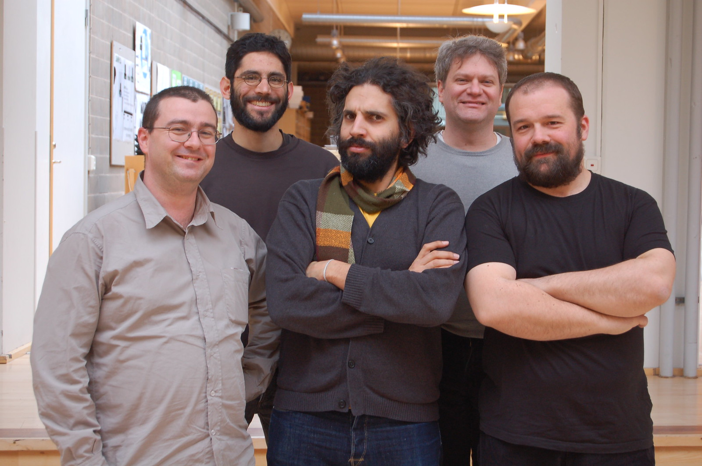

# レッスン0 オリエンテーション -ロボ部へようこそ！-

## ロボ部はこんな活動です！

こんにちは！アイアルクの**ロボ部**のレッスンへようこそ！ロボ部ではいままでよりも本格的なロボットのレッスンが学べます。ロボ部で使うロボットはこれ！


カッコイイよね。これはLEGOなどで動いていたロボットとは違って、部品が丸出しになっています。だから、センサーやモーターの原理がより深く学べるんだ！

その代わり囲われていない分、壊れやすいとも言えます。このロボットはみんなひとりひとり自分のロボットをお家の人に買ってもらったものだから、**大切**に使ってくださいね。壊れたときはそのパーツを別に買ってもらうことになります！

## Aruduino（アルディーノ）について

ロボ部のロボットの頭脳とも言えるコンピュータを**Aruduino**といいます。これはイタリアのある王様の名前から取られたもの。2005年にいままで高くて教育用には使えなかったマイコンを**安く多く**の人に使ってもらえるように、と開発されたものなんだ。

安くてシンプルで使いやすいと評判になって世界中の電子工作や電気回路、プログラムを学ぼうとしている人たちに使われています。その中には子どもだけじゃなくて大学や企業でしっかりと学ぼうとしている人たちも含まれているんだ。



出典:https://www.flickr.com/photos/dcuartielles/2363657276/

## 

### このレッスンで身につける力

- [ ] 

---

### ミッションの準備

#### ＜手順＞

- [ ] 

#### ＜具体的手順＞

##### ＜内容のタイトル＞　 


<本文>

```C++
void setup() {
  // put your setup code here, to run once:

}

void loop() {
  // put your main code here, to run repeatedly:

}
```


### ミッションチャレンジ

＜本文＞

``` C++
void setup() {
  // put your setup code here, to run once:
  // サンプルコード
void loop() {
 
}

```

#### ＜ミッションチャレンジの内容＞

> 引用

- [ ] チェックポイント1
- [ ] チェックポイント2

---

### まとめ


- **用語とか概念の名前** :＜説明＞
- `コードの書き方` : ＜説明＞

#### 出来たことをチェックしよう

- [ ] ＜〜できる。全体構成と一致させる＞