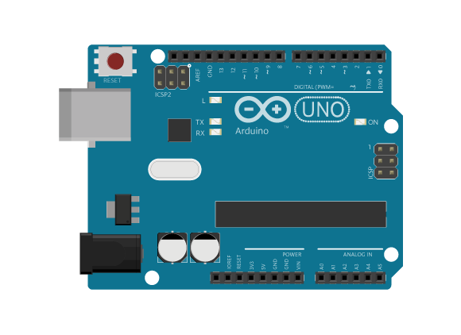
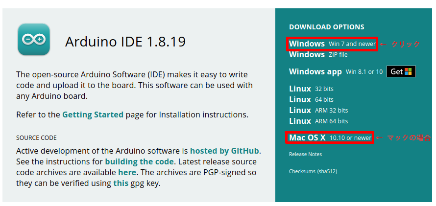
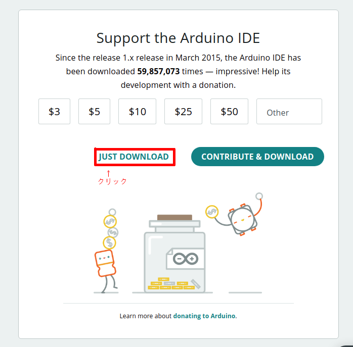
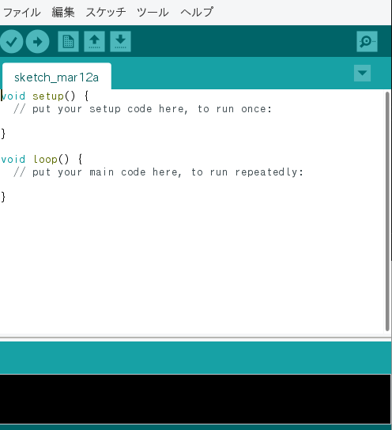
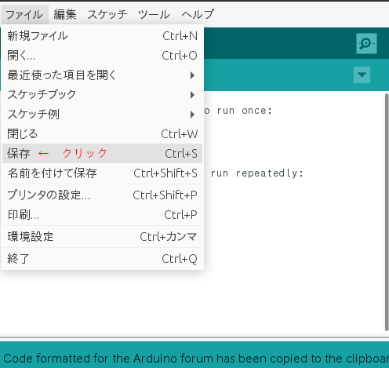
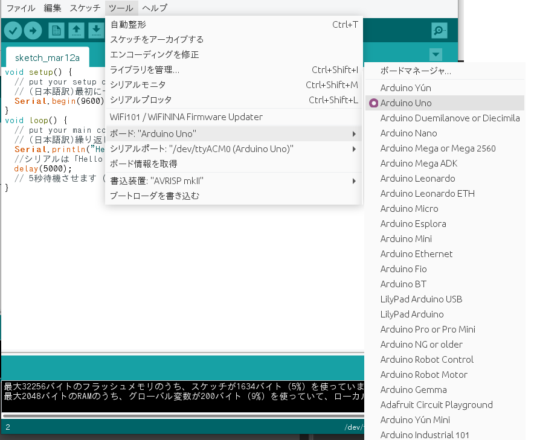
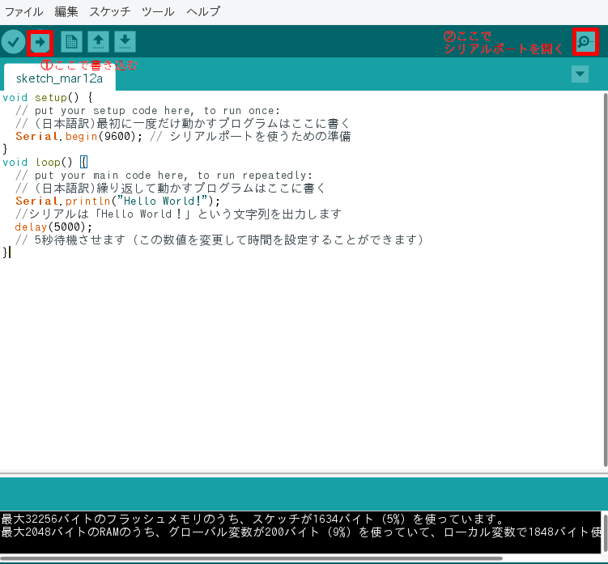
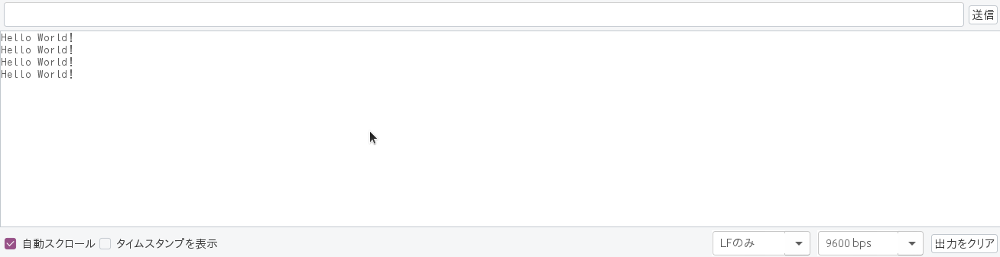

# Hello World！ -ハローワールド！-

## **シリアルモニター**に文字を表示してみよう

### このレッスンで身につける力

- [ ] **Arduino IDE**を起動できる

- [ ] 白紙の**スケッチ**を作れる

- [ ] スケッチに**コメント**を入れることが出来る

- [ ] **Serial.begin()** と **Serial.println()** つかって"Hello World"を表示できる

---

### ミッションの準備

#### 0. ハードウェアを用意しよう

- [ ] Osoyoo UNO Board（ Arduino UNO rev.3と完全互換）x 1

- [ ] USBケーブルx 1

- [ ] パソコン x 1

#### 1. Arduino IDEをインストールしよう

##### Arduino IDEとはなに？　 



Arduino（あるでぃーの）は世界中で使われているコンピュータ。ロボットや電子工作に使われているよ。安い上に使うためのいろいろな情報が豊富で、コンピュータやロボットの学習にピッタリ。

Arduino IDE（あるでぃーの あいでぃーいー）はArduinoのためのプログラムを書くためのツールです。さっそくインストールしていきましょう。

https://www.arduino.cc/en/software

上のリンクをクリックしてダウンロードページに行きましょう。






これでArduino IDEがインストールできました！

#### 2. スケッチを作成しよう

インストールが正しく出来ていたらデスクトップにアイコンが出来ているはずです。さっそくクリックして起動してみましょう。

こんな画面が出てくるはずです。この画面のプログラムのことを**スケッチ**といいます。



では、最初にスケッチを保存しておきましょう。まずは分かりやすい名前をつけてデスクトップに保存してみましょう。



そうするとデスクトップに先ほど付けた名前のフォルダーが出来ていると思います。フォルダーの中には「（付けた名前）.ino」というファイルがあるはずです。

スケッチを移動したりするときにはこのフォルダーごと行うようにしましょう。

#### 3. コメントついて知ろう

次に出来た画面を詳しく見てみましょう。アルファベットがたくさん並んでいますね。

プログラムは英語を元にして書くことが多いのですが、英語の単語は少しずつ覚えていけば大丈夫。安心してね。

```C++
void setup() {
  // put your setup code here, to run once:

}

void loop() {
  // put your main code here, to run repeatedly:

}
```

`//`で始まる行が2つのあるのを見つけられるかな？`//`で始まる行は**コメント**といってプログラムの中で実行されない部分です。

プログラムなのに動かない行があるのは変だと思いますか？これはなかなか便利なんです。

##### 便利なコメントの使い方

- プログラムの使い方や書き方などを説明する文を書く。日本語でも大丈夫。
- プログラムの動きを調べるために、コメントにして動かないようにする（**コメントアウト**）

### ミッションチャレンジ

では、ミッションにチャレンジしていこう！

スケッチにこのコードをコピーして貼り付けていきましょう。

``` C++
void setup() {
  // put your setup code here, to run once:
  // (日本語訳)最初に一度だけ動かすプログラムはここに書く
  Serial.begin(9600); // シリアルポートを使うための準備
}
void loop() {
  // put your main code here, to run repeatedly:
  // (日本語訳)繰り返して動かすプログラムはここに書く
  Serial.println("Hello World!");
  //シリアルは「Hello World！」という文字列を出力します
  delay(5000);
  // 5秒待機させます（この数値を変更して時間を設定することができます）
}

```

#### コピーアンドペースト（コピペ）のやり方

> 1. コピーする範囲をマウスでドラックして選択
> 2. `Ctrl` + `C`を押してコピー
> 3. Arduino IDEをウィンドウで貼り付けたいところに`Ctrl` + `V`すると貼り付けられる
>
>**便利な技**
>
> - `Ctrl` + `A`を押すとすべてを選択できる
> - 選択したところに貼り付けると、選択した範囲を消して貼り付けられる
> - `Ctrl` + `X`を押すと元の選択範囲を消してコピーできる（切り取り）

- [ ] **コピーアンドペースト**が出来たらチェック！
- [ ] 一番はじめの行にコメントで自分の名前を入れてみよう。出来たらチェック！

#### スケッチをArduinoに書き込もう

次にスケッチをArduinに書き込んでいきます。まずUSBケーブルをArduinoとつなぎます。

Arduinoはいろいろな種類があるので、それを選びます。



次に接続しているポートを選びます。デバイスの名前が付いているのが選ぶべきポートです。




虫眼鏡のマークのアイコンをクリックするとシリアルポートが開きます。



このプログラムは5秒毎に"Hello World！"が表示されるスケッチですね。

ここまで出来たら書き込みは成功です。

- [ ] "Hello World!"が表示できたらチェック！

#### 自分の名前を表示させてみよう

最後にこのレッスンの総仕上げ！

``` C++
  Serial.println("ここに自分の名前など");
```
`" "`は文字を表す記号「引用符」です。この間に自分の名前などの表示させたい言葉を入力してみましょう。日本語でも大丈夫だよ。

- [ ] "Hello World!"が表示できたらチェック！
- [ ] 引用部`" "`の意味を説明できたらチェック！

---

### まとめ

 

- **Arduino** :ロボットを動かすためのコンピュータ。
- **Arduino IDE** : Arduinoのコードを書くためのツール。
- **スケッチ** : Arduino IDEのプログラムのこと。
- `Serial.begin(9600);` : シリアルポートを使うための準備。setupに書く。
- `Serial.println();` : シリアルポートに表示する。
- `" "` :　文字を表す記号「**引用符**」。

#### 出来たことをチェックしよう

- [ ] **Arduino IDE**を起動できる
- [ ] 白紙の**スケッチ**を作れる
- [ ] スケッチに**コメント**を入れることが出来る
- [ ] **Serial.begin()** と **Serial.println()** つかって"Hello World"を表示できる