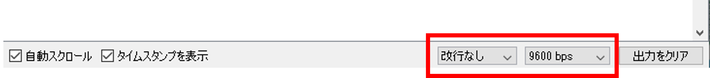

# レッスン2 Arduinoでタイマーをつくってみよう！

## **シリアルモニターから入力を拾ってオンオフするタイマーを作成する**

### このレッスンで身につける力

- [ ] 足す、引く、掛ける、割るの計算が出来る
- [ ] 計算の順序に合わせて( )を使える
- [ ] delay()と変数、整数型（int）を使ってタイマーを作れる
- [ ] 浮動小数点型(float)を使ってタイマーを改良できる

---

### ミッションの準備

#### 0.ハードウェアを用意しよう

- [ ] Osoyoo UNO Board（ Arduino UNO rev.3と完全互換）x 1
- [ ] USBケーブルx 1
- [ ] パソコン x 1

#### 1.ArduinoIDEを起動しよう（復習）

デスクトップにあるAruduinoのアイコンをダブルクリックしてArduinoIDEを起動しましょう．


#### 2.スケッチを保存しよう（復習）

(Arduinoでは，プログラムのことを「スケッチ」といいます．)

ファイル→保存をクリック（Ctrl+SでもOK）して，デスクトップに「(日付)（ローマ字の名前）02_1」という名前で保存しましょう．

(例)5月17日にまことさんが作ったファイルなら、「0517makoto02_1」


#### 3.Arduinoとパソコンを接続しよう（復習）

Arduino UNOボードとパソコンをUSBケーブルでつなぎましょう．


【注意】USBを抜き差しするときは向きを確認して，ていねいにあつかうこと．

USBを差したら，ArduinoIDEでポートを指定しましょう．

ツール→シリアルポートをクリックして，「COM～（USB）」となっているものをクリックしましょう．（COM～の数字は毎回変わります．）


---

### 【ミッションチャレンジ1】Aruduinoを計算機として使ってみよう

#### 計算結果を表示しよう

以下をすべてコピー＆ペーストしましょう．

``` C++
void setup() {
  // put your setup code here, to run once:
  // (日本語訳)最初に一度だけ動かすプログラムはここに書く
  Serial.begin(9600); // シリアルポートを使うための準備
}
void loop() {
  // put your main code here, to run repeatedly:
  // (日本語訳)繰り返して動かすプログラムはここに書く
  Serial.println(1 + 1);
  //()内の計算をしてシリアルモニタに表示
  delay(5000);
  // 5秒待機させます（この数値を変更して時間を設定することができます）
}
```

**＜実行の準備＞**

1. コピー＆ペーストができたら左上の矢印 を押して（またはCtrl＋U），プログラムを書き込みましょう．
2. 右上のをクリックしましょう．
3. シリアルモニタが表示されたら，ボーレートを **9600** になっていることを確認しましょう．なってなかったら変更します。





**＜実行結果＞**


#### 計算式の書き方を覚えよう

足し算，引き算，掛け算，割り算のことを **「四則演算（しそくえんざん）」** と言います．

算数の時間だけでなく，プログラムを書くときもこの四則演算を使うことが多いです．

プログラム内での四則演算の書き方を覚えましょう．

| 種類 | 算数 | プログラム |
| ---- | ---- | ---- |
|  足し算  | + | + |
|  引き算  | - | - |
|  掛け算  | × | * （アスタリスク） |
|  割り算  | ÷ | / （スラッシュ）|

プログラムで書く四則演算の例
- 1 + 1
- 2 - 1
- 2 * 3  
- 4 / 2

四則演算が混ざった計算は掛け算(*)と割り算(/)が先に計算されます。
- 2 + 3 * 2　※先に 3 * 2 を計算する
- 2 + 6　※掛け算の結果を出してから足し算をする
- 8

足し算・引き算を先に計算させたいときは()を使います。
 
- (1 + 2) * 3 → 9
- ((1 + 2) *3) / 3 →3

上のプログラムの9行目を改造して，足し算，引き算，掛け算，割り算や（）を使って計算してみましょう．

例：
``` C++
  Serial.println(2 + 3 * 2);
``` 

``` C++
  Serial.println(2 * 3);
``` 

``` C++
  Serial.println(((1 + 2) *3) / 3);
``` 


- [ ] 足す、引く、掛ける、割るの計算が出来たらチェック
- [ ] 計算の順序に合わせて( )を使えたらチェック

---

### 【ミッションチャレンジ2】カウントアップするタイマーをつくろう！

50m走をするときに使うストップウォッチなどは，1秒の100分の1（=0.01秒）や1000分の1（=0.001秒）の細かい時間まで測ることができます．

ミッションチャレンジ2では，カウントアップするタイマーを作りましょう．

#### 【ステップ1】1秒ごとにカウントアップするタイマーを作ろう

ファイル→名前を付けて保存をクリックして，「lesson_02_2」という名前で保存しましょう．

以下をすべてコピー＆ペーストしましょう．

``` C++
int count = 0;
//整数型の変数countを定義

void setup() {
  Serial.begin(9600);
  Serial.println("Yを押してタイマースタート");
}
void loop() {
  if (Serial.available()) {
  //シリアル信号を受信した場合
    char ch = Serial.read();
    //受信した値を変数に代入
    if (ch == 'y' ||  ch == 'Y') {
    //yまたはYだった場合
      Serial.println("タイマーON");
      Serial.println("タイマーを止めるにはNを押してください");
      count = 0;
      //countに0を代入
    }
    if (ch == 'n' ||  ch == 'N') {
    //nまたはNだった場合
      Serial.println("タイマーOFF");
      Serial.print(count);
      Serial.println(" 秒");
      Serial.println("Yを押してタイマースタート");
      count = 0;
      //countに0を代入
    }
  }
  delay(1000);
  //1秒待機
  count += 1;
  //countに1を足す
  
}
```

**＜実行の準備＞**

1. コピー＆ペーストができたら左上の矢印 を押して（またはCtrl＋U），プログラムを書き込みましょう．
2. 右上のをクリックしましょう．
3. シリアルモニタが表示されたら，ボーレートを **9600** に，改行の設定を「 **改行なし** 」にしましょう．
4. シリアルモニタに「y」を入力して，Enterを押しましょう．タイマーが起動します．
5. 数秒後，シリアルモニタに「n」を入力して，またEnterを押しましょう．タイマーが停止して，経過した時間が表示されます．

**＜実行結果＞**


- [ ] 整数型を使ってタイマーを作れたらチェック
---


#### 変数とデータ型について学ぼう

**変数**は，数字や文字を入れておく入れ物のことです．MindStormsではカバンになっていましたね．

Arduinoでは，変数を使う前に宣言する（用意する）必要があります．

例えば，こんな風に宣言します．

``` C++
int count = 0;
```
これは，「整数が入る変数`count`を変数を用意して、その変数に0を入れた」ということになります．

「int」が「整数型」を表します．整数とは，「1」「100」「-5」などの小数や分数以外の数字です．整数型には整数しか入りません．「3.14（小数）」「b（文字）」などは入りません．

小数を扱いたいときは「float型」を使います．float型は「浮動小数点型」とも言います．

---

#### 【ステップ2】0.1秒ごとにカウントアップするタイマーを作ろう

ステップ1のタイマーは1秒ずつしか測れませんでした。50m走や水泳などに使うならせめて0.1秒ごとに計りたいですよね。

そのためにはステップ1をどう改造したらいいでしょうか？

このプログラムでは
```C++
void loop(){
  (省略)
}
```
の中に書かれているプログラムが繰り返し実行されています。

プログラムの下のほうに`delay(1000);`という行があるのが分かりますか？この **`delay(1000)`は1秒待つ** という意味です。1秒なら1000、2秒なら2000、0.5秒なら500です。

つまり、 **このプログラムは1秒に1回ループする**ようになっています。ここを変えたら、0.1秒ごとに測れるようになりそうですよね。

では、ループを遅らせる時間を1000ms（1秒）から100ms（0.1秒）に変えましょう．

上のプログラムの
``` C++
delay(1000);
```
の部分を
``` C++
delay(100);
```
に変えましょう．

また，
``` C++
count += 1;
```
の部分は`count`の値を1増やす、という意味です。なので、ここも変える必要がありますね。
``` C++
count += 0.1;
```
に変えて実行してみましょう。

**＜実行結果＞**


**何秒経っても0秒のままです．** これは整数型の変数`count`に小数を入れようとして起こるエラーです。どうやって直したらいいでしょうか？


#### countの型を修正してタイマーを正しく動作させよう


先ほどのプログラムでは変数`count`が整数型だったのでエラーになりました。では、ここを小数も入る「float型（浮動小数点型）」に変えてみたら上手くいくのではないでしょうか？

``` C++
int count = 0;
```
の部分を
``` C++
float count = 0;
```
に変えてやってみましょう．

**＜実行結果＞**


**0.1秒単位で数字が表示できました！**

確認出来たら，0.01秒単位のタイマーをつくってみよう．

- [ ] delay()を使ってタイマーを改良できたらチェック
- [ ] float型を使ってタイマーを改良できたらチェック

---

### まとめ

- プログラムでの四則演算は「+」「-」「*」「/」
- シリアルモニタでデータの入力・表示ができる
- ループを遅らせるための関数はdelay();
- 変数は，数字や文字を入れておく箱
- int型は「整数型」，float型は「浮動小数点型」


#### 出来たことをチェックしよう

- [ ] 足す、引く、掛ける、割るの計算が出来る
- [ ] 計算の順序に合わせて( )を使える
- [ ] delay()と変数、整数型（int）を使ってタイマーを作れる
- [ ] 浮動小数点型(float)を使ってタイマーを改良できる