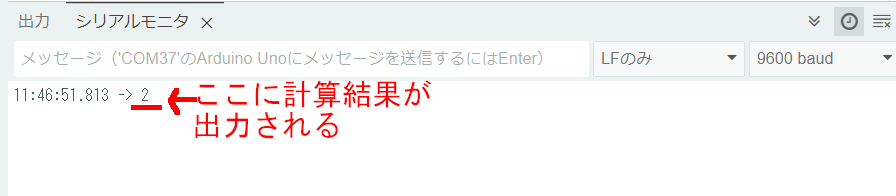

# Arduinoでタイマーをつくってみよう！

## **シリアルモニターから入力を拾ってオンオフするタイマーを作成する**

### このレッスンで身につける力

- [ ] 足す、引く、掛ける、割るの計算が出来る
- [ ] 計算の順序に合わせて( )を使える
- [ ] delay()と変数、整数型（int）を使ってタイマーを作れる
- [ ] 浮動小数点型(float)を使ってタイマーを改良できる

---

### ミッションの準備

#### 0.ハードウェアを用意しよう

- [ ] Osoyoo UNO Board（ Arduino UNO rev.3と完全互換）x 1
- [ ] USBケーブルx 1
- [ ] パソコン x 1

#### 1.ArduinoIDEを起動しよう（復習）

デスクトップにあるAruduinoのアイコンをダブルクリックしてArduinoIDEを起動しましょう．


#### 2.スケッチを保存しよう（復習）

(Arduinoでは，プログラムのことを「スケッチ」といいます．)

ファイル→保存をクリック（Ctrl+SでもOK）して，デスクトップに「lesson_02_1」という名前で保存しましょう．


#### 3.Arduinoとパソコンを接続しよう（復習）

Arduino UNOボードとパソコンをUSBケーブルでつなぎましょう．


【注意】USBを抜き差しするときは向きを確認して，ていねいにあつかうこと．

USBを差したら，ArduinoIDEでポートを指定しましょう．

ツール→シリアルポートをクリックして，「COM～（Arduino UNO）」となっているものをクリックしましょう．（COM～の数字は毎回変わります．）


---

### 【ミッションチャレンジ】プログラムで計算をしてみよう


足し算，引き算，掛け算，割り算のことを「四則演算（しそくえんざん）」と言います．

算数の時間だけでなく，プログラムを書くときもこの四則演算を使うことが多いです．

しかし，プログラム内での四則演算は少し変わった書き方をします．まずは書き方を覚えましょう．

| 種類 | 算数 | プログラム |
| ---- | ---- | ---- |
|  足し算  | + | + |
|  引き算  | - | - |
|  掛け算  | × | * （アスタリスク） |
|  割り算  | ÷ | / （スラッシュ）|

プログラムで書く四則演算の例
- 1 + 1
- 2 - 1
- 2 * 3  
- 4 / 2

また，普通の式と同じように()で囲んだ式を先に計算することもできます．
- (1 + 2) * 3 → 9
- ((1 + 2) *3) / 3 →3


#### 計算結果を表示しよう

以下をすべてコピー＆ペーストしましょう．

``` C++
void setup() {
  // put your setup code here, to run once:
  // (日本語訳)最初に一度だけ動かすプログラムはここに書く
  Serial.begin(9600); // シリアルポートを使うための準備
}
void loop() {
  // put your main code here, to run repeatedly:
  // (日本語訳)繰り返して動かすプログラムはここに書く
  Serial.println(1 + 1);
  //()内の計算をしてシリアルモニタに表示
  delay(5000);
  // 5秒待機させます（この数値を変更して時間を設定することができます）
}
```

**＜実行の準備＞**

コピー＆ペーストができたら左上の矢印を押して（またはCtrl＋U），プログラムを書き込みましょう．

ツール→シリアルモニタをクリックしましょう．

シリアルモニタが表示されたら，ボーレートを9600に，と改行の設定を「改行無し」にしましょう．


**＜実行結果＞**




#### 様々な計算をしよう

上のプログラムの9行目を改造して，足し算，引き算，掛け算，割り算や（）を使って計算してみましょう．

例：
``` C++
  Serial.println(2 * 3);
``` 

``` C++
  Serial.println(((1 + 2) *3) / 3);
``` 


- [ ] 足す、引く、掛ける、割るの計算が出来たらチェック
- [ ] 計算の順序に合わせて( )を使えたらチェック

---

### 0.1秒ごとにカウントアップするタイマーをつくろう！
50m走をするときに使うストップウォッチなどは，1秒の100分の1（=0.01秒）や1000分の1（=0.001秒）の細かい時間まで測ることができます．

今回は，0.1秒ごとにカウントアップするタイマーを作りましょう．

#### 変数とデータ型について学ぼう

変数は，数字や文字を入れておく入れ物のことです．MindStormsではカバンになっていましたね．

Arduinoでは，変数を使う前に宣言する（用意する）必要があります．

例えば，こんな風に宣言します．

``` C++
int a;
```
これは，「整数型で，aという変数を宣言した」ということになります．

「int」が「整数型」を表します．整数とは，「1」「100」「-5」などの小数や分数以外の数字です．整数型には整数しか入りません．「3.14（小数）」「b（文字）」などは入りません．

小数を扱いたいときは「float型」を使います．float型は「浮動小数点型」とも言います．

---

#### 【ステップ1】1秒ごとにカウントアップするタイマーを作ろう

ファイル→名前を付けて保存をクリックして，「lesson_02_2」という名前で保存しましょう．

以下をすべてコピー＆ペーストしましょう．

``` C++
int count = 0;

void setup() {
  Serial.begin(9600);
  Serial.println("Yを押してタイマースタート");
}
void loop() {
  if (Serial.available()) {
    char ch = Serial.read();
    if (ch == 'y' ||  ch == 'Y') {
      Serial.println("タイマーON");
      Serial.println("タイマーを止めるにはNを押してください");
      count = 0;
    }
    if (ch == 'n' ||  ch == 'N') {
      Serial.println("タイマーOFF");
      Serial.print(count);
      Serial.println(" 秒");
      Serial.println("Yを押してタイマースタート");
      count = 0;
    }
  }
  delay(1000);
  count += 1;
}
```

**＜実行の準備＞**

コピー＆ペーストができたら左上の矢印を押して（またはCtrl＋U），プログラムを書き込みましょう．


ツール→シリアルモニタをクリックしましょう．

シリアルモニタが表示されたら，ボーレートを9600に，と改行の設定を「改行無し」にしましょう．

シリアルモニタに「y」を入力して，Enterを押しましょう．タイマーが起動します．

数秒後，シリアルモニタに「n」を入力して，またEnterを押しましょう．タイマーが停止して，経過した時間が表示されます．

**＜実行結果＞**


- [ ] delay()と整数型を使ってタイマーを作れたらチェック
---

#### 【ステップ2】0.1秒ごとにカウントアップするタイマーを作ろう

ステップ1のプログラムを改造して，0.1秒ごとにカウントアップするようにしましょう．

ループを遅らせる時間を1000ms（1秒）から100ms（0.1秒）に変えましょう．

上のプログラムの
``` C++
delay(1000);
```
の部分を
``` C++
delay(100);
```
に変えましょう．

また，
``` C++
count += 1;
```
の部分を
``` C++
count += 0.1;
```
に変えましょう．


**＜実行の準備＞**

コピー＆ペーストができたら左上の矢印を押して（またはCtrl＋U），プログラムを書き込みましょう．

さきほどと同じように実行しましょう．


**＜実行結果＞**


**何秒経っても0秒のままです．**


#### float型を使ってタイマーを正しく動作させよう


先ほどのプログラムの変数「count」を，「float型（浮動小数点型）」に変えてみましょう．

``` C++
int count = 0;
```
の部分を
``` C++
float count = 0;
```
に変えましょう．

**＜実行の準備＞**

コピー＆ペーストができたら左上の矢印を押して（またはCtrl＋U），プログラムを書き込みましょう．

さきほどと同じように実行しましょう．


**＜実行結果＞**


**0.1秒単位で数字が表示されることを確認しよう**

確認出来たら，0.01秒単位のタイマーをつくってみよう．

- [ ] float型を使ってタイマーを改良できたらチェック

---

### まとめ

- プログラムでの四則演算は「+」「-」「*」「/」
- シリアルモニタでデータの入力・表示ができる
- ループを遅らせるための関数はdelay();
- 変数は，数字や文字を入れておく箱
- int型は「整数型」，float型は「浮動小数点型」


#### 出来たことをチェックしよう

- [ ] 足す、引く、掛ける、割るの計算が出来る
- [ ] 計算の順序に合わせて( )を使える
- [ ] delay()と変数、整数型（int）を使ってタイマーを作れる
- [ ] 浮動小数点型(float)を使ってタイマーを改良できる