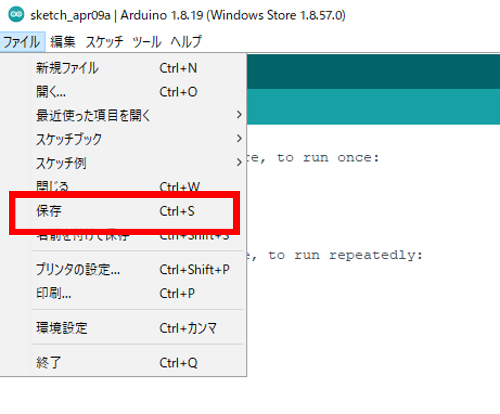
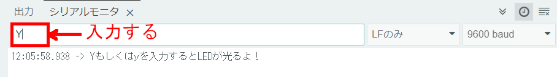
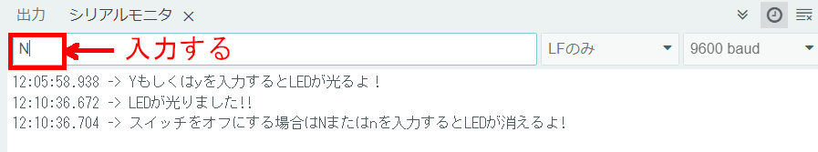

# レッスン3 LEDの点滅をコントロールしてみよう！

## ブレッドボードに回路を作成しシリアルモニターからの入力でLEDを点灯させる

このレッスンではシリアルポートを使ってLEDをつけたり消したりできるプログラムと電子回路を作ります。

### このレッスンで身につける力

- [ ] **ブレッドボード**で回路を作れる。

- [ ] **Serial.read()** を使って文字の入力を取れる

- [ ] **setup()** について説明できる

- [ ] **loop()** について説明できる

- [ ] **pinMode()** でピンの設定が出来る

- [ ] **if構文** を使ってプログラムを改造できる
  
---

### ミッションの準備

#### ハードウェアを用意しよう

- [ ] Osoyoo UNO Board（ Arduino UNO rev.3と完全互換）x 1

- [ ] USBケーブルx 1

- [ ] パソコン x 1

- [ ] ブレッドボード x 1　※先生に言って借りてくる

- [ ] ジャンパー線 (オス-オス)x 3　※先生に言って借りてくる

- [ ] 抵抗 330Ω × 1　※先生に言って借りてくる 

- [ ] LED(赤) x 1　※先生に言って借りてくる

- [ ] LED(緑) x 1　※先生に言って借りてくる

---

#### 0.ArduinoIDEを起動しよう

デスクトップにあるAruduinoのアイコンをダブルクリックしてArduinoIDEを起動しましょう．


---

#### 1.スケッチを保存しよう

(Arduinoでは，プログラムのことを「スケッチ」といいます．)

ファイル→保存をクリック（Ctrl+SでもOK）して，デスクトップに「lesson_03_1」という名前で保存しましょう．



---
#### 2.Arduinoとパソコンを接続しよう

Arduino UNOボードとパソコンをUSBケーブルでつなぎましょう．


【注意】USBを抜き差しするときは向きを確認して，ていねいにあつかうこと．

USBを差したら，ArduinoIDEでボードとシリアルポートを指定しましょう．　　

ツール→ボードをクリックして、Arduino/Genuino UNOをクリックしましょう。　　

次にツール→シリアルポートをクリックして，「COM～（USB）」となっているものをクリックしましょう．（COM～の数字は毎回変わります．）


---

### ミッションチャレンジ

#### ブレッドボードで回路を作ってみよう

**ブレッドボード**と**ジャンパー線**を使って電子回路を組んでみよう。ブレッドボードやジャンパー線を使うことでハンダ付けをしないでも簡単に電子回路を作ることが出来るんだ。

先生に声を掛けてブレッドボードとジャンパー線、LED(赤)を借りてこよう！

<ブレッドボード>

  

<ジャンパー線（オス-オス）>

　　

これらの器具とArduinoを使ってイラストと同じように配線をしてみよう！ **LED** にはプラスとマイナスの向きがあるのに注意しよう。

　

実際に配線するとこんな感じになるよ。  
　

- [ ] ブレッドボードで回路を作れたらチェック！

---


#### サンプルスケッチを実行させてみよう

スケッチに以下のコードをコピー＆ペーストして、スケッチを実行してみよう。

```C++
void setup() {
  pinMode(2, OUTPUT);//LEDピンを出力へ
  Serial.begin(9600); //シリアルを9600バンドに設定する
  while (! Serial); // シリアルの初期化を許可する
  Serial.println("Yもしくはyを入力するとLEDが光るよ！");
}
void loop() {
  if (Serial.available()){
    char ch = Serial.read();
    if(ch=='y'||ch=='Y'){
      digitalWrite(2, HIGH);
      Serial.println("LEDが光りました!!");
      Serial.println("スイッチをオフにする場合はNまたはnを入力するとLEDが消えるよ!");
      }
    if(ch=='n'||ch=='N'){
      digitalWrite(2, LOW);
      Serial.println("LEDが消えました!!");
      Serial.println("スイッチをオンにする場合はYもしくはyを入力するとLEDが光るよ");
    }
  }
  delay(1000);
}
```

---

#### スケッチをArduinoに書き込んで実験をしよう

サンプルコードを書き込めたら、スケッチをArduinoに書き込もう！
書き込みが終わったら、シリアルモニターをクリックしましょう．
<!-- 
パソコンとArduinoを通信するよ。
通信が始まるとこんな画面が出るよ！
```
<<<<<<< HEAD:Lesson_03/Lesson_03.md

<<<<<<< Updated upstream:Lesson_03/レッスン3.md
>>>>>>> hasegawa_work1:Lesson_03/レッスン3.md
``` -->
シリアルポートの中に文章が出てきたね！少し読んでみよう！  


<!-- 
>英語:  
Enter Y to turn on the LED" 

>日本語:  
Yボタンを押すとLEDが光る  -->
<!-- 
>>>>>>> Stashed changes:Lesson_03/Lesson_03.md -->

一番上の入力ボックスにキーボードを使って大文字のYを入力して、エンターを押してみよう
　

そうするとブレッドボード上の配線したLEDが光るよ!
　


どうやらキーボードでnかNを入力するとLEDが消えるらしいよ。  
さっきと同じように入力ボックスにnかNを入力してみよう！


そうするとLEDが消えたね。


#### Serial.read() について学ぼう

このプログラムの
```C++
    char ch = Serial.read();
```
に注目しよう。これはシリアルポートの入力スペースに入れられた文字を一文字ずつ`ch`という変数に代入しています。`char`は文字を入力できるデータ型ですが、英数字1文字しかはいりません。

`Serial.read()`の部分で入力スペースの値を読み込んでいます。

次に

```C++
  if (Serial.available()){
    (省略）
  }
```
の行を見ましょう。ここはシリアルポートに入力があったときだけ動くプログラムです。if文にも似てるね。if文についてはこのレッスンのあとでやるよ。

- [ ] **Serial.read()** を使って文字の入力を取れたらチェック！
---

#### setup(),loop()について学ぼう

**setup()関数**
よく見かける**void Setup()**。これはArduinoに**電源が入ったとき一回だけ実行されるプログラム**だよ。ここのsetup関数の中でピンの設定をしたり、シリアルモニタで通信を開始する設定を行うよ。

**loop()関数**
setup関数とセットのloop関数。これは処理をずっとループする関数だよ。Arduinoに電源が入って起動して、setup関数の処理が終わった後電源が切れるまでこの関数の処理が行なわれるよ。いわばArduinoのプログラムのメインとなるね。

**まとめ**
```C++
void setup() {
  pinMode(使いたいピンの番号, ピンの設定(入力or出力));//使いたいピンの設定
  
  最初に1回だけする処理をここに書く

}
void loop() {

  繰り返す処理をここに書く

}
```

- [ ] **setup()** について説明できたらチェック
- [ ] **loop()** について説明できたらチェック

#### pinMode() について学ぼう
**pinMode(ピン番号,モード)**
Arduinoにはたくさんのピンがあるね。このpinmodeはピンを設定するためのものだよ。

- モード: INPUT・OUTPUT

INPUTは「**入力**」という意味で、Arduinoから**データを受け取ったり、読み込ませる**時に使うよ。
OUTPUTは「**出力**」という意味で、Arduinoから**データを送ったり、信号を出したりする**時に使うよ。

今回のプログラムでは、

```C++
pinMode(2, OUTPUT);//LEDピンを出力へ
```
Arduinoの2番ピンを出力ピンに設定しているよ。

この３つをまとめるとこんな感じになるよ。これら学習していく上で重要になってくるからちゃんと覚えておこう！

- [ ] **pinMode()** でピンの設定が出来たらチェック！
---

#### if文を覚えてプログラムを改造しよう！

では、ミッションにチャレンジしていこう！　　

まずは図のようにブレッドボードにLEDをもう一つ追加してみよう。
　

実際に配線するとこんな感じになるよ。
　

**追加したLEDをArduinoの４番ピンでキーボードのmもしくはMでLEDを光らせよう!**
下のプログラムに**３つの？マークがあるよ。その？**を変更してみよう！

```C++
void setup() {
  pinMode(2, OUTPUT);//LEDピンを出力へ
  pinMode(?, OUTPUT);//LEDピンを出力へ
  Serial.begin(9600); //シリアルを9600バンドに設定する
  while (! Serial); // シリアルの初期化を許可する
  Serial.println("Yもしくはyを入力するとLEDが光るよ！");
}
void loop() {
  if (Serial.available()){
    char ch = Serial.read();
    if(ch=='y'||ch=='Y'){
      digitalWrite(2, HIGH);
      Serial.println("LEDが光りました!!");
      Serial.println("スイッチをオフにする場合はNまたはnを入力するとLEDが消えるよ!");
      }
    if(ch=='n'||ch=='N'){
      digitalWrite(2, LOW);
      digitalWrite(4, LOW);
      Serial.println("LEDが消えました!!");
      Serial.println("スイッチをオンにする場合はYもしくはyを入力するとLEDが光るよ");
    }
    if (ch == '?' || ch == '?')  {  //キーボードのmもしくはMを押すとLEDが光る
      digitalWrite(4, HIGH);
      Serial.println("LEDが光りました!!");
      Serial.println("スイッチをオフにする場合はNまたはnを入力するとLEDが消えるよ!");
    }
  }
  delay(1000);
}
```
mもしくはMを押してこのように追加したLEDが光れば成功だ！みんなはできたかな？
　

思い通りに動かすことはできたかな？正解はこんな感じになるよ。

```C++
void setup() {
  pinMode(2, OUTPUT);//LEDピンを出力へ
  pinMode(4, OUTPUT);//LEDピンを出力へ
  Serial.begin(9600); //シリアルを9600バンドに設定する
  while (! Serial); // シリアルの初期化を許可する
  Serial.println("Yもしくはyを入力するとLEDが光るよ！");
}
void loop() {
  if (Serial.available()){
    char ch = Serial.read();
    if(ch=='y'||ch=='Y'){
      digitalWrite(2, HIGH);
      Serial.println("LEDが光りました!!");
      Serial.println("スイッチをオフにする場合はNまたはnを入力するとLEDが消えるよ!");
      }
    if(ch=='n'||ch=='N'){
      digitalWrite(2, LOW);
      digitalWrite(4, LOW);
      Serial.println("LEDが消えました!!");
      Serial.println("スイッチをオンにする場合はYもしくはyを入力するとLEDが光るよ");
    }
    if (ch == '?' || ch == '?')  {  //キーボードのmもしくはMを押すとLEDが光る
      digitalWrite(4, HIGH);
      Serial.println("LEDが光りました!!");
      Serial.println("スイッチをオフにする場合はNまたはnを入力するとLEDが消えるよ!");
    }
  }
  delay(1000);
}
```

#### if文とは

さっきまでキーボードを押すことでLEDが光ったり、消えたりしたね。これはif構文と行ってプログラミングの中で条件分岐を行うための命令文を使っているからだよ。具体的には条件式を与えた後に条件式が成立するときにどんな処理をするかを書くと条件分岐ができるよ。

**＜if文の書き方＞**
```C++
if (条件式){
    (条件式が成立する場合の処理を記述)
}
```
**条件式**は正しい(true)か正しくない（false)をプログラムに判断させるための式。if文は条件式がtrueのときだけ実行されるプログラムの書き方です。さっきやった`Serial.available()`も条件式の一つ。シリアルポートの入力があったときにはtrueになります。

他には**比較演算子**と呼ばれるものもあって、2つの値の大きさを比べます。

| 演算子 | 説明             |
| :----: | :--------------: |
| x == y   | xとyは等しければtrue     |
| x != y   | xとyは等しくなければtrue |
| x  < y    | xはyより小さければtrue   |
| x  > y    | xはyより大きければtrue   |
| x <= y   | xがy以下ならばtrue         | 
| x > =y   | xがy以上ならばtrue         | 

- [ ] **if構文** を使ってプログラムを改造できたらチェック！

### まとめ

- **ブレッドボード** :電子回路の実験や試作をするための板のこと
- **Serial.read()** :　受信データを読み取る
- **setup()** : 最初に一回だけ実行される処理
- **loop()** : ずっと実行される処理
- **pinMode()** : ピンを設定するための関数
- **if構文** : プログラミングの条件分岐

### 出来たことをチェックしよう

- [ ] **ブレッドボード** で回路が作れる
- [ ] **Serial.read()** を使えるようになった
- [ ] **setup()** と **loop()** の概念を理解している
- [ ] **pinMode()** でピンの指定ができる
- [ ] **if構文**で条件分岐ができる
