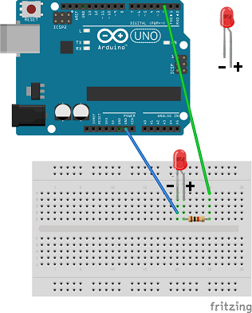
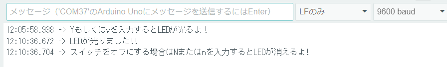
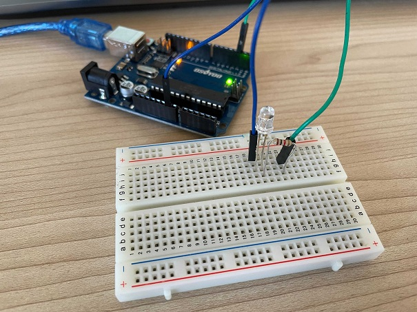
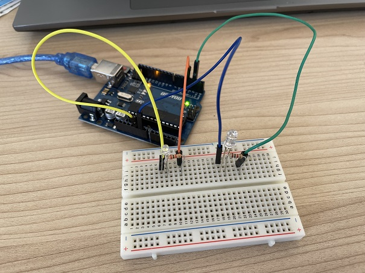

# LEDの点滅をコントロールしてみよう！

## ブレッドボードに回路を作成しシリアルモニターからの入力でLEDを点灯させる

### このレッスンで身につける力

- [ ] **ブレッドボード**で回路を作れる。

- [ ] **pinMode()** でピンの設定が出来る

- [ ] **if構文** を使ってプログラムを改造できる

- [ ] **setup()** について説明できる

- [ ] **loop()** について説明できる

- [ ] **Serial.read()** を使って文字の入力を取れる

---

### ミッションの準備

#### 0. ハードウェアを用意しよう

- [ ] Osoyoo UNO Board（ Arduino UNO rev.3と完全互換）x 1

- [ ] USBケーブルx 1

- [ ] パソコン x 1

- [ ] ブレッドボード x 1

- [ ] M / Mジャンパー線 x 1

- [ ] LED x 1


#### 1. ブレッドボードで回路を作ってみよう
イラストと同じように接続してみよう！



実際に配線するとこんな感じになるよ。


#### 2. サンプルスケッチを実行させてみよう
Arduino IDEを起動させて、スケッチに以下のコードをコピー＆ペーストして、スケッチを実行してみよう。

```C++
void setup() {
  pinMode(2, OUTPUT);//LEDピンを出力へ
  Serial.begin(9600); //シリアルを9600バンドに設定する
  while (! Serial); // シリアルの初期化を許可する
  Serial.println("Enter Y to turn on the LED:");
}
void loop() {
  if (Serial.available()) {
    char ch = Serial.read();
    if (ch == 'y' || ch == 'Y') {　//キーボードのyもしくはYを押すとLEDが光る
      digitalWrite(2, HIGH);
      Serial.println("You have turned on the LED!!");
      Serial.println("If you want to switch it off, simply enter N or n!");
    }
    if (ch == 'n' || ch == 'N') {　//キーボードのnもしくはNを押すとLEDが光る
      digitalWrite(2, LOW);
      Serial.println("You have turned off the LED!!");
      Serial.println("If you want to switch it on, simply enter Y or y!");
    }
  }
  delay(1000);
}
```

#### 4. スケッチをArduinoに書き込もう
次にスケッチをArduinoに書き込もう！  
まずUSBケーブルをArduinoとつなぎます。  
これまでと同じようにボードとシリアルポートを選択します。

この作業が終わったら、実際にArduinoに書き込みましょう。

書き込みが終わったら、右上のシリアルポートを選んで、パソコンとArduinoを通信しよう.
通信が始まるとこんな画面が出るよ！
  
>英語:  
Enter Y to turn on the LED"  

>日本語:  
Yボタンを押すとLEDが光る 

って書いてあるね。一番上の入力ボックスに大文字のYを入力して、エンターを押してみよう
  
そうするとブレッドボード上のLEDが光るよ!

  
シリアルポートの中文章が増えたね。少し読んでみよう！  


>英語:  
You have turned on the LED!!  
The LED was off for 5 seconds
If you want to switch it off, simply enter N or n!

>日本語:  
LEDが点灯しました!!  
LEDが5秒間消灯しました
スイッチをオフにする場合は、Nまたはnを入力するだけです。

この文章からキーボードのnかNを押すとLEDが消えることがわかるね。次にさっきと同じように入力ボックスにＮを入力してエンターキーを押してみよう。どうなるかな？

そうするとLEDが消えたね。


#### コードの説明

##### Setup()関数
よく見かける**void Setup()**。これはArduinoに電源が入ったとき一回だけ呼ばれる処理だよ。ここのsetup関数の中でピンの設定をしたり、シリアルモニタで通信を開始する設定を行うよ。

##### loop()関数
setup関数とセットのloop関数。これは処理をずっとループする関数だよ。Arduinoに電源が入って起動して、setup関数の処理が終わった後電源が切れるまでこの関数の処理が行なわれるよ。いわばArduinoのプログラムのメインとなるね。

##### pinMode(pin,mode)
Arduinoにはたくさんのピンがあるね。このpinmodeはピンを設定するためのものだよ。
今回のプログラムでは、

>pinMode(2, OUTPUT);//LEDピンを出力へ

Arduinoの2番ピンを出力ピンに設定しているよ。

### ミッションチャレンジ

では、ミッションにチャレンジしていこう！
まずは図のようにブレッドボードにLEDをもう一つ追加してみよう。

実際に配線するとこんな感じになるよ。


追加したLEDをArduinoの４番ピンでキーボードのmもしくはMでLEDを光らせよう。  
下のプログラムに３つの？マークがあるよ。その？を変更してみよう！

```C++
void setup() {
  pinMode(2, OUTPUT);//LEDピンを出力へ
  pinMode(?, OUTPUT);//LEDピンを出力へ
  Serial.begin(9600); //シリアルを9600バンドに設定する
  while (! Serial); // シリアルの初期化を許可する
  Serial.println("Enter Y to turn on the LED:");
}
void loop() {
  if (Serial.available()) {
    char ch = Serial.read();
    if (ch == 'y' || ch == 'Y') { //キーボードのyもしくはYを押すとLEDが光る
      digitalWrite(2, HIGH);
      Serial.println("You have turned on the LED!!");
      Serial.println("If you want to switch it off, simply enter N or n!");
    }
    if (ch == 'n' || ch == 'N')  { //キーボードのnもしくはNを押すとLEDが光る
      digitalWrite(2, LOW);
      digitalWrite(4, LOW);
      Serial.println("You have turned off the LED!!");
      Serial.println("If you want to switch it on, simply enter Y or y!");
    }

    if (ch == '?' || ch == '?')  {  //キーボードのmもしくはMを押すとLEDが光る
      digitalWrite(4, HIGH);
      Serial.println("You have turned on the LED!!");
      Serial.println("If you want to switch it off, simply enter N or n!");
    }
  }
  delay(1000);
}
```

答え
```C++
void setup() {
  pinMode(2, OUTPUT);//LEDピンを出力へ
  pinMode(4, OUTPUT);//LEDピンを出力へ
  Serial.begin(9600); //シリアルを9600バンドに設定する
  while (! Serial); // シリアルの初期化を許可する
  Serial.println("Enter Y to turn on the LED:");
}
void loop() {
  if (Serial.available()) {
    char ch = Serial.read();
    if (ch == 'y' || ch == 'Y') { //キーボードのyもしくはYを押すとLEDが光る
      digitalWrite(2, HIGH);
      Serial.println("You have turned on the LED!!");
      Serial.println("If you want to switch it off, simply enter N or n!");
    }
    if (ch == 'n' || ch == 'N')  { //キーボードのnもしくはNを押すとLEDが光る
      digitalWrite(2, LOW);
      digitalWrite(4, LOW);
      Serial.println("You have turned off the LED!!");
      Serial.println("If you want to switch it on, simply enter Y or y!");
    }

    if (ch == 'm' || ch == 'M')  {  //キーボードのmもしくはMを押すとLEDが光る
      digitalWrite(4, HIGH);
      Serial.println("You have turned on the LED!!");
      Serial.println("If you want to switch it off, simply enter N or n!");
    }
  }
  delay(1000);
}
```
mもしくはMを押してこのように追加したLEDが光れば成功だ！おめでとう！


#### if構文とは
さっきまでキーボードを押すことでLEDが光ったり、消えたりしたね。これはif構文と行ってプログラミングの中で条件分岐を行うための命令文を使っているからだよ。具体的には条件式を与えた後に条件式が成立するときにどんな処理をするかを書くと条件分岐ができるよ。
```C++
if (条件式){
    (条件式が成立する場合の処理を記述)
}
```

### まとめ

- **ブレッドボード** :電子回路の実験や試作をするための板のこと
- **pinMode()** : ピンを設定するための関数
- **setup()** : 最初に一回だけ実行される処理
- **loop()** : ずっと実行される処理
- **Serial.read()** :　
- - **if構文** : 

### 出来たことをチェックしよう

- [ ] **ブレッドボード**で回路が作れる
- [ ] **pinMode()**でピンの指定ができる
- [ ] **if構文**で条件分岐ができる
- [ ] **setup()**と**loop()**の概念を理解している
- [ ] **Serial.read()**を使えるようになった