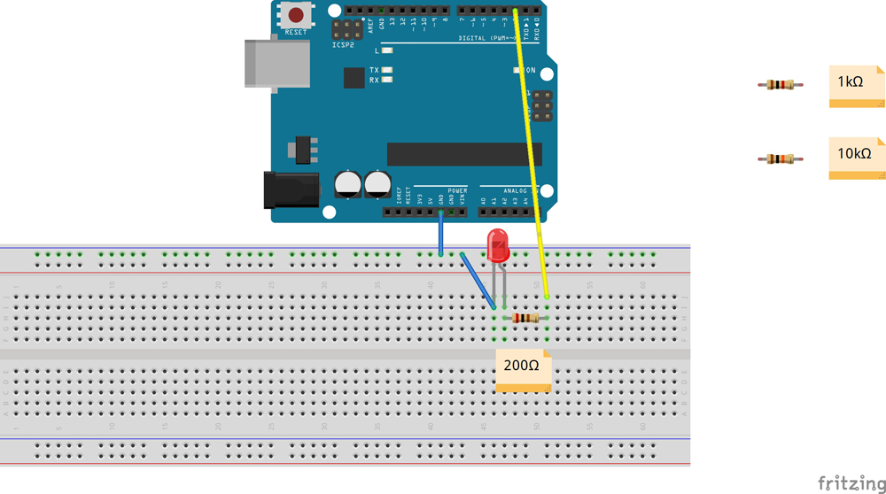

# LEDの点滅をコントロールしてみよう！

## ブレッドボードに回路を作成しシリアルモニターからの入力でLEDを点灯させる

### このレッスンで身につける力

- [ ] **ブレッドボード**で回路を作れる。

- [ ] **pinMode()** でピンの設定が出来る

- [ ] **if構文** を使ってプログラムを改造できる

- [ ] **setup()** について説明できる

- [ ] **loop()** について説明できる

- [ ] **Serial.read()** を使って文字の入力を取れる

---

### ミッションの準備

#### 0. ハードウェアを用意しよう

- [ ] Osoyoo UNO Board（ Arduino UNO rev.3と完全互換）x 1

- [ ] USBケーブルx 1

- [ ] パソコン x 1

- [ ] ブレッドボード x 1

- [ ] M / Mジャンパー線 x 1

- [ ] LED x 1


#### 1. ブレッドボードで回路を作ってみよう
イラストと同じように接続してみよう！



#### 2. スケッチをコピーしよう
Arduino IDEを起動させて、スケッチに以下のコードをコピー＆ペーストして、スケッチを実行してみよう。

```C++
int redLedPin = 2; // 赤色LEDをピンに接続
int count = 0; 
void setup() { 
pinMode(redLedPin, OUTPUT);//LEDピンを出力へ
Serial.begin(9600); //シリアルを9600バンドに設定する
while (! Serial); // シリアルの初期化を許可する
Serial.println("Enter Y to turn on the LED:"); 
} 
void loop() { 
if (Serial.available())  {  
char ch = Serial.read();  
if (ch == 'y'||ch == 'Y')  
{  
digitalWrite(redLedPin, HIGH);  
Serial.println("You have turned on the LED!!");  
Serial.print("The LED was off for ");  
Serial.print(count);  
Serial.println(" seconds");  
Serial.println("If you want to switch it off, simply enter N or n!"); 
count = 0;  
}  
if (ch == 'n'||ch == 'N')  {  
digitalWrite(redLedPin, LOW);  
Serial.println("You have turned off the LED!!");  
Serial.print("The LED was on for ");  
Serial.print(count);  
Serial.println(" seconds");  
Serial.println("If you want to switch it on, simply enter Y or y!");  
count = 0;  
}  
}  
delay(1000);  count += 1; 
}
```

#### 3. もう一つのLEDも光らせてみよう
ここでsetupとloopの理解をさせる

#### 4. if文


### ミッションチャレンジ

では、ミッションにチャレンジしていこう！

スケッチにこのコードをコピーして貼り付けていきましょう。


### まとめ


- **ブレッドボード** :電子回路の実験や試作をするための板のこと
- **pinMode()** : Arduinoのコードを書くためのツール。
- **スケッチ** : Arduino IDEのプログラムのこと。
- `Serial.begin(9600);` : シリアルポートを使うための準備。setupに書く。
- `Serial.println();` : シリアルポートに表示する。
- `" "` :　文字を表す記号「**引用符**」。

#### 出来たことをチェックしよう

- [ ] **Arduino IDE**を起動できる
- [ ] 白紙の**スケッチ**を作れる
- [ ] スケッチに**コメント**を入れることが出来る
- [ ] **Serial.begin()** と **Serial.println()** つかって"Hello World"を表示できる