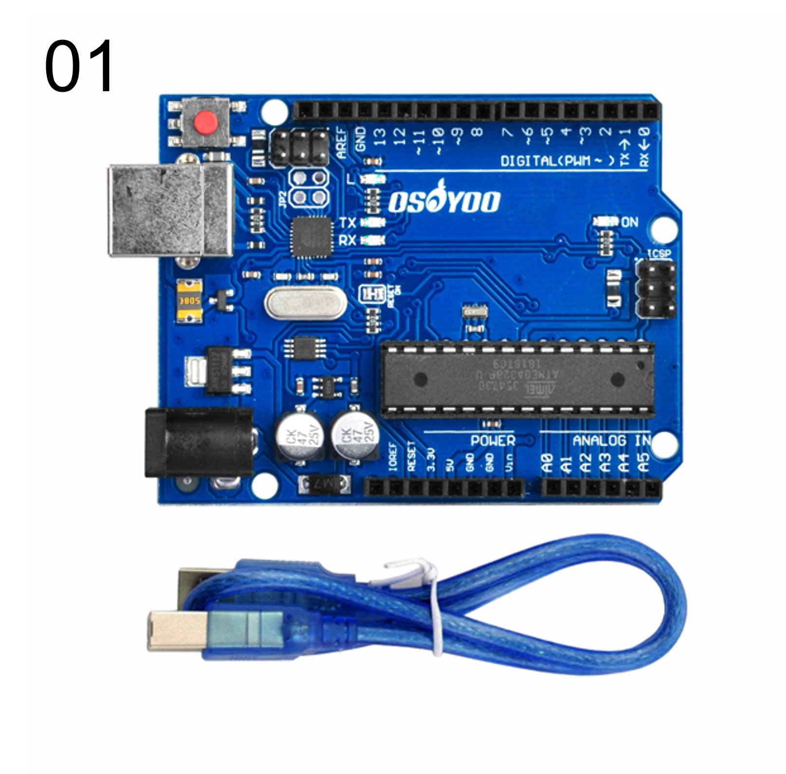
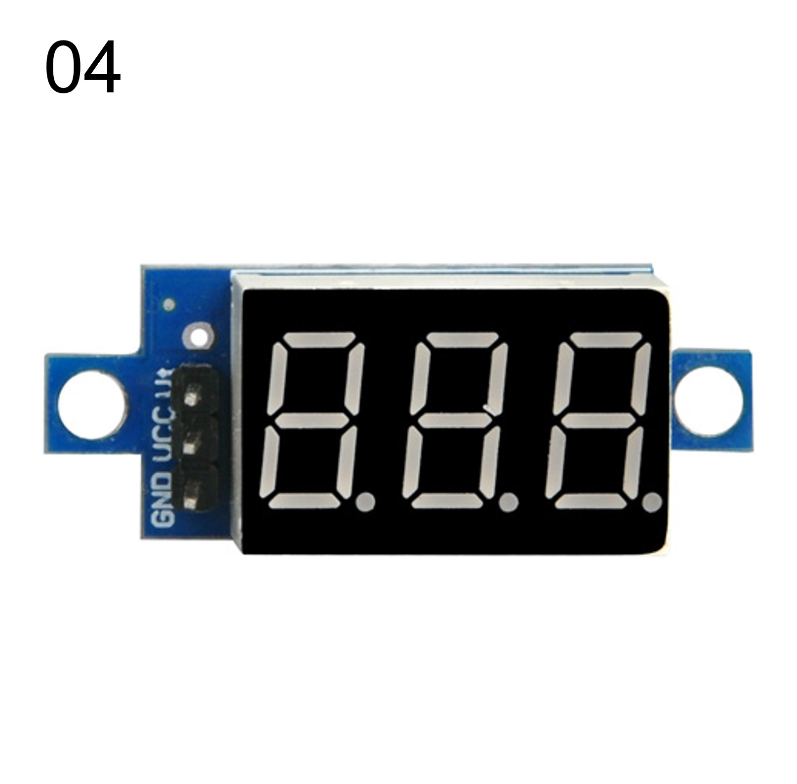
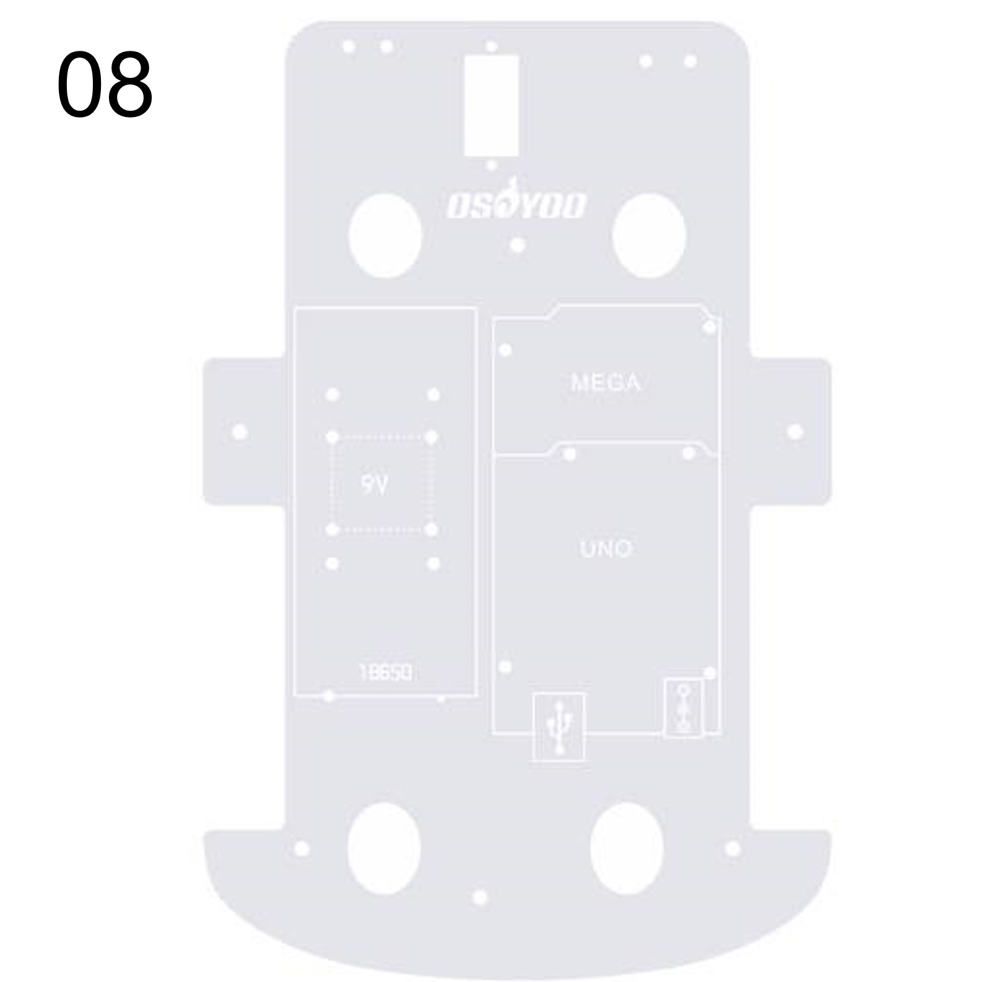

# ロボットカーを組み立てよう！

## **ロボットカーを組み立てる**

### このレッスンで身につける力

- [ ] 部品があるかチェックが出来る
- [ ] モーターを取り付けられる
- [ ] モータードライバーと電圧計を取り付けられる
- [ ] Arduinoボードと電池ボックス、WIFIシールドを取り付けられる
- [ ] ジャンパーワイヤーを正しく取り付けられる
- [ ] シャーシ・タイヤを取り付けられる
- [ ] サンプルコードを動かすことが出来る

---

### ミッションの準備

#### ハードウェアを用意しよう

- [ ] Osoyoo ROBOT CAR KIT x1
- [ ] 六角ドライバー x1
- [ ] ラジオペンチ x1

---
### 部品があるかチェックしよう

部品一覧：

| 写真 | 名前 | 個数 | 
| ------- |----------------------|-----------| 
|  | Arduino UNO                       | 1    | 
|  | UART WiFiシールド                 | 1    |
|  | モータードライバー                | 1    | 
|  | 電圧計                            | 1    | 
|  | ギアモーター                      | 4    | 
|  | モーター用ホルダー（ネジ付き）    | 4    | 
|  | ホイール                          | 4    | 
|  | シャーシ（上部）                  | 1    | 
|  | シャーシ（下部）                  | 1    | 
|  | 3ピン メスーメス ジャンパーワイヤ | 1   | 
|  | 6ピン オスーメス ジャンパーワイヤ | 1    | 
|  | 2ピン PnP ケーブル                | 1    | 
|  | プラスドライバー                  | 1    | 
|  | 六角ドライバー                    | 1    | 
|  | バッテリーボックス（９V電池用）   | 1    | 
|  | M3 x 10 六角ネジ	                 | 10   | 
|  | M3 x 10 プラスネジ	               | 4    | 
|  | M3 ナット                         | 4    | 
|  | スペーサー（黄銅）                | 5    | 
|  | ホイール用ネジ                    | 4    | 
|  | M3 プラスチックネジ               | 9    | 
|  | M3 プラスチックスペーサー         | 10   | 
|  | M3 プラスチックナット             | 10   | 

---

### モーターを取り付けよう

**1.シャーシの保護フィルムをはがしましょう．**

必要なもの：
- シャーシ（上部）
- シャーシ（下部）

**2.ギアモーターにモーター用ホルダーを付属のネジで固定しましょう．**

必要なもの：
- ギアモーター
- モーター用ホルダー（ネジ付き）

※取り付け向きに注意！

**3.モーターをシャーシ（下部）に取り付けましょう．**

必要なもの：
- シャーシ（上部）
- シャーシ（下部）
- 2.で組み立てたモーター

※ネジはモーター用ホルダーに同封されています．新しく出す必要はありません．

---

### モータードライバと電圧計を取り付けよう

---

#### 【ステップ2】0.1秒ごとにカウントアップするタイマーを作ろう

**＜実行の準備＞**

コピー＆ペーストができたら左上の矢印を押して（またはCtrl＋U），プログラムを書き込みましょう．

さきほどと同じように実行しましょう．

**＜実行結果＞**

---

### まとめ

- プログラムでの四則演算は「+」「-」「*」「/」
- シリアルモニタでデータの入力・表示ができる
- ループを遅らせるための関数はdelay();
- 変数は，数字や文字を入れておく箱
- int型は「整数型」，float型は「浮動小数点型」

#### 出来たことをチェックしよう

- [ ] 足す、引く、掛ける、割るの計算が出来る
- [ ] 計算の順序に合わせて( )を使える
- [ ] delay()と変数、整数型（int）を使ってタイマーを作れる
- [ ] 浮動小数点型(float)を使ってタイマーを改良できる