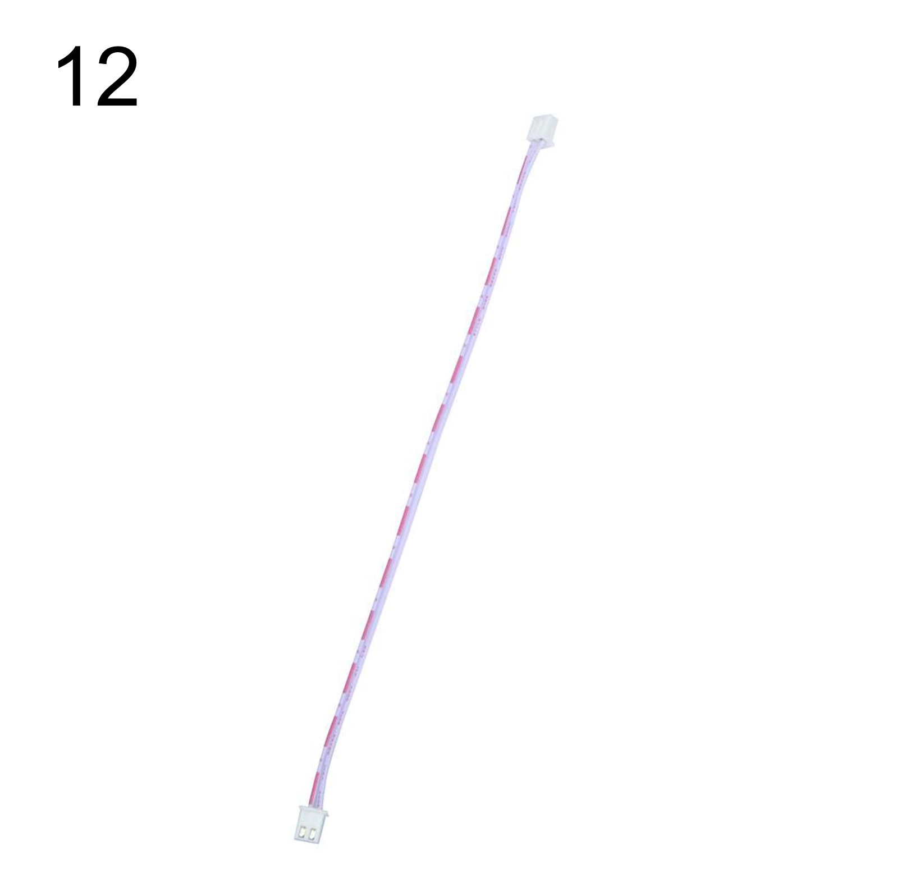
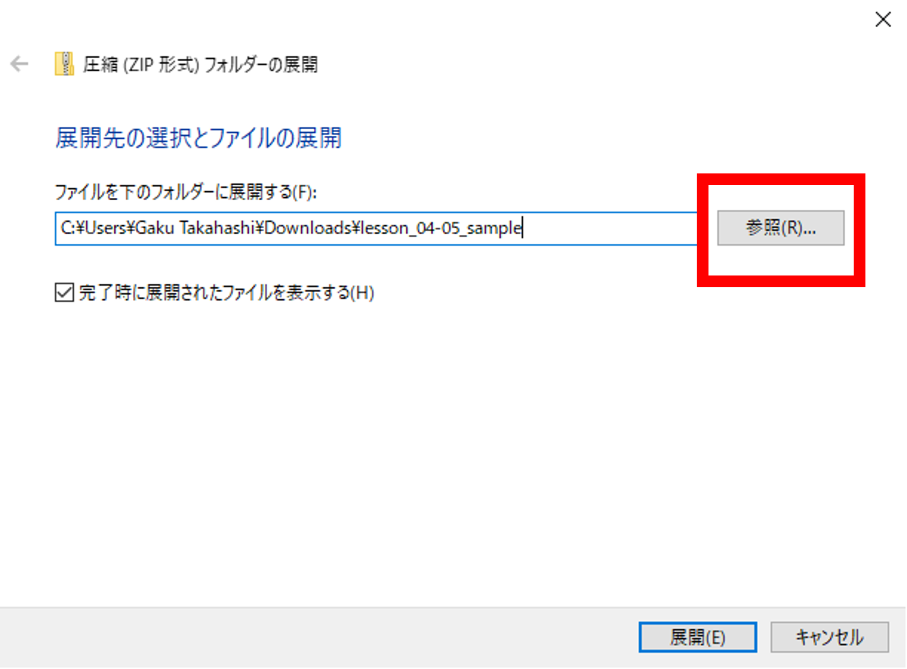

# ロボットカーを組み立てよう！

## **ロボットカーを組み立てる**

### このレッスンで身につける力

- [ ] 部品があるかチェックが出来る
- [ ] モーターを取り付けられる
- [ ] モータードライバーと電圧計を取り付けられる
- [ ] Arduinoボードと電池ボックス、WIFIシールドを取り付けられる
- [ ] ジャンパーワイヤーを正しく取り付けられる
- [ ] シャーシ・タイヤを取り付けられる
- [ ] サンプルコードを動かすことが出来る

---

### ミッションの準備

#### 組み立てに必要な物を用意しよう

- [ ] Osoyoo ROBOT CAR KIT x1
- [ ] 六角ドライバー x1
- [ ] ラジオペンチ x1

---
### 部品があるかチェックしよう

部品一覧：

| 番号 | 名前 | 個数 | 
| ------- |----------------------|-----------| 
| 01 | Arduino UNO                       | 1    | 
| 02 | WiFiシールド                 | 1    |
| 03 | モータードライバー                | 1    | 
| 04 | 電圧計                            | 1    | 
| 05 | ギアモーター                      | 4    | 
| 06 | モーター用ホルダー（ネジ付き）    | 4    | 
| 07 | ホイール                          | 4    | 
| 08 | シャーシ（上部）                  | 1    | 
| 09 | シャーシ（下部）                  | 1    | 
| 10 | 3ピン メスーメス ジャンパーワイヤ | 1   | 
| 11 | 6ピン オスーメス ジャンパーワイヤ | 1    | 
| 12 | 2ピン PnP ケーブル                | 1    | 
| 13 | プラスドライバー                  | 1    | 
| 14 | 六角ドライバー                    | 1    | 
| 15 | バッテリーボックス（９V電池用）   | 1    | 
| 16 | M3x10 六角ネジ	                 | 10   | 
| 17 | M3x10 プラスネジ	               | 4    | 
| 18 | M3ナット                         | 4    | 
| 19 | 黄銅スペーサー                | 5    | 
| 20 | ホイール用ネジ                    | 4    | 
| 21 | M3プラスチックネジ               | 9    | 
| 22 | M3プラスチックスペーサー         | 10   | 
| 23 | M3プラスチックナット             | 10   | 

---

### ハードウェアを組み立てよう①

#### 1.シャーシの保護フィルムをはがしましょう．

必要なもの：
- シャーシ（上部）
- シャーシ（下部）

#### 2.ギアモーターにモーター用ホルダーを付属のネジで固定しましょう．

必要なもの：
- ギアモーター x4
- モーター用ホルダー（ネジ付き） x4

※取り付け向きに注意！

#### 3.モーターをシャーシ（下部）に取り付けましょう．

必要なもの：
- シャーシ（下部）
- 2.で組み立てたモーター

※ネジはモーター用ホルダーに同封されています．新しく出す必要はありません．

#### 4.モータードライバを取り付けよう．

必要なもの：
- モータードライバ
- M3プラスチックネジ x4
- M3プラスチックスペーサー x4
- M3プラスチックナット x4
- 3.で組み立てたシャーシ

※モータードライバの取り付け向きに注意！

#### 5.電圧計を取り付けよう．

必要なもの：
- 電圧計
- M3プラスチックネジ x2
- M3プラスチックスペーサー x2
- M3プラスチックナット x2
- 4.で組み立てたシャーシ

#### 6.ArduinoUNOを取り付けよう．

必要なもの：
- ArduinoUNO
- シャーシ（上部）
- M3プラスチックネジ x4
- M3プラスチックスペーサー x4
- M3プラスチックナット x4

#### 7.バッテリーボックスを取り付けよう．

必要なもの：
- バッテリーボックス（９V電池用）
- M3x10 プラスネジ x4
- M3ナット x4
- 6.で組み立てたシャーシ

#### 8.WiFiシールドを取り付けよう．

必要なもの：
- 5.までに組み立てたシャーシ

---

### 配線を完成させよう

#### 1.モータードライバとモーターを接続しよう

#### 2.モータードライバとモーターを接続しよう

必要なもの：
- 3ピン メスーメス ジャンパーワイヤ

#### 3.モータードライバとWifiシールドを接続しよう

必要なもの：
- 6ピン オスーメス ジャンパーワイヤ
- 2ピン PnP ケーブル

※上部シャーシの穴を通して配線しよう！

#### 4.バッテリーボックスとWifiシールドを接続しよう

---

### ハードウェアを組み立てよう②

#### 1.上下のシャーシを固定しよう

必要なもの：
- M3x10 六角ネジ x10
- 黄銅スペーサー x5

※最後までネジが入らない場合があります．

#### 2.ホイールを取り付けよう

必要なもの：
- ホイール x4
- ホイール用ネジ x4

※きつく締め付けすぎるとタイヤが回らなくなります．

**完成！**

---

### サンプルコードを動かそう

#### 1.サンプルコードをダウンロードしよう

[ここからサンプルコードをダウンロード] (https://github.com/kobayashi-makoto2021/robobu/blob/Takahashi-work/Lesson_04-05/lesson_04-05_sample/lesson_04-05_sample.ino)

画面の下の方にこのような表示が出たらクリック

「すべて展開」をクリック

「参照」をクリックし，「デスクトップ」に展開しよう

デスクトップに移動し，「v2smartcar-lesson1.ino」を開こう．

#### 2.スケッチをArduinoに書き込もう

Arduino UNOボードとパソコンをUSBケーブルでつなぎましょう．

【注意】USBを抜き差しするときは向きを確認して，ていねいにあつかうこと．

USBを差したら，ArduinoIDEでポートを指定しましょう．

ツール→シリアルポートをクリックして，「COM～（Arduino UNO）」となっているものをクリックしましょう．（COM～の数字は毎回変わります．）

さいごに左上の矢印を押して（またはCtrl＋U），プログラムを書き込みましょう．

### 3.バッテリーを取り付けて電源を入れよう

プラス・マイナスに気を付けて9V電池をバッテリーボックスに差し込もう．

9V電池を差し込んだら，スイッチを押し込んで電源を入れよう！

**4.動作を確認しよう**

---

#### 出来たことをチェックしよう

- [ ] 部品があるかチェックが出来る
- [ ] モーターを取り付けられる
- [ ] モータードライバーと電圧計を取り付けられる
- [ ] Arduinoボードと電池ボックス、WIFIシールドを取り付けられる
- [ ] ジャンパーワイヤーを正しく取り付けられる
- [ ] シャーシ・タイヤを取り付けられる
- [ ] サンプルコードを動かすことが出来る