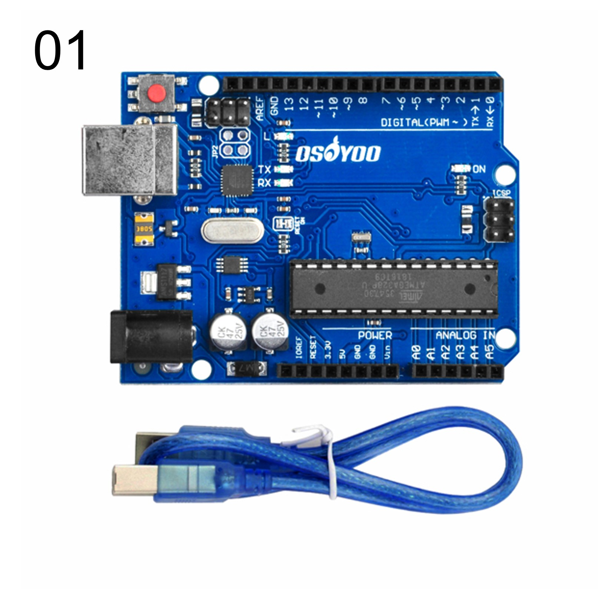
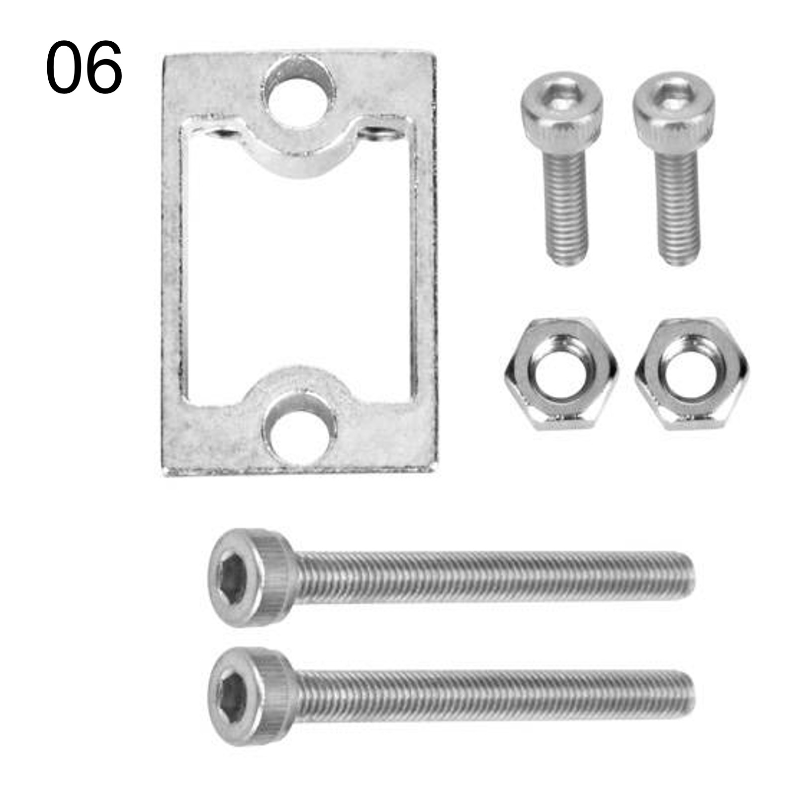
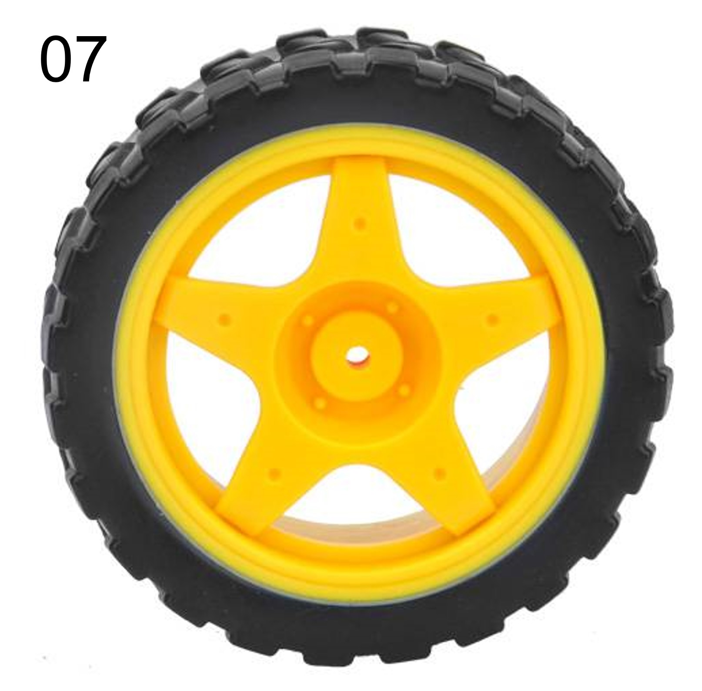
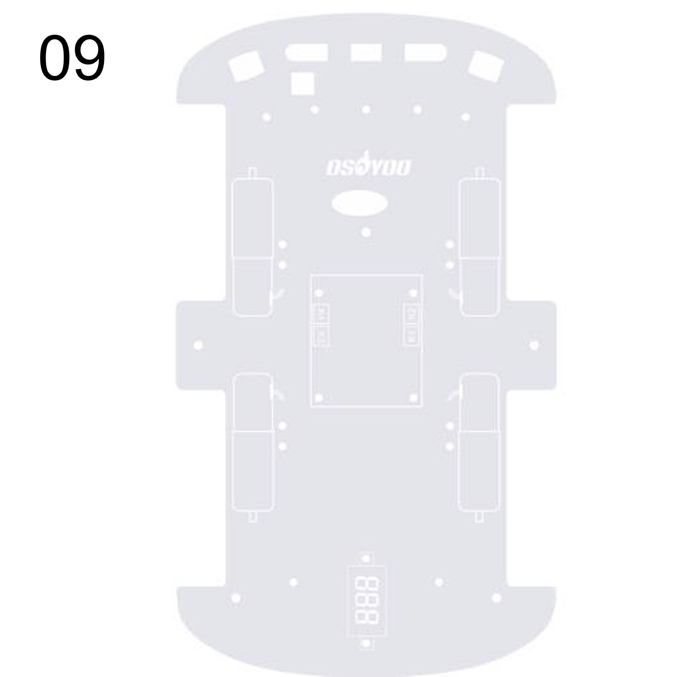
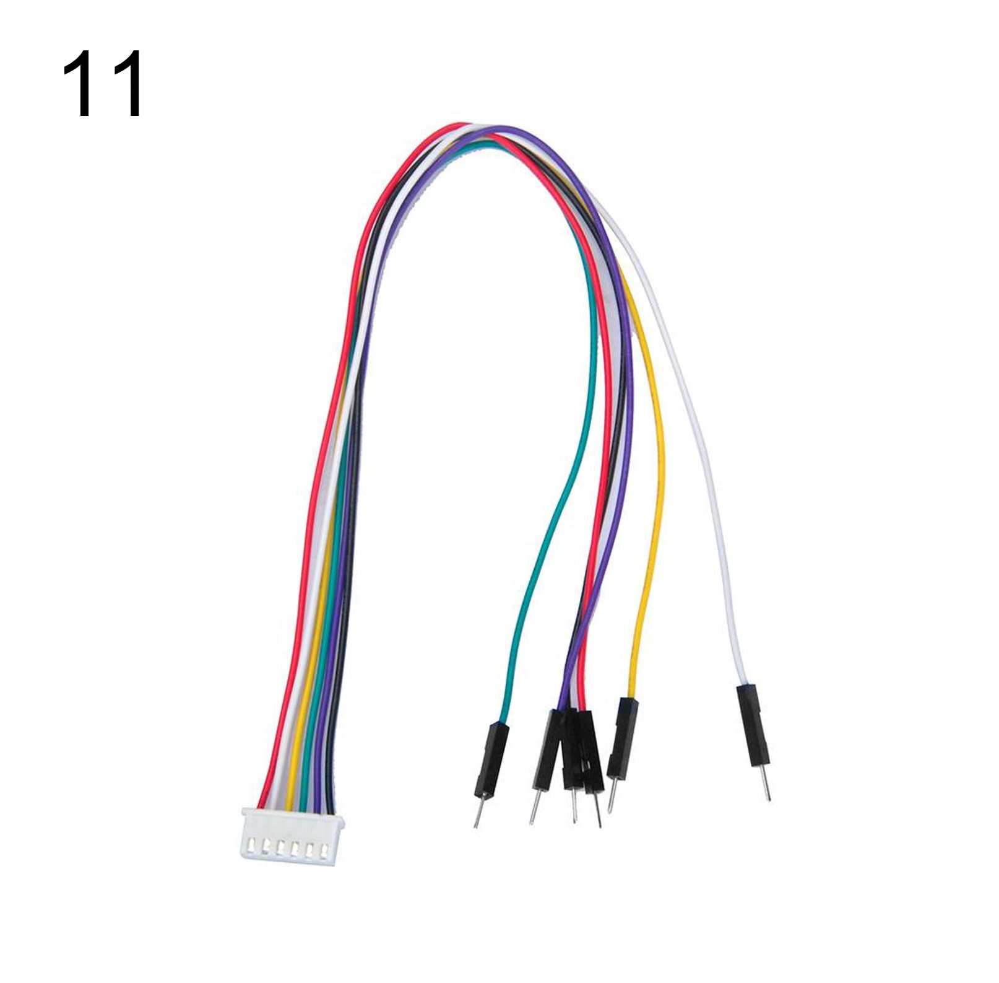
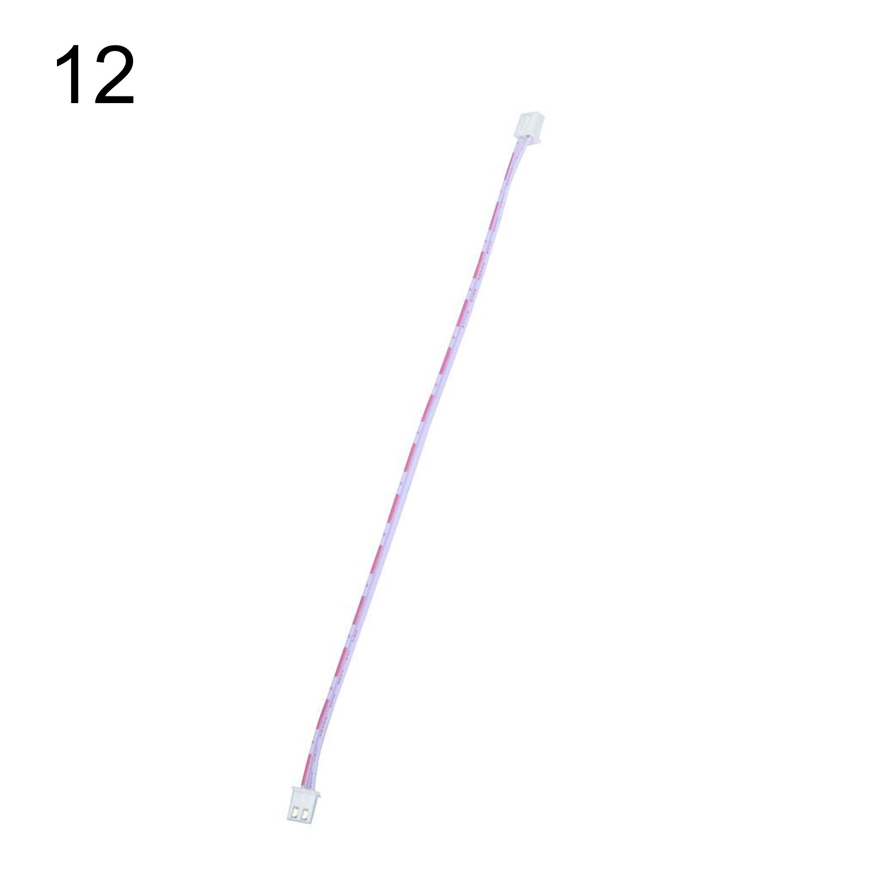
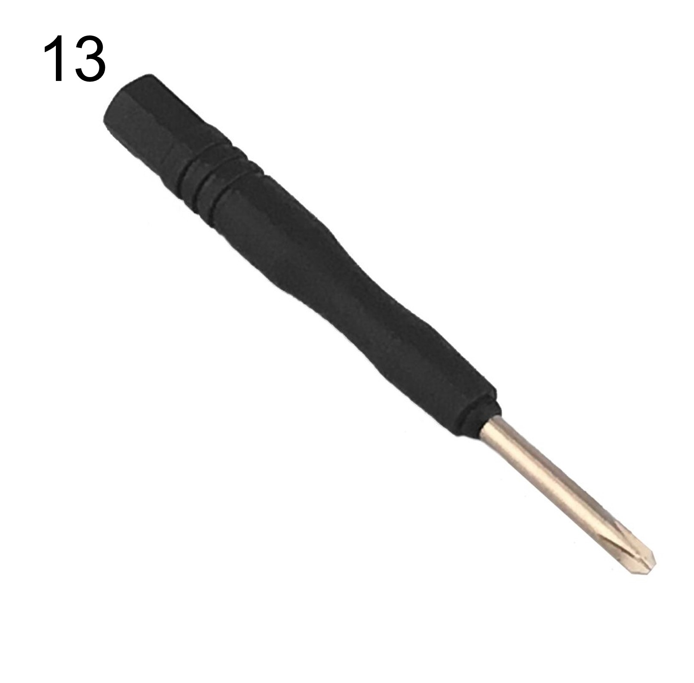
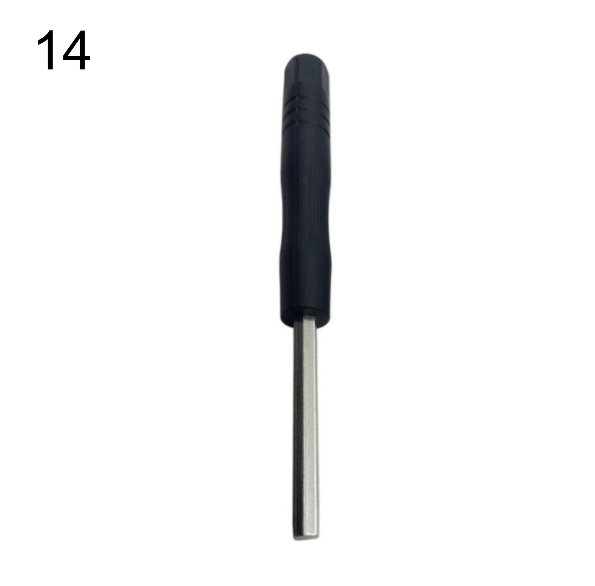
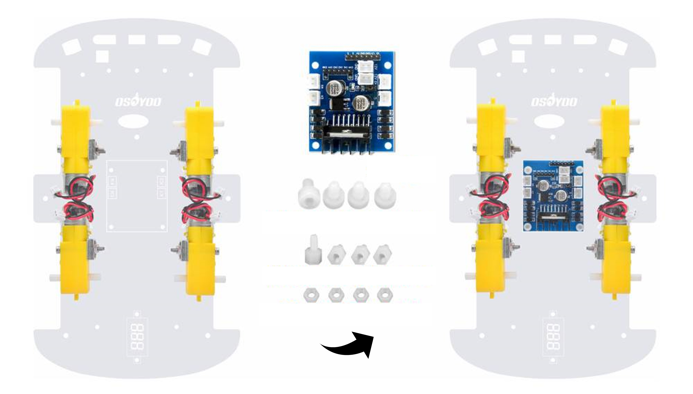
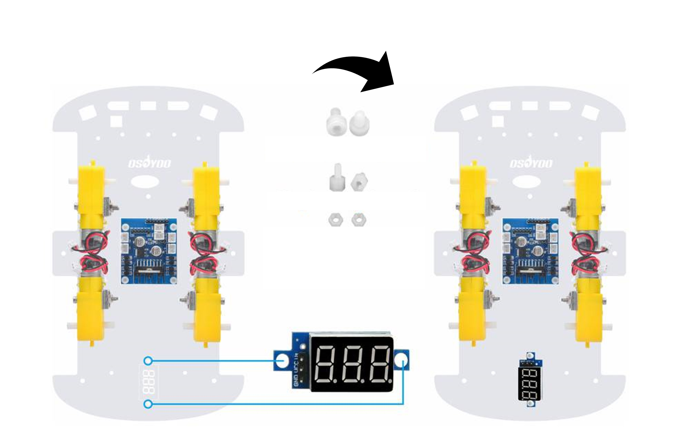

# レッスン4 ロボットカーを組み立てよう(1)

## **シャーシと部品を取り付けよう**

### このレッスンで身につける力

- [ ] 部品があるかチェックが出来る
- [ ] モーターを取り付けられる
- [ ] モータードライバーと電圧計を取り付けられる
- [ ] Arduinoボードと電池ボックス、WIFIシールドを取り付けられる

---

### ミッションの準備

#### 組み立てに必要な物を用意しよう

- [ ] Osoyoo ROBOT CAR KIT x1
- [ ] 六角ドライバー（教室のもの） x1
- [ ] ラジオペンチ（教室のもの） x1

---
### 部品があるかチェックしよう

部品一覧：

| 番号 | 名前 | 個数 | | 番号 | 名前 | 個数 |
| ----- |----|-----------|-| ------- |----------------------|-----------|
| 01 | Arduino UNO                       | 1    |  | 13 | プラスドライバー                  | 1    |
| 02 | WiFiシールド                 | 1    | | 14 | 六角ドライバー                    | 1    |
| 03 | モータードライバー                | 1    | | 15 | バッテリーボックス（９V電池用）   | 1    |
| 04 | 電圧計                            | 1    | | 16 | M3x10 六角ネジ	                 | 10   |
| 05 | ギアモーター                      | 4    | | 17 | M3x10 プラスネジ	               | 4    |
| 06 | モーター用ホルダー（ネジ付き）    | 4    | | 18 | M3ナット                         | 4    |
| 07 | ホイール                          | 4    |  | 19 | 黄銅スペーサー                | 5    |
| 08 | シャーシ（上部）                  | 1    || 20 | ホイール用ネジ                    | 4    |
| 09 | シャーシ（下部）                  | 1    |  | 21 | M3プラスチックネジ               | 9    |
| 10 | 3ピン メスーメス ジャンパーワイヤ | 1   | | 22 | M3プラスチックスペーサー         | 10   |
| 11 | 6ピン オスーメス ジャンパーワイヤ | 1    | | 23 | M3プラスチックナット             | 10   |
| 12 | 2ピン PnP ケーブル                | 1    |

- [ ] 部品があるか確認出来たらチェック！

---

### ハードウェアを組み立てよう①

#### 1.シャーシの保護フィルムをはがそう

必要なもの：
- シャーシ（上部）
- シャーシ（下部）

#### 2.ギアモーターにモーター用ホルダーを付属のネジで固定しよう

必要なもの：
- ギアモーター x4
- モーター用ホルダー（ネジ付き） x4

※取り付け向きに注意！

#### 3.モーターをシャーシ（下部）に取り付けよう

必要なもの：
- シャーシ（下部）
- 2.で組み立てたモーター

※ネジはモーター用ホルダーに同封されています．新しく出す必要はありません．

- [ ] モーターを取り付けられたらチェック！

---

#### 4.モータードライバを取り付けよう

必要なもの：
- モータードライバ
- M3プラスチックネジ x4
- M3プラスチックスペーサー x4
- M3プラスチックナット x4
- 3.で組み立てたシャーシ

※モータードライバの取り付け向きに注意！

#### 5.電圧計を取り付けよう

必要なもの：
- 電圧計
- M3プラスチックネジ x2
- M3プラスチックスペーサー x2
- M3プラスチックナット x2
- 4.で組み立てたシャーシ

- [ ] モータードライバーと電圧計を取り付けられたらチェック！

---

#### 6.ArduinoUNOを取り付けよう

必要なもの：
- Arduino UNO
- シャーシ（上部）
- M3プラスチックネジ x4
- M3プラスチックスペーサー x4
- M3プラスチックナット x4

#### 7.バッテリーボックスを取り付けよう

必要なもの：
- バッテリーボックス（9V電池用）
- M3x10 プラスネジ x4
- M3ナット x4
- 6.で組み立てたシャーシ

#### 8.WiFiシールドを取り付けよう

必要なもの：
- WiFiシールド
- 7.で組み立てたシャーシ

- [ ] Arduinoボードと電池ボックス、WIFIシールドを取り付けられたらチェック！

---

#### 出来たことをチェックしよう

- [ ] 部品があるかチェックが出来る
- [ ] モーターを取り付けられる
- [ ] モータードライバーと電圧計を取り付けられる
- [ ] Arduinoボードと電池ボックス、WIFIシールドを取り付けられる
