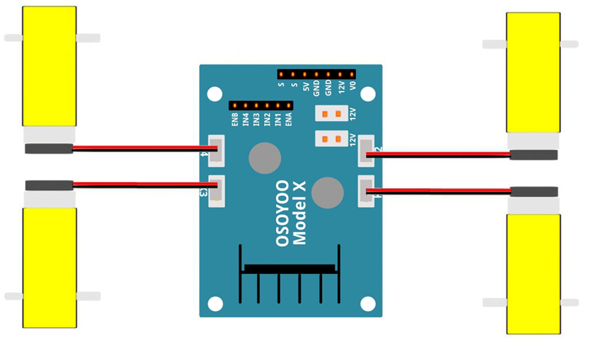
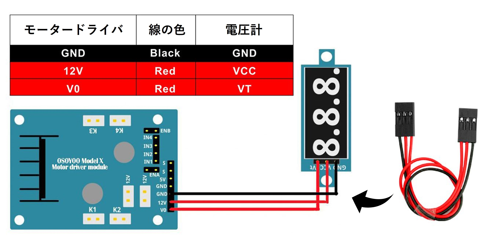
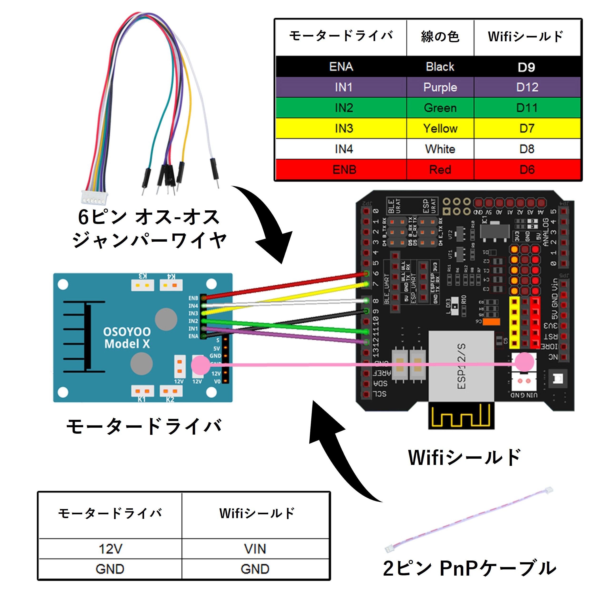
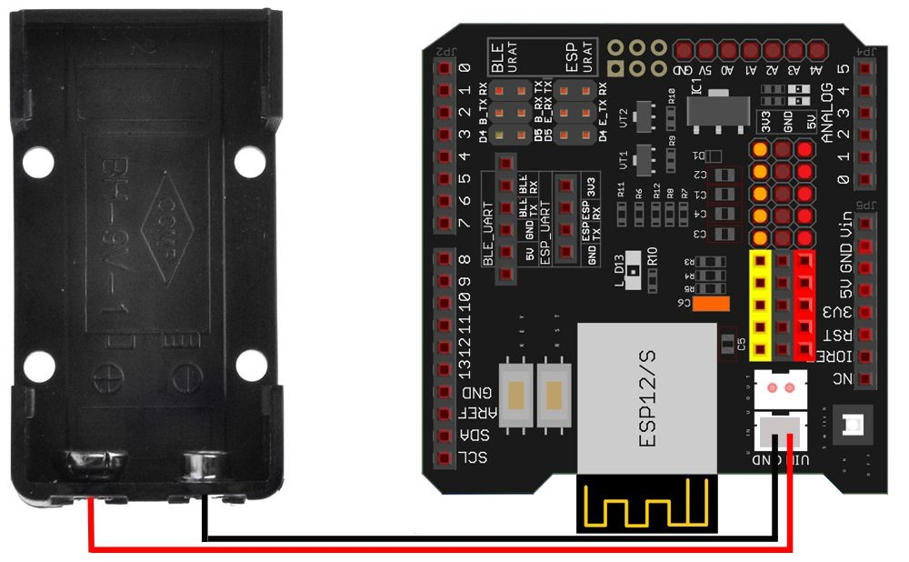
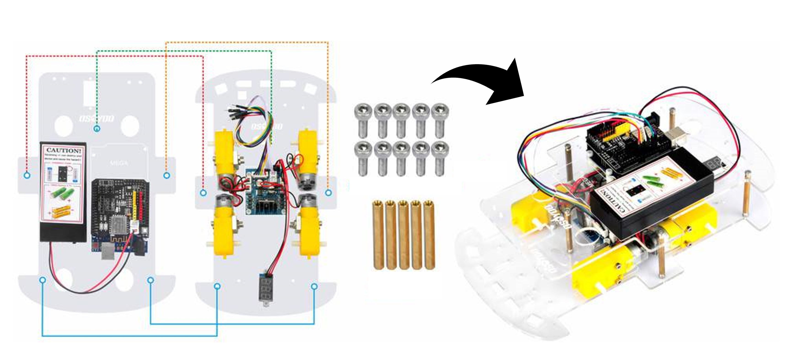
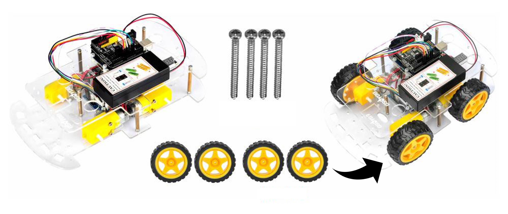
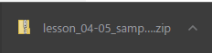
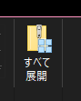
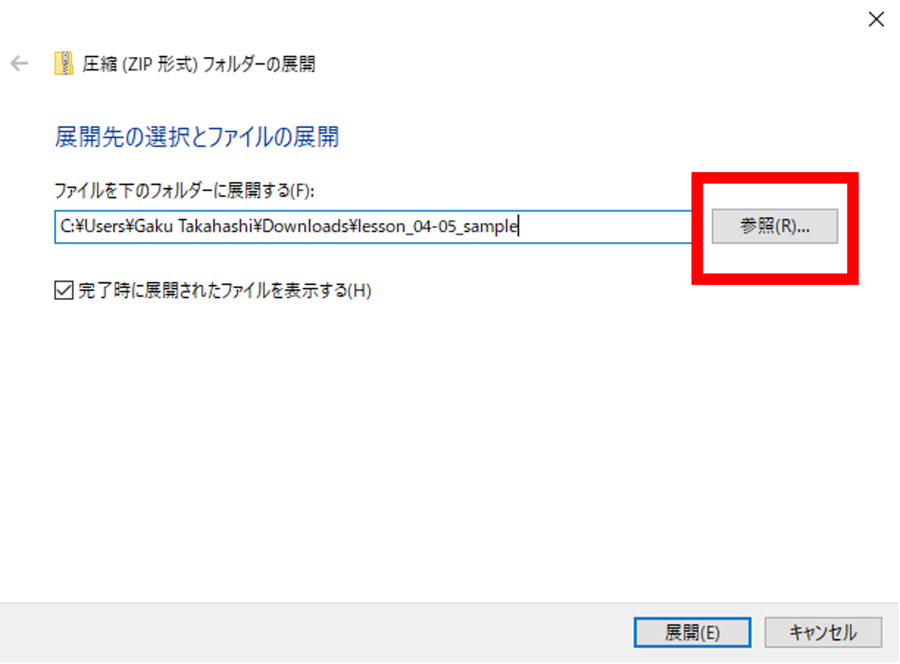
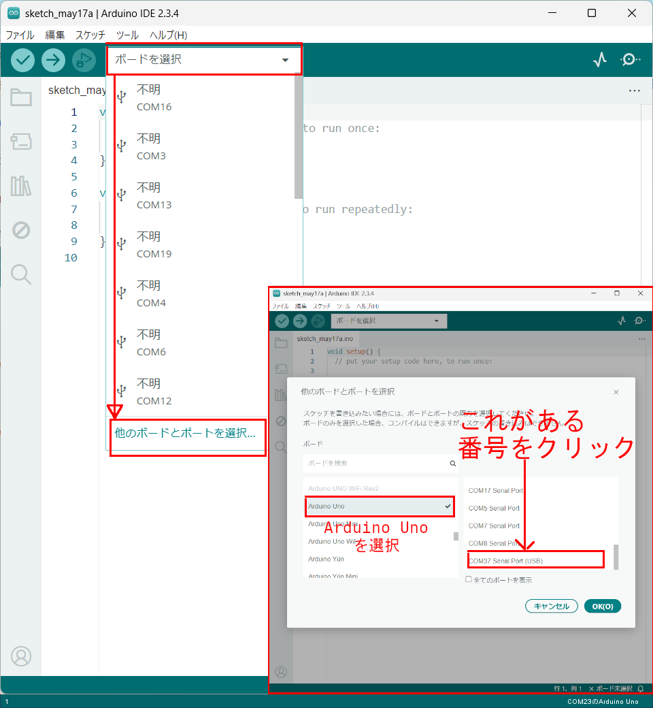

# レッスン5 ロボットカーを組み立てよう(2)

## **配線してサンプルコードを動かそう**

### このレッスンで身につける力

- [ ] ジャンパーワイヤーを正しく取り付けられる
- [ ] シャーシ・タイヤを取り付けられる
- [ ] サンプルコードを動かすことが出来る

---

### 配線を完成させよう

#### 1.モータードライバとモーターを接続しよう





#### 2.モータードライバとモーターを接続しよう

必要なもの：
- 3ピン メスーメス ジャンパーワイヤ




#### 3.モータードライバとWifiシールドを接続しよう

必要なもの：
- 6ピン オスーメス ジャンパーワイヤ
- 2ピン PnP ケーブル

※上部シャーシの穴を通して配線しよう！




#### 4.バッテリーボックスとWifiシールドを接続しよう




- [ ] ジャンパーワイヤーを正しく取り付けられたらチェック！

---

### ハードウェアを組み立てよう②

#### 1.上下のシャーシを固定しよう

必要なもの：
- M3x10 六角ネジ x10
- 黄銅スペーサー x5

※最後までネジが入らない場合があります．




#### 2.ホイールを取り付けよう

必要なもの：
- ホイール x4
- ホイール用ネジ x4

※きつく締め付けすぎるとタイヤが回らなくなります．



- [ ] シャーシ・タイヤを取り付けられたらチェック！


**完成！**

---


### サンプルコードを動かそう

#### 1.サンプルコードをダウンロードしよう

[ここをクリックしてサンプルコードをダウンロード](https://github.com/kobayashi-makoto2021/robobu/raw/main/Lesson_05/sample/lesson_04-05_sample.zip)

画面の下の方にこのような表示が出たらクリック




「すべて展開」をクリック




「参照」をクリックし，「デスクトップ」に展開しよう



デスクトップに移動し，「lesson_04-05_sample.ino」を開こう．

<details><summary>*サンプルプログラムはここからコピー＆ペーストできるよ</summary><div>

```c++
#include "motor_driver.h"  // 標準モーター制御ライブラリ（ENA=D3, ENB=D6 など）

void setup()
{
  init_GPIO();        // モーターピンを初期化して停止状態にする

  go_Advance();       // 前進
  delay(2000);

  go_Back();          // 後退
  delay(2000);

  go_Left();          // 左旋回
  delay(2000);

  go_Right();         // 右旋回
  delay(2000);

  stop_Stop();        // 停止
}

void loop() {
}
```

</div></details>

#### 2.スケッチをArduinoに書き込もう

Arduino UNOボードとパソコンをUSBケーブルでつなぎましょう．


【注意】USBを抜き差しするときは向きを確認して，ていねいにあつかうこと．

USBを差したら，ArduinoIDEでポートを指定しましょう．

ツール→シリアルポートをクリックして，「COM～（Arduino UNO）」となっているものをクリックしましょう．（COM～の数字は毎回変わります．）




さいごに左上の矢印を押して（またはCtrl＋U），プログラムを書き込みましょう．


#### 3.バッテリーを取り付けて電源を入れよう

プラス・マイナスに気を付けて9V電池をバッテリーボックスに差し込もう．


#### 4.動作を確認しよう

**※ロボットを広い場所に移動しよう**

電池を差し込んだら，スイッチを押し込んで電源を入れよう！


**ロボットが前後移動・左右旋回したら成功！**

- [ ] サンプルコードを動かすことが出来たらチェック！


---


#### 出来たことをチェックしよう

- [ ] ジャンパーワイヤーを正しく取り付けられる
- [ ] シャーシ・タイヤを取り付けられる
- [ ] サンプルコードを動かすことが出来る
