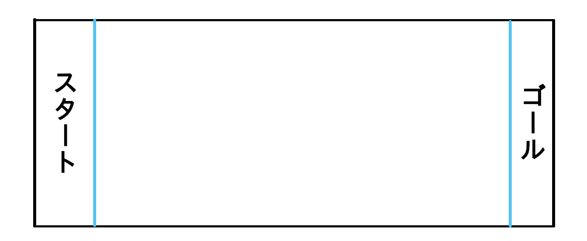

# レッスン6 ロボット・チキンラン！<br>～ロボットで線ギリギリまで進むプログラムを書こう！～

## このレッスンで身につける力

- [ ] レッスン04・05のサンプルコードを使ってロボットを**まっすぐ進める**ことができる。
- [ ] ロボットを**後ろに下がらせる**ことができる。
- [ ] ロボットの**速度を調整する**ことができる。
- [ ] 設定した速度と前進する時間からおおよその**進む距離が予想**できる。
- [ ] **ラインギリギリで止まる**ことができる。
---

## ミッションの準備
### 0. 必要なハードウェア

- [ ] Osoyoo ROBOT CAR STARTER KIT ×1
- [ ] USBケーブル ×1
- [ ] ArduinoIDEがインストールされたパソコン ×1
- [ ] コース



### 1. ArduinoIDEを起動して白紙のスケッチを作ろう<br>
最初にArduinoIDEを起動しよう。次に起動したらスケッチに名前を付けてデスクトップに保存してみよう。やり方が分からなかったらレッスン1のテキストを見て復習しよう！
### 2. サンプルコードをコピー&ペーストしよう<br>
サンプルコードを1で作ったスケッチにコピー&ペーストしよう
```C++
#define speedPinR 9    //  右側のPWM信号を送信するピンの設定
#define RightMotorDirPin1  12    //右後ろのモーターの信号ピンの設定 
#define RightMotorDirPin2  11    //右前のモーターの信号ピンの設定
#define speedPinL 6    // 左のPWM信号を送信するピンの設定
#define LeftMotorDirPin1  7    //左後ろのモーターの信号ピンの設定 
#define LeftMotorDirPin2  8   //左前のモーターの信号ピンの設定  


//モーターの制御
void go_Advance(int speed = 200, int time = 0)  //前に進む関数
{
  digitalWrite(RightMotorDirPin1, HIGH);
  digitalWrite(RightMotorDirPin2, LOW);
  digitalWrite(LeftMotorDirPin1, HIGH);
  digitalWrite(LeftMotorDirPin2, LOW);
  analogWrite(speedPinL, speed);
  analogWrite(speedPinR, speed);
  if (time == 0) {
    ;
  } else {
    delay(time);
  }
}
void go_Left(int speed = 200, int time = 0) //左に旋回する関数
{
  digitalWrite(RightMotorDirPin1, HIGH);
  digitalWrite(RightMotorDirPin2, LOW);
  digitalWrite(LeftMotorDirPin1, LOW);
  digitalWrite(LeftMotorDirPin2, HIGH);
  analogWrite(speedPinL, speed);
  analogWrite(speedPinR, speed);
  if (time == 0) {
    ;
  } else {
    delay(time);
  }
}
void go_Right(int speed = 200, int time = 0) //右に旋回する関数
{
  digitalWrite(RightMotorDirPin1, LOW);
  digitalWrite(RightMotorDirPin2, HIGH);
  digitalWrite(LeftMotorDirPin1, HIGH);
  digitalWrite(LeftMotorDirPin2, LOW);
  analogWrite(speedPinL, speed);
  analogWrite(speedPinR, speed);
  if (time == 0) {
    ;
  } else {
    delay(time);
  }
}
void go_Back(int speed = 200, int time = 0) //後ろに下がる関数
{
  digitalWrite(RightMotorDirPin1, LOW);
  digitalWrite(RightMotorDirPin2, HIGH);
  digitalWrite(LeftMotorDirPin1, LOW);
  digitalWrite(LeftMotorDirPin2, HIGH);
  analogWrite(speedPinL, speed);
  analogWrite(speedPinR, speed);
  if (time == 0) {
    ;
  } else {
    delay(time);
  }
}
void stop_Stop(int time = 1000)    //ストップ
{
  digitalWrite(RightMotorDirPin1, LOW);
  digitalWrite(RightMotorDirPin2, LOW);
  digitalWrite(LeftMotorDirPin1, LOW);
  digitalWrite(LeftMotorDirPin2, LOW);
  delay(time);
}
//モーター速度の設定
void set_Motorspeed(int speed_L, int speed_R)
{
  analogWrite(speedPinL, speed_L);
  analogWrite(speedPinR, speed_R);
}

//ピンの初期化
void init_GPIO()
{
  pinMode(RightMotorDirPin1, OUTPUT);
  pinMode(RightMotorDirPin2, OUTPUT);
  pinMode(speedPinL, OUTPUT);

  pinMode(LeftMotorDirPin1, OUTPUT);
  pinMode(LeftMotorDirPin2, OUTPUT);
  pinMode(speedPinR, OUTPUT);
  stop_Stop();
}

void setup()
{
  init_GPIO();

//ここから下にプログラムを書く

}

void loop() {
} 
```
---

## ミッションチャレンジ
### ロボットをまっすぐ進ませよう
ロボットをまっすぐ進ませるには**go_Advance関数**を使うよ。
```C++
go_Advance(100);
delay(止まるまでの時間);
stop_Stop();
```
のように書くと指定された時間が経つまで前に進み続けるよ。
試しにプログラムの`//ここから下にプログラムを書く`と書いてある下に
```C++
go_Advance(100);
delay(1000);
stop_Stop();
```
と書いてみよう。プログラムを実行するとロボットが1秒間(1000ミリ秒間)進むよ。<br>
>クイズ<br>
>ロボットが1.25秒間前に進むプログラムを書いてみよう！
 - [ ] ロボットが前に進んだらチェック！
 - [ ] ロボットが進む時間を自分で設定できたらチェック！
<br><br>

### ロボットを後ろに下がらせよう
ロボットを後ろに下がらせるためには**go_Back関数**を使うよ。go_Back関数もgo_Advance関数と同じように
```C++
go_Back(100);
delay(止まるまでの時間);
stop_Stop();
```
のように書くと指定された時間が経つまで後ろに下がり続けるよ。
>クイズ<br>
>ロボットが1秒間前に進んだ後に1度停止して、1秒間後ろに下がるプログラムを書いてみよう！
 - [ ] ロボットが後ろ下がったらチェック！
 - [ ] ロボットが下がる時間を自分で設定できたらチェック！
<br><br>

### ロボットの速度を調整しよう
今までに使ったgo_Advance関数、go_Back関数の()の中の数字を変更するとロボットのスピードが変わるよ。
```C++
go_Advance(スピード);
delay(止まるまでの時間);
stop_Stop();
```
と書くとロボットが前に進むスピードと時間を設定できるよ。試しに
```C++
go_Advance(100);
delay(1000);
stop_Stop();
delay(100);
go_Advance(1000);
delay(1000);
stop_Stop();
```
と書いてみよう。プログラムを実行させると1度目よりも2度目の方がロボットのスピードが上がっているね。
>クイズ<br>
>スピード100で前に進んだ後に1度停止してスピード1000で後ろに下がるプログラムを書いてみよう！
 - [ ] ロボットの進むスピードが変わっていたらチェック！
 - [ ] ロボットが後ろに下がるスピードが変更できたらチェック！
<br><br>

### 設定した速度と前進する時間からおおよその進む距離を予想しよう
進む距離は
>速度×時間

で計算できるよ。
試しにスピードが100で1秒間進んだ時にどのくらい移動するか計算してみよう！計算できたら実験して答えがあっているか調べよう！
```C++
go_Advance(100);
delay(1000);
stop_Stop();
```
>クイズ<br>
>スピードが200で1秒間進む距離とスピードが100で1秒間進む距離はどちらの方が多いかな？


 - [ ] ロボットの進む距離が計算できたらチェック！
 - [ ] スピードと時間と距離の関係が分かったらチェック！

<br><br>

### ラインギリギリでロボットを止めよう


#### スタートからゴールの線ギリギリで止めよう
<!-- 
ロボットをラインギリギリで止めるためには
1.スタートラインからゴールラインまでの距離を測る<br>
2.ゴールラインまでの距離をスピードで割る<br>
3.プログラムの止まるまでの時間を入力する<br>
4.ロボットを走らせてみてラインを超えたら止まるまでの時間を減らす<br>
5.ロボットを走らせてみてラインギリギリより手前で止まったら時間を増やす<br>

をするとできるよ。やってみよう！ -->
<!-- - [ ] スタートラインからゴールラインまでの距離を測れたらチェック！ -->
<!-- - [ ] プログラムの止まるまでの時間を計算できたらチェック！ -->
- [ ] ラインギリギリで止まれたらチェック！

#### ゴールまで行ってスタート地点まで戻ってこよう
- [ ] ラインギリギリで戻ってこれたらチェック！


---
## まとめ
- **go_Advance関数** :ロボットを前に進めるための関数
- **go_Back関数** :ロボットを後ろに下がらせるための関数
- ```C++ 
  go_Advance(スピード);
  delay(止まるまでの時間);
  stop_Stop();
  ```
  →ロボットが前に進むプログラム
- ```C++ 
  go_Back(スピード);
  delay(止まるまでの時間);
  stop_Stop();
  ```
  →ロボットが後ろに下がるプログラム
- `速さ×時間=進む距離` :ロボットが進む距離の計算式


### 出来たことをチェックしよう
- [ ] レッスン04・05のサンプルコードを使ってロボットをまっすぐ進めることができる。
- [ ] ロボットを後ろに下がらせることができる。
- [ ] ロボットの速度を調整することができる。
- [ ] 設定した速度と前進する時間からおおよその進む距離が予想できる。
- [ ] ラインギリギリで止まることができる。