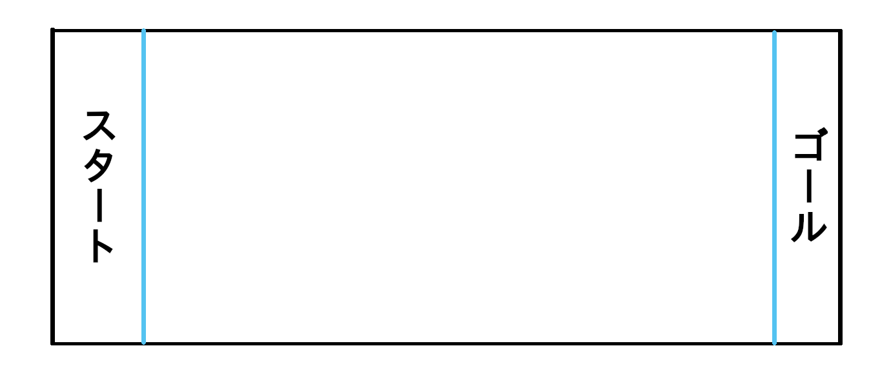

# レッスン6 ロボット・チキンラン！<br>～ロボットで線ギリギリまで進むプログラムを書こう！～

#### このレッスンで身につける力

- [ ] レッスン04・05のサンプルコードを使ってロボットを**まっすぐ進める**ことができる。
- [ ] ロボットを**後ろに下がらせる**ことができる。
- [ ] ロボットの**速度を調整する**ことができる。
- [ ] 設定した速度と前進する時間からおおよその**進む距離が予想**できる。
- [ ] **ラインギリギリで止まる**ことができる。
---

### ミッションの準備
#### 0. 必要なハードウェア

- [ ] Osoyoo ROBOT CAR STARTER KIT ×1
- [ ] USBケーブル ×1
- [ ] ArduinoIDEがインストールされたパソコン ×1
- [ ] コース



#### 1. ArduinoIDEを起動して白紙のスケッチを作ろう<br>
最初にArduinoIDEを起動しよう。次に起動したらスケッチに名前を付けてデスクトップに保存してみよう。やり方が分からなかったらレッスン1のテキストを見て復習しよう！
#### 2. motor_driver.h をスケッチフォルダにコピーしよう<br>
`Lesson_common` フォルダにある `motor_driver.h` を、今回のスケッチフォルダにコピーしよう。

```
lesson_06_sample/
├── lesson_06_sample.ino
└── motor_driver.h     ← ここにコピー
```

#### 3. サンプルコードをコピー&ペーストしよう<br>
サンプルコードを2で作ったスケッチにコピー&ペーストしよう

```C++
#include "motor_driver.h"  // モーター制御ライブラリ

void setup()
{
  init_GPIO();  // ピンの初期化

  // ここから下にプログラムを書く

}

void loop() {
}
```
---

### ミッションチャレンジ
#### ロボットをまっすぐ進ませよう
ロボットをまっすぐ進ませるには**go_Advance関数**を使うよ。
```C++
go_Advance(スピード, 止まるまでの時間);
```
のように書くと指定された時間が経つまで前に進み続けるよ。
試しにプログラムの`//ここから下にプログラムを書く`と書いてある下に
```C++
go_Advance(100, 1000);
```
と書いて動かしてみよう。プログラムを実行するとロボットが1秒間(1000ミリ秒間)進むよ。

これができたら、速度と距離を変えて、コースのゴールの線ギリギリまで進んでみよう！

**出来たらチェック！**
 - [ ] ロボットの前進が出来たらチェック！
 - [ ] 速度を調節できたらチェック！
 - [ ] ラインギリギリで止まれたらチェック！

#### ロボットを後ろに下がらせよう
ゴールの線ギリギリに止まったロボットを今度はスタート地点まで戻してみよう。

ロボットを後ろに下がらせるためには**go_Back関数**を使うよ。go_Back関数もgo_Advance関数と同じように
```C++
go_Back(スピード, 止まるまでの時間);
```
のように書くと指定された時間が経つまで後ろに下がるよ。試しに

```C++
go_Back(100, 1000);
```
と書いて動かしてみよう。これができたら、速度と距離を変えて、コースのスタートの線ギリギリまで戻ってみよう！

**出来たらチェック！**

 - [ ] ロボットの後進が出来たらチェック！
 - [ ] 速度を調節できたらチェック！
 - [ ] ラインギリギリで止まれたらチェック！


#### 設定した前進する時間と距離から速度を計算しよう
速度は

`速度 = 進んだ距離 ÷ 時間`

で計算できるよ。

試しにスピードが100で1秒間進んだ時にどのくらい移動するか測ってみよう。
測った距離から速度をノートに計算してみよう。

同じようにスピードが200に設定したとき、300に設定したときで速度がどのように変わるか、距離を測って、ノートに記録しよう。

速度から距離を求める計算も覚えておこう

`進む距離 = 速さ × 時間` 


---
## まとめ
- **go_Advance関数** :ロボットを前に進めるための関数
- **go_Back関数** :ロボットを後ろに下がらせるための関数
- ```C++ 
  go_Advance(スピード, 止まるまでの時間);
  ```
  →ロボットが前に進むプログラム
- ```C++ 
  go_Back(スピード, 止まるまでの時間);
  ```
  →ロボットが後ろに下がるプログラム
- `進む距離 = 速さ × 時間` :ロボットが進む距離の計算式


### 出来たことをチェックしよう
- [ ] レッスン04・05のサンプルコードを使ってロボットをまっすぐ進めることができる。
- [ ] ロボットを後ろに下がらせることができる。
- [ ] ロボットの速度を調整することができる。
- [ ] 設定した速度と前進する時間からおおよその進む距離が予想できる。
- [ ] ラインギリギリで止まることができる。