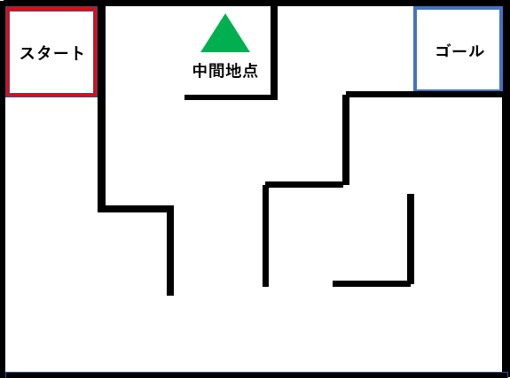

# レッスン7 迷路チャレンジ！(1)

## **ロボットの前進・左回転、右回転を制御して決められた迷路をクリアしよう！

### このレッスンで身につける力

- [ ] レッスン04・05のサンプルコードを使ってロボットを左右に向きを変えることが出来る
- [ ] 時間を調整して丁度いい方向にロボットを向けることが出来る
- [ ] 前進と方向転換を使って迷路を抜けることが出来る

---

### ミッションの準備

## ハードウェアを用意しよう
- [ ] Osoyoo ロボット（ Arduino UNO rev.3と完全互換）x 1
- [ ] USBケーブルx 1
- [ ] パソコン x 1


#### 0.ArduinoIDEを起動しよう

デスクトップにあるAruduinoのアイコンをダブルクリックしてArduinoIDEを起動しましょう．


---

#### 1.スケッチを保存しよう

(Arduinoでは，プログラムのことを「スケッチ」といいます．)

ファイル→保存をクリック（Ctrl+SでもOK）して，デスクトップに「lesson_08_1」という名前で保存しましょう．


---
#### 2.Arduinoとパソコンを接続しよう

Arduino UNOボードとパソコンをUSBケーブルでつなぎましょう．


【注意】USBを抜き差しするときは向きを確認して，ていねいにあつかうこと．

USBを差したら，ArduinoIDEでボードとシリアルポートを指定しましょう．　　

ツール→ボードをクリックして、Arduino/Genuino UNOをクリックしましょう。　　

次にツール→シリアルポートをクリックして，「COM～（Arduino UNO）」となっているものをクリックしましょう．（COM～の数字は毎回変わります．）


#### 3. サンプルコードをコピー&ペーストしよう<br>
サンプルコードを1で作ったスケッチにコピー&ペーストしよう
```C++
#define speedPinR 9    //  右側のPWM信号を送信するピンの設定
#define RightMotorDirPin1  12    //右後ろのモーターの信号ピンの設定 
#define RightMotorDirPin2  11    //右前のモーターの信号ピンの設定
#define speedPinL 6    // 左のPWM信号を送信するピンの設定
#define LeftMotorDirPin1  7    //左後ろのモーターの信号ピンの設定 
#define LeftMotorDirPin2  8   //左前のモーターの信号ピンの設定  


//モーターの制御
void go_Advance(int speed = 200, int time = 0)  //前に進む関数
{
  digitalWrite(RightMotorDirPin1, HIGH);
  digitalWrite(RightMotorDirPin2, LOW);
  digitalWrite(LeftMotorDirPin1, HIGH);
  digitalWrite(LeftMotorDirPin2, LOW);
  analogWrite(speedPinL, speed);
  analogWrite(speedPinR, speed);
  if (time == 0) {
    ;
  } else {
    delay(time);
  }
}
void go_Left(int speed = 200, int time = 0) //左に旋回する関数
{
  digitalWrite(RightMotorDirPin1, HIGH);
  digitalWrite(RightMotorDirPin2, LOW);
  digitalWrite(LeftMotorDirPin1, LOW);
  digitalWrite(LeftMotorDirPin2, HIGH);
  analogWrite(speedPinL, speed);
  analogWrite(speedPinR, speed);
  if (time == 0) {
    ;
  } else {
    delay(time);
  }
}
void go_Right(int speed = 200, int time = 0) //右に旋回する関数
{
  digitalWrite(RightMotorDirPin1, LOW);
  digitalWrite(RightMotorDirPin2, HIGH);
  digitalWrite(LeftMotorDirPin1, HIGH);
  digitalWrite(LeftMotorDirPin2, LOW);
  analogWrite(speedPinL, speed);
  analogWrite(speedPinR, speed);
  if (time == 0) {
    ;
  } else {
    delay(time);
  }
}
void go_Back(int speed = 200, int time = 0) //後ろに下がる関数
{
  digitalWrite(RightMotorDirPin1, LOW);
  digitalWrite(RightMotorDirPin2, HIGH);
  digitalWrite(LeftMotorDirPin1, LOW);
  digitalWrite(LeftMotorDirPin2, HIGH);
  analogWrite(speedPinL, speed);
  analogWrite(speedPinR, speed);
  if (time == 0) {
    ;
  } else {
    delay(time);
  }
}
void stop_Stop(int time = 1000)    //ストップ
{
  digitalWrite(RightMotorDirPin1, LOW);
  digitalWrite(RightMotorDirPin2, LOW);
  digitalWrite(LeftMotorDirPin1, LOW);
  digitalWrite(LeftMotorDirPin2, LOW);
  delay(time);
}
//モーター速度の設定
void set_Motorspeed(int speed_L, int speed_R)
{
  analogWrite(speedPinL, speed_L);
  analogWrite(speedPinR, speed_R);
}

//ピンの初期化
void init_GPIO()
{
  pinMode(RightMotorDirPin1, OUTPUT);
  pinMode(RightMotorDirPin2, OUTPUT);
  pinMode(speedPinL, OUTPUT);

  pinMode(LeftMotorDirPin1, OUTPUT);
  pinMode(LeftMotorDirPin2, OUTPUT);
  pinMode(speedPinR, OUTPUT);
  stop_Stop();
}

void setup()
{
  init_GPIO();

//ここから下にプログラムを書く

}

void loop() {
} 
```
---

### ミッションチャレンジ

#### 迷路とは？

入り込むと迷って出られなくなるような道のことだよ！ここで少し変わった迷路を紹介しよう。栃木県の日光市というとことには写真のような人が通れるような巨大な迷路もあるよ。

 ネットで「巨大な迷路」と検索するともっと出てくるよ。検索してみてね。
ちょっとした豆知識を知ったところで今回のミッションについて話すね。
今回は下図のような迷路を今までスタートから中間地点を通ってゴールしてもらうよ。
みんなが達成できるように下に書いてある「Step1」から順に見ていこう！


#### [Step1]ロボットを動かそう!（復習）

ここで前後左右の動きができるか確認するよ！

前回のレッスンの内容を思い出そう！

左右の動きで関数が変わっちゃうからマイナス「-」とか使わないように注意しよう。

ロボットがうまく動かなかったらレッスン6のサンプルコードを見て復習しよう！

まずは前後の動きをさせてみよう！

ロボットをまっすぐ進ませるにはgo_Advance関数を使うよ。
```C++
go_Advance(速さ、動く時間);
```
ロボットを後ろに下がらせるにはgo_Back関数を使うよ。
```C++
go_Back(速さ、動く時間);
```

次にロボットを左右に動かしてみよう！

ロボットを左に曲がらせるにはgo_Left関数を使うよ。
```C++
go_Left(速さ、動く時間);
```
ロボットを右に曲がらせるにはgo_Right関数を使うよ。
```C++
go_Right(速さ、動く時間);
```
思い出したかな？

思い出せたら次のステップに進もう！


#### [Step2]ロボットを中間地点に動かそう!

[Step1]を使ってスタートから中間地点に目指そう！

前後左右の動きをうまく組み合わせて動かしてみよう！

ここではロボットを動かす「速さ」と「動く時間」の設定の仕方が重要になってくるよ！


中間地点まで移動出来たら次のStepに進もう！

#### [Step3]ロボットをゴール地点に動かそう!
中間地点からゴールに目指そう！

[Step2]の時と同じような感じで中間地点からゴールに移動してみよう。

中間地点から抜け出すときに後ろに下がりながら移動すると楽だよ！

だけどほかの抜け出し方をしてもいいよ！


#### [Step4]ロボットをスタートからゴール地点に動かそう!
最後のステップだよ！

スタートから中間地点を通ってゴールまで移動しよう。

[Step2]と[Step3]をうまく組み合わせてゴールにたどりつけるかな。

ゴールにたどり着けたらミッションクリアだよ！


### まとめ


ロボットをまっすぐ進ませるにはgo_Advance関数を使うよ。
```C++
go_Advance(速さ、動く時間);
```
ロボットを後ろに下がらせるにはgo_Back関数を使うよ。
```C++
go_Back(速さ、動く時間);
```
ロボットを左に曲がらせる関数
```C++
go_Left(速さ、動く時間);
```
ロボットを右に曲がらせる関数
```C++
go_Right(速さ、動く時間);
```

これらのプログラムの組み合わせを変えることで前後左右の移動ができる。


### 出来たことをチェックしよう

- [ ] レッスン04・05のサンプルコードを使ってロボットを左右に向きを変えることが出来る
- [ ] 時間を調整して丁度いい方向にロボットを向けることが出来る
- [ ] 前進と方向転換を使って迷路を抜けることが出来る