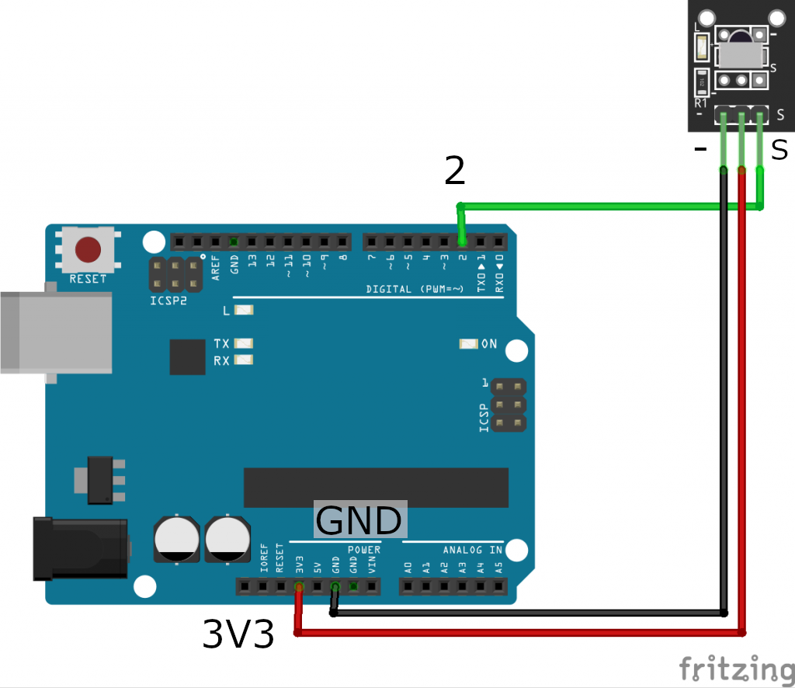
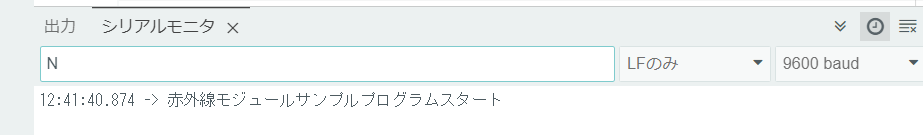

# 赤外線リモコンのデータを受信してみよう！

## 赤外線受信モジュールを使った回路を作成し受信データを表示しよう

### このレッスンで身につける力
- [ ] 赤外線受信モジュールを説明できる

- [ ] ジャンパー線を使って赤外線受信モジュールの配線ができる

- [ ] IRremote**ライブラリ**を追加できる

- [ ] サンプルコードを実行できる

- [ ] 付属のリモコンからの信号を確認できる

- [ ] 他の付属ではないリモコンの信号を確認できる

- [ ] （発展）赤外線受信の原理を説明できる
  
---

### ミッションの準備

#### ハードウェアを用意しよう

- [ ] Osoyoo UNO Board（ Arduino UNO rev.3と完全互換）x 1

- [ ] USBケーブルx 1

- [ ] パソコン x 1

- [ ] M / Mジャンパー線 x 1

- [ ] 赤外線受信機　x 1

- [ ] リモートコントローラ　x 1


---

#### 0.ArduinoIDEを起動しよう

デスクトップにあるAruduinoのアイコンをダブルクリックしてArduinoIDEを起動しましょう．


---

#### 1.スケッチを保存しよう

(Arduinoでは，プログラムのことを「スケッチ」といいます．)

ファイル→保存をクリック（Ctrl+SでもOK）して，デスクトップに「lesson_08_1」という名前で保存しましょう．


---
#### 2.Arduinoとパソコンを接続しよう

Arduino UNOボードとパソコンをUSBケーブルでつなぎましょう．


【注意】USBを抜き差しするときは向きを確認して，ていねいにあつかうこと．

USBを差したら，ArduinoIDEでボードとシリアルポートを指定しましょう．　　

ツール→ボードをクリックして、Arduino/Genuino UNOをクリックしましょう。　　

次にツール→シリアルポートをクリックして，「COM～（Arduino UNO）」となっているものをクリックしましょう．（COM～の数字は毎回変わります．）


---

### ミッションチャレンジ

#### 赤外線受信機とは？
赤外線は人間に見えない光のことだよ。光は電磁波と呼ばれる波によって人間がみえる形になっていて、その波の長さによって見える光が決まってくるんだよ。ちなみに人間が見ることができる光を可視光線と呼んで、可視光線の赤の外側にある光を赤外線と呼ぶよ。逆に紫の外側にある光を紫外線と呼ぶよ。
  
赤外線はみんなの暮らしに溶け込んでいるよ。例えばテレビやエアコンのリモコンは遠くからでも電源をつけたり、消したり、温度を変えたりいろんな操作ができるよね？これはリモコンが 電磁波の一種である**赤外線を送信** してテレビやエアコンが **赤外線を受信** 動作するとこで機械を操作しているんだよ。
このレッスンでは、テレビやエアコンの中にある赤外線受信機と同じようなモジュールをArduinoと配線して、リモコンからどんな値が出ているか見てみるよ！

  

- [ ]  赤外線受信モジュールを説明できる
  
  
#### ジャンパー線を使って赤外線受信モジュールの配線しよう
赤外線受信機とブレッドボード、Arduino、ジャンパー線を使って写真と同じように配線してみよう

  
 
- [ ] ジャンパー線を使って赤外線受信モジュールの配線ができる

---

#### IRremote**ライブラリ**を追加しよう
Arduinoライブラリとは？  
Arduinoライブラリとは世界中のプログラマが切磋琢磨して作ったプログラムでよく利用される機能などをいろんな人に使いやすいようにまとめたものだよ。難しいプログラムを自分で組まなくても、ライブラリから利用することで効率的に開発ができる優れたものなんだ！
実際にプログラムをお仕事にしている人たちもライブラリを駆使して、プログラムを作っているよ。
ライブラリをArduinoIDEに追加する方法はいくつかあるけど、今回はGitHubと呼ばれるサイトからzipファイルでインストールする方法をやってみよう！
まずは赤外線受信モジュール用のライブラリのサイトにアクセスしよう！  
↓↓↓↓↓↓↓↓↓↓↓↓↓↓↓↓↓↓↓↓↓↓↓↓  
[IRremote Arduino Library](https://github.com/Arduino-IRremote/Arduino-IRremote)

サイトにアクセスしたら、緑色に書いてあるCodeというボタンを押してみよう。

  

そうすると、Download ZIPを押して、ライブラリをダウンロードしよう。

  

ダウンロードが終わったら、Arduino IDEに戻って
スケッチ→ライブラリをインクルード→ZIP形式のライブラリをインストールを押そう！

 

さっきサイトからダウンロードしたライブラリのzipファイルを探して、最後に開くボタンを押すとインクルードできるよ。

 

#### サンプルスケッチを実行して、実験してみよう

スケッチに以下のコードをコピー＆ペーストして、スケッチを実行してみよう。

```c++
#include <IRremote.h>  // IRRemote.hをインクルード
const int irReceiverPin = 2;  ///受信モジュールのSIGはpin2
IRrecv irrecv(irReceiverPin); //IRrecvタイプの変数を作成します
decode_results results;    // 結果

void setup(){
  Serial.begin(9600);    //シリアルを初期化し、ボーレートは9600に設定する
  irrecv.enableIRIn();   // 赤外線受信機モジュールを有効にする
  Serial.print("赤外線モジュールサンプルプログラムスタート\n");
}

void loop(){
  if (irrecv.decode(&results)){ //赤外線受信機モジュールの受信データ
    Serial.print("IRコード: ");
    Serial.print(results.value, HEX); //シリアルに値を出力する
    Serial.print(",　ビット: ");  //bitsを送信する         
    Serial.println(results.bits); //bitsを結果に出力する
    irrecv.resume();// 次の値を受取る
  }  
  delay(600); //600ミリ秒待機
}
```

今までのレッスンを参考にスケッチをArduinoに書き込もう！
書き込みが終わったら、ツール→シリアルモニタをクリックしてみよう
クリックするとこんな画面が出てくるよ。「赤外線モジュールサンプルプログラムスタート」と表示されたら、プログラムがうまく動いているよ。

  

そうしたら付属の赤外線コントローラを黒色の赤外線受信モジュールに向かってボタンを押してみよう！
  
すると写真のような感じでIRコードとビットが表示されるよ。
みんなも表示できたかな？  
 
- [ ] サンプルコードを実行できる
- [ ] 付属のリモコンからの信号を確認できる
---

#### クイズ！
ここでクイズだよ！  
問題1：付属のリモコンの「OK」ボタンを押したときのIRコードはシリアルモニタにどのように表示されるかな？
<details><summary>答えはここをクリック</summary><div>
IRコード: FF38C7,　ビット: 32
</div></details>

問題2：付属のリモコンの「#」ボタンを押したときのIRコードはシリアルモニタにどのように表示されるかな？
<details><summary>答えはここをクリック</summary><div>
IRコード: FFB04F,　ビット: 32
</div></details>

２問とも正解できたかな？このクイズでわかる通り、リモコンのボタンごとに「IRコード」というのが割り振られているよ。

#### ミッションチャレンジ 付属のリモコンを使ってLEDを光らせてみよう！
さっきのクイズの結果を使って、付属のリモコンの「OK」ボタンを押すとブレッドボード上に配線されたLEDが光り、「#」ボタンを押すとLEDが消えるプログラムを作ってみよう！
Arduinoの3番ピンを使ってLEDが光るように配線してみよう！
配線が終わったら、下にあるプログラムをArduinoIDEにコピー＆ペーストしよう。プログラムを見てみると、0x******と書いてある部分があるね。ここにそれぞれOKボタン、「#」を押したときのIRコードを記述してみよう。成功すると、それぞれのボタンを押すことでLEDを光らせたり、消えさせたりできるよ。それではやってみよう！

```C++
#include <IRremote.h>  // IRRemote.hをインクルード
const int irReceiverPin = 2;  ///受信モジュールを２番ピンに繋げる
IRrecv irrecv(irReceiverPin); //IRrecvタイプの変数を作成します
decode_results results;    // 結果

void setup(){
  Serial.begin(9600);    //シリアルを初期化し、ボーレートは9600に設定する
  pinMode(3,OUTPUT);     //LEDを３番ピンに繋げる
  irrecv.enableIRIn();   // 赤外線受信機モジュールを有効にする
  Serial.print("赤外線モジュールチャレンジプログラムスタート\n");
}

void loop(){
  if (irrecv.decode(&results)){ //赤外線受信機モジュールの受信データ
    Serial.print("IRコード: ");
    Serial.print(results.value,HEX); //シリアルに値を出力する
    Serial.print(",　ビット: ");  //bitsを送信する         
    Serial.println(results.bits); //bitsを結果に出力する
    //「OK」ボタンが押されたら、LEDが光る
    if(results.value==0x******){
      digitalWrite(3, HIGH);
      Serial.print("HIGH\n");
      }
    //「#」ボタンが押されたら、LEDが消える
    if(results.value==0x******){
      digitalWrite(3, LOW);
      Serial.print("LOW\n");
    }
    irrecv.resume();// 次の値を受取る

  }
  delay(600); //600ミリ秒待機
}
```
成功するとこんな感じで動くよ！みんなはできたかな？

<details><summary>答えのプログラムはここをクリック</summary><div>

```C++
#include <IRremote.h>  // IRRemote.hをインクルード
const int irReceiverPin = 2;  ///受信モジュールを２番ピンに繋げる
IRrecv irrecv(irReceiverPin); //IRrecvタイプの変数を作成します
decode_results results;    // 結果

void setup(){
  Serial.begin(9600);    //シリアルを初期化し、ボーレートは9600に設定する
  pinMode(3,OUTPUT);     //LEDを３番ピンに繋げる
  irrecv.enableIRIn();   // 赤外線受信機モジュールを有効にする
  Serial.print("赤外線モジュールチャレンジプログラムスタート\n");
}

void loop(){
  if (irrecv.decode(&results)){ //赤外線受信機モジュールの受信データ
    Serial.print("IRコード: ");
    Serial.print(results.value,HEX); //シリアルに値を出力する
    Serial.print(",　ビット: ");  //bitsを送信する         
    Serial.println(results.bits); //bitsを結果に出力する
    //「OK」ボタンが押されたら、LEDが光る
    if(results.value==0xFF38C7){
      digitalWrite(3, HIGH);
      Serial.print("HIGH\n");
      }
    //「#」ボタンが押されたら、LEDが消える
    if(results.value==0xFFB04F){
      digitalWrite(3, LOW);
      Serial.print("LOW\n");
    }
    irrecv.resume();// 次の値を受取る

  }
  delay(600); //600ミリ秒待機
}
```

</div></details>

#### 身の回りにある赤外線リモコンの信号を確認してみよう
赤外線リモコンは世界で一番機械を操作するために使われているリモコンだよ。テレビのリモコンやエアコンのリモコンも赤外線で動いているよ。びっくりなことに今回使っている赤外線受信モジュールは市販の赤外線エアコンの信号を受け取ることができるよ！最初のサンプルプログラムで赤外線受信モジュールにリモコンを近づけてみて、どんな信号が出るか確認してみよう！
 


### まとめ
- **赤外線受信モジュール** :リモコンから送られる赤外線を受信するモジュール
- **ライブラリ**:プログラムを効率的に開発できるツール

### 出来たことをチェックしよう
- [ ] ジャンパー線を使って**赤外線受信モジュール**の配線ができる
- [ ] IRremote**ライブラリ**を追加できる
- [ ] サンプルコードを実行できる
- [ ] 付属のリモコンからの信号を確認できる
- [ ] 他の付属ではないリモコンの信号を確認できる
- [ ] （発展）赤外線受信の原理を説明できる