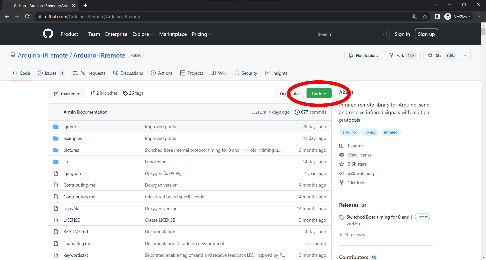
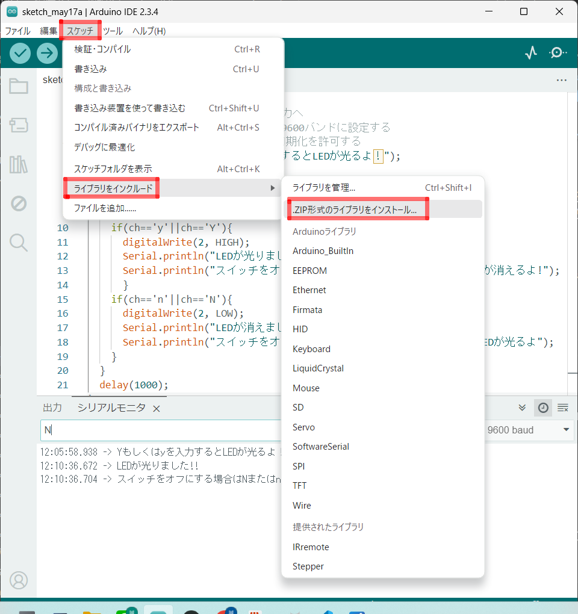

# 赤外線リモコンのデータを受信してみよう！

## 赤外線受信モジュールを使った回路を作成し受信データを表示しよう

### このレッスンで身につける力
- [ ] 赤外線受信モジュールを説明できる

- [ ] ジャンパー線を使って赤外線受信モジュールの配線ができる

- [ ] IRremote**ライブラリ**を追加できる

- [ ] サンプルコードを実行できる

- [ ] 付属のリモコンからの信号を確認できる

- [ ] 他の付属ではないリモコンの信号を確認できる

- [ ] （発展）赤外線受信の原理を説明できる
  
---

### ミッションの準備

#### ハードウェアを用意しよう

- [ ] Osoyoo UNO Board（ Arduino UNO rev.3と完全互換）x 1

- [ ] USBケーブルx 1

- [ ] パソコン x 1

- [ ] M / Mジャンパー線 x 1

- [ ] 赤外線受信機　x 1

- [ ] リモートコントローラ　x 1


---

#### 0.ArduinoIDEを起動しよう

デスクトップにあるAruduinoのアイコンをダブルクリックしてArduinoIDEを起動しましょう．


---

#### 1.スケッチを保存しよう

(Arduinoでは，プログラムのことを「スケッチ」といいます．)

ファイル→保存をクリック（Ctrl+SでもOK）して，デスクトップに「lesson_08_1」という名前で保存しましょう．


---
#### 2.Arduinoとパソコンを接続しよう

Arduino UNOボードとパソコンをUSBケーブルでつなぎましょう．


【注意】USBを抜き差しするときは向きを確認して，ていねいにあつかうこと．

USBを差したら，ArduinoIDEでボードとシリアルポートを指定しましょう．　　

ツール→ボードをクリックして、Arduino/Genuino UNOをクリックしましょう。　　

次にツール→シリアルポートをクリックして，「COM～（Arduino UNO）」となっているものをクリックしましょう．（COM～の数字は毎回変わります．）


---

### ミッションチャレンジ

#### 赤外線受信機とは？
赤外線は人間に見えない電磁波のことだよ。電磁波というとちょっと難しく感じるかもしれないけど、赤外線はみんなの暮らしに溶け込んでいるよ。例えばテレビやエアコンのリモコンは遠くからでも電源をつけたり、消したり、温度を変えたりいろんな操作ができるよね？これはリモコンが**赤外線を送信(赤外線を送る)**してテレビやエアコンが**赤外線を受信(赤外線を受け取る)**しているからこういうことができるだよ。
このレッスンでは、テレビやエアコンの中にある赤外線受信機と同じようなモジュールをArduinoと配線して、リモコンからどんな値が出ているか見てみるよ！

  

- [ ]  赤外線受信モジュールを説明できる
  
  
#### ジャンパー線を使って赤外線受信モジュールの配線しよう
赤外線受信機とブレッドボード、Arduino、ジャンパー線を使って写真と同じように配線してみよう

  

実際に回路を作るとこんな感じになるよ！

  

- [ ] ジャンパー線を使って赤外線受信モジュールの配線ができる
---

#### IRremote**ライブラリ**を追加しよう
Arduinoライブラリとは？
Arduinoライブラリとはプログラムを費やす時間を短縮できたり、難しいプログラムを自分で組まなくても、ライブラリから利用することで効率的に開発ができる優れたものなんだよ！
実際にプログラムをお仕事にしている人たちもライブラリを駆使して、プログラムを作っているよ。
ライブラリをArduinoIDEに追加する方法はいくつかあるけど、今回はGitHubと呼ばれるサイトからzipファイルでインストールする方法をやってみよう！
まずは赤外線受信モジュール用のライブラリのサイトにアクセスしよう！  
↓↓↓↓↓↓↓↓↓↓↓↓↓↓↓↓↓↓↓↓↓↓↓↓  
[IRremote Arduino Library](https://github.com/Arduino-IRremote/Arduino-IRremote)

サイトにアクセスしたら、緑色に書いてあるCodeというボタンを押してみよう。
  

そうしたら、Download ZIPを押して、ライブラリをダウンロードしよう。

  

ダウンロードが終わったら、Arduino IDEに戻って
スケッチ→ライブラリをインクルード→ZIP形式のライブラリをインストールを押そう！

 

さっきサイトからダウンロードしたライブラリのzipファイルを探して、最後に開くボタンを押すとインクルードできるよ。

 

#### サンプルスケッチを実行して、実験してみよう

スケッチに以下のコードをコピー＆ペーストして、スケッチを実行してみよう。

```C++
#include <IRremote.h>  // IRRemote.hの関数を使用する
const int irReceiverPin = 2;  ///受信モジュールのSIGはpin2
IRrecv irrecv(irReceiverPin); //IRrecvタイプの変数を作成します
decode_results results;    // 結果

void setup()
{
  Serial.begin(9600);    //シリアルを初期化し、ボーレートは9600に設定する
  irrecv.enableIRIn();   // 赤外線受信機モジュールを有効にする
}

void loop() 
{
  if (irrecv.decode(&results)) //赤外線受信機モジュールの受信データ
  {  
    Serial.print("irCode: ");    //irCode："の値を送信する 
    Serial.print(results.value, HEX); //シリアルに値を出力する
    Serial.print(",  bits: ");  //bitsを送信する         
    Serial.println(results.bits); //bitsを結果に出力する
    irrecv.resume();    // 次の値を受取る
  }  
  delay(600); //600ミリ秒待機
}
```

今までのレッスンを参考にスケッチをArduinoに書き込もう！
書き込みが終わったら、ツール→シリアルモニタをクリックしてみよう

- [ ] サンプルコードを実行できる
- [ ] 付属のリモコンからの信号を確認できる
---

#### 身の回りにある赤外線リモコンの信号を確認してみよう

#### 身の回りのリモコンを使ってブレッドボードに作った回路のLEDを光らせてみよう！

```C++

```


### まとめ

- **赤外線受信モジュール** :リモコンから送られる赤外線を受信するモジュール
- **ライブラリ**:プログラムを効率的に開発できるツール

### 出来たことをチェックしよう
- [ ] ジャンパー線を使って**赤外線受信モジュール**の配線ができる
- [ ] IRremote**ライブラリ**を追加できる
- [ ] サンプルコードを実行できる
- [ ] 付属のリモコンからの信号を確認できる
- [ ] 他の付属ではないリモコンの信号を確認できる
- [ ] （発展）赤外線受信の原理を説明できる