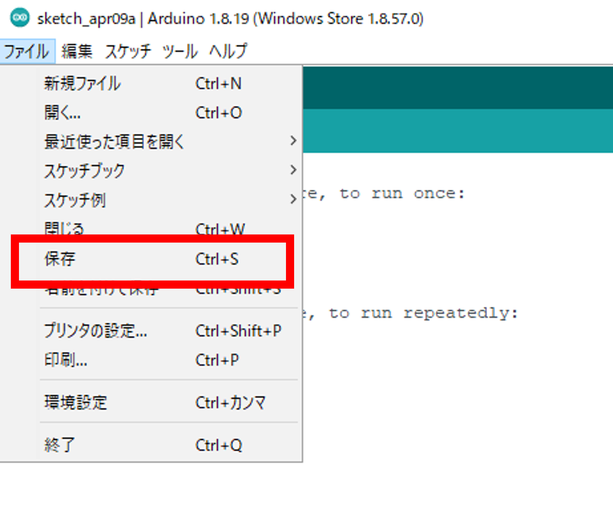
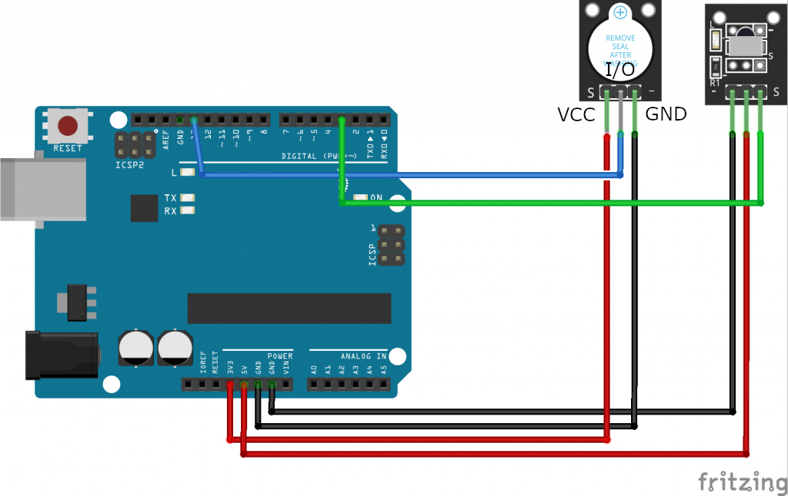

# 赤外線を使ってブザーを鳴らそう！

## 赤外線受信モジュールを使ってブザーを鳴らす

### このレッスンで身につける力
- [ ] ブザーと赤外線受信モジュールの回路を作ることが出来る
- [ ] digitalWrite()とdelay()を使って、いろいろなブザーの鳴らし方を作ることが出来る
- [ ] サンプルコードを実行できる
- [ ] サンプルコードを改造して他のボタンに他の音を割り当てることが出来る

---

### ミッションの準備
- [ ] Osoyoo UNO Board x 1
- [ ] 赤外線コントローラー
- [ ] 赤外線受信機
- [ ] アクティブブザーモジュールx 1
- [ ] F/Mジャンパー
- [ ] USBケーブルx 1
- [ ] パソコン x 1

#### 0.ArduinoIDEを起動しよう

デスクトップにあるAruduinoのアイコンをダブルクリックしてArduinoIDEを起動しましょう．


---

#### 1.スケッチを保存しよう

(Arduinoでは，プログラムのことを「スケッチ」といいます．)

ファイル→保存をクリック（Ctrl+SでもOK）して，デスクトップに「lesson_09_1」という名前で保存しましょう．



---
#### 2.Arduinoとパソコンを接続しよう

Arduino UNOボードとパソコンをUSBケーブルでつなぎましょう．


【注意】USBを抜き差しするときは向きを確認して，ていねいにあつかうこと．

USBを差したら，ArduinoIDEでボードとシリアルポートを指定しましょう．　　

ツール→ボードをクリックして、Arduino/Genuino UNOをクリックしましょう。　　

次にツール→シリアルポートをクリックして，「COM～（Arduino UNO）」となっているものをクリックしましょう．（COM～の数字は毎回変わります．）


---
## ミッションチャレンジ
### ブザーと赤外線受信モジュールの回路を作ろう！

画像のように回路同士をF/Mジャンパーで接続しよう！
 - [ ] 回路が作れたらチェック！

### digitalWrite()とdelay()を使って、いろいろなブザーの鳴らし方を作ろう！
```C++
const int buzzerPin = 13;//13ピンをブザーに割り当て

void setup() {
    pinMode(buzzerPin,OUTPUT);//ブザーのピン番号を出力に設定
}

void loop() {
    digitalWrite(buzzerPin,LOW);//ブザーのビーブ音（低音）
    delay(1000);                 //200ms待機
    digitalWrite(buzzerPin,HIGH);//ブザーを停止
    delay(1000);                 //200ms待機
}
```
上のプログラムをコピーして実行してみよう！ブザーから音が鳴るよ。
似たプログラムを見たことがないかな？実はLEDを光らせる時と同じプログラムでブザーで音を鳴らすことができるんだ。
>**やってみよう**<br>
>ブザーが鳴る時間を500msにしてみよう！
- [ ] ブザーを鳴らせたらチェック！
- [ ] 鳴る時間を変更できたらチェック！

### サンプルコードを実行しよう！
```C++
#include <IRremote.h>
const int irReceiverPin =2; //受信モジュールのSIGはpin2
const int buzzerPin = 13;//13ピンをブザーに接続します
IRrecv irrecv(irReceiverPin); //IRrecv タイプの変数を作成します
decode_results results;
void setup()
{
  pinMode(buzzerPin,OUTPUT);//ブザーピンを出力として設定します
  digitalWrite(buzzerPin,HIGH);
  Serial.begin(9600);//irrecvを初期化します。
  irrecv.enableIRIn(); // ir受信機モジュールを有効にする
}
void loop() 
{
  if (irrecv.decode(&results)) //赤外線受信モジュールの受信データ
  { 
    Serial.print("IRコード: "); //"irCode: "を送信する出力
    Serial.print(results.value, HEX); //値を16進数で出力します
    Serial.print(",　ビット"); //" , bits: " を送信する
    Serial.println(results.bits); //bitsを結果に出力する
    irrecv.resume(); // Receive the next value 
  } 

  if(results.value == 0xFF38C7)//「OK」ボタンを押すと、受信モジュールは0xFF38C7を受信します
  {
    digitalWrite(buzzerPin,LOW);//ブザーのビーブ音（低音）
  }
  else
  {
    digitalWrite(buzzerPin,HIGH);//stop beep
  }
    delay(400); //delay 400ms
}
```
このプログラムを空のスケッチにコピー&ペーストしよう！
アップロードが完了後に数秒間待ってからOKボタンを押すとブザーが鳴り続けるよ。止めたかったら他のボタンを押してね。
 - [ ] サンプルプログラムが実行できたらチェック

### サンプルコードを改造して他のボタンに他の音を割り当てよう！
OKボタンの他にも音を割り当てられるよ。

1.  を押してシリアルモニターから各ボタンの信号を読み取ってみよう。
2. サンプルコードのOKボタンの信号を読み取った信号に書き換えてみよう。
```C++
if(results.value == 0x{ここに読み取った信号を入力})//「OK」ボタンを押すと、受信モジュールは0xFF38C7を受信します
  {
    digitalWrite(buzzerPin,LOW);//ブザーのビーブ音（低音）
  }
  else
  {
    digitalWrite(buzzerPin,HIGH);//stop beep
  }
```


**出来たらチェック**
- [ ] 他のボタンにも音を割り当てられる


---
### まとめ
- **ブザー** :音が出る素子
- `digitalwrite(buzerPin,LOW);` : 音が出るプログラム

### 出来たことをチェックしよう
- [ ] ブザーと赤外線受信モジュールの回路を作ることが出来る
- [ ] digitalWrite()とdelay()を使って、いろいろなブザーの鳴らし方を作ることが出来る
- [ ] サンプルコードを実行できる
- [ ] サンプルコードを改造して他のボタンに他の音を割り当てることが出来る