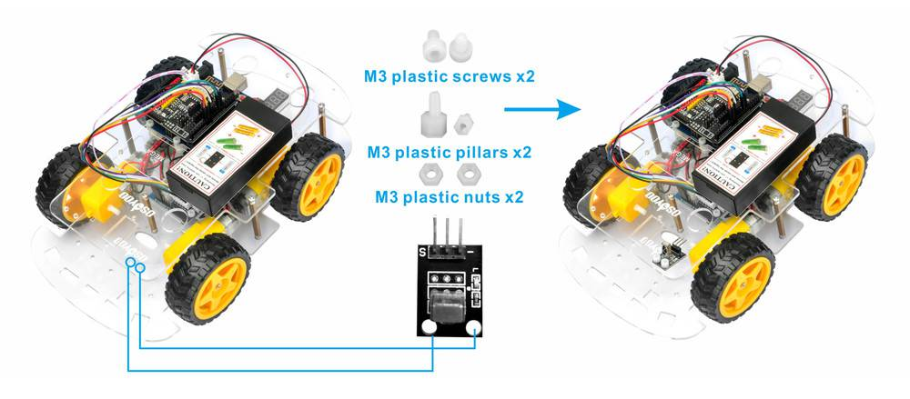
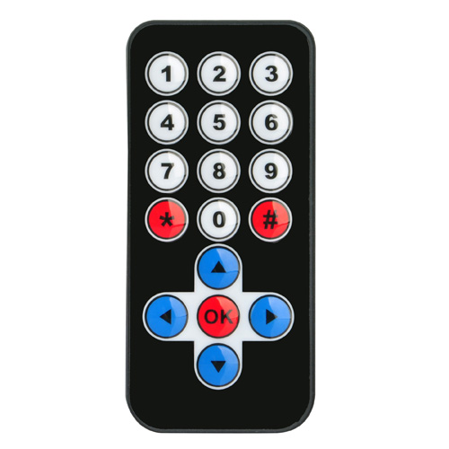
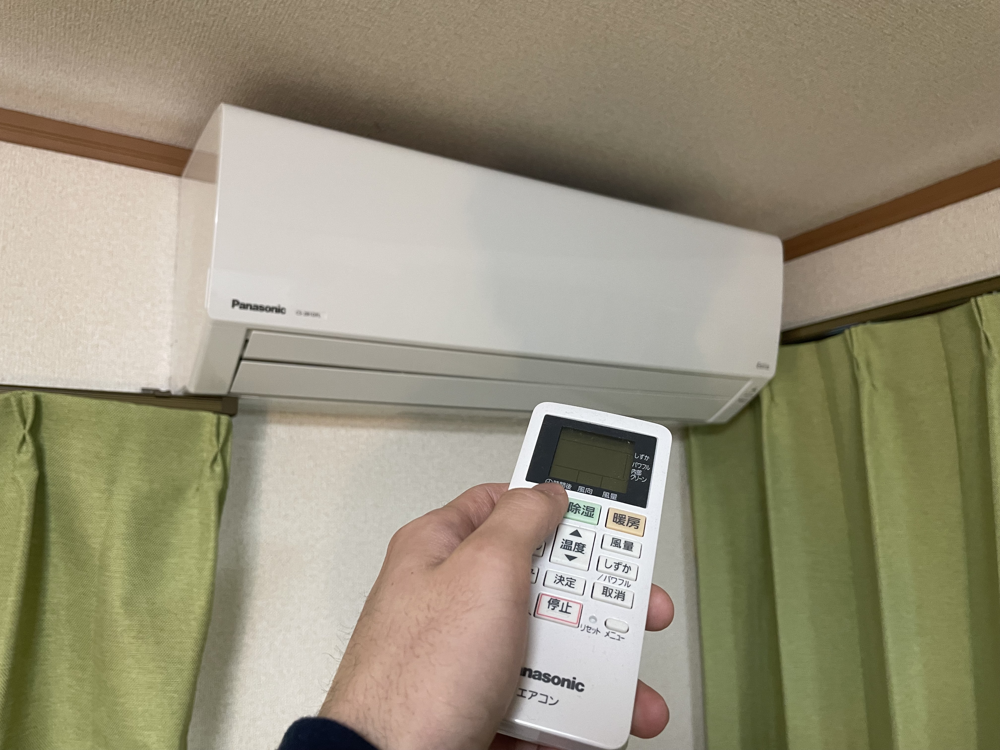

# レッスン10 赤外線リモコンでロボットを動かそう！

## **赤外線リモコンでロボットをコントロールしてコースを走破する**


### このレッスンで身につける力

- [ ] 赤外線受信モジュールを正しく取り付けることが出来る
- [ ] ジャンパーワイヤーを正しく接続出来る
- [ ] （復習）IRremoteライブラリを追加できる
- [ ] サンプルコードを実行できる
- [ ] コースを走破するためにサンプルコードを修正できる
- [ ] （発展）テレビなどのリモコンを使ってロボットを動かすことが出来る

---
---

### ミッションチャレンジ

#### 赤外線受信モジュールを作ったロボットに取り付けよう！
上部シャーシ前側に赤外線受信モジュール追加します、取り付けにはプラスチックのM2.5ネジ長10、ピラーとナットで取り付けよう！



- [ ] 赤外線受信モジュールを正しく取り付けることが出来る
---

#### ジャンパーワイヤーを正しく接続しよう！
写真の様に赤と黒と白のワイヤーを接続します。
この時今までのレッスンでつないできたワイヤーは外さないでね！

  

- [ ] ジャンパーワイヤーを正しく接続出来る
  
---


#### （復習）IRremote**ライブラリ**を追加しよう

ライブラリが入ってなかったときには[レッスン8](https://github.com/kobayashi-makoto2021/robobu/blob/main/Lesson_08/lesson_8.md)をみよう！
**（復習）**
- [ ]IRremoteライブラリを追加できる


#### サンプルスケッチを実行して、実験してみよう

スケッチに以下のコードをコピー＆ペーストして、スケッチを実行してみよう。

```C++
#include <IRremote.hpp>
#define IR_PIN    10  // 赤外線レシーバ信号ピンはArduinoピンD10に接続

#define speedPinR 9    //  右側のPWM信号を送信するピンの設定
#define RightMotorDirPin1  12    //右のモーターの信号ピン1の設定 
#define RightMotorDirPin2  11    //右のモーターの信号ピン2の設定
#define speedPinL 6    // 左のPWM信号を送信するピンの設定
#define LeftMotorDirPin1  7    //左のモーターの信号ピン1の設定
#define LeftMotorDirPin2  8   //左のモーターの信号ピン2の設定

 #define IR_ADVANCE       0x00FF18E7       //IRコントローラー 「▲」 ボタンのコード
 #define IR_BACK          0x00FF4AB5       //IRコントローラー 「▼」 ボタンのコード
 #define IR_RIGHT         0x00FF5AA5       //IRコントローラー 「>」 ボタンのコード
 #define IR_LEFT          0x00FF10EF       //IRコントローラー 「<」 ボタンのコード
 #define IR_STOP          0x00FF38C7       //IRコントローラー 「OK」 ボタンのコード
 #define IR_turnsmallleft 0x00FFB04F       //IRコントローラー 「#」 ボタンのコード

enum DN
{ 
  GO_ADVANCE, //前進する
  GO_LEFT, //左折
  GO_RIGHT,//右折
  GO_BACK,//後進する
  STOP_STOP, 
  DEF
}Drive_Num=DEF;

bool stopFlag = true;//停止フラグを設定する
bool JogFlag = false;
uint16_t JogTimeCnt = 0;
uint32_t JogTime=0;
uint8_t motor_update_flag = 0;
/***************モーター制御***************/
void stop_Stop(int time = 1000)    //ストップ
{
  digitalWrite(RightMotorDirPin1, LOW);
  digitalWrite(RightMotorDirPin2, LOW);
  digitalWrite(LeftMotorDirPin1, LOW);
  digitalWrite(LeftMotorDirPin2, LOW);
  delay(time);
}

void go_Advance(int speed = 200, int time = 0)  //前に進む関数
{
  digitalWrite(RightMotorDirPin1, HIGH);
  digitalWrite(RightMotorDirPin2, LOW);
  digitalWrite(LeftMotorDirPin1, HIGH);
  digitalWrite(LeftMotorDirPin2, LOW);
  analogWrite(speedPinL, speed);
  analogWrite(speedPinR, speed);
  if (time == 0) {
    ;
  } else {
    delay(time);
    stop_Stop();
  }
}
void go_Left(int speed = 200, int time = 0) //左に旋回する関数
{
  digitalWrite(RightMotorDirPin1, HIGH);
  digitalWrite(RightMotorDirPin2, LOW);
  digitalWrite(LeftMotorDirPin1, LOW);
  digitalWrite(LeftMotorDirPin2, HIGH);
  analogWrite(speedPinL, speed);
  analogWrite(speedPinR, speed);
  if (time == 0) {
    ;
  } else {
    delay(time);
    stop_Stop();
  }
}
void go_Right(int speed = 200, int time = 0) //右に旋回する関数
{
  digitalWrite(RightMotorDirPin1, LOW);
  digitalWrite(RightMotorDirPin2, HIGH);
  digitalWrite(LeftMotorDirPin1, HIGH);
  digitalWrite(LeftMotorDirPin2, LOW);
  analogWrite(speedPinL, speed);
  analogWrite(speedPinR, speed);
  if (time == 0) {
    ;
  } else {
    delay(time);
    stop_Stop();
  }
}
void go_Back(int speed = 200, int time = 0) //後ろに下がる関数
{
  digitalWrite(RightMotorDirPin1, LOW);
  digitalWrite(RightMotorDirPin2, HIGH);
  digitalWrite(LeftMotorDirPin1, LOW);
  digitalWrite(LeftMotorDirPin2, HIGH);
  analogWrite(speedPinL, speed);
  analogWrite(speedPinR, speed);
  if (time == 0) {
    ;
  } else {
    delay(time);
    stop_Stop();
  }
}

//モーター速度の設定
void set_Motorspeed(int speed_L, int speed_R)
{
  analogWrite(speedPinL, speed_L);
  analogWrite(speedPinR, speed_R);
}

/**************赤外線コードを検出する***************/
void do_IR_Tick()
{
  if (IrReceiver.decode())
  {
    uint32_t code = IrReceiver.decodedIRData.decodedRawData;
    Serial.print(code, HEX);  // シリアルに値を出力する
    if (code == IR_ADVANCE)
    {
      Drive_Num = GO_ADVANCE;
      Serial.print(" >> GO_ADVANCE");
    }
    else if (code == IR_RIGHT)
    {
      Drive_Num = GO_RIGHT;
      Serial.print(" >> GO_RIGHT");
    }
    else if (code == IR_LEFT)
    {
      Drive_Num = GO_LEFT;
      Serial.print(" >> GO_LEFT");
    }
    else if (code == IR_BACK)
    {
      Drive_Num = GO_BACK;
      Serial.print(" >> GO_BACK");
    }
    else if (code == IR_STOP)
    {
      Drive_Num = STOP_STOP;
      Serial.print(" >> STOP_STOP");
    }
    Serial.println("");
    IrReceiver.resume();
  }
}

/**************車制御**************/
void do_Drive_Tick()
{
    switch (Drive_Num) 
    {
      case GO_ADVANCE://GO_ADVANCEコードが検出された場合、前に進みます。
        go_Advance(200, 1000); //ここのパラメータを調整しよう
        JogFlag = true;
        JogTimeCnt = 1;
        JogTime=millis();
        break;
      case GO_LEFT: //GO_LEFTコードが検出された場合は、左に曲がります。
        go_Left(200, 1000);//ここのパラメータを調整しよう
        JogFlag = true;
        JogTimeCnt = 1;
        JogTime=millis();
        break;
      case GO_RIGHT://GO_RIGHTコードが検出された場合は右に曲がる
        go_Right(200, 1000);//ここのパラメータを調整しよう
        JogFlag = true;
        JogTimeCnt = 1;
        JogTime=millis();
        break;
      case GO_BACK://GO_BACKコードが検出された場合、バックします
        go_Back(200, 1000);//ここのパラメータを調整しよう
        JogFlag = true;
        JogTimeCnt = 1;
        JogTime=millis();
        break;
      case STOP_STOP://STOP_STOPコードが検出された場合、ストップします。
        stop_Stop();
        JogTime = 0;
        break;
      default:break;
    }
    Drive_Num=DEF;
    if(millis()-JogTime>=200)
    {
      JogTime=millis();
      if(JogFlag == true) 
      {
        stopFlag = false;
        if(JogTimeCnt <= 0) 
        {
          JogFlag = false; stopFlag = true;
        }
        JogTimeCnt--;
      }
      if(stopFlag == true) 
      {
        JogTimeCnt=0;
        stop_Stop();
      }
    }
}

void setup()
{
  //モーターのPinの設定を行う
  pinMode(RightMotorDirPin1, OUTPUT);
  pinMode(RightMotorDirPin2, OUTPUT);
  pinMode(speedPinL, OUTPUT);

  pinMode(LeftMotorDirPin1, OUTPUT);
  pinMode(LeftMotorDirPin2, OUTPUT);
  pinMode(speedPinR, OUTPUT);
  stop_Stop();
  
  // 赤外線受信モジュールを有効にする
  IrReceiver.begin(IR_PIN, ENABLE_LED_FEEDBACK);

  //シリアルを初期化し、ボーレートは9600に設定する       
  Serial.begin(9600);
  Serial.println("--プログラムスタート！--");
}


void loop()
{
  do_IR_Tick();
  do_Drive_Tick();
}

```

今までのレッスンを参考にスケッチをArduinoに書き込もう！
書き込みが終わったら、ロボットを起動してみよう

ロボットを起動したらリモコンで操縦してみよう！

操縦の仕方↓↓↓↓↓↓↓↓↓↓↓↓↓↓↓↓↓↓↓↓↓↓↓↓↓↓↓↓↓↓↓

赤外線リモコン“▲”前進ボタン

赤外線リモコン▼” 後進ボタン

赤外線リモコン“►”右折ボタン

赤外線リモコン“◄” 左折ボタン

赤外線リモコン“OK”ストップボタン

赤外線リモコン“#”小さい左折 ボタン

 

- [ ] サンプルコードを実行できる

---

#### コースを走破しよう！

今回は下図のような迷路を今までスタートから中間地点を通ってゴールしてもらうよ。
リモコンでうまく操作してゴールできるかな。


- [ ] コースを走破するためにサンプルコードを修正できる


#### （発展）テレビなどのリモコンを使ってロボットを動かしてみよう！


今回使ったサンプルコードの上の範囲を見てみよう。

```C++
 #define IR_ADVANCE       0x00FF18E7       //IRコントローラー 「▲」 ボタンのコード
 #define IR_BACK          0x00FF4AB5       //IRコントローラー 「▼」 ボタンのコード
 #define IR_RIGHT         0x00FF5AA5       //IRコントローラー 「>」 ボタンのコード
 #define IR_LEFT          0x00FF10EF       //IRコントローラー 「<」 ボタンのコード
 #define IR_STOP          0x00FF38C7       //IRコントローラー 「OK」 ボタンのコード
 #define IR_turnsmallleft 0x00FFB04F       //IRコントローラー 「#」 ボタンのコード
```
コードの中に数字と文字が混ざった「0x00FF18E7」とか「0x00FF10EF」のような文字があることを確認しよう。

これらはリモコンのボタンから赤外線センサから出る信号。この信号が来たら、どの動きをするかを割り当ててるんだ。

次に、シリアルモニターを使って、リモコンからの信号を確認しよう。

「FF18E7 >> GO_ADVANCE」といった表示が出てくるはず。これはコードの「0x00FF18E7」から「0x00」を取り除いたものだね。この「FF18E7」がリモコンから受け取った信号ということだよ。

だから「１」とか「２」とかを押すと別な信号がリモコンから出てくるんだよ！

豆知識になるけど、身の回りにあるテレビやエアコンのリモコンのボタンも今回使っているリモコンと同じようにボタンを押すといろん信号を発信するんだよ。

これを利用してテレビやエアコンのリモコンを利用してロボットを動かしてみよう！

まずはこのようなリモコンを用意しよう！

 

用意してもらったんだけど、これらのリモコンのボタンからどんな信号が出てるかを確認してその信号をコードに書き込んで、そのリモコンでロボットを動かしてみよう！

```C++
 #define IR_ADVANCE       0x00FF18E7       //IRコントローラー 「▲」 ボタンのコード
 #define IR_BACK          0x00FF4AB5       //IRコントローラー 「▼」 ボタンのコード
 #define IR_RIGHT         0x00FF5AA5       //IRコントローラー 「>」 ボタンのコード
 #define IR_LEFT          0x00FF10EF       //IRコントローラー 「<」 ボタンのコード
 #define IR_STOP          0x00FF38C7       //IRコントローラー 「OK」 ボタンのコード
 #define IR_turnsmallleft 0x00FFB04F       //IRコントローラー 「#」 ボタンのコード
```
ここの記述を書き換えればロボットの動きの割り当てを変えることができそうだね！

動いたらコントローラの入れ替えが成功したことになるよ。

- [ ] （発展）テレビなどのリモコンを使ってロボットを動かすことが出来る

### まとめ

リモコンのボタンを押したときの赤外線の信号を出力。

出力された信号にロボットの動きを割り当てる。


### 出来たことをチェックしよう

- [ ] 赤外線受信モジュールを正しく取り付けることが出来る
- [ ] ジャンパーワイヤーを正しく接続出来る
- [ ] （復習）IRremoteライブラリを追加できる
- [ ] サンプルコードを実行できる
- [ ] コースを走破するためにサンプルコードを修正できる
- [ ] （発展）テレビなどのリモコンを使ってロボットを動かすことが出来る