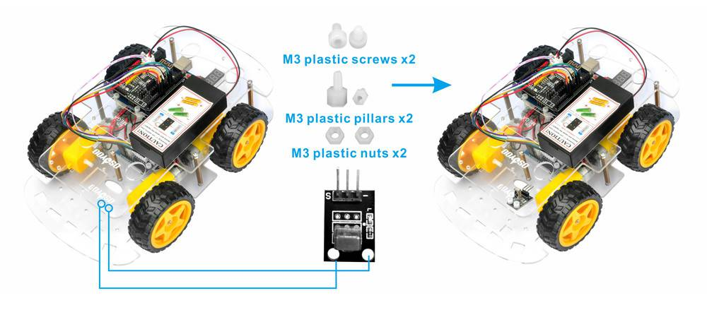

# レッスン7 赤外線リモコンでロボットを動かそう！

## **赤外線リモコンでロボットをコントロールしてコースを走破する

### このレッスンで身につける力

- [ ] 赤外線受信モジュールを正しく取り付けることが出来る
- [ ] ジャンパーワイヤーを正しく接続出来る
- [ ] （復習）IRremoteライブラリを追加できる
- [ ] サンプルコードを実行できる
- [ ] コースを走破するためにサンプルコードを修正できる
- [ ] （発展）テレビなどのリモコンを使ってロボットを動かすことが出来る

---

#### 0.ArduinoIDEを起動しよう

デスクトップにあるAruduinoのアイコンをダブルクリックしてArduinoIDEを起動しましょう．


---

#### 1.スケッチを保存しよう

(Arduinoでは，プログラムのことを「スケッチ」といいます．)

ファイル→保存をクリック（Ctrl+SでもOK）して，デスクトップに「lesson_08_1」という名前で保存しましょう．


---
#### 2.Arduinoとパソコンを接続しよう

Arduino UNOボードとパソコンをUSBケーブルでつなぎましょう．


【注意】USBを抜き差しするときは向きを確認して，ていねいにあつかうこと．

USBを差したら，ArduinoIDEでボードとシリアルポートを指定しましょう．　　

ツール→ボードをクリックして、Arduino/Genuino UNOをクリックしましょう。　　

次にツール→シリアルポートをクリックして，「COM～（Arduino UNO）」となっているものをクリックしましょう．（COM～の数字は毎回変わります．）


---

### ミッションチャレンジ

#### 赤外線受信モジュールを作ったロボットに取り付けよう！
上部シャーシ前側に赤外線受信モジュール追加します、取り付けにはプラスチックのM2.5ネジ長10、ピラーとナットで取り付けよう！



- [ ] 赤外線受信モジュールを正しく取り付けることが出来る
---

#### ジャンパーワイヤーを正しく接続しよう！
写真の様に赤と黒と白のワイヤーを接続します。
この時今までのレッスンでつないできたワイヤーは外さないでね！

  

実際に回路を作るとこんな感じになるよ！

 

- [ ] ジャンパーワイヤーを正しく接続出来る
---


#### IRremote**ライブラリ**を追加しよう
Arduinoライブラリとは？
Arduinoライブラリとはプログラムを費やす時間を短縮できたり、難しいプログラムを自分で組まなくても、ライブラリから利用することで効率的に開発ができる優れたものなんだよ！
実際にプログラムをお仕事にしている人たちもライブラリを駆使して、プログラムを作っているよ。
ライブラリをArduinoIDEに追加する方法はいくつかあるけど、今回はGitHubと呼ばれるサイトからzipファイルでインストールする方法をやってみよう！
まずは赤外線受信モジュール用のライブラリのサイトにアクセスしよう！  
↓↓↓↓↓↓↓↓↓↓↓↓↓↓↓↓↓↓↓↓↓↓↓↓  
[IRremote Arduino Library](https://github.com/Arduino-IRremote/Arduino-IRremote)

サイトにアクセスしたら、緑色に書いてあるCodeというボタンを押してみよう。
  

そうしたら、Download ZIPを押して、ライブラリをダウンロードしよう。

  

ダウンロードが終わったら、Arduino IDEに戻って
スケッチ→ライブラリをインクルード→ZIP形式のライブラリをインストールを押そう！

 

さっきサイトからダウンロードしたライブラリのzipファイルを探して、最後に開くボタンを押すとインクルードできるよ。

 

- [ ] （復習）IRremoteライブラリを追加できる


#### サンプルスケッチを実行して、実験してみよう

スケッチに以下のコードをコピー＆ペーストして、スケッチを実行してみよう。

```C++

あとであとであとであとであとであとであとであとであとであとであとであとであとであとであとであとであとであとであとであとであとであとであとであとであとであとであとであとであとであとで


```

今までのレッスンを参考にスケッチをArduinoに書き込もう！
書き込みが終わったら、ロボットを起動してみよう

- [ ] サンプルコードを実行できる

---

#### コースを走破しよう！


- [ ] コースを走破するためにサンプルコードを修正できる


#### （発展）テレビなどのリモコンを使ってロボットを動かしてみよう！

```C++

```

- [ ] （発展）テレビなどのリモコンを使ってロボットを動かすことが出来る

### まとめ


### 出来たことをチェックしよう

- [ ] 赤外線受信モジュールを正しく取り付けることが出来る
- [ ] ジャンパーワイヤーを正しく接続出来る
- [ ] （復習）IRremoteライブラリを追加できる
- [ ] サンプルコードを実行できる
- [ ] コースを走破するためにサンプルコードを修正できる
- [ ] （発展）テレビなどのリモコンを使ってロボットを動かすことが出来る