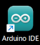
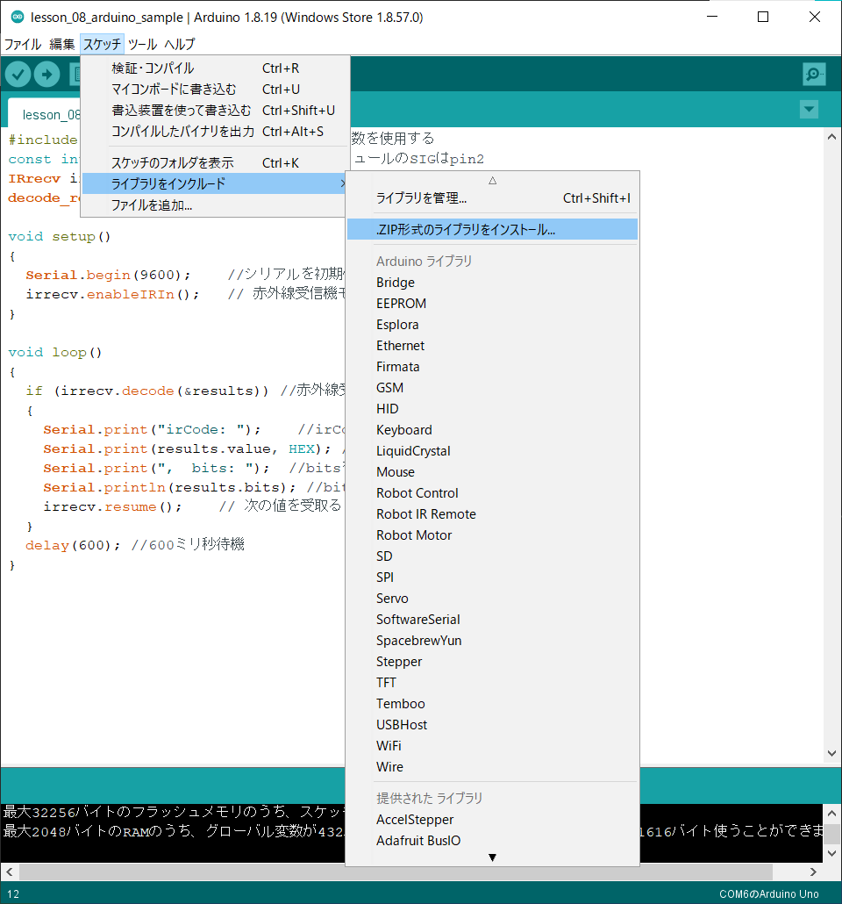

# レッスン10 赤外線リモコンでロボットを動かそう！

## **赤外線リモコンでロボットをコントロールしてコースを走破する**


### このレッスンで身につける力

- [ ] 赤外線受信モジュールを正しく取り付けることが出来る
- [ ] ジャンパーワイヤーを正しく接続出来る
- [ ] （復習）IRremoteライブラリを追加できる
- [ ] サンプルコードを実行できる
- [ ] コースを走破するためにサンプルコードを修正できる
- [ ] （発展）テレビなどのリモコンを使ってロボットを動かすことが出来る

---

#### 0.ArduinoIDEを起動しよう

デスクトップにあるAruduinoのアイコンをダブルクリックしてArduinoIDEを起動しましょう．



---

#### 1.スケッチを保存しよう

(Arduinoでは，プログラムのことを「スケッチ」といいます．)

ファイル→保存をクリック（Ctrl+SでもOK）して，デスクトップに「lesson_10_1」という名前で保存しましょう．


---
#### 2.Arduinoとパソコンを接続しよう

Arduino UNOボードとパソコンをUSBケーブルでつなぎましょう．


【注意】USBを抜き差しするときは向きを確認して，ていねいにあつかうこと．

USBを差したら，ArduinoIDEでボードとシリアルポートを指定しましょう．　　

ツール→ボードをクリックして、Arduino/Genuino UNOをクリックしましょう。　　

次にツール→シリアルポートをクリックして，「COM～（Arduino UNO）」となっているものをクリックしましょう．（COM～の数字は毎回変わります．）


---

### ミッションチャレンジ

#### 赤外線受信モジュールを作ったロボットに取り付けよう！
上部シャーシ前側に赤外線受信モジュール追加します、取り付けにはプラスチックのM2.5ネジ長10、ピラーとナットで取り付けよう！


- [ ] 赤外線受信モジュールを正しく取り付けることが出来る
---

#### ジャンパーワイヤーを正しく接続しよう！
写真の様に赤と黒と白のワイヤーを接続します。
この時今までのレッスンでつないできたワイヤーは外さないでね！

  

- [ ] ジャンパーワイヤーを正しく接続出来る
  
---


#### （復習）IRremote**ライブラリ**を追加しよう
Arduinoライブラリとは？
Arduinoライブラリとはプログラムを費やす時間を短縮できたり、難しいプログラムを自分で組まなくても、ライブラリから利用することで効率的に開発ができる優れたものなんだよ！
実際にプログラムをお仕事にしている人たちもライブラリを駆使して、プログラムを作っているよ。
ライブラリをArduinoIDEに追加する方法はいくつかあるけど、今回はGitHubと呼ばれるサイトからzipファイルでインストールする方法をやってみよう！
まずは赤外線受信モジュール用のライブラリのサイトにアクセスしよう！  
↓↓↓↓↓↓↓↓↓↓↓↓↓↓↓↓↓↓↓↓↓↓↓↓  
[IRremote Arduino Library](https://github.com/Arduino-IRremote/Arduino-IRremote)

サイトにアクセスしたら、緑色に書いてあるCodeというボタンを押してみよう。
  

そうしたら、Download ZIPを押して、ライブラリをダウンロードしよう。

  

ダウンロードが終わったら、Arduino IDEに戻って
スケッチ→ライブラリをインクルード→ZIP形式のライブラリをインストールを押そう！

 

さっきサイトからダウンロードしたライブラリのzipファイルを探して、最後に開くボタンを押すとインクルードできるよ。

 

- [ ] （復習）IRremoteライブラリを追加できる


#### サンプルスケッチを実行して、実験してみよう

スケッチに以下のコードをコピー＆ペーストして、スケッチを実行してみよう。

```C++
#include <IRremote.h>  
#define IR_PIN    10 //赤外線レシーバ信号ピンはArduinoピンD 10に接続 
 IRrecv IR(IR_PIN);  //  IRrecvオブジェクトIRリモコンからコードを取得する
 decode_results IRresults;   
#define speedPinR 9    //  RIGHT PWMピン接続MODEL-X ENA
#define RightDirectPin1  12    //右モーター方向ピン1~MODEL-X IN 1
#define RightDirectPin2  11    //右モーター方向ピン2からMODEL-X IN 2
#define speedPinL 6    // 左PWMピン接続MODEL-X ENB
#define LeftDirectPin1  7    //左モーター方向ピン1~MODEL-X IN 3
#define LeftDirectPin2  8   //左モーター方向ピン1~MODEL-X IN 4

 #define IR_ADVANCE       0x00FF18E7       //IRコントローラー 「▲」 ボタンのコード
 #define IR_BACK          0x00FF4AB5       //IRコントローラー 「▼」 ボタンのコード
 #define IR_RIGHT         0x00FF5AA5       //IRコントローラー 「>」 ボタンのコード
 #define IR_LEFT          0x00FF10EF       //IRコントローラー 「<」 ボタンのコード
 #define IR_STOP          0x00FF38C7       //IRコントローラー 「OK」 ボタンのコード
 #define IR_turnsmallleft 0x00FFB04F       //IRコントローラー 「#」 ボタンのコード

enum DN
{ 
  GO_ADVANCE, //前進する
  GO_LEFT, //左折
  GO_RIGHT,//右折
  GO_BACK,//後進する
  STOP_STOP, 
  DEF
}Drive_Num=DEF;

bool stopFlag = true;//停止フラグを設定する
bool JogFlag = false;
uint16_t JogTimeCnt = 0;
uint32_t JogTime=0;
uint8_t motor_update_flag = 0;
/***************モーター制御***************/
void go_Advance(void)  //前進
{
  digitalWrite(RightDirectPin1, HIGH);
  digitalWrite(RightDirectPin2,LOW);
  digitalWrite(LeftDirectPin1,HIGH);
  digitalWrite(LeftDirectPin2,LOW);
  analogWrite(speedPinL,255);
  analogWrite(speedPinR,255);
}
void go_Left(int t=0)  //左折
{
  digitalWrite(RightDirectPin1, HIGH);
  digitalWrite(RightDirectPin2,LOW);
  digitalWrite(LeftDirectPin1,LOW);
  digitalWrite(LeftDirectPin2,HIGH);
  analogWrite(speedPinL,200);
  analogWrite(speedPinR,200);
  delay(t);
}
void go_Right(int t=0)  //右折
{
  digitalWrite(RightDirectPin1, LOW);
  digitalWrite(RightDirectPin2,HIGH);
  digitalWrite(LeftDirectPin1,HIGH);
  digitalWrite(LeftDirectPin2,LOW);
  analogWrite(speedPinL,200);
  analogWrite(speedPinR,200);
  delay(t);
}
void go_Back(int t=0)  //後進
{
  digitalWrite(RightDirectPin1, LOW);
  digitalWrite(RightDirectPin2,HIGH);
  digitalWrite(LeftDirectPin1,LOW);
  digitalWrite(LeftDirectPin2,HIGH);
  analogWrite(speedPinL,255);
  analogWrite(speedPinR,255);
  delay(t);
}
void stop_Stop()    //止まる
{
  digitalWrite(RightDirectPin1, LOW);
  digitalWrite(RightDirectPin2,LOW);
  digitalWrite(LeftDirectPin1,LOW);
  digitalWrite(LeftDirectPin2,LOW);
}

/**************赤外線コードを検出する***************/
void do_IR_Tick()
{
  if(IR.decode(&IRresults))
  {
    if(IRresults.value==IR_ADVANCE)
    {
      Drive_Num=GO_ADVANCE;
    }
    else if(IRresults.value==IR_RIGHT)
    {
       Drive_Num=GO_RIGHT;
    }
    else if(IRresults.value==IR_LEFT)
    {
       Drive_Num=GO_LEFT;
    }
    else if(IRresults.value==IR_BACK)
    {
        Drive_Num=GO_BACK;
    }
    else if(IRresults.value==IR_STOP)
    {
        Drive_Num=STOP_STOP;
    }
    IRresults.value = 0;
    IR.resume();
  }
}

/**************車制御**************/
void do_Drive_Tick()
{
    switch (Drive_Num) 
    {
      case GO_ADVANCE:go_Advance();JogFlag = true;JogTimeCnt = 1;JogTime=millis();break;//GO_ADVANCEコードが検出された場合、次に進みます。
      case GO_LEFT: go_Left();JogFlag = true;JogTimeCnt = 1;JogTime=millis();break;//GO_LEFTコードが検出された場合は、左に曲がります。
      case GO_RIGHT:  go_Right();JogFlag = true;JogTimeCnt = 1;JogTime=millis();break;//GO_RIGHTコードが検出された場合は右に曲がる
      case GO_BACK: go_Back();JogFlag = true;JogTimeCnt = 1;JogTime=millis();break;//GO_BACKコードが検出された場合、逆方向
      case STOP_STOP: stop_Stop();JogTime = 0;break;//stop
      default:break;
    }
    Drive_Num=DEF;
    if(millis()-JogTime>=200)
    {
      JogTime=millis();
      if(JogFlag == true) 
      {
        stopFlag = false;
        if(JogTimeCnt <= 0) 
        {
          JogFlag = false; stopFlag = true;
        }
        JogTimeCnt--;
      }
      if(stopFlag == true) 
      {
        JogTimeCnt=0;
        stop_Stop();
      }
    }
}

void setup()
{
  pinMode(RightDirectPin1, OUTPUT); 
  pinMode(RightDirectPin2, OUTPUT); 
  pinMode(speedPinL, OUTPUT);  
  pinMode(LeftDirectPin1, OUTPUT);
  pinMode(LeftDirectPin2, OUTPUT); 
  pinMode(speedPinR, OUTPUT); 
  stop_Stop();

  pinMode(IR_PIN, INPUT); 
  digitalWrite(IR_PIN, HIGH);  
  IR.enableIRIn();       
}


void loop()
{
  do_IR_Tick();
  do_Drive_Tick();
}
```

今までのレッスンを参考にスケッチをArduinoに書き込もう！
書き込みが終わったら、ロボットを起動してみよう

ロボットを起動したらリモコンで操縦してみよう！

操縦の仕方↓↓↓↓↓↓↓↓↓↓↓↓↓↓↓↓↓↓↓↓↓↓↓↓↓↓↓↓↓↓↓

赤外線リモコン“▲”前進ボタン

赤外線リモコン▼” 後進ボタン

赤外線リモコン“►”右折ボタン

赤外線リモコン“◄” 左折ボタン

赤外線リモコン“OK”ストップボタン

赤外線リモコン“#”小さい左折 ボタン

 

- [ ] サンプルコードを実行できる

---

#### コースを走破しよう！

今回は下図のような迷路を今までスタートから中間地点を通ってゴールしてもらうよ。
リモコンでうまく操作してゴールできるかな。


- [ ] コースを走破するためにサンプルコードを修正できる


#### （発展）テレビなどのリモコンを使ってロボットを動かしてみよう！


今回使ったサンプルコードの上の範囲を見てみよう。

```C++
 #define IR_ADVANCE       0x00FF18E7       //IRコントローラー 「▲」 ボタンのコード
 #define IR_BACK          0x00FF4AB5       //IRコントローラー 「▼」 ボタンのコード
 #define IR_RIGHT         0x00FF5AA5       //IRコントローラー 「>」 ボタンのコード
 #define IR_LEFT          0x00FF10EF       //IRコントローラー 「<」 ボタンのコード
 #define IR_STOP          0x00FF38C7       //IRコントローラー 「OK」 ボタンのコード
 #define IR_turnsmallleft 0x00FFB04F       //IRコントローラー 「#」 ボタンのコード
```
真ん中あたりに変な数字と文字が混ざった文字が書いてあることを確認しよう！

「0x00FF18E7」とか「0x00FF10EF」のような文字だよ。

これらはリモコンのボタンから赤外線センサから出る文字だよ。

だから「１」とか「２」とかを押すと別な文字情報がリモコンから出てくるんだよ！

豆知識になるけど、身の回りにあるテレビやエアコンのリモコンのボタンも今回使っているリモコンと同じようにボタンを押すといろんな文字情報を発信するんだよ。

これを利用してテレビやエアコンのリモコンを利用してロボットを動かしてみよう！

まずはこのようなリモコンを用意しよう！

 

用意してもらったんだけど、これらのリモコンのボタンからどんな文字が出てるかがわからないと思うんだ。

だから次のサンプルコードを使って調べてみよう！

```C++
#include <IRremote.h>  // IRRemote.hをインクルード
const int irReceiverPin = 2;  ///受信モジュールのSIGはpin2
IRrecv irrecv(irReceiverPin); //IRrecvタイプの変数を作成します
decode_results results;    // 結果

void setup(){
  Serial.begin(9600);    //シリアルを初期化し、ボーレートは9600に設定する
  irrecv.enableIRIn();   // 赤外線受信機モジュールを有効にする
  Serial.print("赤外線モジュールサンプルプログラムスタート\n");
}

void loop(){
  if (irrecv.decode(&results)){ //赤外線受信機モジュールの受信データ
    Serial.print("IRコード: ");
    Serial.print(results.value, HEX); //シリアルに値を出力する
    Serial.print(",　ビット: ");  //bitsを送信する         
    Serial.println(results.bits); //bitsを結果に出力する
    irrecv.resume();// 次の値を受取る
  }  
  delay(600); //600ミリ秒待機
}
```

今までのレッスンを参考にスケッチをArduinoに書き込もう！

書き込みが終わったら、ツール→シリアルモニタをクリックしてみよう。

そうするとボタンを押すといろんな文字が出てくると思うんだ。

この文字たちを最初のサンプルコードに利用するよ。

今回使ったサンプルコードの上の範囲をもう一度見てみよう。

```C++
 #define IR_ADVANCE       0x00FF18E7       //IRコントローラー 「▲」 ボタンのコード
 #define IR_BACK          0x00FF4AB5       //IRコントローラー 「▼」 ボタンのコード
 #define IR_RIGHT         0x00FF5AA5       //IRコントローラー 「>」 ボタンのコード
 #define IR_LEFT          0x00FF10EF       //IRコントローラー 「<」 ボタンのコード
 #define IR_STOP          0x00FF38C7       //IRコントローラー 「OK」 ボタンのコード
 #define IR_turnsmallleft 0x00FFB04F       //IRコントローラー 「#」 ボタンのコード
```
こんな感じだったんだと思うけど変な文字が書いてあると思うんだ。

用意してもらったリモコンから出てきた文字と入れ替えることでロボットが動くようになるよ。

文字を入れ替えたらもう一度ロボットを動かしてみよう！

動いたらコントローラの入れ替えが成功したことになるよ。

- [ ] （発展）テレビなどのリモコンを使ってロボットを動かすことが出来る

### まとめ

リモコンのボタンを押すと赤外線の文字情報が出力される。

出力された情報を今回ロボットに取り付けた赤外線センサが読み取ることでロボットが動く。


### 出来たことをチェックしよう

- [ ] 赤外線受信モジュールを正しく取り付けることが出来る
- [ ] ジャンパーワイヤーを正しく接続出来る
- [ ] （復習）IRremoteライブラリを追加できる
- [ ] サンプルコードを実行できる
- [ ] コースを走破するためにサンプルコードを修正できる
- [ ] （発展）テレビなどのリモコンを使ってロボットを動かすことが出来る