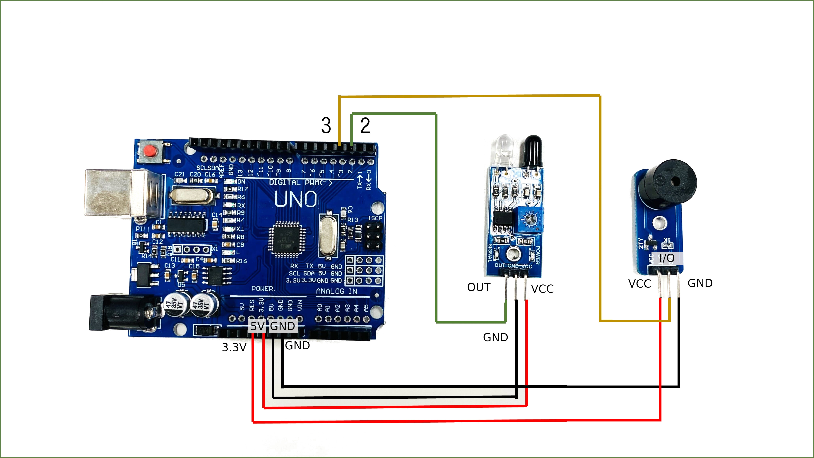

# 障害物センサーを使ってブザーを鳴らそう！

## 障害物センサーを使って近づいたらブザーを鳴らす

---

### このレッスンで身につける力

- [ ] ブレッドボードを使って障害物センサーとブザーの入った回路を作成できる
- [ ] 障害物センサーの感度を調整できる
- [ ] サンプルコードを実行できる
- [ ] （工夫できる課題）

---

### ミッションの準備

- [ ] Osoyoo UNO Board x1
- [ ] 赤外線障害物回避センサー x1
- [ ] アクティブブザーモジュール x1
- [ ] ブレッドボード x1
- [ ] ジャンパー線
- [ ] プラスドライバー x1
- [ ] USBケーブル x1
- [ ] パソコン x1


## ミッションチャレンジ
---

### 障害物センサーとブザーをArduinoにつなごう！

配線図（要編集）


ブレッドボードを用いた接続例：


**※注意！**

ブザーに書かれている「VCC」と「GND」は実際には反対です．気を付けて配線しましょう．


- [ ] 回路が作れたらチェック！


### 障害物を検知したらシリアルモニタとLEDで通知しよう！

``` C++
int buzzerPin = 3;  //3番ピンをブザーに接続
int isObstaclePin = 2;  // 2番ピンを赤外線センサーに接続
int isObstacle = HIGH;  // 障害物が無い場合

void setup() {
  pinMode(buzzerPin, OUTPUT);
  pinMode(isObstaclePin, INPUT);
  digitalWrite(buzzerPin, HIGH);
  Serial.begin(9600);
}

void loop() {
  isObstacle = digitalRead(isObstaclePin);
  if (isObstacle == LOW)  //障害物がある場合
  {
    Serial.println("OBSTACLE!!, OBSTACLE!!"); //Obstacleは「障害物」の意味
    digitalWrite(buzzerPin, LOW);
  }
  else  //障害物がない場合
  {
    Serial.println("clear");
    digitalWrite(buzzerPin, HIGH); //stop beep

  }
  delay(200);
}
```

上のプログラムをコピーして実行し，シリアルモニタを開こう！
**センサに手をかざすと何が起こるかな？**

- [ ] シリアルモニタに「clear」「OBSTACLE!!」の表示が出たらチェック！
- [ ] ブザーが鳴ったらチェック！


---

### 障害物センサーの感度を調整しよう

回路につないだまま，プラスドライバーで障害物センサーのねじをまわしてみよう！ネジを回す方向によって反応する距離がどのように変化するかな？


>やってみよう<br>
>ちょうど10[cm]で反応するように調整しよう


#### 出来たことをチェックしよう

- [ ] ブレッドボードを使って障害物センサーとブザーの入った回路を作成できる
- [ ] 障害物センサーの感度を調整できる
- [ ] サンプルコードを実行できる
- [ ] （工夫できる課題）
