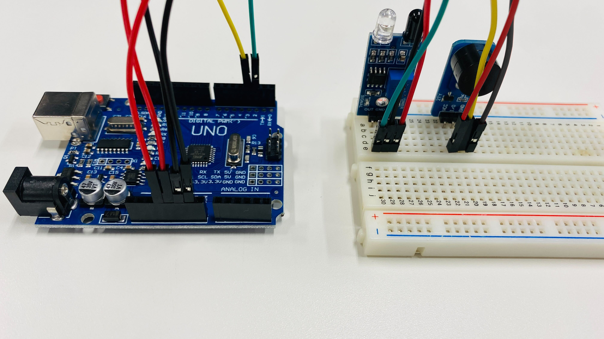

# 障害物センサーを使ってブザーを鳴らそう！

## 障害物センサーを使って近づいたらブザーを鳴らす


### このレッスンで身につける力

- [ ] ブレッドボードを使って障害物センサーとブザーの入った回路を作成できる
- [ ] 障害物センサーの感度を調整できる
- [ ] サンプルコードを実行できる
- [ ] 10cmでブザーが鳴る人感センサーを作ることができる

---

### ミッションの準備

- [ ] Osoyoo UNO Board x1
- [ ] 赤外線障害物回避センサー x1
- [ ] アクティブブザーモジュール x1
- [ ] ブレッドボード x1
- [ ] ジャンパー線
- [ ] プラスドライバー x1
- [ ] 定規 x1
- [ ] USBケーブル x1
- [ ] パソコン x1


## ミッションチャレンジ

### 障害物センサーとブザーをArduinoにつなごう！

配線図：


ブレッドボードを用いた接続例：


**※注意！**
**ブザーが鳴らないとき・・・**
**ブザーによっては書かれている「VCC」と「GND」は実際には反対の場合があります（生産工場のミス）．配線しなおしてましょう．**


- [ ] 回路が作れたらチェック！

---


### 障害物を検知したらシリアルモニタとLEDで通知しよう！

ArduinoIDEを開き，ファイル→名前を付けて保存をクリックして，「lesson_11_1」という名前で保存しましょう．

スケッチに以下のコードをコピー＆ペーストして，スケッチを実行してみよう．


``` C++
int LEDPin = 13;  //LEDピンを13番に設定　（Arduino本体のLED）
int isObstaclePin = 2;  // 2番ピンを赤外線センサーに接続
int isObstacle = HIGH;  // 障害物が無い場合

void setup() {
  pinMode(isObstaclePin, INPUT);
  pinMode(LEDPin, OUTPUT);
  Serial.begin(9600);
}

void loop() {
  isObstacle = digitalRead(isObstaclePin);
  if (isObstacle == LOW)  //障害物がある場合
  {
    Serial.println("物体を検知しました！！　LEDをオン"); 
    digitalWrite(LEDPin, HIGH); //LEDをON
  }
  else  //障害物がない場合
  {
    Serial.println("物体はありません　LEDオフ");
    digitalWrite(LEDPin, LOW); //LEDをOFF
  }
  delay(200);
}
```

上のプログラムをコピーして実行し，シリアルモニタを開こう！
**センサに手をかざすと何が起こるかな？**

- [ ] シリアルモニタに「clear」「OBSTACLE!!」の表示が出たらチェック！
- [ ] LEDが光ったらチェック！


---

### 障害物センサーの感度を調整しよう

回路につないだまま，プラスドライバーで障害物センサーのネジをまわしてみよう！ネジを回す方向によって反応する距離がどのように変化するかな？


- [ ] ネジを回して反応距離が変化することが確認出来たらチェック！

---
### ちょうど10cmでブザーが鳴る人感センサーを作ろう！

ArduinoIDEを開き，ファイル→名前を付けて保存をクリックして，「lesson_11_2」という名前で保存しましょう．

スケッチに以下のコードをコピー＆ペーストして，スケッチを実行してみよう．

``` C++
int LEDPin = 13;  //LEDピンを13番に設定　（Arduino本体のLED）
int buzzerPin = 3;  //3番ピンをブザーに接続
int isObstaclePin = 2;  // 2番ピンを赤外線センサーに接続
int isObstacle = HIGH;  // 障害物が無い場合

void setup() {
  pinMode(buzzerPin, OUTPUT);
  pinMode(isObstaclePin, INPUT);
  pinMode(LEDPin, OUTPUT);
  Serial.begin(9600);
}

void loop() {
  isObstacle = digitalRead(isObstaclePin);
  if (isObstacle == LOW)  //障害物がある場合
  {
    Serial.println("物体を検知しました！！　LED・ブザーをオン"); 
    digitalWrite(LEDPin, HIGH); //LEDをON
    digitalWrite(buzzerPin, LOW); //ブザーをON
  }
  else  //障害物がない場合
  {
    Serial.println("物体はありません　LED・ブザーをオフ");
    digitalWrite(LEDPin, LOW); //LEDをOFF
    digitalWrite(buzzerPin, HIGH); //ブザーをOFF
  }
  delay(200);
}

```


**定規などを使って，反応する距離を10cmになるように調整しよう！**


- [ ] ちょうど10cmでブザーが鳴ったらチェック！

---
### まとめ
- 内蔵LEDは13番（`LEDPin = 13`で指定できる）
- 障害物センサーは`digitalRead(isObstaclePin);`で読み取る
- 障害物センサーはネジを回すことで反応距離を調整できる


#### 出来たことをチェックしよう

- [ ] ブレッドボードを使って障害物センサーとブザーの入った回路を作成できる
- [ ] 障害物センサーの感度を調整できる
- [ ] サンプルコードを実行できる
- [ ] 10cmでブザーが鳴る人感センサーを作ることができる
