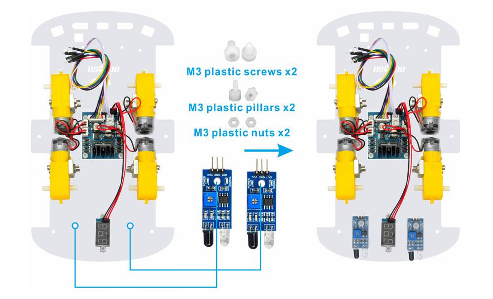
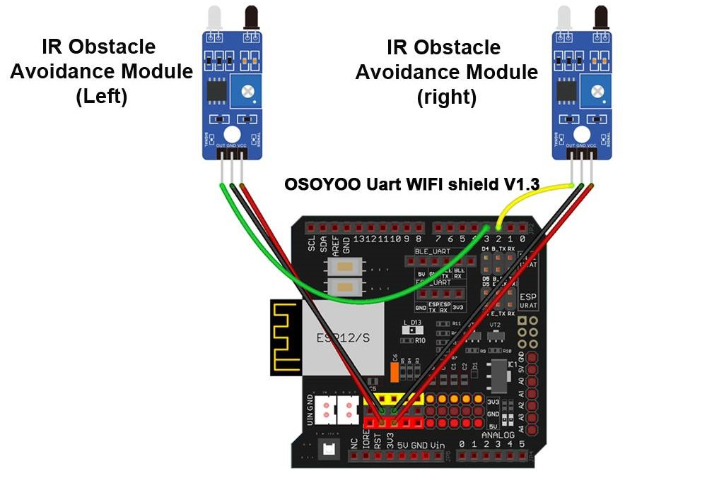
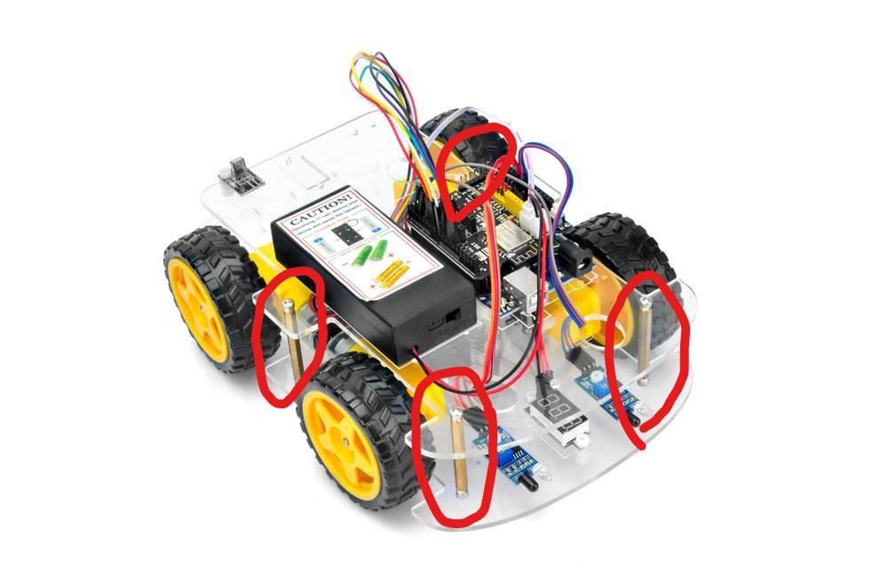
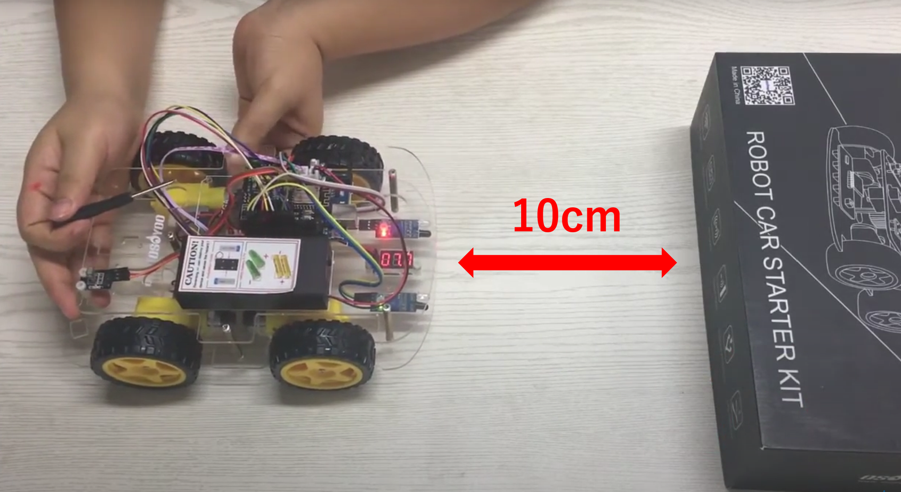
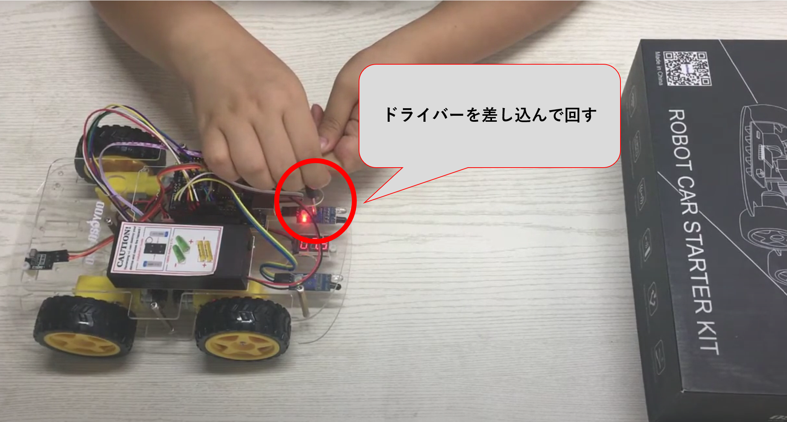
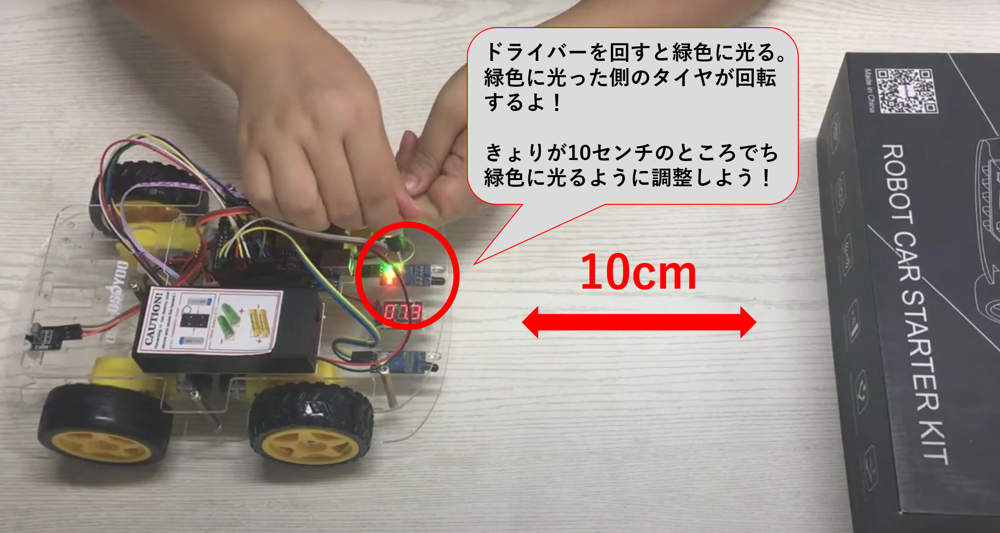
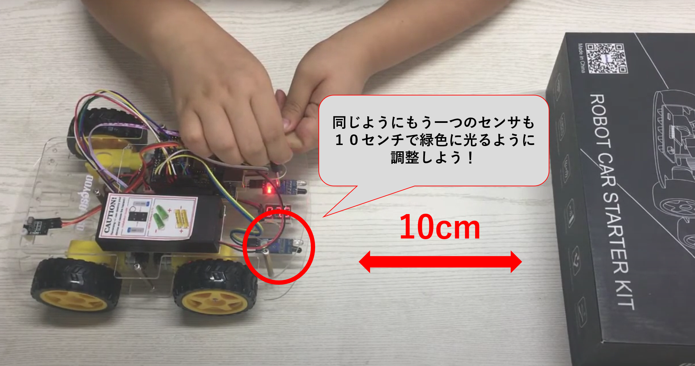

# 追いかけロボットを作ろう

## 障害物センサーを使って物体追従を行う

### このレッスンで身につける力

- [ ] 障害物線センサーを正しく取り付けられる
- [ ] ジャンパーワイヤーを正しく接続出来る
- [ ] サンプルコードを実行できる
- [ ] 障害物センサーの感度を調整できる
- [ ] 追従しやすくするためにサンプルコードを修正できる


---
### ミッションの準備
- [ ] Osoyoo UNO Board x 1
- [ ] 赤外線コントローラー
- [ ] 赤外線受信機
- [ ] アクティブブザーモジュールx 1
- [ ] F/Mジャンパー
- [ ] USBケーブルx 1
- [ ] パソコン x 1

---
#### 0.ArduinoIDEを起動しよう

デスクトップにあるAruduinoのアイコンをダブルクリックしてArduinoIDEを起動しましょう．


---
#### 1.スケッチを保存しよう

(Arduinoでは，プログラムのことを「スケッチ」といいます．)

ファイル→保存をクリック（Ctrl+SでもOK）して，デスクトップに「lesson_09_1」という名前で保存しましょう．


---
#### 2.Arduinoとパソコンを接続しよう

Arduino UNOボードとパソコンをUSBケーブルでつなぎましょう．


【注意】USBを抜き差しするときは向きを確認して，ていねいにあつかうこと．

USBを差したら，ArduinoIDEでボードとシリアルポートを指定しましょう．　　

ツール→ボードをクリックして、Arduino/Genuino UNOをクリックしましょう。　　

次にツール→シリアルポートをクリックして，「COM～（Arduino UNO）」となっているものをクリックしましょう．（COM～の数字は毎回変わります．）


---
### ミッションチャレンジ

#### 障害物線センサーを正しく取り付けられる
銅ピラーのネジを外し、2個の赤外線回避モジュールを車に追加します。

下部カーシャーシの背面に、2個のM3プラスチックネジ、M3プラスチックピラー、

およびM3プラスチックナットを使用して当該センサーを取り付けます。




---
#### ジャンパーワイヤーを正しく接続出来る

次の接続図のように2個の障害回避モジュールを接続します 



銅ピラーにネジを固定して、上部シャーシと下部シャーシを接続します。



---
#### サンプルコードを実行できる
スケッチに以下のコードをコピー＆ペーストして、スケッチを実行してみよう。

```C++
#define speedPinR 9          //PWM右ピン接続
#define RightDirectPin1  12  //右モーター方向ピン1
#define RightDirectPin2  11  //右モーター方向ピン2
#define speedPinL 6          //PWM右ピン接続
#define LeftDirectPin1  7    //左モーター方向ピン
#define LeftDirectPin2  8    //左モーター方向ピン


/*左からD 3、A 1-A 3、D 10に接続します*/
#define RightObstacleSensor 2  //右障害物センサーからD2
#define LeftObstacleSensor 3   //左障害物センサーからD3

#define SPEED   180 //モータ速度
void go_Advance(void)  //前進
{
  digitalWrite(RightDirectPin1, HIGH);
  digitalWrite(RightDirectPin2,LOW);
  digitalWrite(LeftDirectPin1,HIGH);
  digitalWrite(LeftDirectPin2,LOW);
    set_Motorspeed(SPEED,SPEED);
}
void back_Right(void)  //左折
{
  digitalWrite(RightDirectPin1, HIGH);
  digitalWrite(RightDirectPin2,LOW);
  digitalWrite(LeftDirectPin1,LOW);
  digitalWrite(LeftDirectPin2,HIGH);
    set_Motorspeed(SPEED,0);
}
void back_Left(void)  //右折
{
  digitalWrite(RightDirectPin1, LOW);
  digitalWrite(RightDirectPin2,HIGH);
  digitalWrite(LeftDirectPin1,HIGH);
  digitalWrite(LeftDirectPin2,LOW);
    set_Motorspeed(0,SPEED);
}
void go_Back(void)  //後進
{
  digitalWrite(RightDirectPin1, LOW);
  digitalWrite(RightDirectPin2,HIGH);
  digitalWrite(LeftDirectPin1,LOW);
  digitalWrite(LeftDirectPin2,HIGH);
    set_Motorspeed(SPEED,SPEED);
}
void stop_Stop()    //止まる
{
  digitalWrite(RightDirectPin1, LOW);
  digitalWrite(RightDirectPin2,LOW);
  digitalWrite(LeftDirectPin1,LOW);
  digitalWrite(LeftDirectPin2,LOW);
}
/*モーター速度を設定*/
void set_Motorspeed(int speed_L,int speed_R)
{
  analogWrite(speedPinL,speed_L); 
  analogWrite(speedPinR,speed_R);   
}

void setup()
{
 pinMode(speedPinL,OUTPUT); //左モーターPWMピン
 pinMode(speedPinR,OUTPUT); //右モーターPWMピン
 pinMode(RightDirectPin1,OUTPUT); //左モーター方向ピン1
 pinMode(RightDirectPin2,OUTPUT); //左モーター方向ピン2
 pinMode(LeftDirectPin1,OUTPUT);  //右モーター方向ピン1
 pinMode(LeftDirectPin2,OUTPUT);  //右モーター方向ピン2

  /*障害物センサ初期設定 */
 pinMode(RightObstacleSensor,INPUT); 
  pinMode(LeftObstacleSensor,INPUT); 
 Serial.begin(9600);
}

void auto_following(){
 int IRvalueLeft= digitalRead(RightObstacleSensor);
  int IRvalueRight=digitalRead(LeftObstacleSensor);
 if (IRvalueLeft==LOW && IRvalueRight==LOW)
 { 
  //両方のセンサーが障害物を検出しました。先に進みます。
      go_Back();  //Turn left
 }
 else  if (IRvalueLeft==HIGH && IRvalueRight==HIGH)
 {
     stop_Stop();   //ストップ
     set_Motorspeed(0,0);
    }
 else if (IRvalueLeft==LOW && IRvalueRight==HIGH)
 { 
  //左センサのみが障害物を検知
      back_Left();  //左折
 }
  else if (IRvalueLeft==HIGH && IRvalueRight==LOW)
 { 
   //右側センサのみが障害物を検知する
      back_Right();  //右折
  
 }
}

void loop(){
 
auto_following();
}
```

---
#### 障害物センサーの感度を調整できる
まずは車の電源を入れます。

赤外線障害物回避モジュールの約10cm前方に物を置くよ！


次にモジュールのポテンショメーターを調整して物体または手を検出するようしよう！






これらの調整ができたら赤外線障害物回避モジュールに箱を近づけてみよう！

そうすると箱にロボットが近づくよ！

片方のセンサーに箱を近づけると旋回して追従してくれるよ！

---
#### 追従しやすくするためにサンプルコードを修正できる

箱を追従しやすくするためにタイヤの回転速度を変更してみよう！

さっきロボットに書き込んだ長いサンプルコードの上あたりを
見てもらうと

```C++
#define speedPinR 9          //PWM右ピン接続
#define RightDirectPin1  12  //右モーター方向ピン1
#define RightDirectPin2  11  //右モーター方向ピン2
#define speedPinL 6          //PWM右ピン接続
#define LeftDirectPin1  7    //左モーター方向ピン
#define LeftDirectPin2  8    //左モーター方向ピン


/*左からD 3、A 1-A 3、D 10に接続します*/
#define RightObstacleSensor 2  //右障害物センサーからD2
#define LeftObstacleSensor 3   //左障害物センサーからD3

#define SPEED   180 //モータ速度
void go_Advance(void)  //前進
```
こんな感じで書いてあると思うんだがどこにタイヤの回転速度が書いてあるかわかったかな？

正解は
```C++
#define SPEED   180 //モータ速度
```
この部分だよ！

今は速度が180に設定されてるから別な数字に変えてみよう！


---
### まとめ

この処理でロボットが箱を追従することができる
```C++
void auto_following(){
 int IRvalueLeft= digitalRead(RightObstacleSensor);
  int IRvalueRight=digitalRead(LeftObstacleSensor);
 if (IRvalueLeft==LOW && IRvalueRight==LOW)
 { 
  //両方のセンサーが障害物を検出しました。先に進みます。
      go_Back();  //Turn left
 }
 else  if (IRvalueLeft==HIGH && IRvalueRight==HIGH)
 {
     stop_Stop();   //ストップ
     set_Motorspeed(0,0);
    }
 else if (IRvalueLeft==LOW && IRvalueRight==HIGH)
 { 
  //左センサのみが障害物を検知
      back_Left();  //左折
 }
  else if (IRvalueLeft==HIGH && IRvalueRight==LOW)
 { 
   //右側センサのみが障害物を検知する
      back_Right();  //右折
  
 }
}
```


モーター速度を調整できる
```C++
#define SPEED   180 //モータ速度
```


---
#### 出来たことをチェックしよう

- [ ] 障害物線センサーを正しく取り付けられる
- [ ] ジャンパーワイヤーを正しく接続出来る
- [ ] サンプルコードを実行できる
- [ ] 障害物センサーの感度を調整できる
- [ ] 追従しやすくするためにサンプルコードを修正できる