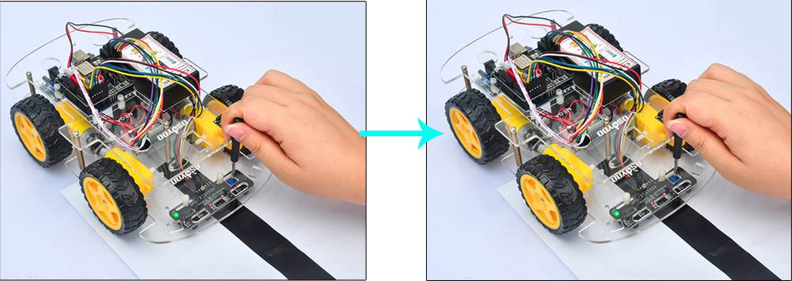

# トラッキングセンサーを使ってみよう！

## トラッキングセンサーの使い方を学ぼう

### このレッスンで身につける力

- [ ] ブレッドボードにトラッキングセンサーを使った回路を作ることができる
- [ ] トラッキングセンサーの感度を調整できる
- [ ] サンプルコードが実行できる
- [ ] 特定の反応の時にPCに〇を表示できる

### ミッションの準備
- [ ] Osoyoo UNO Board x 1
- [ ] トラッキングセンサー
- [ ] F/Mジャンパー
- [ ] USBケーブルx 1
- [ ] パソコン x 1

## ミッションチャレンジ

### ブレッドボードにトラッキングセンサーを使った回路を作ろう
図のようにトラッキングセンサーとOsoyoo UNO Boardを接続しよう！5VとGNDを間違えないようにしよう。
<image src="image/Arduino-5-tracking.jpg" >

- [ ] 接続できたらチェック！

  ---
### トラッキングセンサーの感度を調整しよう
トラッキングセンサーモジュールの感度を調整します．

車の電源をオンにして、ドライバーでトラッキングセンサーのポテンショメーターを調整して、一番よい感度の状態にします．

信号はトラックの上にある黒いトラックの上にいる時にLEDライトが点灯し、センサーが白いトラックの上にあるときに消灯する様に調整します．



- [ ] トラッキングセンサーの感度を調整できたらチェック！

### サンプルコードを実行しよう
ArduinoIDEを開き，ファイル→名前を付けて保存をクリックして，「lesson_13」という名前で保存しよう。
スケッチに以下のコードをコピー＆ペーストして，スケッチを実行してみよう。
``` C++
#define ir1 A0
#define ir2 A1
#define ir3 A2
#define ir4 A3
#define ir5 A4

void setup() {
  pinMode(ir1, INPUT);
  pinMode(ir2, INPUT);
  pinMode(ir3, INPUT);
  pinMode(ir4, INPUT);
  pinMode(ir5, INPUT);
  Serial.begin(9600);
}

void loop(){
  //センサー値の読み取り
  int s1 = digitalRead(ir1);  //左端のセンサ
  int s2 = digitalRead(ir2);  //左センサー
  int s3 = digitalRead(ir3);  //中央センサ
  int s4 = digitalRead(ir4);  //右センサー
  int s5 = digitalRead(ir5);  //右端のセンサ
 
  Serial.print(s1);
  Serial.print(s2);
  Serial.print(s3);
  Serial.print(s4);
  Serial.println(s5);
  delay(1000);
}
```
- [ ] サンプルコードが実行できたらチェック！

### 左端のセンサーが黒を見たときに時にPCに ok! を表示しよう！
``` C++
  Serial.print(!s1);
  Serial.print(!s2);
  Serial.print(!s3);
  Serial.print(!s4);
  Serial.println(!s5);
```
この後にif文を追加して左端のセンサーが黒を見たとき「ok!」を表示してみよう。

if文は[レッスン３](https://github.com/kobayashi-makoto2021/robobu/blob/main/Lesson_03/lesson_03.md)も確認しよう！

``` C++
  if (条件式){
    (条件式が成立する場合の処理を記述)
  }
```

### 両端が同時に黒を見たときに「ok!」を表示してみよう。
  
二つの条件式を同時に成り立つ条件を設定するには`` && ``を使うよ！

## まとめ
- [ ] トラッキングセンサーはdigital.Readで読むことができる
- [ ] ドライバーでねじを回すことで感度を調整できる
- [ ] if文でセンサーが特定の反応をしたときに別な処理をすることができる

### できたことをチェックしよう！
- [ ] ブレッドボードにトラッキングセンサーを使った回路を作ることができる
- [ ] トラッキングセンサーの感度を調整できる
- [ ] サンプルコードが実行できる
- [ ] 特定の反応の時にPCに〇を表示できる
