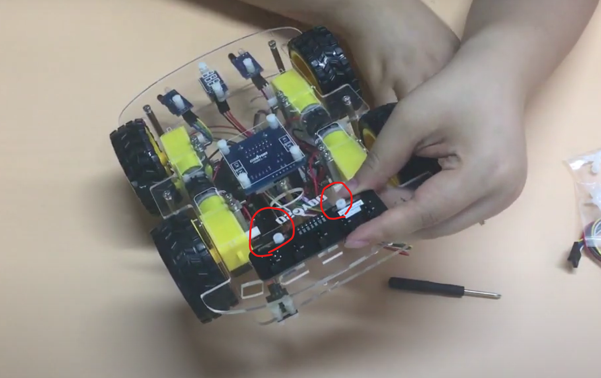

# 追いかけロボットを作ろう

## 障害物センサーを使って物体追従を行う

### このレッスンで身につける力

- [ ] トラッキングセンサーを正しく取り付けられる
- [ ] ジャンパーワイヤーを正しく接続出来る
- [ ] トラッキングセンサーの感度を調整できる
- [ ] サンプルコードを実行できる
- [ ] 条件式(and or)の書き方を理解してコードを修正できる
- [ ] コースを走破するためにサンプルコードを修正できる

---
### ミッションの準備
- [ ] Osoyoo UNO Board x 1
- [ ] 赤外線コントローラー
- [ ] トラッキングセンサーモジュール
- [ ] アクティブブザーモジュールx 1
- [ ] F/Mジャンパー
- [ ] USBケーブルx 1
- [ ] パソコン x 1


---
### ミッションチャレンジ
今回のレッスンではこの線上を自動で走破してもらうよ！


#### トラッキングセンサーを正しく取り付けられる


2個のM3プラスチックネジ、プラスチックピラー、およびプラスチックナットを使用して、追跡センサーモジュールを下部シャーシの下面側に取り付けます。

近くで見るとこんな感じだよ．


裏側から見るとこんな感じだよ．


- [ ] トラッキングセンサーを正しく取り付けられる

---
#### ジャンパーワイヤーを正しく接続出来る
トラッキングセンサーモジュールのGNDとVCCピンをOSOYOO UartWiFiシールドV1.3のボードGNDと5Vにそれぞれ接続します.

下の図に示すように、IR1、IR2、IR3、IR4、IR5ピンをA0、A1、A2、A3、A4に7ピン25cmメス-メスケーブルで接続します.


- [ ] ジャンパーワイヤーを正しく接続出来る

---
#### サンプルコードを実行できる
スケッチに以下のコードをコピー＆ペーストして、スケッチを実行してみよう。

```C++
#define m1 7  //右モーターMA1
#define m2 8  //右モーターMA2
#define m3 12  //左モーターMB1
#define m4 11  //左モーターMB2
#define e1 9  //右モーター使用可能ピンEA
#define e2 6 //左モーター使用可能ピンEB      

//**********5チャンネルIRセンサー接続**********//
#define ir1 A0
#define ir2 A1
#define ir3 A2
#define ir4 A3
#define ir5 A4
//*************************************************//

void setup() {
  pinMode(m1, OUTPUT);
  pinMode(m2, OUTPUT);
  pinMode(m3, OUTPUT);
  pinMode(m4, OUTPUT);
  pinMode(e1, OUTPUT);
  pinMode(e2, OUTPUT);
  pinMode(ir1, INPUT);
  pinMode(ir2, INPUT);
  pinMode(ir3, INPUT);
  pinMode(ir4, INPUT);
  pinMode(ir5, INPUT);
  Serial.begin(9600);
}

void loop() {
  //センサー値の読み取り
  int s1 = digitalRead(ir1);  //左端のセンサ
  int s2 = digitalRead(ir2);  //左センサー
  int s3 = digitalRead(ir3);  //中央センサ
  int s4 = digitalRead(ir4);  //右センサー
  int s5 = digitalRead(ir5);  //右端のセンサ
 
 Serial.print(!s1);
  Serial.print(!s2);
  Serial.print(!s3);
  Serial.print(!s4);
  Serial.println(!s5);
 
  //中央のセンサの黒い線のみの場合
  if((s1 == 1) && (s2 == 1) && (s3 == 0) && (s4 == 1) && (s5 == 1))
  {
    //全速力で前進する 
    analogWrite(e1, 120); //モーターの速度を0~255の範囲で調整できます
    analogWrite(e2, 120); //モーターの速度を0~255の範囲で調整できます
    digitalWrite(m1, HIGH);
    digitalWrite(m2, LOW);
    digitalWrite(m3, HIGH);
    digitalWrite(m4, LOW);
  }
  
  //左センサーの黒線のみの場合
  if((s1 == 1) && (s2 == 0) && (s3 == 1) && (s4 == 1) && (s5 == 1))
  {
    //左に移動
    analogWrite(e1, 150); //モーターの速度を0~255の範囲で調整できます
    analogWrite(e2, 150); //モーターの速度を0~255の範囲で調整できます
    digitalWrite(m1, LOW);
    digitalWrite(m2, LOW);
    digitalWrite(m3, HIGH);
    digitalWrite(m4, LOW);
    

  }
  
  //センサの黒い線が一番左にある場合
  if((s1 == 0) && (s2 == 1) && (s3 == 1) && (s4 == 1) && (s5 == 1))
  {
    //全速力で左へ
    analogWrite(e1, 180); //モーターの速度を0~255の範囲で調整できます
    analogWrite(e2, 180); //モーターの速度を0~255の範囲で調整できます
    digitalWrite(m1, LOW);
    digitalWrite(m2, HIGH);
    digitalWrite(m3, HIGH);
    digitalWrite(m4, LOW);
    

  }

  //右側のセンサの黒い線のみの場合
  if((s1 == 1) && (s2 == 1) && (s3 == 1) && (s4 == 0) && (s5 == 1))
  {
    //going right
    analogWrite(e1, 150); //モーターの速度を0~255の範囲で調整できます
    analogWrite(e2, 150); //モーターの速度を0~255の範囲で調整できます
    digitalWrite(m1, HIGH);
    digitalWrite(m2, LOW);
    digitalWrite(m3, LOW);
    digitalWrite(m4, LOW);
  }

  //右端のセンサーのみが黒線を検出した場合
  if((s1 == 1) && (s2 == 1) && (s3 == 1) && (s4 == 1) && (s5 == 0))
  {
    //going right with full speed 
    analogWrite(e1, 180); //モーターの速度を0~255の範囲で調整できます
    analogWrite(e2, 180); //モーターの速度を0~255の範囲で調整できます
    digitalWrite(m1, HIGH);
    digitalWrite(m2, LOW);
    digitalWrite(m3, LOW);
    digitalWrite(m4, HIGH);
  }

  //中央と右のセンサーが黒線を検出した場合
  if((s1 == 1) && (s2 == 1) && (s3 == 0) && (s4 == 0) && (s5 == 1))
  {
    //going right
    analogWrite(e1, 150); //モーターの速度を0~255の範囲で調整できます
    analogWrite(e2, 150); //モーターの速度を0~255の範囲で調整できます
    digitalWrite(m1, HIGH);
    digitalWrite(m2, LOW);
    digitalWrite(m3, LOW);
    digitalWrite(m4, LOW);
  }

  //中央と左のセンサが黒線を検出した場合
  if((s1 == 1) && (s2 == 0) && (s3 == 0) && (s4 == 1) && (s5 == 1))
  {
    //going left
    analogWrite(e1, 150); //モーターの速度を0~255の範囲で調整できます
    analogWrite(e2, 150); //モーターの速度を0~255の範囲で調整できます
    digitalWrite(m1, LOW);
    digitalWrite(m2, LOW);
    digitalWrite(m3, HIGH);
    digitalWrite(m4, LOW);
  }

  //中央、左、左のほとんどのセンサが黒い線を検出した場合
  if((s1 == 0) && (s2 == 0) && (s3 == 0) && (s4 == 1) && (s5 == 1))
  {
    //going left
    analogWrite(e1, 150); //モーターの速度を0~255の範囲で調整できます
    analogWrite(e2, 150); //モーターの速度を0~255の範囲で調整できます
    digitalWrite(m1, LOW);
    digitalWrite(m2, LOW);
    digitalWrite(m3, HIGH);
    digitalWrite(m4, LOW);
  }

  //中央、右、一番右のセンサーが黒い線を検出した場合
  if((s1 == 1) && (s2 == 1) && (s3 == 0) && (s4 == 0) && (s5 == 0))
  {
    //going right
    analogWrite(e1, 150); //モーターの速度を0~255の範囲で調整できます
    analogWrite(e2, 150); //モーターの速度を0~255の範囲で調整できます
    digitalWrite(m1, HIGH);
    digitalWrite(m2, LOW);
    digitalWrite(m3, LOW);
    digitalWrite(m4, LOW);
  }

  //すべてのセンサーが黒い線上にある場合
  if((s1 == 0) && (s2 == 0) && (s3 == 0) && (s4 == 0) && (s5 == 0))
  {
    //stop
    digitalWrite(m1, LOW);
    digitalWrite(m2, LOW);
    digitalWrite(m3, LOW);
    digitalWrite(m4, LOW);
  }
}
```


- [ ] サンプルコードを実行できる

---
#### トラッキングセンサーの感度を調整できる
トラッキングセンサーモジュールの感度を調整します．

車の電源をオンにして、フィリップスのドライバーでトラッキングセンサーのポテンショメーターを調整して、一番よい感度の状態にします．

信号はトラックの上にある黒いトラックの上にいる時にLEDライトが点灯し、センサーが白いトラックの上にあるときに消灯する様に調整します．


- [ ] トラッキングセンサーの感度を調整できる


---
#### 条件式(and or)の書き方を理解してコードを修正できる
先ほどサンプルコードをコピー&ペーストしてもらったコードの中身を見てみよう！

```C++
  //中央のセンサの黒い線のみの場合
  if((s1 == 1) && (s2 == 1) && (s3 == 0) && (s4 == 1) && (s5 == 1))
  {
    //全速力で前進する 
    analogWrite(e1, 120); //モーターの速度を0~255の範囲で調整できます
    analogWrite(e2, 120); //モーターの速度を0~255の範囲で調整できます
    digitalWrite(m1, HIGH);
    digitalWrite(m2, LOW);
    digitalWrite(m3, HIGH);
    digitalWrite(m4, LOW);
  }
```

このようなコードの中に
```C++
&&
```
がたくさんあるのが確認できるかな？
この記号の意味は次の例を見て理解していこう！
```C++
5 && 7
```
この文の意味は「5かつ7」という意味になります．

要は5と7どちらの条件も満たしているという意味になります．

このコードと似たような意味で
```C++
||
```
という記号もあるよ．

例を示すよ．
```C++
5 || 7
```
この文の意味は「5または7」という意味になります．

要は5と7どちらかの条件を満たしているという意味になります．

上記のサンプルコードをもう一度確認してみよう！
```C++
  //中央のセンサの黒い線のみの場合
  if((s1 == 1) && (s2 == 1) && (s3 == 0) && (s4 == 1) && (s5 == 1))
  {
    //全速力で前進する 
    analogWrite(e1, 120); //モーターの速度を0~255の範囲で調整できます
    analogWrite(e2, 120); //モーターの速度を0~255の範囲で調整できます
    digitalWrite(m1, HIGH);
    digitalWrite(m2, LOW);
    digitalWrite(m3, HIGH);
    digitalWrite(m4, LOW);
  }
```

このコードの意味は

センサ１が黒線の上にいないかつ

センサ２が黒線の上にいないかつ

センサ３が黒線の上にいるかつ

センサ４が黒線の上にいないかつ

センサ５が黒線の上にいないとき

```C++
//全速力で前進する 
    analogWrite(e1, 120); //モーターの速度を0~255の範囲で調整できます
    analogWrite(e2, 120); //モーターの速度を0~255の範囲で調整できます
    digitalWrite(m1, HIGH);
    digitalWrite(m2, LOW);
    digitalWrite(m3, HIGH);
    digitalWrite(m4, LOW);
```
この処理が実行されるという意味です．

要するに，

「センサ３だけが黒線の上にいるときにロボットが前進する」

という意味と同じです．


- [ ] 条件式(and or)の書き方を理解してコードを修正できる


---
#### コースを走破するためにサンプルコードを修正できる

このコースを走破してみよう．


カーブの部分の走行の速度調整をできるかな？


- [ ] コースを走破するためにサンプルコードを修正できる

---
### まとめ

```C++
5 && 7
```
この文の意味は「5かつ7」という意味になります．

要は5と7どちらの条件も満たしているという意味になります

```C++
5 || 7
```
この文の意味は「5または7」という意味になります．

要は5と7どちらかの条件を満たしているという意味になります．

---
#### 出来たことをチェックしよう

- [ ] トラッキングセンサーを正しく取り付けられる
- [ ] ジャンパーワイヤーを正しく接続出来る
- [ ] トラッキングセンサーの感度を調整できる
- [ ] サンプルコードを実行できる
- [ ] 条件式(and or)の書き方を理解してコードを修正できる
- [ ] コースを走破するためにサンプルコードを修正できる