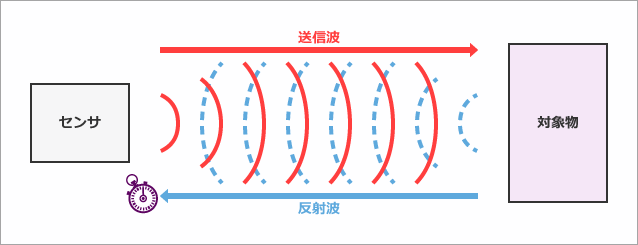

# 超音波センサーを使ってみよう！

## 超音波センサーで距離を測ってみよう！


### このレッスンで身につける力

- [ ] ブレッドボードに超音波センサーを使った回路を作ることができる
- [ ] 超音波センサの仕組みを大まかに理解する
- [ ] サンプルコードを実行できる
- [ ] サンプルコードを改造して人感センサを作ることができる

---

### ミッションの準備

- [ ] Osoyoo UNO Board x1
- [ ] 超音波センサーHC-SR04 x1
- [ ] ブレッドボード x1
- [ ] ジャンパー線
- [ ] USBケーブル x1
- [ ] パソコン x1

---
## ミッションチャレンジ

### 超音波センサをArduinoにつなごう！

配線図：


- [ ] 回路が作れたらチェック！

---

### 超音波センサで測った距離をシリアルモニタに表示しよう！

ArduinoIDEを開き，ファイル→名前を付けて保存をクリックして，「name_lesson_15_1」という名前で保存しましょう．

スケッチに以下のコードをコピー＆ペーストして，スケッチを実行してみよう．


``` C++
#define echoPin 2
#define trigPin 3

void setup() {
  Serial.begin (9600);
  pinMode(trigPin, OUTPUT);
  pinMode(echoPin, INPUT);
}

void loop() {
  float duration, distance;
  digitalWrite(trigPin, LOW);
  delayMicroseconds(2);

  digitalWrite(trigPin, HIGH);
  delayMicroseconds(10);
  digitalWrite(trigPin, LOW);

  duration = pulseIn(echoPin, HIGH);
  distance = (duration / 2) * 0.0344;

  if (distance >= 400 || distance <= 2) {
    Serial.print("Distance = ");
    Serial.println("Out of range");
  }
  else {
    Serial.print("Distance = ");
    Serial.print(distance);
    Serial.println(" cm");
  }
  delay(10);
}
```

上のプログラムをコピーして実行し，シリアルモニタを開こう！


- [ ] シリアルモニタに上の画像のような表示が出たらチェック！

---

### 超音波センサとは？

ここで，超音波センサの仕組みについて簡単に説明するよ．

「超音波」とは，人間には聞こえない高さの音のことで，音は空気中を波として伝わっていくよ．

超音波を対象物に向かって出すと，対象物に当たってセンサーに返ってくるよ．超音波を出してから返ってくるまでに少しだけ時間がかかるよ．

例えば，音は**1秒で340m**くらい進むから，340m先に対象物があったら，返ってくるまでに往復で2秒かかるよ．


**返ってくるまでにかかった時間から，対象物がどのくらい遠くにあるかを計算できるよ．これが超音波センサの簡単な仕組みだよ．**

実際にはセンサから出てくる信号を使いやすい単位（cmなど）に直して表示したりするよ．

今回のプログラムだと,

変数「duration」がセンサが測った超音波が返ってくるまでの時間,

変数「distance」がdurationの値を距離(cm)に直しているよ.



---

### 超音波センサとLEDを組み合わせて人感センサを作ろう！

先ほどの回路を改造して，10cm以内に障害物があることを検知したらLEDが点灯する人感センサを作ろう！


配線図：


- [ ] 回路が作れたらチェック！

ArduinoIDEを開き，ファイル→名前を付けて保存をクリックして，「name_lesson_15_2」という名前で保存しましょう．

スケッチに以下のコードをコピー＆ペーストして，スケッチを実行してみよう．

``` C++
#define echoPin 2
#define trigPin 3
#define LEDPin 9

void setup() {
  Serial.begin (9600);
  pinMode(trigPin, OUTPUT);
  pinMode(echoPin, INPUT);
  pinMode(LEDPin, OUTPUT);

}

void loop() {
  float duration, distance;
  digitalWrite(trigPin, LOW);
  delayMicroseconds(2);

  digitalWrite(trigPin, HIGH);
  delayMicroseconds(10);
  digitalWrite(trigPin, LOW);

  duration = pulseIn(echoPin, HIGH);
  distance = (duration / 2) * 0.0344;

  Serial.print("Distance = ");
  Serial.print(distance);
  Serial.println(" cm");

  if (distance < 10) {
    digitalWrite(LEDPin, HIGH);
  }
  else {
    digitalWrite(LEDPin, LOW);
  }
  delay(10);
}
```

- [ ] 超音波センサで測定した距離に応じてLEDが光ったらチェック！


---
### 超音波センサで測定した距離に応じてLEDの明るさを変えよう！

ArduinoIDEを開き，ファイル→名前を付けて保存をクリックして，「name_lesson_15_3」という名前で保存しましょう．

スケッチに以下のコードをコピー＆ペーストして，スケッチを実行してみよう．

``` C++
#define echoPin 2
#define trigPin 3
#define LEDPin 9

void setup() {
  Serial.begin (9600);
  pinMode(trigPin, OUTPUT);
  pinMode(echoPin, INPUT);
  pinMode(LEDPin, OUTPUT);

}

void loop() {
  float duration, distance;
  digitalWrite(trigPin, LOW);
  delayMicroseconds(2);

  digitalWrite(trigPin, HIGH);
  delayMicroseconds(10);
  digitalWrite(trigPin, LOW);

  duration = pulseIn(echoPin, HIGH);
  distance = (duration / 2) * 0.0344;

  Serial.print("Distance = ");
  Serial.print(distance);
  Serial.println(" cm");

  float duty=map(distance,0,180,0,255);
  
  analogWrite(LEDPin, duty);
  delay(10);
}
```

- [ ] このようにLEDの明るさが変化したらチェック！


---
### map関数とは？

変数「duty」で使われているmap関数について説明していくよ.

map関数とは,数値のある範囲を別の範囲に対応させて変換する関数だよ.

例えば「0～10」の範囲で取られた5という値を,「0～100」の範囲に変換すると50になるよ.

lesson_15_3のプログラム

``` C++
  float duty=map(distance,0,180,0,255);
```
の場合、

変数「duty」は,0～180の範囲で取られている変数「distance」を0～255の範囲に変換しているよ.

map関数を使うことで,距離とLEDの明るさを対応させることができるようになったよ.

---
### まとめ

- 超音波センサは，返ってくるまでにかかった時間から，対象物がどのくらい遠くにあるかを計算できる
- 実際にはセンサから出てくる信号を使いやすい単位（cmなど）に直す．

---

#### 出来たことをチェックしよう
- [ ] ブレッドボードに超音波センサーを使った回路を作ることができる
- [ ] 超音波センサの仕組みを大まかに理解する
- [ ] サンプルコードを実行できる
- [ ] サンプルコードを改造して人感センサを作ることができる
