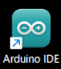
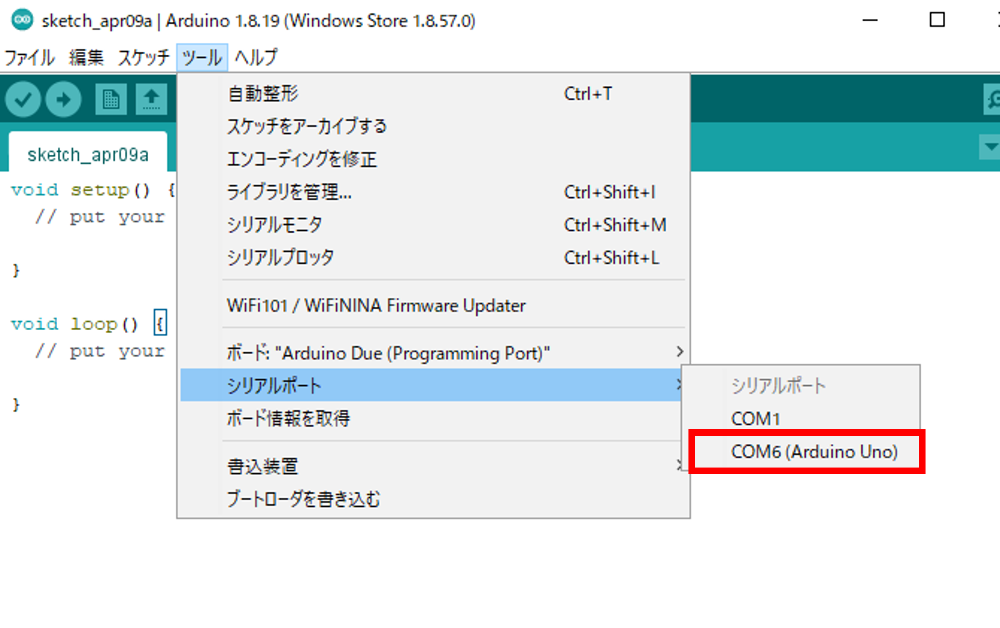
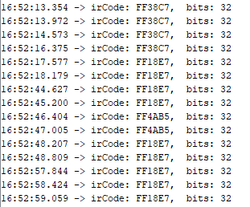

# リモコンでサーボモーターを動かそう！

## リモコンを使ってサーボモーターを制御する


### このレッスンで身につける力

- [ ] ブレッドボードにサーボモーターと赤外線受信モジュールを使った回路を作ることが出来る
- [ ] サンプルコードを実行できる
- [ ] サンプルコードを改造して（工夫できる課題）

---

### ミッションの準備

- [ ] Osoyoo UNO Board x1
- [ ] 赤外線受信機 x1
- [ ] リモートコントローラー x1
- [ ] SG90サーボモーター x1
- [ ] ブレッドボード x1
- [ ] ジャンパー線
- [ ] USBケーブル x1
- [ ] パソコン x1


#### 0.ハードウェアを用意しよう

- [ ] Osoyoo UNO Board（ Arduino UNO rev.3と完全互換）x 1
- [ ] USBケーブルx 1
- [ ] パソコン x 1

#### 1.ArduinoIDEを起動しよう（復習）

デスクトップにあるAruduinoのアイコンをダブルクリックしてArduinoIDEを起動しましょう．



#### 2.スケッチを保存しよう（復習）

(Arduinoでは，プログラムのことを「スケッチ」といいます．)

ファイル→保存をクリック（Ctrl+SでもOK）して，デスクトップに「lesson_16_1」という名前で保存しましょう．


#### 3.Arduinoとパソコンを接続しよう（復習）

Arduino UNOボードとパソコンをUSBケーブルでつなぎましょう．


【注意】USBを抜き差しするときは向きを確認して，ていねいにあつかうこと．

USBを差したら，ArduinoIDEでポートを指定しましょう．

ツール→シリアルポートをクリックして，「COM～（Arduino UNO）」となっているものをクリックしましょう．（COM～の数字は毎回変わります．）




---
## ミッションチャレンジ

### 赤外線受信機とサーボモーターをArduinoにつなごう！

配線図：


- [ ] 回路が作れたらチェック！

---


### リモコンからの信号をシリアルモニタに表示しよう！

ArduinoIDEを開き，ファイル→名前を付けて保存をクリックして，「lesson_16_1」という名前で保存しましょう．

スケッチに以下のコードをコピー＆ペーストして，スケッチを実行してみよう．


``` C++
#include <IRremote.h>  // IRRemote.hの関数を使用する
const int irReceiverPin = 3;  ///受信モジュールのSIGはpin2
IRrecv irrecv(irReceiverPin); //IRrecvタイプの変数を作成します
decode_results results;    // 結果

void setup()
{
  Serial.begin(9600);    //シリアルを初期化し、ボーレートは9600に設定する
  irrecv.enableIRIn();   // 赤外線受信機モジュールを有効にする
}

void loop() 
{
  if (irrecv.decode(&results)) //赤外線受信機モジュールの受信データ
  {  
    Serial.print("irCode: ");    //irCode："の値を送信する 
    Serial.print(results.value, HEX); //シリアルに値を出力する
    Serial.print(",  bits: ");  //bitsを送信する         
    Serial.println(results.bits); //bitsを結果に出力する
    irrecv.resume();    // 次の値を受取る
  }  
  delay(600); //600ミリ秒待機
}
```

上のプログラムをコピーして実行し，シリアルモニタを開こう！
**リモコンを押すと何が起こるかな？**



- [ ] シリアルモニタに上の画像のような表示が出たらチェック！


---

### 障害物センサーの感度を調整しよう

回路につないだまま，プラスドライバーで障害物センサーのネジをまわしてみよう！ネジを回す方向によって反応する距離がどのように変化するかな？


- [ ] ネジを回して反応距離が変化することが確認出来たらチェック！

---
### ちょうど10cmでブザーが鳴る人感センサーを作ろう！

ArduinoIDEを開き，ファイル→名前を付けて保存をクリックして，「lesson_11_2」という名前で保存しましょう．

スケッチに以下のコードをコピー＆ペーストして，スケッチを実行してみよう．

``` C++
int LEDPin = 13;  //LEDピンを13番に設定
int buzzerPin = 3;  //3番ピンをブザーに接続
int isObstaclePin = 2;  // 2番ピンを赤外線センサーに接続
int isObstacle = HIGH;  // 障害物が無い場合

void setup() {
  pinMode(buzzerPin, OUTPUT);
  pinMode(isObstaclePin, INPUT);
  pinMode(LEDPin, OUTPUT);
  Serial.begin(9600);
}

void loop() {
  isObstacle = digitalRead(isObstaclePin);
  if (isObstacle == LOW)  //障害物がある場合
  {
    Serial.println("OBSTACLE!!, OBSTACLE!!"); //Obstacleは「障害物」の意味
    digitalWrite(LEDPin, HIGH); //LEDをON
    digitalWrite(buzzerPin, LOW); //ブザーをON
  }
  else  //障害物がない場合
  {
    Serial.println("clear");
    digitalWrite(LEDPin, LOW); //LEDをOFF
    digitalWrite(buzzerPin, HIGH); //ブザーをOFF
  }
  delay(200);
}

```


**定規などを使って，反応する距離を10cmになるように調整しよう！**


- [ ] ちょうど10cmでブザーが鳴ったらチェック！

---
### まとめ
- 内蔵LEDは13番（`LEDPin = 13`で指定できる）
- 障害物センサーは`digitalRead(isObstaclePin);`で読み取る
- 障害物センサーはネジを回すことで反応距離を調整できる


---

#### 出来たことをチェックしよう

- [ ] ブレッドボードを使って障害物センサーとブザーの入った回路を作成できる
- [ ] 障害物センサーの感度を調整できる
- [ ] サンプルコードを実行できる
- [ ] 10cmでブザーが鳴る人感センサーを作ることができる
