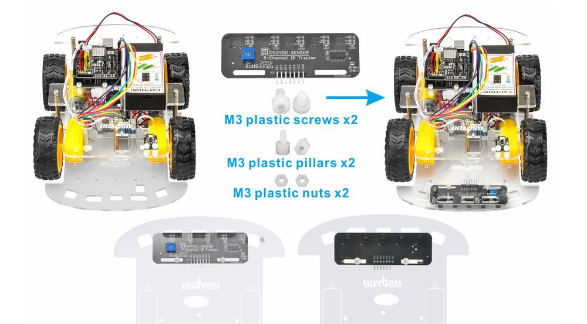
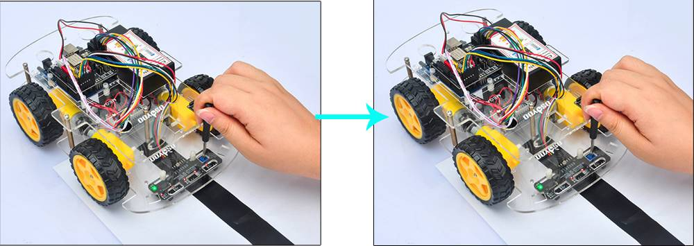

# ライントラッキングをやってみよう！

## 障害物センサーを使って物体追従を行う

### このレッスンで身につける力

- [ ] トラッキングセンサーを正しく取り付けられる
- [ ] ジャンパーワイヤーを正しく接続出来る
- [ ] トラッキングセンサーの感度を調整できる
- [ ] サンプルコードを実行できる
- [ ] 条件式(and or)の書き方を理解してコードを修正できる
- [ ] コースを走破するためにサンプルコードを修正できる

---
### ミッションの準備
- [ ] Osoyoo UNO Board x 1
- [ ] 赤外線コントローラー
- [ ] トラッキングセンサーモジュール
- [ ] アクティブブザーモジュールx 1
- [ ] F/Mジャンパー
- [ ] USBケーブルx 1
- [ ] パソコン x 1


---

### ブレッドボードで試してみよう！（事前実験）

ロボットに取り付ける前に、ブレッドボードでトラッキングセンサーの動きを確かめよう。

#### ブレッドボード実験の配線

| トラッキングセンサーのピン | Arduinoのピン |
|---|---|
| VCC | 5V |
| GND | GND |
| IR1 | A0 |
| IR2 | A1 |
| IR3 | A2 |
| IR4 | A3 |
| IR5 | A4 |

#### センサー値を読み取るコード

```C++
#define ir1 A0
#define ir2 A1
#define ir3 A2
#define ir4 A3
#define ir5 A4

void setup() {
  pinMode(ir1, INPUT);
  pinMode(ir2, INPUT);
  pinMode(ir3, INPUT);
  pinMode(ir4, INPUT);
  pinMode(ir5, INPUT);
  Serial.begin(9600);
  Serial.println("センサー値を表示します（黒=0, 白=1）");
}

void loop() {
  int s1 = digitalRead(ir1);
  int s2 = digitalRead(ir2);
  int s3 = digitalRead(ir3);
  int s4 = digitalRead(ir4);
  int s5 = digitalRead(ir5);

  // 反転して表示（0→黒線あり、1→白で検出なし）
  Serial.print(!s1);
  Serial.print(!s2);
  Serial.print(!s3);
  Serial.print(!s4);
  Serial.println(!s5);

  delay(200);
}
```

**確認すること**：
1. シリアルモニタを開く（9600bps）
2. センサーを白い紙の上に置くと → `00000`（すべて0）
3. 黒いテープに重ねると → 黒線上のセンサーが `1` になる

> センサーの感度調整は、センサー上のポテンショメーター（可変抵抗）をドライバーで回して調整しよう。黒線の上でLEDが点灯し、白の上で消灯するように合わせる。

- [ ] シリアルモニタでセンサー値の変化が確認できたらチェック！

---

### ミッションチャレンジ
今回のレッスンではこの線上を自動で走破してもらうよ！


#### トラッキングセンサーを正しく取り付けられる


2個のM3プラスチックネジ、プラスチックピラー、およびプラスチックナットを使用して、追跡センサーモジュールを下部シャーシの下面側に取り付けます。

近くで見るとこんな感じだよ．


裏側から見るとこんな感じだよ．


- [ ] トラッキングセンサーを正しく取り付けられる

---
#### ジャンパーワイヤーを正しく接続出来る
トラッキングセンサーモジュールのGNDとVCCピンをOSOYOO UartWiFiシールドV1.3のボードGNDと5Vにそれぞれ接続します.

下の図に示すように、IR1、IR2、IR3、IR4、IR5ピンをA0、A1、A2、A3、A4に7ピン25cmメス-メスケーブルで接続します.


- [ ] ジャンパーワイヤーを正しく接続出来る

---
#### サンプルコードを実行できる
スケッチに以下のコードをコピー＆ペーストして、スケッチを実行してみよう。

> `motor_driver.h` をスケッチフォルダにコピーしておくこと。

```C++
#include "motor_driver.h"  // 標準モーター制御ライブラリ（ENA=D3, ENB=D6 など）

// 5チャンネルラインセンサーの接続ピン（A0〜A4）
#define ir1 A0  // 左端センサー
#define ir2 A1  // 左センサー
#define ir3 A2  // 中央センサー
#define ir4 A3  // 右センサー
#define ir5 A4  // 右端センサー

void setup() {
  init_GPIO();  // モーターピンを初期化

  // ラインセンサーの初期設定
  pinMode(ir1, INPUT);
  pinMode(ir2, INPUT);
  pinMode(ir3, INPUT);
  pinMode(ir4, INPUT);
  pinMode(ir5, INPUT);

  Serial.begin(9600);
}

void loop() {
  // 各センサーの値を読み取る（0=黒線あり、1=黒線なし）
  int s1 = digitalRead(ir1);  // 左端
  int s2 = digitalRead(ir2);  // 左
  int s3 = digitalRead(ir3);  // 中央
  int s4 = digitalRead(ir4);  // 右
  int s5 = digitalRead(ir5);  // 右端

  // シリアルモニターに表示（!で黒=1、白=0 と読みやすく反転）
  Serial.print(!s1);
  Serial.print(!s2);
  Serial.print(!s3);
  Serial.print(!s4);
  Serial.println(!s5);

  // 中央センサーだけが黒線を検出 → 直進
  if ((s1 == 1) && (s2 == 1) && (s3 == 0) && (s4 == 1) && (s5 == 1))
  {
    go_Advance(120);
  }

  // 左センサーだけが黒線を検出 → 左に曲がる
  else if ((s1 == 1) && (s2 == 0) && (s3 == 1) && (s4 == 1) && (s5 == 1))
  {
    set_Motorspeed(150, 0);  // 左モーター走行・右モーター停止
    go_Left();
  }

  // 左端センサーだけが黒線を検出 → 大きく左に曲がる
  else if ((s1 == 0) && (s2 == 1) && (s3 == 1) && (s4 == 1) && (s5 == 1))
  {
    set_Motorspeed(180, 0);
    go_Left();
  }

  // 右センサーだけが黒線を検出 → 右に曲がる
  else if ((s1 == 1) && (s2 == 1) && (s3 == 1) && (s4 == 0) && (s5 == 1))
  {
    set_Motorspeed(0, 150);  // 左モーター停止・右モーター走行
    go_Right();
  }

  // 右端センサーだけが黒線を検出 → 大きく右に曲がる
  else if ((s1 == 1) && (s2 == 1) && (s3 == 1) && (s4 == 1) && (s5 == 0))
  {
    set_Motorspeed(0, 180);
    go_Right();
  }

  // 中央＋右センサーが黒線を検出 → 右に曲がる
  else if ((s1 == 1) && (s2 == 1) && (s3 == 0) && (s4 == 0) && (s5 == 1))
  {
    set_Motorspeed(0, 150);
    go_Right();
  }

  // 中央＋左センサーが黒線を検出 → 左に曲がる
  else if ((s1 == 1) && (s2 == 0) && (s3 == 0) && (s4 == 1) && (s5 == 1))
  {
    set_Motorspeed(150, 0);
    go_Left();
  }

  // 左3つのセンサーが黒線を検出 → 左に曲がる
  else if ((s1 == 0) && (s2 == 0) && (s3 == 0) && (s4 == 1) && (s5 == 1))
  {
    set_Motorspeed(150, 0);
    go_Left();
  }

  // 右3つのセンサーが黒線を検出 → 右に曲がる
  else if ((s1 == 1) && (s2 == 1) && (s3 == 0) && (s4 == 0) && (s5 == 0))
  {
    set_Motorspeed(0, 150);
    go_Right();
  }

  // すべてのセンサーが黒線上 → 停止
  else if ((s1 == 0) && (s2 == 0) && (s3 == 0) && (s4 == 0) && (s5 == 0))
  {
    stop_Stop();
  }
}
```


- [ ] サンプルコードを実行できる

---
#### トラッキングセンサーの感度を調整できる
トラッキングセンサーモジュールの感度を調整します．

車の電源をオンにして、フィリップスのドライバーでトラッキングセンサーのポテンショメーターを調整して、一番よい感度の状態にします．

信号はトラックの上にある黒いトラックの上にいる時にLEDライトが点灯し、センサーが白いトラックの上にあるときに消灯する様に調整します．



- [ ] トラッキングセンサーの感度を調整できる


---
#### 条件式(and or)の書き方を理解してコードを修正できる
先ほどサンプルコードをコピー&ペーストしてもらったコードの中身を見てみよう！

```C++
  // 中央センサーだけが黒線を検出 → 直進
  if ((s1 == 1) && (s2 == 1) && (s3 == 0) && (s4 == 1) && (s5 == 1))
  {
    go_Advance(120);  // スピード120で前進
  }
```

このようなコードの中に
```C++
&&
```
がたくさんあるのが確認できるかな？
この記号の意味は次の例を見て理解していこう！
```C++
5 && 7
```
この文の意味は「5かつ7」という意味になります．

要は5と7どちらの条件も満たしているという意味になります．

このコードと似たような意味で
```C++
||
```
という記号もあるよ．

例を示すよ．
```C++
5 || 7
```
この文の意味は「5または7」という意味になります．

要は5と7どちらかの条件を満たしているという意味になります．

上記のサンプルコードをもう一度確認してみよう！
```C++
  // 中央センサーだけが黒線を検出 → 直進
  if ((s1 == 1) && (s2 == 1) && (s3 == 0) && (s4 == 1) && (s5 == 1))
  {
    go_Advance(120);  // スピード120で前進
  }
```

このコードの意味は

センサ１が黒線の上にいないかつ

センサ２が黒線の上にいないかつ

センサ３が黒線の上にいるかつ

センサ４が黒線の上にいないかつ

センサ５が黒線の上にいないとき

```C++
    go_Advance(120);  // スピード120で前進
```
この処理が実行されるという意味です．

要するに，

「センサ３だけが黒線の上にいるときにロボットが前進する」

という意味と同じです．


- [ ] 条件式(and or)の書き方を理解してコードを修正できる


---
#### コースを走破するためにサンプルコードを修正できる

このコースを走破してみよう．


カーブの部分の走行の速度調整をできるかな？


- [ ] コースを走破するためにサンプルコードを修正できる

---
### まとめ

```C++
5 && 7
```
この文の意味は「5かつ7」という意味になります．

要は5と7どちらの条件も満たしているという意味になります

```C++
5 || 7
```
この文の意味は「5または7」という意味になります．

要は5と7どちらかの条件を満たしているという意味になります．

---
#### 出来たことをチェックしよう

- [ ] トラッキングセンサーを正しく取り付けられる
- [ ] ジャンパーワイヤーを正しく接続出来る
- [ ] トラッキングセンサーの感度を調整できる
- [ ] サンプルコードを実行できる
- [ ] 条件式(and or)の書き方を理解してコードを修正できる
- [ ] コースを走破するためにサンプルコードを修正できる