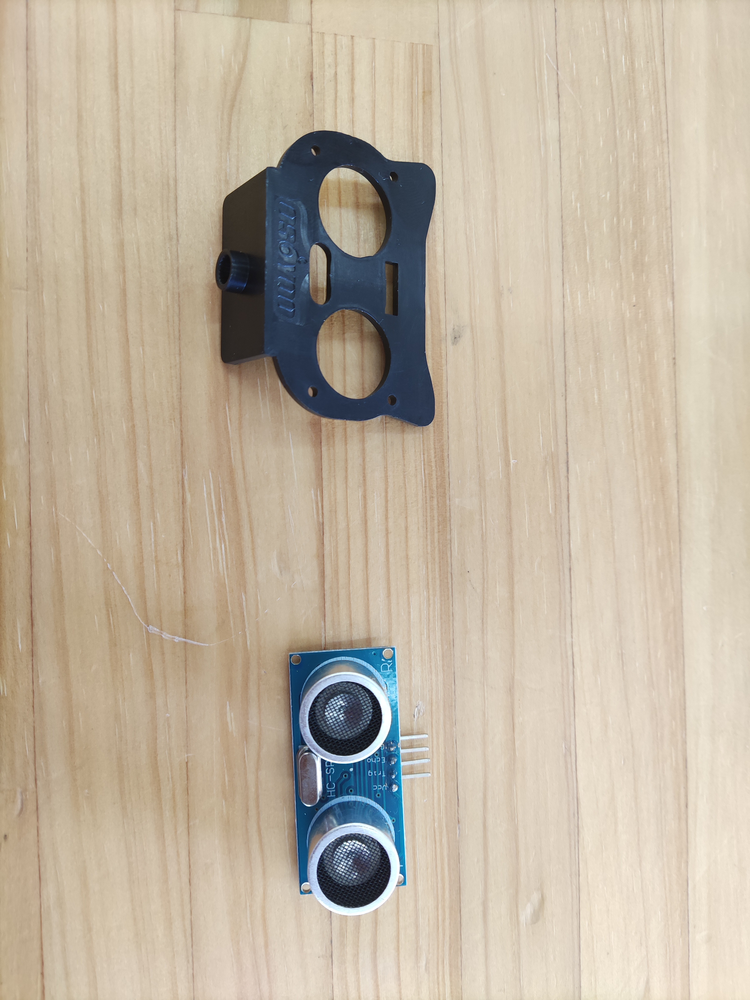
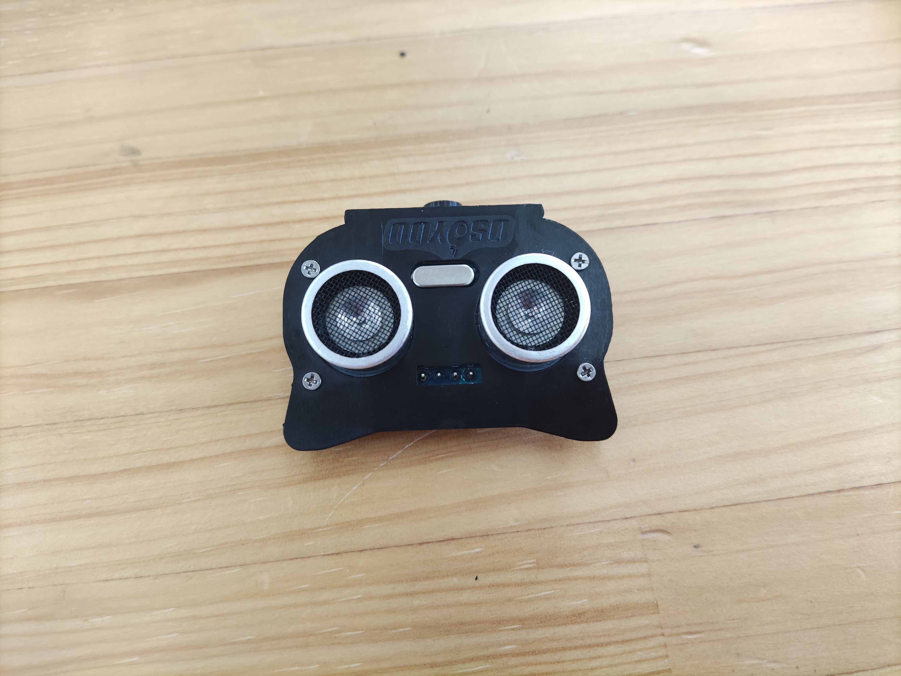
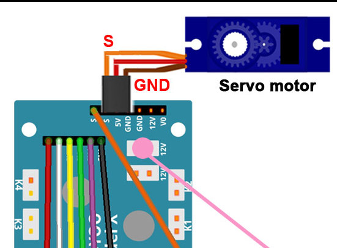
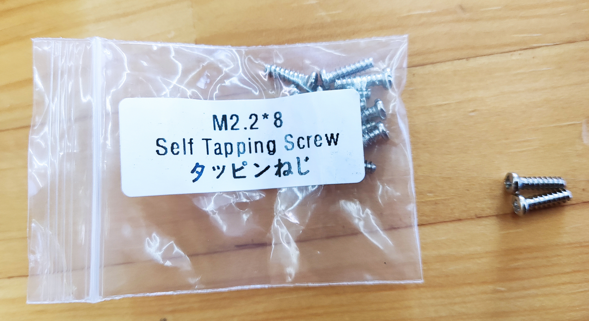
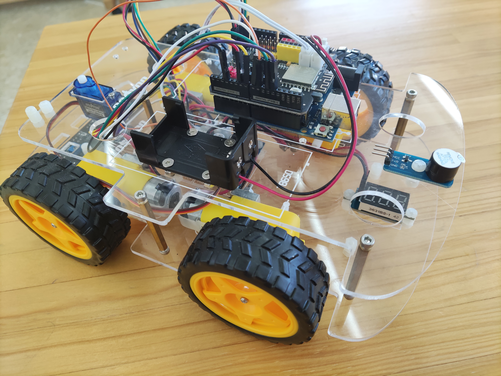
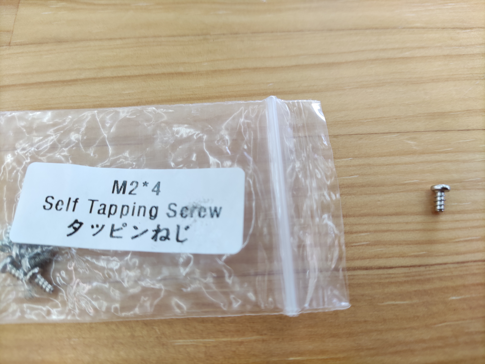
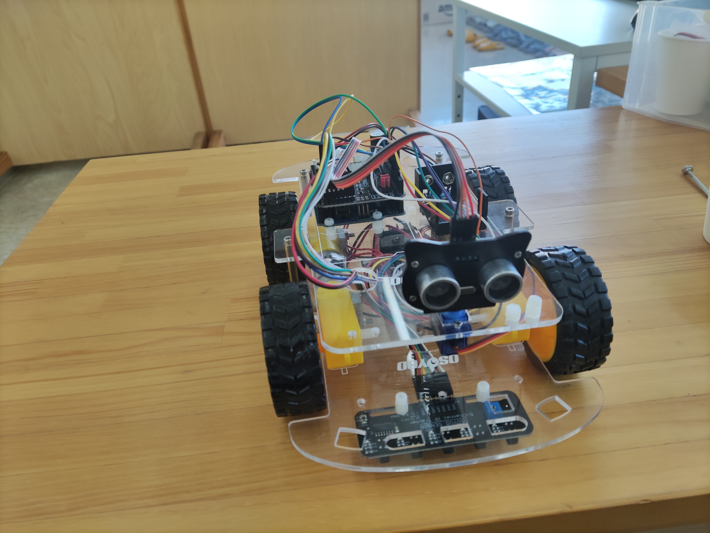
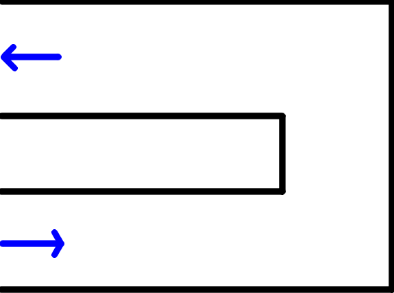

# レッスン17 迷路チャレンジ！(2)

## ロボットの超音波センサを工夫して決められた迷路をクリアしよう！

### このレッスンで身につける力

- [ ] 超音波センサを正しく取り付けることができる
- [ ] ジャンパーワイヤーを正しく接続できる
- [ ] トラッキングセンサの感度を調整できる
- [ ] サンプルコードを実行できる
- [ ] 条件式の書き方を理解してコードを修正できる
- [ ] コースを走破するためにサンプルコードを修正できる

---

### ミッションの準備

#### 0.必要なハードウェアを用意しよう
- [ ] Osoyoo ロボット(Arduino UNO rev.3と完全互換) x 1
- [ ] USBケーブル x 1
- [ ] パソコン x 1
- [ ] 超音波センサ x 1
- [ ] サーボモータ x 1
- [ ] 取り付け用ねじなど
---
#### 1.ハードウェアを取り付けよう
##### ジャンパーピンを取り外そう
以前のレッスンで使ったジャンパーピンは一度すべて取り外します。

##### 超音波センサーとホルダーを取り付ける

M1.4*8ネジとナットを使ってホルダーと超音波センサーを固定します。ねじとナットが小さいので注意しよう。


##### 上シャーシを外してモータードライバーとサーボモーターをつなげよう
1. 上シャーシを外します。
2. 下シャーシのモータードライバーとサーボモーターのジャンパーワイヤーを取り付けます。
3. モータードライバーからジャンパー線を一本出しておきます。

#### サーボモーターを上シャーシに取り付けよう



##### ブザーを取り付けよう


##### ジャンパーピンを取り付けよう
下の図を見ながらジャンパーピンを取り付ける。


##### 超音波ホルダーをサーボモータに取り付けよう


後で、ホルダーの位置を調整するのでここでは仮止めでとどめておく。

#### 2.ホルダーの位置を調整しよう
サーボモーターはどのくらい回転しているかを記憶して、正確に回転位置を出せるモーターです。なのではじめの位置を調整する必要があります。

サーボモーターは壊れやすいので、**無理やり手で回してしまうと簡単に壊れてしまいます。絶対にやめましょう。**

##### サンプルスケッチを実行してみる
調整するために、スケッチに以下のコードをコピー＆ペーストして、スケッチを実行してみましょう。超音波センサーが変なところを向いてしまうかもしれません。これを調整します。

```C++

#include <Servo.h>
/*ロードするライブラリがないため、L298NデュアルH-ブリッジモーターコントローラを直接宣言します。*/
//L298N デュアル H ブリッジ モーター コントローラー ピンの定義
#define speedPinR 3   // 右側PWM ピン接続 MODEL-X ENA
#define RightDirectPin1  12    //  右側モーター方向ピン 1 から MODEL-X IN1
#define RightDirectPin2  11    // 右側モーター方向ピン 2 から MODEL-X IN1
#define speedPinL 6        //  左側PWM ピン接続 MODEL-X ENB
#define LeftDirectPin1  7    // 左モーター方向ピン 1 から MODEL-X IN3
#define LeftDirectPin2  8   // 左モーター方向ピン 2 から MODEL-X IN4
#define LPT 2 // スキャンループカウンター(ループを数える)

#define SERVO_PIN     9  //サーボをD9に接続

#define Echo_PIN    2 // 超音波エコーピンを D11 に接続
#define Trig_PIN    10  // 超音波トリガーピンを D12 に接続

#define BUZZ_PIN     13
#define FAST_SPEED  250     //速いモーター速度
#define SPEED  120     //モーター速度
#define TURN_SPEED  200     //曲がるときのモーター速度 
#define BACK_SPEED1  255     //後退時のモーター速度1
#define BACK_SPEED2  90     //後退時のモーター速度2

int leftscanval, centerscanval, rightscanval, ldiagonalscanval, rdiagonalscanval;
const int distancelimit = 30; //前方障害物の距離制限           
const int sidedistancelimit = 30; //両側の障害物までの最小距離 (cm) (車は横方向の短い距離を許容します)
int distance;
int numcycles = 0;
const int turntime = 250; //ロボットが曲がるのに費やした時間 (ミリ秒)
const int backtime = 300; //ロボットが後退に費やした時間 (ミリ秒)

int thereis;
Servo head;
/*モーター制御*/
void go_Advance(void)  //前進
{
  digitalWrite(RightDirectPin1, HIGH);
  digitalWrite(RightDirectPin2,LOW);
  digitalWrite(LeftDirectPin1,HIGH);
  digitalWrite(LeftDirectPin2,LOW);
}
void go_Left()  //
{
  digitalWrite(RightDirectPin1, HIGH);
  digitalWrite(RightDirectPin2,LOW);
  digitalWrite(LeftDirectPin1,LOW);
  digitalWrite(LeftDirectPin2,HIGH);
}
void go_Right()  //右に曲がる
{
  digitalWrite(RightDirectPin1, LOW);
  digitalWrite(RightDirectPin2,HIGH);
  digitalWrite(LeftDirectPin1,HIGH);
  digitalWrite(LeftDirectPin2,LOW);
}
void go_Back()  //後退
{
  digitalWrite(RightDirectPin1, LOW);
  digitalWrite(RightDirectPin2,HIGH);
  digitalWrite(LeftDirectPin1,LOW);
  digitalWrite(LeftDirectPin2,HIGH);
}
void stop_Stop()    //停止
{
  digitalWrite(RightDirectPin1, LOW);
  digitalWrite(RightDirectPin2,LOW);
  digitalWrite(LeftDirectPin1,LOW);
  digitalWrite(LeftDirectPin2,LOW);
  set_Motorspeed(0,0);
}

/*モーター速度の設定*/
void set_Motorspeed(int speed_L,int speed_R)
{
  analogWrite(speedPinL,speed_L); 
  analogWrite(speedPinR,speed_R);   
}

void buzz_ON()   //ブザーを鳴らす
{
  
  for(int i=0;i<100;i++)
  {
   digitalWrite(BUZZ_PIN,LOW);
   delay(2);//wait for 1ms
   digitalWrite(BUZZ_PIN,HIGH);
   delay(2);//wait for 1ms
  }
}

void atention()   //ブザーを鳴らす
{
   for(int i=0;i<3;i++)
  {
   digitalWrite(BUZZ_PIN,LOW);
   delay(200);//wait for 1ms
   digitalWrite(BUZZ_PIN,HIGH);
   delay(200);//wait for 1ms
  }
}

void buzz_OFF()  //ブザーを止める
{
  digitalWrite(BUZZ_PIN, HIGH);
  
}
void alarm(){
   buzz_ON();
 
   buzz_OFF();
}

/*超音波距離の検出*/
int watch(){
  long echo_distance;
  digitalWrite(Trig_PIN,LOW);
  delayMicroseconds(5);                                                                              
  digitalWrite(Trig_PIN,HIGH);
  delayMicroseconds(15);
  digitalWrite(Trig_PIN,LOW);
  echo_distance=pulseIn(Echo_PIN,HIGH);
  echo_distance=echo_distance*0.01657; //物体までの距離は何cmか？
  //Serial.println((int)echo_distance);
  return round(echo_distance);
}
//右、左、前、左対角線、右対角線までの距離を測定し、cm 単位で変数 rightscanval に割り当てます。
//leftscanval、centerscanval、ldiagonalscanval、rdiagonalscanval (距離のテストには 5 つのポイントがあります)
String watchsurrounding(){
/*  Failure_status は 2 進数の整数で、下 5 桁は 5 方向に障害物があるかどうかを表します。　*/
 
int obstacle_status =B100000;
  centerscanval = watch();
  if(centerscanval<distancelimit){
    stop_Stop();
    alarm();
    obstacle_status  =obstacle_status | B100;
    }
  head.write(120);
  delay(100);
  ldiagonalscanval = watch();
  if(ldiagonalscanval<distancelimit){
    stop_Stop();
    alarm();
     obstacle_status  =obstacle_status | B1000;
    }
  head.write(170); //注：サーボはこの角度を取ることができないため、180 度を使用しませんでした
  delay(300);
  leftscanval = watch();
  if(leftscanval<sidedistancelimit){
    stop_Stop();
    alarm();
     obstacle_status  =obstacle_status | B10000;
    }

  head.write(90); //サーボを 180 度全体に動かす場合は、90 度を使用します。
  delay(100);
  centerscanval = watch();
  if(centerscanval<distancelimit){
    stop_Stop();
    alarm();
    obstacle_status  =obstacle_status | B100;
    }
  head.write(40);
  delay(100);
  rdiagonalscanval = watch();
  if(rdiagonalscanval<distancelimit){
    stop_Stop();
    alarm();
    obstacle_status  =obstacle_status | B10;
    }
  head.write(0);
  delay(100);
  rightscanval = watch();
  if(rightscanval<sidedistancelimit){
    stop_Stop();
    alarm();
    obstacle_status  =obstacle_status | 1;
    }
  head.write(90); //見回し終える(また前を向く)
  delay(300);
   String obstacle_str= String(obstacle_status,BIN);
  obstacle_str= obstacle_str.substring(1,6);
  
  return obstacle_str; 
}

void auto_avoidance(){//障害物を感知して回避する

  ++numcycles;
  if(numcycles>=LPT){ //前進中にすべてのLPTループの周りに何かがあるかどうかを確認します
     stop_Stop();
    String obstacle_sign=watchsurrounding(); //5桁のobject_signバイナリ値は、5方向の障害ステータスを意味します
      Serial.print("begin str=");
        Serial.println(obstacle_sign);
                    if( obstacle_sign=="10000"){
     Serial.println("SLIT right");
          set_Motorspeed(FAST_SPEED,SPEED);
     go_Advance();
 
      delay(turntime);
      stop_Stop();
    }
        else    if( obstacle_sign=="00001"  ){
     Serial.println("SLIT LEFT");
       set_Motorspeed(SPEED,FAST_SPEED);
      go_Advance();
  
      delay(turntime);
      stop_Stop();
    }
    else if( obstacle_sign=="11100" || obstacle_sign=="01000" || obstacle_sign=="11000"  || obstacle_sign=="10100"  || obstacle_sign=="01100" ||obstacle_sign=="00100"  ||obstacle_sign=="01000" ){
     Serial.println("hand right");
      go_Right();
      set_Motorspeed(TURN_SPEED,TURN_SPEED);
      delay(turntime);
      stop_Stop();
    } 
    else if( obstacle_sign=="00010" || obstacle_sign=="00111" || obstacle_sign=="00011"  || obstacle_sign=="00101" || obstacle_sign=="00110" || obstacle_sign=="01010" ){
    Serial.println("hand left");
     go_Left();//左に曲がる
     set_Motorspeed(TURN_SPEED,TURN_SPEED);
      delay(turntime);
      stop_Stop();
    }
 
    else if(  obstacle_sign=="01111" ||  obstacle_sign=="10111" || obstacle_sign=="11111"  ){
    Serial.println("hand back right");
    go_Left();
    set_Motorspeed( FAST_SPEED,SPEED);
       delay(backtime);
          stop_Stop();
        } 
         else if( obstacle_sign=="11011"  ||    obstacle_sign=="11101"  ||  obstacle_sign=="11110"  || obstacle_sign=="01110"  ){
    Serial.println("hand back left");
    go_Right();
    set_Motorspeed( SPEED,FAST_SPEED);
       delay(backtime);
          stop_Stop();
        }    
  
        else Serial.println("no handle");
    numcycles=0; //サイクルの再開回数
  } else {
     set_Motorspeed(SPEED,SPEED);
     go_Advance();  // 何も問題がなければ、上記の go() 関数を使用して先に進みます。
        delay(backtime);
          stop_Stop();
  }
  
  //else  Serial.println(numcycles);
  
  distance = watch(); // watch() 関数を使用して、前方に何かがあるかどうかを確認します (ロボットが前進しているだけで周囲を見回していない場合、前方の距離をテストします)
  if (distance<distancelimit){ //前方に障害物があると完全に確信できる場合、ロボットは停止します (25 回テストする必要があります) (超音波センサーの誤信号を無視する必要があります)。
 Serial.println("final go back");
    go_Right();
    set_Motorspeed( SPEED,FAST_SPEED);
  delay(backtime*3/2);
      ++thereis;}
  if (distance>distancelimit){
      thereis=0;} //カウント再開
  if (thereis > 25){
  Serial.println("final stop");
    stop_Stop(); //何かが先にあるので、動きを止めてください。
    thereis=0;
  }
}

void setup() {
  /*L298N pin モードのセットアップ*/
  pinMode(RightDirectPin1, OUTPUT); 
  pinMode(RightDirectPin2, OUTPUT); 
  pinMode(speedPinL, OUTPUT);  
  pinMode(LeftDirectPin1, OUTPUT);
  pinMode(LeftDirectPin2, OUTPUT); 
  pinMode(speedPinR, OUTPUT); 
  stop_Stop();//動きを止める
  /*HC-SR04の初期化*/
  pinMode(Trig_PIN, OUTPUT); 
  pinMode(Echo_PIN,INPUT); 
  /*ブザーの初期化*/
  pinMode(BUZZ_PIN, OUTPUT);
  digitalWrite(BUZZ_PIN, HIGH);  
  buzz_OFF(); 

  delay(1000);
  atention();
  digitalWrite(Trig_PIN,LOW);
  /*サーボの初期化*/
  head.attach(SERVO_PIN); 
  head.write(90);
  /*正面を向いて3秒待機（調整用）*/
  delay(3000);
  atention();
  Serial.begin(9600);
}

void loop() {
  auto_avoidance();
}
```

##### ホルダーを一度取り外して調整する
プログラムを実行すると、ピピピという音の後に3秒サーボモーターが静止します。ここで電源を切って、ホルダーのねじを取り外して、この位置で超音波センサーが正面に向くように調整しましょう。

調整が成功するとこういう感じになります。※動画

https://www.youtube.com/embed/hYld9d5zTak?si=kk0jfPL_co6i4WDr

---
### ミッションチャレンジ
#### 迷路を解いてみよう！
今回は超音波センサーを使って迷路をクリアしてみよう!



障害物との距離（distancelimit, sidedistancelimit）やスピード、曲がる時間（turntime, backtime）などを調整して、迷路をクリアーしよう。

### まとめ
迷路をそうはできたら、このミッションはクリア。できたことをチェックしていこう。

#### 出来たことをチェックしよう
- [ ] 超音波センサを正しく取り付けることができる
- [ ] ジャンパーワイヤーを正しく接続できる
- [ ] 超音波センサーの位置を調整できる
- [ ] サンプルコードを実行できる
- [ ] コースを走破するためにサンプルコードを修正できる
