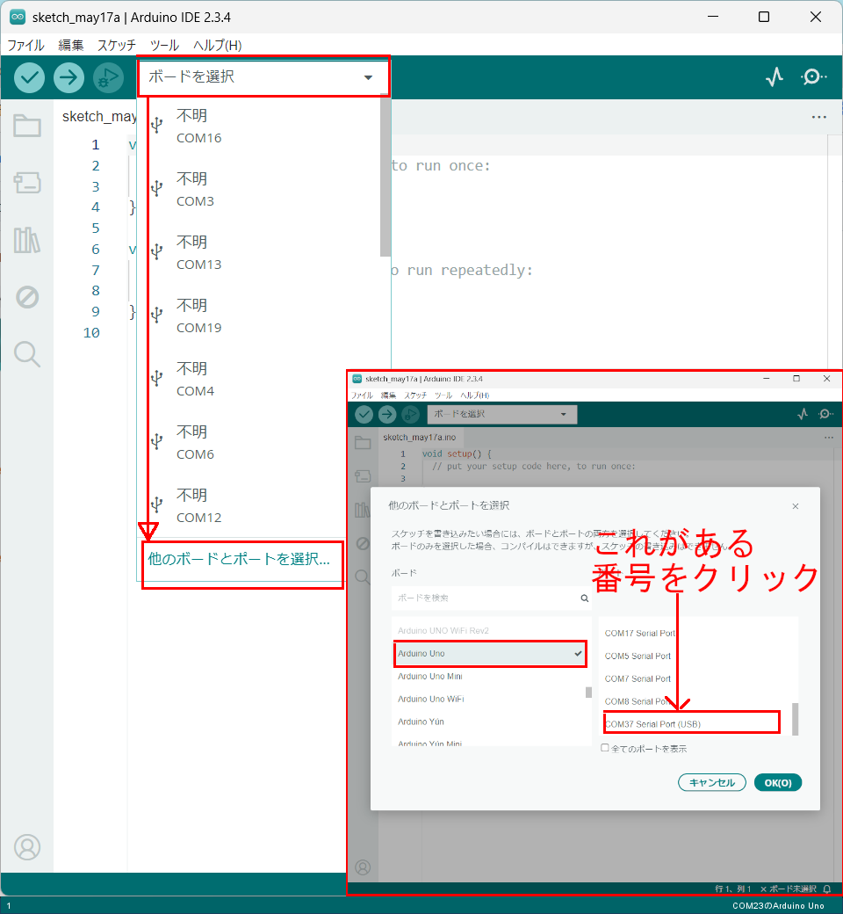

# レッスン17 迷路チャレンジ！(2)

## ロボットの超音波センサを工夫して決められた迷路をクリアしよう！

## このレッスンで身につける力

- [ ] 超音波センサを正しく取り付けることができる
- [ ] ジャンパーワイヤーを正しく接続できる
- [ ] トラッキングセンサの感度を調整できる
- [ ] サンプルコードを実行できる
- [ ] 条件式の書き方を理解してコードを修正できる
- [ ] コースを走破するためにサンプルコードを修正できる

---

## ミッションの準備

## ハードウェアを用意しよう
- [ ] Osoyoo ロボット(Arduino UNO rev.3と完全互換) x 1
- [ ] USBケーブル x 1
- [ ] パソコン x 1
- [ ] 超音波センサ x 1
- [ ] サーボモータ x 1
- [ ] 取り付け用ねじなど
---
#### 0.ArduinoIDEを起動しよう

デスクトップにあるAruduinoのアイコンをダブルクリックしてArduinoIDEを起動しましょう．


---

#### 1.スケッチを保存しよう

(Arduinoでは，プログラムのことを「スケッチ」といいます．)

ファイル→保存をクリック（Ctrl+SでもOK）して，デスクトップに「lesson_08_1」という名前で保存しましょう．


---
#### 2.Arduinoとパソコンを接続しよう

Arduino UNOボードとパソコンをUSBケーブルでつなぎましょう．


【注意】USBを抜き差しするときは向きを確認して，ていねいにあつかうこと．

USBを差したら，ArduinoIDEでボードとシリアルポートを指定しましょう．　　

ツール→ボードをクリックして、Arduino/Genuino UNOをクリックしましょう。　　

次にツール→シリアルポートをクリックして，「COM～（Arduino UNO）」となっているものをクリックしましょう．（COM～の数字は毎回変わります．）



---

## ミッションチャレンジ
### 配線をしよう
今回新たに取り付けるのはサーボモータと超音波センサだよ。これらをジャンパー線を用いて配線を行なおう！
写真と同じようにして配線をしてみよう。


### サンプルスケッチを実行して、実験してみよう
スケッチに以下のコードをコピー＆ペーストして、スケッチを実行してみよう。


```C++

#include <Servo.h>
/*Declare L298N Dual H-Bridge Motor Controller directly since there is not a library to load.*/
//Define L298N Dual H-Bridge Motor Controller Pins
#define speedPinR 3   // RIGHT PWM pin connect MODEL-X ENA
#define RightDirectPin1  12    //  Right Motor direction pin 1 to MODEL-X IN1 
#define RightDirectPin2  11    // Right Motor direction pin 2 to MODEL-X IN2
#define speedPinL 6        //  Left PWM pin connect MODEL-X ENB
#define LeftDirectPin1  7    // Left Motor direction pin 1 to MODEL-X IN3
#define LeftDirectPin2  8   ///Left Motor direction pin 1 to MODEL-X IN4
#define LPT 2 // scan loop coumter

#define SERVO_PIN     9  //servo connect to D9

#define Echo_PIN    2 // Ultrasonic Echo pin connect to D11
#define Trig_PIN    10  // Ultrasonic Trig pin connect to D12

#define BUZZ_PIN     13
#define FAST_SPEED  250     //both sides of the motor speed
#define SPEED  120     //both sides of the motor speed
#define TURN_SPEED  200     //both sides of the motor speed
#define BACK_SPEED1  255     //back speed
#define BACK_SPEED2  90     //back speed

int leftscanval, centerscanval, rightscanval, ldiagonalscanval, rdiagonalscanval;
const int distancelimit = 30; //distance limit for obstacles in front           
const int sidedistancelimit = 30; //minimum distance in cm to obstacles at both sides (the car will allow a shorter distance sideways)
int distance;
int numcycles = 0;
const int turntime = 250; //Time the robot spends turning (miliseconds)
const int backtime = 300; //Time the robot spends turning (miliseconds)

int thereis;
Servo head;
/*motor control*/
void go_Advance(void)  //Forward
{
  digitalWrite(RightDirectPin1, HIGH);
  digitalWrite(RightDirectPin2,LOW);
  digitalWrite(LeftDirectPin1,HIGH);
  digitalWrite(LeftDirectPin2,LOW);
}
void go_Left()  //Turn left
{
  digitalWrite(RightDirectPin1, HIGH);
  digitalWrite(RightDirectPin2,LOW);
  digitalWrite(LeftDirectPin1,LOW);
  digitalWrite(LeftDirectPin2,HIGH);
}
void go_Right()  //Turn right
{
  digitalWrite(RightDirectPin1, LOW);
  digitalWrite(RightDirectPin2,HIGH);
  digitalWrite(LeftDirectPin1,HIGH);
  digitalWrite(LeftDirectPin2,LOW);
}
void go_Back()  //Reverse
{
  digitalWrite(RightDirectPin1, LOW);
  digitalWrite(RightDirectPin2,HIGH);
  digitalWrite(LeftDirectPin1,LOW);
  digitalWrite(LeftDirectPin2,HIGH);
}
void stop_Stop()    //Stop
{
  digitalWrite(RightDirectPin1, LOW);
  digitalWrite(RightDirectPin2,LOW);
  digitalWrite(LeftDirectPin1,LOW);
  digitalWrite(LeftDirectPin2,LOW);
  set_Motorspeed(0,0);
}

/*set motor speed */
void set_Motorspeed(int speed_L,int speed_R)
{
  analogWrite(speedPinL,speed_L); 
  analogWrite(speedPinR,speed_R);   
}

void buzz_ON()   //open buzzer
{
  
  for(int i=0;i<100;i++)
  {
   digitalWrite(BUZZ_PIN,LOW);
   delay(2);//wait for 1ms
   digitalWrite(BUZZ_PIN,HIGH);
   delay(2);//wait for 1ms
  }
}
void buzz_OFF()  //close buzzer
{
  digitalWrite(BUZZ_PIN, HIGH);
  
}
void alarm(){
   buzz_ON();
 
   buzz_OFF();
}

/*detection of ultrasonic distance*/
int watch(){
  long echo_distance;
  digitalWrite(Trig_PIN,LOW);
  delayMicroseconds(5);                                                                              
  digitalWrite(Trig_PIN,HIGH);
  delayMicroseconds(15);
  digitalWrite(Trig_PIN,LOW);
  echo_distance=pulseIn(Echo_PIN,HIGH);
  echo_distance=echo_distance*0.01657; //how far away is the object in cm
  //Serial.println((int)echo_distance);
  return round(echo_distance);
}
//Meassures distances to the right, left, front, left diagonal, right diagonal and asign them in cm to the variables rightscanval, 
//leftscanval, centerscanval, ldiagonalscanval and rdiagonalscanval (there are 5 points for distance testing)
String watchsurrounding(){
/*  obstacle_status is a binary integer, its last 5 digits stands for if there is any obstacles in 5 directions,
 *   for example B101000 last 5 digits is 01000, which stands for Left front has obstacle, B100111 means front, right front and right ha
 */
 
int obstacle_status =B100000;
  centerscanval = watch();
  if(centerscanval<distancelimit){
    stop_Stop();
    alarm();
    obstacle_status  =obstacle_status | B100;
    }
  head.write(120);
  delay(100);
  ldiagonalscanval = watch();
  if(ldiagonalscanval<distancelimit){
    stop_Stop();
    alarm();
     obstacle_status  =obstacle_status | B1000;
    }
  head.write(170); //Didn't use 180 degrees because my servo is not able to take this angle
  delay(300);
  leftscanval = watch();
  if(leftscanval<sidedistancelimit){
    stop_Stop();
    alarm();
     obstacle_status  =obstacle_status | B10000;
    }

  head.write(90); //use 90 degrees if you are moving your servo through the whole 180 degrees
  delay(100);
  centerscanval = watch();
  if(centerscanval<distancelimit){
    stop_Stop();
    alarm();
    obstacle_status  =obstacle_status | B100;
    }
  head.write(40);
  delay(100);
  rdiagonalscanval = watch();
  if(rdiagonalscanval<distancelimit){
    stop_Stop();
    alarm();
    obstacle_status  =obstacle_status | B10;
    }
  head.write(0);
  delay(100);
  rightscanval = watch();
  if(rightscanval<sidedistancelimit){
    stop_Stop();
    alarm();
    obstacle_status  =obstacle_status | 1;
    }
  head.write(90); //Finish looking around (look forward again)
  delay(300);
   String obstacle_str= String(obstacle_status,BIN);
  obstacle_str= obstacle_str.substring(1,6);
  
  return obstacle_str; //return 5-character string standing for 5 direction obstacle status
}

void auto_avoidance(){

  ++numcycles;
  if(numcycles>=LPT){ //Watch if something is around every LPT loops while moving forward 
     stop_Stop();
    String obstacle_sign=watchsurrounding(); // 5 digits of obstacle_sign binary value means the 5 direction obstacle status
      Serial.print("begin str=");
        Serial.println(obstacle_sign);
                    if( obstacle_sign=="10000"){
     Serial.println("SLIT right");
          set_Motorspeed(FAST_SPEED,SPEED);
     go_Advance();
 
      delay(turntime);
      stop_Stop();
    }
        else    if( obstacle_sign=="00001"  ){
     Serial.println("SLIT LEFT");
       set_Motorspeed(SPEED,FAST_SPEED);
      go_Advance();
  
      delay(turntime);
      stop_Stop();
    }
    else if( obstacle_sign=="11100" || obstacle_sign=="01000" || obstacle_sign=="11000"  || obstacle_sign=="10100"  || obstacle_sign=="01100" ||obstacle_sign=="00100"  ||obstacle_sign=="01000" ){
     Serial.println("hand right");
	    go_Right();
      set_Motorspeed(TURN_SPEED,TURN_SPEED);
      delay(turntime);
      stop_Stop();
    } 
    else if( obstacle_sign=="00010" || obstacle_sign=="00111" || obstacle_sign=="00011"  || obstacle_sign=="00101" || obstacle_sign=="00110" || obstacle_sign=="01010" ){
    Serial.println("hand left");
     go_Left();//Turn left
     set_Motorspeed(TURN_SPEED,TURN_SPEED);
      delay(turntime);
      stop_Stop();
    }
 
    else if(  obstacle_sign=="01111" ||  obstacle_sign=="10111" || obstacle_sign=="11111"  ){
    Serial.println("hand back right");
	  go_Left();
		set_Motorspeed( FAST_SPEED,SPEED);
       delay(backtime);
          stop_Stop();
        } 
         else if( obstacle_sign=="11011"  ||    obstacle_sign=="11101"  ||  obstacle_sign=="11110"  || obstacle_sign=="01110"  ){
    Serial.println("hand back left");
    go_Right();
    set_Motorspeed( SPEED,FAST_SPEED);
       delay(backtime);
          stop_Stop();
        }    
  
        else Serial.println("no handle");
    numcycles=0; //Restart count of cycles
  } else {
     set_Motorspeed(SPEED,SPEED);
     go_Advance();  // if nothing is wrong go forward using go() function above.
        delay(backtime);
          stop_Stop();
  }
  
  //else  Serial.println(numcycles);
  
  distance = watch(); // use the watch() function to see if anything is ahead (when the robot is just moving forward and not looking around it will test the distance in front)
  if (distance<distancelimit){ // The robot will just stop if it is completely sure there's an obstacle ahead (must test 25 times) (needed to ignore ultrasonic sensor's false signals)
 Serial.println("final go back");
    go_Right();
    set_Motorspeed( SPEED,FAST_SPEED);
  delay(backtime*3/2);
      ++thereis;}
  if (distance>distancelimit){
      thereis=0;} //Count is restarted
  if (thereis > 25){
  Serial.println("final stop");
    stop_Stop(); // Since something is ahead, stop moving.
    thereis=0;
  }
}

void setup() {
  /*setup L298N pin mode*/
  pinMode(RightDirectPin1, OUTPUT); 
  pinMode(RightDirectPin2, OUTPUT); 
  pinMode(speedPinL, OUTPUT);  
  pinMode(LeftDirectPin1, OUTPUT);
  pinMode(LeftDirectPin2, OUTPUT); 
  pinMode(speedPinR, OUTPUT); 
  stop_Stop();//stop move
  /*init HC-SR04*/
  pinMode(Trig_PIN, OUTPUT); 
  pinMode(Echo_PIN,INPUT); 
  /*init buzzer*/
  pinMode(BUZZ_PIN, OUTPUT);
  digitalWrite(BUZZ_PIN, HIGH);  
  buzz_OFF(); 

  digitalWrite(Trig_PIN,LOW);
  /*init servo*/
  head.attach(SERVO_PIN); 
  head.write(90);
   delay(2000);
  
  Serial.begin(9600);
 
 
}

void loop() {
  auto_avoidance();
}
```


#### 迷路を解いてみよう！
Lesson7ではセンサに頼ることなく、モータの動く時間で制御して迷路をクリアしたね。今回は超音波センサーを使って迷路をクリアしてみよう!

[コース図](image/course.png)

### 出来たことをチェックしよう
- [ ] 超音波センサを正しく取り付けることができる
- [ ] ジャンパーワイヤーを正しく接続できる
- [ ] トラッキングセンサの感度を調整できる
- [ ] サンプルコードを実行できる
- [ ] 条件式の書き方を理解してコードを修正できる
- [ ] コースを走破するためにサンプルコードを修正できる
