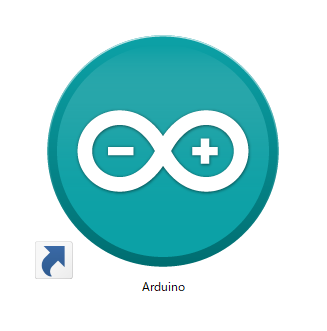
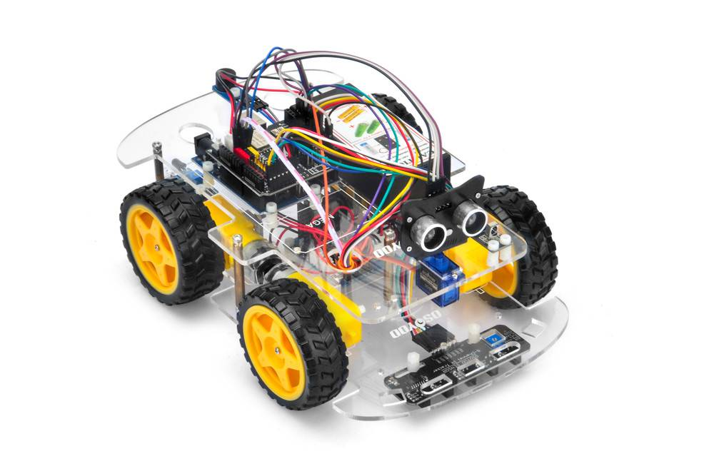
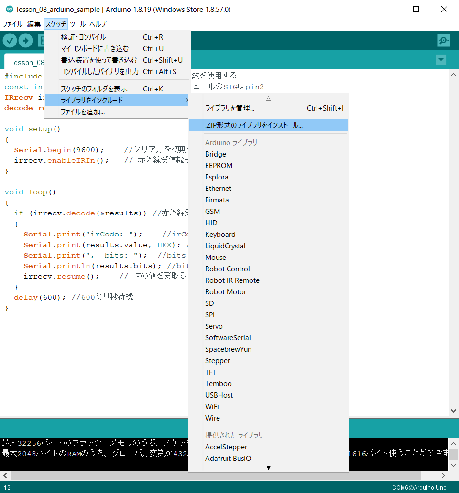
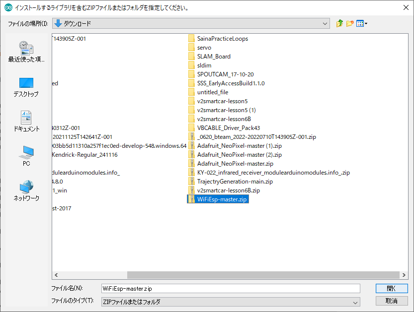
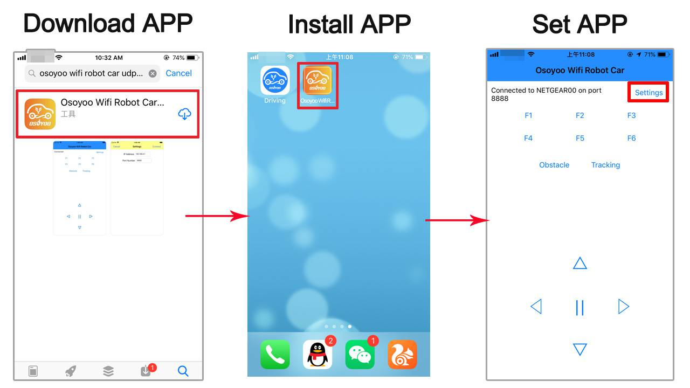
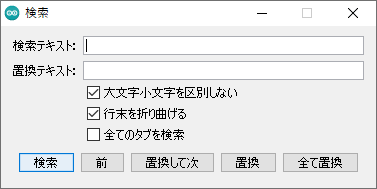
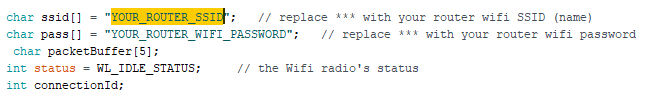
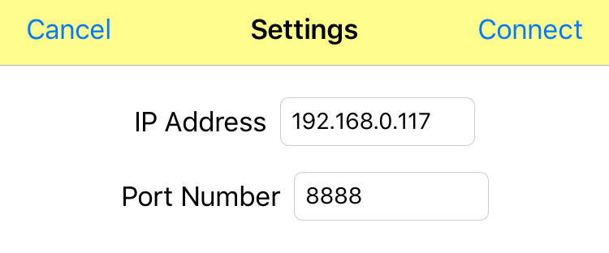
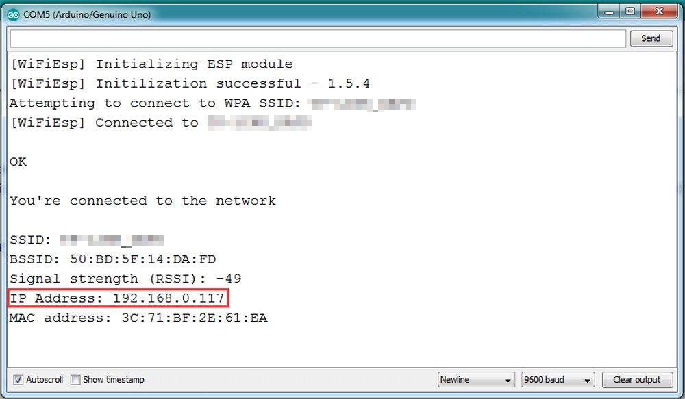

# レッスン18　Wifi接続でロボットを動かそう！

## Wifi接続のアプリを用いてロボットを動かす

## このレッスンで身につける力

- [ ] wifiライブラリを追加できる
- [ ] ジャンパーピンを正しく接続できる
- [ ] STAモードでSSIDとパスワードを使ってWifiに接続できる
- [ ] APモードで直接タブレットと接続できる
- [ ] コースを走破するためにサンプルコードを修正できる

---

## ミッションの準備

### ハードウェアを用意しよう
- [ ] Osoyoo ロボット(Arduino UNO rev.3と完全互換) x 1
- [ ] USBケーブル x 1
- [ ] パソコン x 1
- [ ] 超音波センサ x 1
- [ ] サーボモータ x 1
- [ ] ブザーモジュール x 1
- [ ] 取り付け用ねじなど
---
#### 0.ArduinoIDEを起動しよう

デスクトップにあるAruduinoのアイコンをダブルクリックしてArduinoIDEを起動しましょう．



---

#### 1.スケッチを保存しよう

(Arduinoでは，プログラムのことを「スケッチ」といいます．)

ファイル→保存をクリック（Ctrl+SでもOK）して，デスクトップに「lesson_08_1」という名前で保存しましょう．


---
#### 2.Arduinoとパソコンを接続しよう

Arduino UNOボードとパソコンをUSBケーブルでつなぎましょう．


【注意】USBを抜き差しするときは向きを確認して，ていねいにあつかうこと．

USBを差したら，ArduinoIDEでボードとシリアルポートを指定しましょう．　　

ツール→ボードをクリックして、Arduino/Genuino UNOをクリックしましょう。　　

次にツール→シリアルポートをクリックして，「COM～（Arduino UNO）」となっているものをクリックしましょう．（COM～の数字は毎回変わります．）


---

## ミッションチャレンジ

### Wifiってなに？
みんなはお家でスマートフォンやタブレットを使って動画を見たり、ゲームをしたりすることはあるかな？その時にインターネットに接続するために必要なのがWifiだよ。Wifiは無線通信と言って、人間には見ることのできない電波を用いてデータのやり取りを行なっているんだよ。このレッスンではWifiに接続されたタブレットのアプリを用いてロボットを操作してみるよ。

### 接続準備をしよう
前のレッスンで使ったロボットを少しだけ改良するよ。



改良する場所はここ！Arduinoの上についている黒い基板があることを確認しよう。赤色のジャンパーキャップをイラストの円で囲った部分と同じように接続しよう。ジャンパーキャップは赤色の小さな部品のことだよ。


### WifiUDPライブラリをインストールしよう
Lesson8でライブラリをインストールしたことを覚えているかな？ライブラリは難しいプログラムを組まなくても、これを使うことで効率的により簡単に開発ができる優れたものだったね。今回使うWifiの技術も実際に自分でプログラムを組もうとするとより高度で難しい内容になるので、今回はWifiUDPライブラリをArduinoIDEにインストールしてから、ロボットを動かすよ。  
下のリンクを押してライブラリをダウンロードしよう。
↓↓↓↓↓↓↓↓↓↓↓↓↓↓↓↓↓↓↓↓↓↓↓↓  
[WiFiEsp Library](https://osoyoo.com/driver/WiFiEsp-master.zip)　　

ダウンロードが終わったらArduino IDEを開いて、スケッチ→ライブラリをインクルード→ZIP形式のライブラリをインストールを押そう。

 

インストールボタンを押したら、さっきダウンロードしたWiFiEspライブラリのzipファイルを探して、開くボタンを押すとライブラリをインストールすることができるよ。　　

 

### Wifiで操作するアプリをタブレットにインストールしよう
今回のレッスンではタブレットのアプリを使ってロボットを操縦するよ。今回はOSOYOO WIFI UDP Robot Car control APP1を使ってロボットを動かすよ。みんなが使ってるタブレットのアプリストアからアプリをインストールしよう。

 

### アルドゥイーノSketchコードのインストール：

STAモードでロボットとアプリを接続します。STAモードでは、ロボットカーとアプリの入ったタブレットがLANルーターを介して接続します。LANルーターのSSID名とパスワードをアルドゥイーノスケッチに保存する必要があります。

スケッチが実行されると、ルーターがロボットカーにIPアドレスを割り当て、アプリはこのIPアドレスを使用してロボットカーとアクセスします。

まず、以下のコードをスケッチにコピーしましょう。

```C++
/*  ___   ___  ___  _   _  ___   ___   ____ ___  ____  
 * / _ \ /___)/ _ \| | | |/ _ \ / _ \ / ___) _ \|    \ 
 *| |_| |___ | |_| | |_| | |_| | |_| ( (__| |_| | | | |
 * \___/(___/ \___/ \__  |\___/ \___(_)____)___/|_|_|_|
 *                  (____/ 
 * Osoyoo Wifi Arduino Robot Car project
 * USe WI-FI UDP protocol to control robot car
 * tutorial url: https://osoyoo.com/?p=32758
 */
/*Declare L298N Dual H-Bridge Motor Controller directly since there is not a library to load.*/
#include <WiFiEspUdp.h>
WiFiEspUDP Udp;
unsigned int localPort = 8888;  // local port to listen on

//Define L298N Dual H-Bridge Motor Controller Pins
#define RightDirectPin1  12    //Right Motor direction pin 1 to MODEL-X IN1 grey
#define RightDirectPin2  11    //Right Motor direction pin 1 to MODEL-X IN2 yellow
#define speedPinL 6    //Left PWM pin connect MODEL-X ENB brown
#define LeftDirectPin1  7    //Left Motor direction pin 1 to MODEL-X IN3 green
#define LeftDirectPin2  8   //Left Motor direction pin 1 to MODEL-X IN4 white
#define speedPinR 3    // RIGHT PWM pin connect MODEL-X ENA blue
#define SOFT_RX 4    // Softserial RX port
#define SOFT_TX 5    //Softserial TX port


/*From left to right, connect to D3,A1-A3 ,D10*/
#define LFSensor_0 A0  //OLD D3
#define LFSensor_1 A1
#define LFSensor_2 A2
#define LFSensor_3 A3
#define LFSensor_4 A4  //OLD D10

#define SERVO_PIN     9  //servo connect to D9

#define Echo_PIN   2 // Ultrasonic Echo pin connect to D2
#define Trig_PIN   10  // Ultrasonic Trig pin connect to D10
#define LEFT_TURN_TIME 300
#define RIGHT_TURN_TIME 300
#define AHEAD_TIME 300
#define BACK_TIME 500

#define BUZZ_PIN     13  //buzzer connect to D13
#define FAST_SPEED 180
#define MID_SPEED 130
int track_speed = 100 ;    //tracking speed
#define SPEED   120  //avoidance motor speed
#define SPEED_LEFT  255
#define SPEED_RIGHT  255
#define BACK_SPEED  200     //back speed
#define TURN_SPEED  200     //back speed

#define TRACK_SPEED   150  //line follow motor speed

int leftscanval, centerscanval, rightscanval, ldiagonalscanval, rdiagonalscanval;
int distancelimit = 30; //distance limit for obstacles in front           
int sidedistancelimit = 30; //minimum distance in cm to obstacles at both sides (the car will allow a shorter distance sideways)

const int turntime = 300; //Time the robot spends turning (miliseconds)
const int backtime = 300; //Time the robot spends turning (miliseconds)
int distance;
int numcycles = 0;

int thereis;
bool flag1=false;
bool stopFlag = true;
bool JogFlag = false;
uint16_t JogTimeCnt = 0;
uint32_t JogTime=0;

#define MAX_PACKETSIZE 32    //Serial receive buffer
char buffUART[MAX_PACKETSIZE];
unsigned int buffUARTIndex = 0;
unsigned long preUARTTick = 0;

enum DS
{
  MANUAL_DRIVE,
  AUTO_DRIVE_LF, //line follow
  AUTO_DRIVE_UO  //ultrasonic obstruction
}Drive_Status=MANUAL_DRIVE;

enum DN
{ 
  GO_ADVANCE, 
  GO_LEFT, 
  GO_RIGHT,
  GO_BACK,
  STOP_STOP,
  DEF
}Drive_Num=DEF;
String WorkMode="?";

//String toggleStr="<form action=\"/\" method=GET><input type=submit name=a value=L><input type=submit name=a value=U><input type=submit name=a value=D><input type=submit name=a value=R></form>";
#define DEBUG true
 
#include "WiFiEsp.h"
// Emulate Serial1 on pins 9/10 by default
// If you want to use Hard Serial1 in Mega2560 , please remove the wifi shield jumper cap on ESP8266 RX/TX PIN , CONNECT TX->D18 RX->D19
#ifndef HAVE_HWSERIAL1
#include "SoftwareSerial.h"
SoftwareSerial Serial1(SOFT_RX, SOFT_TX); // RX, TX
#endif

char ssid[] = "YOUR_ROUTER_SSID";   // replace *** with your router wifi SSID (name)
char pass[] = "YOUR_ROUTER_WIFI_PASSWORD";   // replace *** with your router wifi password
 char packetBuffer[5];      
int status = WL_IDLE_STATUS;     // the Wifi radio's status
int connectionId;

#include <Servo.h>
Servo head;
 

// use a ring buffer to increase speed and reduce memory allocation
RingBuffer buf(8);

void go_Advance(void)  //Forward
{
  digitalWrite(RightDirectPin1, HIGH);
  digitalWrite(RightDirectPin2,LOW);
  digitalWrite(LeftDirectPin1,HIGH);
  digitalWrite(LeftDirectPin2,LOW);
  set_Motorspeed(SPEED,SPEED);
}
void go_Left()  //Turn left
{
  digitalWrite(RightDirectPin1, HIGH);
  digitalWrite(RightDirectPin2,LOW);
  digitalWrite(LeftDirectPin1,LOW);
  digitalWrite(LeftDirectPin2,HIGH);
  set_Motorspeed(0,SPEED_RIGHT);
}
void go_Right()  //Turn right
{
  digitalWrite(RightDirectPin1, LOW);
  digitalWrite(RightDirectPin2,HIGH);
  digitalWrite(LeftDirectPin1,HIGH);
  digitalWrite(LeftDirectPin2,LOW);
  set_Motorspeed(SPEED_LEFT,0);
}
void go_Back()  //Reverse
{
  digitalWrite(RightDirectPin1, LOW);
  digitalWrite(RightDirectPin2,HIGH);
  digitalWrite(LeftDirectPin1,LOW);
  digitalWrite(LeftDirectPin2,HIGH);
  set_Motorspeed(BACK_SPEED,BACK_SPEED);
}
void stop_Stop()    //Stop
{
  digitalWrite(RightDirectPin1, LOW);
  digitalWrite(RightDirectPin2,LOW);
  digitalWrite(LeftDirectPin1,LOW);
  digitalWrite(LeftDirectPin2,LOW);
  set_Motorspeed(0,0);
}

void set_Motorspeed(int SPEED_L,int SPEED_R)
{
  analogWrite(speedPinL,SPEED_L); 
  analogWrite(speedPinR,SPEED_R);   
}
void buzz_ON()   //open buzzer
{
   for(int i=0;i<100;i++)
  {
   digitalWrite(BUZZ_PIN,LOW);
   delay(2);//wait for 1ms
   digitalWrite(BUZZ_PIN,HIGH);
   delay(2);//wait for 1ms
  }
}
void buzz_OFF()  //close buzzer
{
  digitalWrite(BUZZ_PIN, HIGH);
}

void alarm(){
   buzz_ON();
 
   buzz_OFF();
}
//car motor control
void do_Drive_Tick()
{

  if(Drive_Status == MANUAL_DRIVE)
  {
    switch (Drive_Num) 
    {
      case GO_ADVANCE:
          go_Advance();
          Serial.println("go ahead");
        //  delay(AHEAD_TIME); 
          break;
      case GO_LEFT: 
          go_Left();
        //  delay(LEFT_TURN_TIME); 
       Serial.println("TURN left");
          break;
      case GO_RIGHT:  
          go_Right();
        //  delay(LEFT_TURN_TIME); 
         Serial.println("TURN right");
          break;
      case GO_BACK: 
          go_Back();
         // delay(BACK_TIME); 
      Serial.println("GO back");
          break;
      case STOP_STOP: 
          stop_Stop();
        //  JogTime = 0;
           Serial.println("STOP");
          break;
      default:
          break;
    }

  }
  else if(Drive_Status==AUTO_DRIVE_LF)
  {
      //Serial.println("auto track");
      auto_tracking();
  }
  else if(Drive_Status==AUTO_DRIVE_UO)
  { //Serial.println("OBSTACLE AVOID");
    auto_avoidance();
  }
}

void setup()
{
   
    pinMode(RightDirectPin1, OUTPUT); 
  pinMode(RightDirectPin2, OUTPUT); 
  pinMode(speedPinL, OUTPUT);  
  pinMode(LeftDirectPin1, OUTPUT);
  pinMode(LeftDirectPin2, OUTPUT); 
  pinMode(speedPinR, OUTPUT); 
  stop_Stop();//stop move
  /*init HC-SR04*/
  pinMode(Trig_PIN, OUTPUT); 
  pinMode(Echo_PIN,INPUT); 
  /*init buzzer*/
  pinMode(BUZZ_PIN, OUTPUT);
  digitalWrite(BUZZ_PIN, HIGH);  
  buzz_OFF(); 

  digitalWrite(Trig_PIN,LOW);
  /*init servo*/
  
  head.attach(SERVO_PIN); 
  head.write(90);
 
   delay(2000);
   
   Serial.begin(9600);   // initialize serial for debugging
 
  Serial1.begin(115200);    // initialize serial for ESP module
  Serial1.print("AT+CIOBAUD=9600\r\n");
      Serial1.write("AT+RST\r\n");
   Serial1.begin(9600);    // initialize serial for ESP module
  
  WiFi.init(&Serial1);    // initialize ESP module

  // check for the presence of the shield
  if (WiFi.status() == WL_NO_SHIELD) {
    Serial.println("WiFi shield not present");
    while (true); // don't continue
  }

 // Serial.print("Attempting to start AP ");
//  Serial.println(ssid);
  //AP mode
  //status = WiFi.beginAP(ssid, 10, "", 0);

//STA mode
   while ( status != WL_CONNECTED) {
    Serial.print("Attempting to connect to WPA SSID: ");
    Serial.println(ssid);
    // Connect to WPA/WPA2 network
    status = WiFi.begin(ssid, pass);
  }
 

  Serial.println("You're connected to the network");
  Serial.println();


  printWifiStatus();
  
  Udp.begin(localPort);
  
  Serial.print("Listening on port ");
  Serial.println(localPort);
 
 
}
 
boolean flag=false;
void loop()
{ 
 
  
  int packetSize = Udp.parsePacket();
  if (packetSize) {                               // if you get a client,
     Serial.print("Received packet of size ");
    Serial.println(packetSize);
    int len = Udp.read(packetBuffer, 255);
    if (len > 0) {
      packetBuffer[len] = 0;
    }
      char c=packetBuffer[0];
            switch (c)    //serial control instructions
            {   
  
               case 'A':Drive_Status=MANUAL_DRIVE; Drive_Num=GO_ADVANCE;  WorkMode="GO_ADVANCE";break;
               case 'L':Drive_Status=MANUAL_DRIVE; Drive_Num=GO_LEFT; WorkMode="GO_LEFT";break;
               case 'R':Drive_Status=MANUAL_DRIVE; Drive_Num=GO_RIGHT;WorkMode="GO_RIGHT";break;
               case 'B':Drive_Status=MANUAL_DRIVE; Drive_Num=GO_BACK;WorkMode="GO_BACK";break;
               case 'E':Drive_Status=MANUAL_DRIVE; Drive_Num=STOP_STOP;WorkMode="STOP_STOP";break;
               case 'O':Drive_Status=AUTO_DRIVE_UO;Serial.println("go OBSTACLE");WorkMode="OBSTACLE";break;
               case 'T':Drive_Status=AUTO_DRIVE_LF;WorkMode="line follow";break;
               case 'G':track_speed=track_speed+10;
                        if(track_speed>200) track_speed=200
                         ;break;
               case 'J':track_speed=track_speed-10;
                        if(track_speed<80) track_speed=80
                         ;break;
               default:break;
              } //END OF ACTION SWITCH
  
  }
   do_Drive_Tick();
 
 
} //end of loop
 
char sensor[5];
 /*read sensor value string, 1 stands for black, 0 starnds for white, i.e 10000 means the first sensor(from left) detect black line, other 4 sensors detected white ground */
String read_sensor_values()
{   int sensorvalue=32;
  sensor[0]= digitalRead(LFSensor_0);
 
  sensor[1]=digitalRead(LFSensor_1);
 
  sensor[2]=digitalRead(LFSensor_2);
 
  sensor[3]=digitalRead(LFSensor_3);
 
  sensor[4]=digitalRead(LFSensor_4);
  sensorvalue +=sensor[0]*16+sensor[1]*8+sensor[2]*4+sensor[3]*2+sensor[4];
  
  
 
  sensorvalue =~sensorvalue;
  String senstr= String(sensorvalue,BIN);
  senstr=senstr.substring(11,16);

  return senstr;
}

void auto_tracking(){
 String sensorval= read_sensor_values();
  Serial.println(sensorval);
 if (  sensorval=="11000" || sensorval=="10000"  || sensorval=="01000")
 { 
  //The black line is in the left of the car, need  left turn 
      go_Left();  //Turn left
    set_Motorspeed(FAST_SPEED,FAST_SPEED);
 //   delay(50);
 //   stop_Stop();
    }
else if (sensorval=="10100" || sensorval=="00100" || sensorval=="01100" || sensorval=="11100"  || sensorval=="10010" || sensorval=="11010")
{
      go_Advance();  //Turn slight left
    set_Motorspeed(MID_SPEED,FAST_SPEED);
 //   delay(50);
//    stop_Stop();
  
}
 else if ( sensorval=="00011" || sensorval=="00001"  || sensorval=="00010" ){ //The black line is  on the right of the car, need  right turn 
  
     go_Right();  //Turn right
       set_Motorspeed(FAST_SPEED,FAST_SPEED);
          // delay(50);
   // stop_Stop();
    }
 else if (sensorval=="00101" || sensorval=="00110" || sensorval=="00111" || sensorval=="01101" || sensorval=="01111"   || sensorval=="01011" || sensorval=="01110"  || sensorval=="01001")
 {
       go_Advance();  //Turn slight right
       set_Motorspeed(FAST_SPEED,MID_SPEED);
        //   delay(50);
    //stop_Stop();
 }
  else if (sensorval=="01110"  || sensorval=="00100"   ){
      go_Advance();  //Turn slight right
       set_Motorspeed(track_speed,track_speed);
  //         delay(50);
  //  stop_Stop();
  }
 else if (sensorval=="11111"){
   stop_Stop();   //The car front touch stop line, need stop
    set_Motorspeed(0,0);
    }
 
  else   if (sensorval=="00000" ){
   // go_Advance();  //Turn slight right
    //   set_Motorspeed(track_speed,track_speed);
    stop_Stop();
 
     
   
     go_Advance();  //Turn slight right
     set_Motorspeed(track_speed,track_speed);
    }
    
}
/*detection of ultrasonic distance*/
int watch(){
  long echo_distance;
  digitalWrite(Trig_PIN,LOW);
  delayMicroseconds(5);                                                                              
  digitalWrite(Trig_PIN,HIGH);
  delayMicroseconds(15);
  digitalWrite(Trig_PIN,LOW);
  echo_distance=pulseIn(Echo_PIN,HIGH);
  echo_distance=echo_distance*0.01657; //how far away is the object in cm
 Serial.println((int)echo_distance);
  return round(echo_distance);
}

//Meassures distances to the right, left, front, left diagonal, right diagonal and asign them in cm to the variables rightscanval, 
//leftscanval, centerscanval, ldiagonalscanval and rdiagonalscanval (there are 5 points for distance testing)
String watchsurrounding(){
/*  obstacle_status is a binary integer, its last 5 digits stands for if there is any obstacles in 5 directions,
 *   for example B101000 last 5 digits is 01000, which stands for Left front has obstacle, B100111 means front, right front and right ha
 */
 
int obstacle_status =B100000;
  centerscanval = watch();
  if(centerscanval<distancelimit){
    stop_Stop();
    alarm();
    obstacle_status  =obstacle_status | B100;
    }
  head.write(120);
  delay(100);
  ldiagonalscanval = watch();
  if(ldiagonalscanval<distancelimit){
    stop_Stop();
    alarm();
     obstacle_status  =obstacle_status | B1000;
    }
  head.write(170); //Didn't use 180 degrees because my servo is not able to take this angle
  delay(300);
  leftscanval = watch();
  if(leftscanval<sidedistancelimit){
    stop_Stop();
    alarm();
     obstacle_status  =obstacle_status | B10000;
    }

  head.write(90); //use 90 degrees if you are moving your servo through the whole 180 degrees
  delay(100);
  centerscanval = watch();
  if(centerscanval<distancelimit){
    stop_Stop();
    alarm();
    obstacle_status  =obstacle_status | B100;
    }
  head.write(40);
  delay(100);
  rdiagonalscanval = watch();
  if(rdiagonalscanval<distancelimit){
    stop_Stop();
    alarm();
    obstacle_status  =obstacle_status | B10;
    }
  head.write(0);
  delay(100);
  rightscanval = watch();
  if(rightscanval<sidedistancelimit){
    stop_Stop();
    alarm();
    obstacle_status  =obstacle_status | 1;
    }
  head.write(90); //Finish looking around (look forward again)
  delay(300);
   String obstacle_str= String(obstacle_status,BIN);
  obstacle_str= obstacle_str.substring(1,6);
  //Serial.print("obstr=");
  //Serial.println(obstacle_str);
  return obstacle_str; //return 5-character string standing for 5 direction obstacle status
}


void auto_avoidance(){

  ++numcycles;
  if(numcycles>=2){ //Watch if something is around every LPT loops while moving forward 
     stop_Stop();
    String obstacle_sign=watchsurrounding(); // 5 digits of obstacle_sign binary value means the 5 direction obstacle status
      Serial.print("begin str=");
        Serial.println(obstacle_sign);
                    if( obstacle_sign=="10000" || obstacle_sign=="01000" || obstacle_sign=="11000" ){
     Serial.println("SLIT right");
       go_Right();
          set_Motorspeed(FAST_SPEED,track_speed);
      delay(180);
      stop_Stop();
    }
        else    if( obstacle_sign=="00001"  || obstacle_sign=="00011" || obstacle_sign=="00010"){
     Serial.println("SLIT LEFT");
      go_Left();
       set_Motorspeed(track_speed,FAST_SPEED);
      delay(180);
      stop_Stop();
    }
    else if(obstacle_sign=="11100" || obstacle_sign=="10100"  || obstacle_sign=="01100" ||obstacle_sign=="00100" ){
     Serial.println("hand right");
      go_Right();
      set_Motorspeed(TURN_SPEED,TURN_SPEED);
      delay(turntime);
      stop_Stop();
    } 
    else if (obstacle_sign=="01110"  || obstacle_sign=="11110" ||   obstacle_sign=="10110" ||   obstacle_sign=="11101" ||   obstacle_sign=="10101")
    {
            go_Right(); //Turn back to Left
      set_Motorspeed(track_speed,FAST_SPEED);
      delay(backtime);
      stop_Stop();
    }
    else if( obstacle_sign=="00111"  || obstacle_sign=="00101" || obstacle_sign=="00110"  ){
    Serial.println("hand left");
     go_Left();//Turn left
     set_Motorspeed(TURN_SPEED,TURN_SPEED);
      delay(turntime);
      stop_Stop();
    }
    else if (obstacle_sign=="11011"   || obstacle_sign=="11111" || obstacle_sign=="01111" || obstacle_sign=="01011" || obstacle_sign=="01010")
    {
         go_Left();//Turn back to right
     set_Motorspeed(FAST_SPEED,track_speed);
      delay(backtime);
      stop_Stop();
    }
  else {Serial.println("SLOW AHEAD");
    go_Advance();  // if nothing is wrong go forward using go() function above.
    set_Motorspeed(SPEED,SPEED);
  }
    numcycles=0; //Restart count of cycles
  } else {
     go_Advance();  // if nothing is wrong go forward using go() function above.
    set_Motorspeed(SPEED,SPEED);
        delay(180);
          stop_Stop();
  }
  
  //else  Serial.println(numcycles);
  
  distance = watch(); // use the watch() function to see if anything is ahead (when the robot is just moving forward and not looking around it will test the distance in front)
  if (distance<distancelimit){ // The robot will just stop if it is completely sure there's an obstacle ahead (must test 25 times) (needed to ignore ultrasonic sensor's false signals)
 Serial.println("final go back");
  go_Right();
  set_Motorspeed(FAST_SPEED,track_speed);
  delay(backtime);
      ++thereis;}
  if (distance>distancelimit){
      thereis=0;} //Count is restarted
  if (thereis > 25){
  Serial.println("final stop");
    stop_Stop(); // Since something is ahead, stop moving.
    thereis=0;
  }
}


void printWifiStatus()
{
  // print your WiFi shield's IP address
  IPAddress ip = WiFi.localIP();
  Serial.print("IP Address: ");
  Serial.println(ip);

  // print where to go in the browser
  Serial.println();
  Serial.print("To see this page in action, connect to ");
  Serial.print(ssid);
  Serial.print(" and open a browser to http://");
  Serial.println(ip);
  Serial.println();
}
```

長いですがここから特定の場所を探して書き換えていきます。

**CTRL + F**を押して、検索窓を開きましょう。そこに「 YOUR_ROUTER_SSID 」と入力して「検索」を押してみましょう。コードの中の書かれている場所にジャンプします。
 

そこに教室のSSIDを先生に教えてもらって入力しましょう。「” ”」で囲まれた中を編集します。大文字小文字も区別して入力してください。同じようにその下の行にある「YOUR_ROUTER_WIFI_PASSWORD」も書き換えます。
 

書き換えたら、アプリを開き右上の「 Setting 」のボタンを教えてセッティング画面を開きましょう。そこの「IP Address」にロボットに割り当てられたIPアドレスを入力します。
 

ロボットのIPアドレスを知るにはシリアルモニターを立ち上げます。
 

「IP Address: 192.168.0.XXX」のような出力が見えるはずです。これをアプリのほうに入力しましょう。


### サンプルプログラムを動かそう
これでロボットカーをリモートで動かすことができるようになりました。以前やったライントラッキングや障害物回避に切り替えることもできます。

自分でコースを作ってロボットを動かしてみよう。


### 出来たことをチェックしよう
- [ ] wifiライブラリを追加できる
- [ ] ジャンパーピンを正しく接続できる
- [ ] STAモードでSSIDとパスワードを使ってWifiに接続できる
- [ ] APモードで直接タブレットと接続できる
- [ ] コースを走破するためにサンプルコードを修正できる
