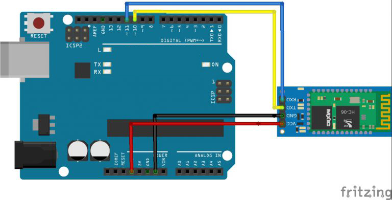
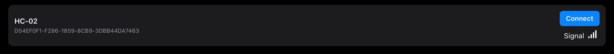
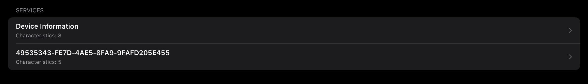

# Bluetooth接続でLEDを光らせてみよう！

## Bluetoothモジュールを使ってLEDを光らせる


### このレッスンで身につける力

- [ ] Bluetoothモジュールを使って回路を作成できる
- [ ] Bluetoothライブラリを追加できる
- [ ] サンプルコードを実行できる
- [ ] （工夫できる課題）

---

このようなマークがついているものを見たことはあるかな？


Bluetooth（ブルートゥース）は無線で通信する技術のひとつで，スマホやイヤホン，ゲーム機，マウスなどにも使われているよ．

このレッスンではBluetoothを使ってデータを送信してみるよ．


---
### ミッションの準備

- [ ] Osoyoo UNO Board x1
- [ ] HCモジュール x1
- [ ] USBケーブル x1
- [ ] パソコン x1


#### 0.ハードウェアを用意しよう

- [ ] Osoyoo UNO Board（Arduino UNO rev.3と完全互換）x 1
- [ ] HCモジュール x1
- [ ] USBケーブル x1
- [ ] iPad x1
- [ ] パソコン x1


---
## ミッションチャレンジ

### HCモジュールをロボットにつなごう！

配線図：


- [ ] HCモジュールが接続出来たらチェック！

---


### サンプルコードでロボットを動かそう！


ArduinoIDEを開き，ファイル→名前を付けて保存をクリックして，「name_lesson_19_1」という名前で保存しましょう．

スケッチに以下のコードをコピー＆ペーストして，スケッチを実行してみよう．


``` C++
#include <SoftwareSerial.h>// シリアルライブラリをインポートする

SoftwareSerial mySerial(10, 11); // RX, TX
int ledpin = 13; //D13に接続されているLEDの点滅はオン/オフを表示します
int BluetoothData; //コンピューターから与えられたデータ

void setup()
{
  Serial.begin(9600);
  Serial.println("Type AT commands!");
  // put your setup code here, to run once:
  mySerial.begin(9600);
  Serial.println("Bluetooth On please press 1 or 0 blink LED ..");
  pinMode(ledpin, OUTPUT);
}

void loop()
{
  // ここにセットアップコードを入れて、1回実行します:
  if (mySerial.available())
  {
    BluetoothData = mySerial.read();
    if (BluetoothData == '1')
    {
      // if number 1 pressed ....
      digitalWrite(ledpin, 1);
      Serial.println("LED  On D13 ON ! ");
    }
    if (BluetoothData == '0')
    {
      // if number 0 pressed ....
      digitalWrite(ledpin, 0);
      Serial.println("LED  On D13 Off ! ");
    }
  }
  delay(100);// prepare for next data ...
}
```

1. シリアルモニタを開こう！

2. プログラムが書き込めたら，教室のiPadからこのアプリを開こう！（入っていなかったら先生に入れてもらおう！）


3. アプリを起動したら「HC-02」を見つけて，「connect」をタップしよう．



4. 「SERVICES」の中の「49535343～～」をタップしよう．



5. 「4953～」の後に「W」のアイコンが二つ並んでいるところの「Terminal」をタップしよう．


6. 「Send ASCII」に「1」や「0」を入力してみよう．


- [ ] Arduino内蔵LEDがついたり消えたりしたらチェック！

---

### 遠隔でサーボモーターを動かしてみよう！


---

### コースの上をうまく走れるように改造しよう！


---
### まとめ

- Bluetoothモジュールを使うためのライブラリは`SoftwareSerial.h`

---

#### 出来たことをチェックしよう
- [ ] Bluetoothモジュールを使って回路を作成できる
- [ ] Bluetoothライブラリを追加できる
- [ ] サンプルコードを実行できる
- [ ] （工夫できる課題）
