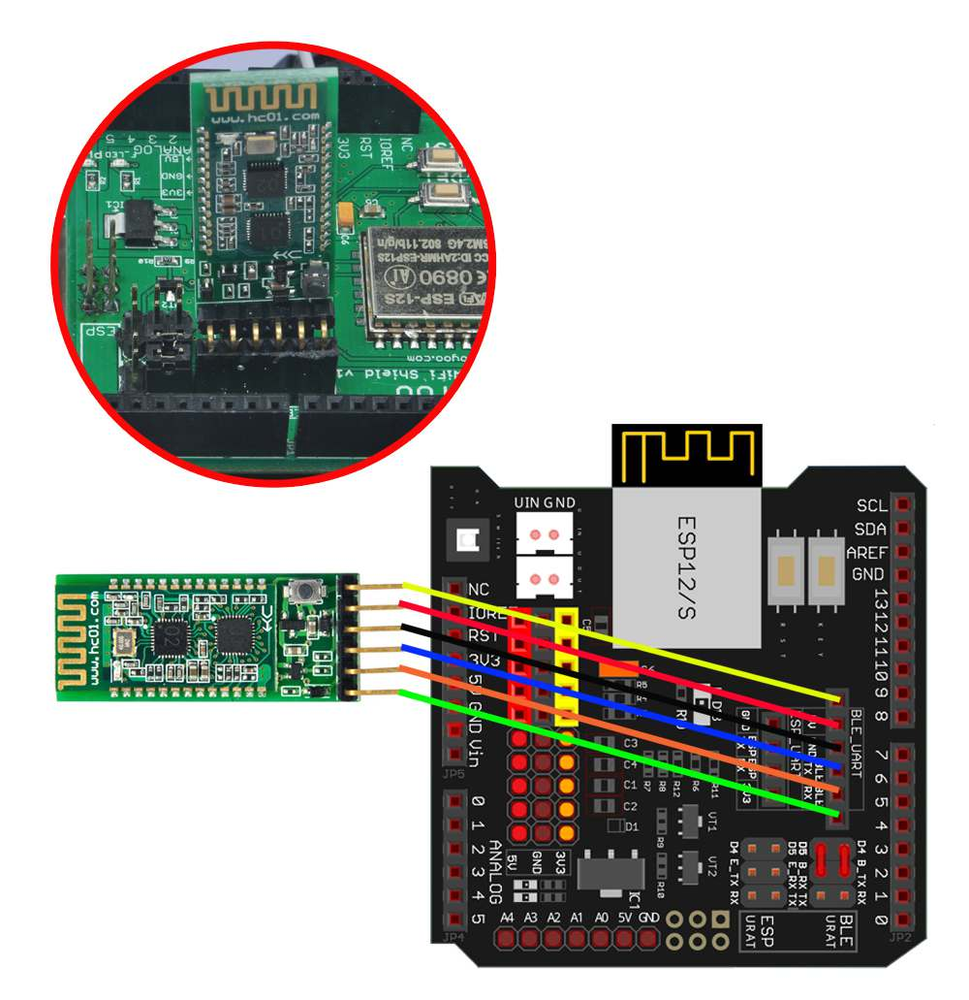

# Bluetooth接続でロボットを動かしてみよう！

## Bluetooth接続とタブレットアプリを使ってコースを走破する


### このレッスンで身につける力

- [ ] (復習)Bluetoothライブラリを追加できる
- [ ] ジャンパーピンを正しく接続できる
- [ ] タブレットとBluetooth接続が出来る
- [ ] サンプルコードを実行できる
- [ ] コースを走破するためにサンプルコードを修正できる

---

### ミッションの準備

- [ ] Osoyoo UNO Board x1
- [ ] HCモジュール x1
- [ ] USBケーブル x1
- [ ] パソコン x1


#### 0.ハードウェアを用意しよう

- [ ] Osoyoo UNO Board（ Arduino UNO rev.3と完全互換）x 1
- [ ] HCモジュール x1
- [ ] USBケーブルx 1
- [ ] パソコン x 1


---
## ミッションチャレンジ

### HCモジュールをロボットにつなごう！

配線図：



- [ ] HCモジュールが接続出来たらチェック！

---


### サンプルコードでロボットを動かそう！


ArduinoIDEを開き，ファイル→名前を付けて保存をクリックして，「name_lesson_20_1」という名前で保存しましょう．

スケッチに以下のコードをコピー＆ペーストして，スケッチを実行してみよう．


``` C++
#include <SoftwareSerial.h>
SoftwareSerial BLTSerial(4, 5);  //RX,TX

int buttonState;

#define dir1PinRight   12  // Right Motor direction pin 1 to MODEL-X IN1 
#define dir2PinRight  11   // Right Motor direction pin 2 to MODEL-X IN2
#define speedPinRight 9   //RIGHT PWM pin connect MODEL-X ENA
#define speedPinLeft 6    // Left PWM pin connect MODEL-X ENB
#define dir1PinLeft  7    //Left Motor direction pin 1 to MODEL-X IN3 
#define dir2PinLeft  8    //Left Motor direction pin 2 to MODEL-X IN4 
//back speed
#define MAX_PACKETSIZE 32    //Serial receive buffer

struct car_status {
  int speed;
  int angle;
  int direct;
};
char buffUART[MAX_PACKETSIZE];
unsigned int buffUARTIndex = 0;
unsigned long preUARTTick = 0;
int Speed = 150;
int TURNSPEED = 50;
/*motor control*/
void go_Advance(void)  //Forward
{
  digitalWrite(dir1PinRight, HIGH);
  digitalWrite(dir2PinRight, LOW);
  digitalWrite(dir1PinLeft, HIGH);
  digitalWrite(dir2PinLeft, LOW);

}
void go_Left()  //Turn left
{
  digitalWrite(dir1PinRight, HIGH);
  digitalWrite(dir2PinRight, LOW);
  digitalWrite(dir1PinLeft, LOW);
  digitalWrite(dir2PinLeft, HIGH);
}
void go_Right()  //Turn right
{
  digitalWrite(dir1PinRight, LOW);
  digitalWrite(dir2PinRight, HIGH);
  digitalWrite(dir1PinLeft, HIGH);
  digitalWrite(dir2PinLeft, LOW);
}
void go_Back()  //Reverse
{
  digitalWrite(dir1PinRight, LOW);
  digitalWrite(dir2PinRight, HIGH);
  digitalWrite(dir1PinLeft, LOW);
  digitalWrite(dir2PinLeft, HIGH);
}
void back_Left()  //Reverse
{
  digitalWrite(dir1PinRight, LOW);
  digitalWrite(dir2PinRight, HIGH);
  digitalWrite(dir1PinLeft, HIGH);
  digitalWrite(dir2PinLeft, LOW);
}
void back_Right()  //Reverse
{
  digitalWrite(dir1PinRight, HIGH);
  digitalWrite(dir2PinRight, LOW);
  digitalWrite(dir1PinLeft, LOW);
  digitalWrite(dir2PinLeft, HIGH);
}
void stop_Stop() {
  digitalWrite(dir1PinRight, LOW);
  digitalWrite(dir2PinRight, LOW);
  digitalWrite(dir1PinLeft, LOW);
  digitalWrite(dir2PinLeft, LOW);
  set_Motorspeed(0, 0) ;
}

/*set motor speed */
void set_Motorspeed(int speed_L, int speed_R)
{
  analogWrite(speedPinRight, speed_R);
  analogWrite(speedPinLeft, speed_L);
}


//WiFi / Bluetooth through the serial control
void do_Uart_Tick()
{

  char Uart_Date = 0;
  if (BLTSerial.available())
  {
    size_t len = BLTSerial.available();
    uint8_t sbuf[len + 1];
    sbuf[len] = 0x00;
    BLTSerial.readBytes(sbuf, len);
    //parseUartPackage((char*)sbuf);
    memcpy(buffUART + buffUARTIndex, sbuf, len);//ensure that the serial port can read the entire frame of data
    buffUARTIndex += len;
    preUARTTick = millis();
    if (buffUARTIndex >= MAX_PACKETSIZE - 1)
    {
      buffUARTIndex = MAX_PACKETSIZE - 2;
      preUARTTick = preUARTTick - 200;
    }
  }
  car_status cs;
  if (buffUARTIndex > 0 && (millis() - preUARTTick >= 100)) //APP send flag to modify the obstacle avoidance parameters
  { //data ready
    buffUART[buffUARTIndex] = 0x00;
    Uart_Date = buffUART[0];
    cs = get_status(buffUART);
    buffUARTIndex = 0;
  }
  Speed = cs.speed + 50;
  TURNSPEED = Speed * 3 / 2;
  if (Speed > 250) Speed = 250;
  if (TURNSPEED > 250) TURNSPEED = 250;
  switch (Uart_Date)    //serial control instructions
  {
    case 'M':
      go_Advance();
      set_Motorspeed(Speed, Speed) ;
      break;
    case 'L':
      go_Left();
      if (cs.angle = 1) {
        set_Motorspeed(0, 50) ;
      }
      if (cs.angle = 2) {
        set_Motorspeed(50, 200) ;
      }
      break;
    case 'R':
      go_Right();
      if (cs.angle = -1) {
        set_Motorspeed(50, 0) ;
      }
      if (cs.angle = -2) {
        set_Motorspeed(200, 50) ;
      }
      break;
    case 'B':
      go_Back();
      set_Motorspeed(Speed, Speed) ;
      break;
    case 'X':
      back_Left();
      if (cs.angle = 1) {
        set_Motorspeed(0, 50) ;
      }
      if (cs.angle = 2) {
        set_Motorspeed(50, 200) ;
      }
      break;
    case 'Y':
      back_Right();
      if (cs.angle = -1) {
        set_Motorspeed(50, 0) ;
      }
      if (cs.angle = -2) {
        set_Motorspeed(200, 50) ;
      }
      break;

    case 'E': stop_Stop() ; break;
    case 'J': stop_Stop() ; break;
    default: break;
  }
}

//car motor control
void setup()
{

  pinMode(dir1PinRight, OUTPUT);
  pinMode(dir2PinRight, OUTPUT);
  pinMode(speedPinRight, OUTPUT);
  pinMode(dir1PinLeft, OUTPUT);
  pinMode(dir2PinLeft, OUTPUT);
  pinMode(speedPinLeft, OUTPUT);
  stop_Stop();

  Serial.begin(9600);//In order to fit the Bluetooth module's default baud rate, only 9600
  BLTSerial.begin(9600);

}
int lastButtonState = 0;
void loop()
{
  do_Uart_Tick();

}

car_status get_status( char buffUART[])
{
  car_status cstatus;
  int index = 2;
  if (buffUART[index] == '-') {
    cstatus.angle = -buffUART[index + 1] + '0';
    index = index + 3;

  } else {

    cstatus.angle = buffUART[index] - '0';
    index = index + 2;
  }
  int currentvalue;
  int spd = 0;
  while (buffUART[index] != ',')
  {
    currentvalue = buffUART[index] - '0';
    spd = spd * 10 + currentvalue;
    index++;
  }
  cstatus.speed = spd;
  index++;
  cstatus.direct = buffUART[index] - '0';
  return cstatus;
}
```

プログラムが書き込めたら，教室のiPadからこのアプリを開こう！↓


1. アプリを起動したら「connect」をタップしよう．
2. 「HC-02～～」をタップしよう．
3. 「Engine」をタップして起動しよう．
4. 「Speed+」をタップして走らせよう．


- [ ] ロボットが走ったらチェック！

---

### コースの上を走らせてみよう！

ビニールテープを使ってベニヤ板に下の写真のようなコースを作ってみよう．


- [ ] コースができたらチェック！

コースができたら，ロボットを置いて走らせてみよう．線の上をうまく走らせることができるかな？

---

### コースの上をうまく走れるように改造しよう！

サンプルコードのままだと，ロボットが思ったように動かなかったかな？

そんな時はコードを改造してみよう！

わからなくなってしまったときに戻れるように，「ファイル」→「名前を付けて保存」から「name_lesson20_2」として保存して，これを編集しよう．

ヒント：

- 23行目あたりの「Speed = 」はまっすぐ進むスピードを表しているよ．
- 24行目あたりの「TURNSPEED = 」は回転するスピードを表しているよ．
- 126行目あたりの「if (cs.angle = 1) ～～～ set_motorspeed～～～」ではiPadの角度によってどれくらいモーターを回転させるかを決めているよ．これを細かく場合分けするとどうなるかな？

- [ ] プログラムを改造して動きを変えられたらチェック！


---
### まとめ

- Bluetoothモジュールを使うためのライブラリは`SoftwareSerial.h`

---

#### 出来たことをチェックしよう
- [ ] (復習)Bluetoothライブラリを追加できる
- [ ] ジャンパーピンを正しく接続できる
- [ ] タブレットとBluetooth接続が出来る
- [ ] サンプルコードを実行できる
- [ ] コースを走破するためにサンプルコードを修正できる
