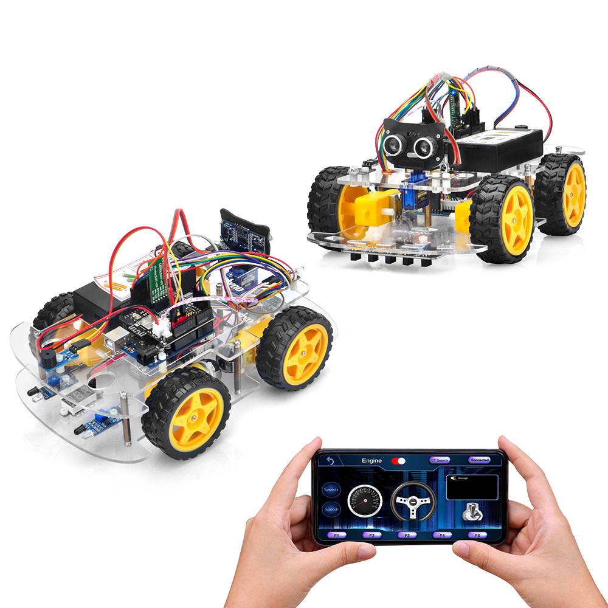
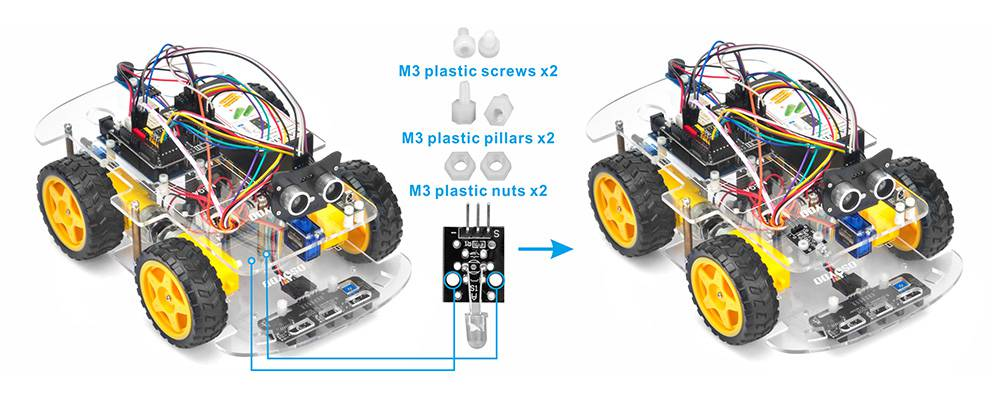
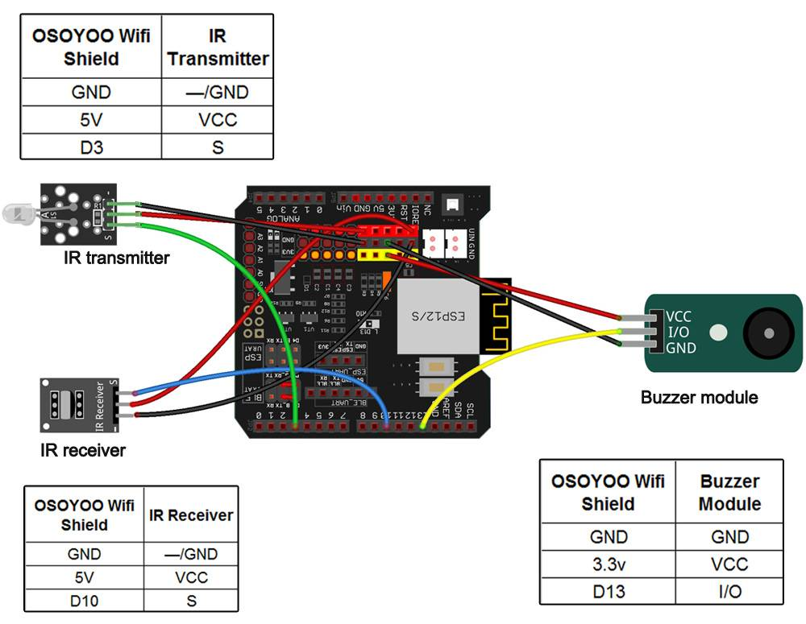
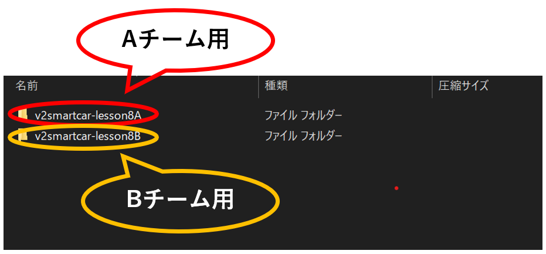
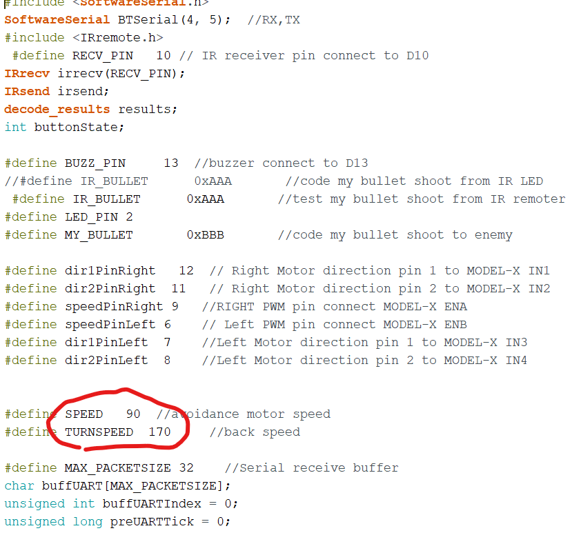

# ロボット対戦ゲーム！(1)

## 今まで使った知識を使ってロボット対戦をする

### このレッスンで身につける力

- [ ] 不要なセンサー・モーター類を取り外すことが出来る
- [ ] 必要なセンサー類を取り付けることが出来る
- [ ] サンプルコードを実行できる
- [ ] 対戦を有利に行うためにサンプルコードを修正できる

---
### ミッションの準備
- [ ] Osoyoo UNO Board x 1
- [ ] 赤外線受信器
- [ ] 赤外線発信器
- [ ] ブザーセンサーモジュール
- [ ] F/Mジャンパー
- [ ] USBケーブルx 1
- [ ] パソコン x 1

---
### ミッションチャレンジ

今回のミッションは，ロボットの戦闘ゲームを作ろう！

Osoyooロボットカーのグループが2つ必要で、各グループには少なくとも1台のロボットカーがあります。

チームAのロボットは、チームBのロボットを撃つための弾丸として赤外線信号を発信し、その逆も同様です。

チームAの赤外線弾丸は、チームBのロボットのみを「倒し」、チームAに害を及ぼすことはありません。

チームBの弾丸も同様です。

プレイヤーはLesson20 のモバイルAPPを使用してロボットを制御し、敵チームのロボットを可能な限り倒します。

---
#### 不要なセンサー・モーター類を取り外すことが出来る
今回は赤外線受信器，赤外線発信器，ブザーセンサーモジュールを使うのでそれ以外のセンサやモジュールをはずそう！

- [ ] 不要なセンサー・モーター類を取り外すことが出来る

---
#### 必要なセンサー類を取り付けることが出来る
ステップ1:このプロジェクトには、少なくとも2台のOsoyoo V2アルドゥイーノロボットが必要です。各ロボットで、レッスン7のハードウェアのインストールが完了している必要があります。

ステップ2: IRレシーバー(レッスン2) とブザーモジュール（レッスン5）を取り付け、次のように2個のM3プラスチックネジ、ピラー、ナットを使用してIRトランスミッターを追加します.

 

ステップ3: 次のグラフのように、IRレシーバー、IRトランスミッター、ブザーモジュールをOSOYOO UartWiFiシールドV1.3に接続します

 

- [ ] 必要なセンサー類を取り付けることが出来る

---
#### サンプルコードを実行できる

ステップ 1:次のリンクからスケッチをダウンロードしてプログラムを動かしてみよう。
↓↓↓↓↓↓↓↓↓↓↓↓↓↓↓↓↓↓↓↓↓↓↓↓  
[WiFiEsp Library](https://osoyoo.com/driver/WiFiEsp-master.zip)　　

ステップ 2: チームAロボットのv2smartcar-lesson8Aフォルダーにコード「v2smartcar-lesson8A.ino」をアップロードし、チームBロボットのv2smartcar-lesson8Bフォルダーにコード「v2smartcar-lesson8B.ino」をアップロードします。

 

ステップ 3: Lesson20でAPPをインストールした場合は、このステップをスキップしてください。それ以外の場合は、Apple APP storeにアクセスして、APP名「Osoyooimitation Driving」を検索し、APPを携帯電話にインストールします。
 

ステップ 4: APPをインストールした後、HC-02 Bluetoothモジュールを携帯電話にペアリングし、Osoyoo Imitation Driving APPを開きます。BTSearchリストが表示されたら、HC-02デバイスをクリックして、Bluetoothデバイスを車に接続します。
 

アプリで[エンジン切り替え]アイコンをクリックすると、ロボットカーが動き始めます。あなたの車の方向を変えるためにあなたのハンドル、ギアを使ってください。敵を見つけたら、「F1」をクリックして弾丸に対して弾丸をトリガーします。弾丸が敵の車に当たると、敵の車はフリーズし、ブザーを鳴らして止まり、車がフリーズし、APPが「デッド」と表示されます。

- [ ] サンプルコードを実行できる

---
#### 対戦を有利に行うためにサンプルコードを修正できる
サンプルコードの上部を見てみると機体の速度が調整できるよ！

対戦しやすい速度に調整してみよう！
 

- [ ] 対戦を有利に行うためにサンプルコードを修正できる

---
#### 出来たことをチェックしよう

- [ ] 不要なセンサー・モーター類を取り外すことが出来る
- [ ] 必要なセンサー類を取り付けることが出来る
- [ ] サンプルコードを実行できる
- [ ] 対戦を有利に行うためにサンプルコードを修正できる