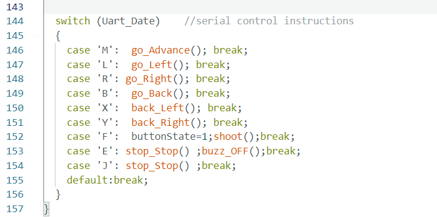

# ロボット対戦ゲーム！(2)

## ロボットの必殺技を作ろう

### このレッスンで身につける力

- [ ] 対戦のルールを把握して自分なりの戦略を考えることができる
- [ ] 戦略に基づいて必殺技の構想を考えることができる
- [ ] 構想に基づいて必殺技をプログラムで実現できる
- [ ] 作った必殺技を対戦で試して修正することができる

---

### ミッションの準備
- [ ] レッスン21で使ったロボット
- [ ] USBケーブルx 1
- [ ] パソコン x 1

#### 対戦のルールを把握しよう


### 友達と対戦をやってみよう！

**対戦を有利にするために考えること**

- [ ] 防御側がどこにオブジェクトを置くか
- [ ] 攻撃側は相手から撃たれないようにブロックをどう配置するか
- [ ] オブジェクトが外に出たときに中央に戻ることを有利になるように考える
- [ ] 防御側は撃たれただけでは負けにならないのでオブジェクトに触るのを邪魔になるようにやられるべき

**※AチームとBチームのプログラムでないと対戦はできません。**

### ミッションチャレンジ1 必殺技の追加の仕方を学ぼう！

まず144行目から156行目を見よう。


ここのコードの意味は、タブレットのアプリから飛んできたメッセージにどんな動きを割り当てるか、ということが書かれているんだ。146行目から151行目までは前進や右左折といったロボットの基本的な動きが割り当てられています。

#### switch文の書き方
swich文はif文と似たような使い方ができますが、ある変数の中身を見てその値によって動きを変えることができます。

``` C++
  switch (変数)    
  {
    case 変数の中の値1:その時の動き; break;
    case 変数の中の値2:その時の動き; break;
    case 変数の中の値3:その時の動き; break;
             :
             :
    default:どの値でもない時の動き; break; 
  }

```

#### F2ボタンを押すと音が鳴るようにしてみよう

はじめのうちはこのようなボタンの割り当てになってます。


| 値 | ボタン | 初めの割り当て | 効果 |
| --- | --- | --- | --- |
| F | F1 | buttonState=1;shoot(); | 赤外線で撃つ |
| G | F2 | なし | なし |
| H | F3 | なし | なし |
| I | F4 | なし | なし |
| J | F5 | stop_Stop() ; | エンジンをかけたまま止まる |

この'G'に音を鳴らすalarm()を割り当ててみましょう。144行目から156行目を次のように書き換えます。

``` C++
  switch (Uart_Date)    //serial control instructions
  {
    case 'M': go_Advance(); break;
    case 'L': go_Left(); break;
    case 'R': go_Right(); break;
    case 'B': go_Back(); break;
    case 'X': back_Left(); break;
    case 'Y': back_Right(); break;
    case 'F': buttonState=1;shoot();break;
    case 'G': alarm();break; // この行を追加する
    case 'E': stop_Stop() ;buzz_OFF();break;
    case 'J': stop_Stop() ;break;
    default:break;
  }
```

タブレットのF2ボタンを押して音が鳴ったら成功です。できた人は続けてF3、F4ボタンにもalarm()を追加してみましょう。

- [ ] F2にアラームを追加できた
- [ ] F3にアラームを追加できた
- [ ] F4にアラームを追加できた

``` C++
  switch (Uart_Date)    //serial control instructions
  {
    case 'M': go_Advance(); break;
    case 'L': go_Left(); break;
    case 'R': go_Right(); break;
    case 'B': go_Back(); break;
    case 'X': back_Left(); break;
    case 'Y': back_Right(); break;
    case 'F': buttonState=1;shoot();break; // F1
    case 'G': alarm();break; // F2 この行を追加する
    case 'H': alarm();break; // F3 この行を追加する
    case 'I': alarm();break; // F4 この行を追加する    
    case 'E': stop_Stop() ;buzz_OFF();break;
    case 'J': stop_Stop() ;break; // F5
    default:break;
  }
```

### ミッションチャレンジ2 必殺技を考えよう！
#### 必殺技の関数を作る
まず、必殺技の動きの関数を作る必要があります。関数とはいくつかの処理をまとめて、名前を付けたものですね。

#### **関数**の作り方
``` C++
void 関数名(){
  （処理）
}
```

では、試しに1秒進んで止まる、という動きをするhissatsuという名前の関数を作ってみましょう。


プログラムの**一番最後のところ**に次のようなコードを追加してみましょう。

``` C++
void hissatsu(){
  go_Advance(); // 前に進む
  delay(1000); // 1秒=1000ミリ秒待つ
  stop_Stop(); // 止まる
}
```

#### ボタンに必殺技を割り当てる
次に、これをF2のボタンに割り当ててみましょう。先ほどの144行目以降の部分を書き換えます。
``` C++
  switch (Uart_Date)    //serial control instructions
  {
    case 'M': go_Advance(); break;
    case 'L': go_Left(); break;
    case 'R': go_Right(); break;
    case 'B': go_Back(); break;
    case 'X': back_Left(); break;
    case 'Y': back_Right(); break;
    case 'F': buttonState=1;shoot();break;
    case 'G': hissatsu();break; // この行を書き換える
    case 'H': alarm();break;
    case 'I': alarm();break;  
    case 'E': stop_Stop() ;buzz_OFF();break;
    case 'J': stop_Stop() ;break;
    default:break;
  }
```

F2ボタンを押して1秒前に進む、という動きができましたか？出来たら成功です。


- [ ] 関数 hissatsu() を作ることができた
- [ ] F2ボタンに hissatsu() を割り当てることができた

#### 1秒進んでから撃つという必殺技を作ってみる
移動するだけでは面白くないですね。では、前に進んでから撃つ、というプログラムを作ってみましょう。

先ほどのhissatsu()を書き換えてみましょう。
``` C++
void hissatsu(){
  go_Advance(); // 前に進む
  delay(1000); // 1秒=1000ミリ秒待つ
  stop_Stop(); // 止まる
  buttonState=1;shoot(); // ここを追記。赤外線で撃つ
}
```

ボタンの割り当てはすでに済んでいるので、変える必要はありません。動くと撃つの二つの動きを一つのボタンでできましたか？出来たら成功です。

- [ ] 関数 hissatsu() に赤外線で撃つ機能を追加できた。

#### オリジナルの必殺技を考えてみよう！

ここまで来たらオリジナルの必殺技を作ってボタンに割り当てることができるはずです。どんな必殺技があったら対戦で有利になるか、考えてみましょう。

過去にはこんな必殺技を考えた人がいました。

1. ぐるぐる回りながら撃つ
2. バックしながら撃つ
3. 速度を変える
4. ちょっとだけ向きを変える
5. 突進する

自分なりに考えて、作ってみましょう。出来たら、対戦で使ってみたりして動きを確かめて、改善点を見つけて修正していきましょう。


---

### まとめ
**switch文の書き方**
``` C++
  switch (変数)    
  {
    case 変数の中の値1:その時の動き; break;
    case 変数の中の値2:その時の動き; break;
    case 変数の中の値3:その時の動き; break;
             :
             :
    default:どの値でもない時の動き; break; 
  }

```
**関数の作り方**
``` C++
void 関数名(){
  （処理）
}
```

#### 出来たことをチェックしよう

- [ ] 対戦のルールを把握して自分なりの戦略を考えることができる
- [ ] 戦略に基づいて必殺技の構想を考えることができる
- [ ] 構想に基づいて必殺技をプログラムで実現できる
- [ ] 作った必殺技を対戦で試して修正することができる