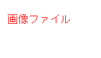

# ＜タイトル＞

## ＜活動内容＞

### このレッスンで身につける力

- [ ] チェック付き箇条書き

---

### ミッションの準備

#### ＜手順＞

- [ ] 

#### ＜具体的手順＞

##### ＜内容のタイトル＞　 

[リンク例（Google）](https://www.google.co.jp/)



<本文>

```C++
void setup() {
  // put your setup code here, to run once:

}

void loop() {
  // put your main code here, to run repeatedly:

}
```


### ミッションチャレンジ

＜本文＞

``` C++
void setup() {
  // put your setup code here, to run once:
  // サンプルコード
void loop() {
 
}

```

#### ＜ミッションチャレンジの内容＞

> 引用

- [ ] チェックポイント1
- [ ] チェックポイント2

---

### まとめ


- **用語とか概念の名前** :＜説明＞
- `コードの書き方` : ＜説明＞

#### 出来たことをチェックしよう

- [ ] ＜〜できる。全体構成と一致させる＞