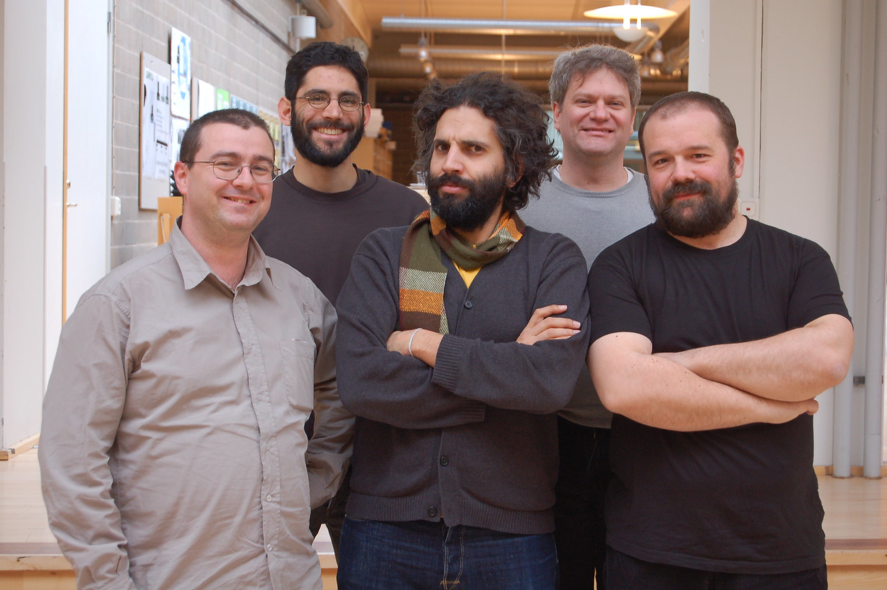
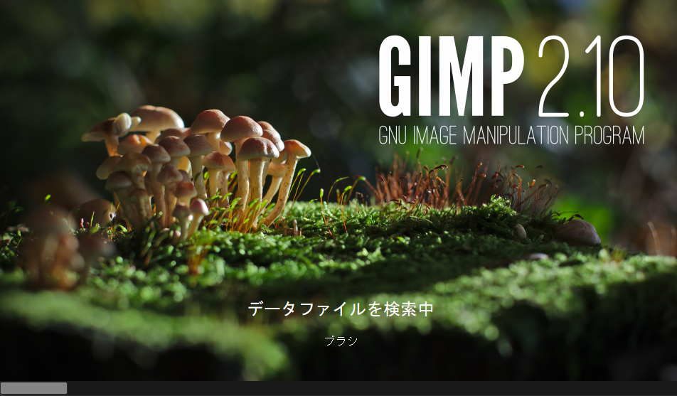
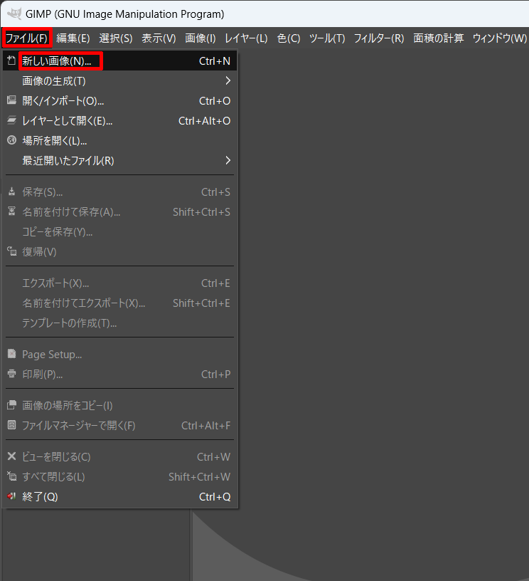
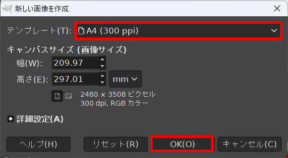
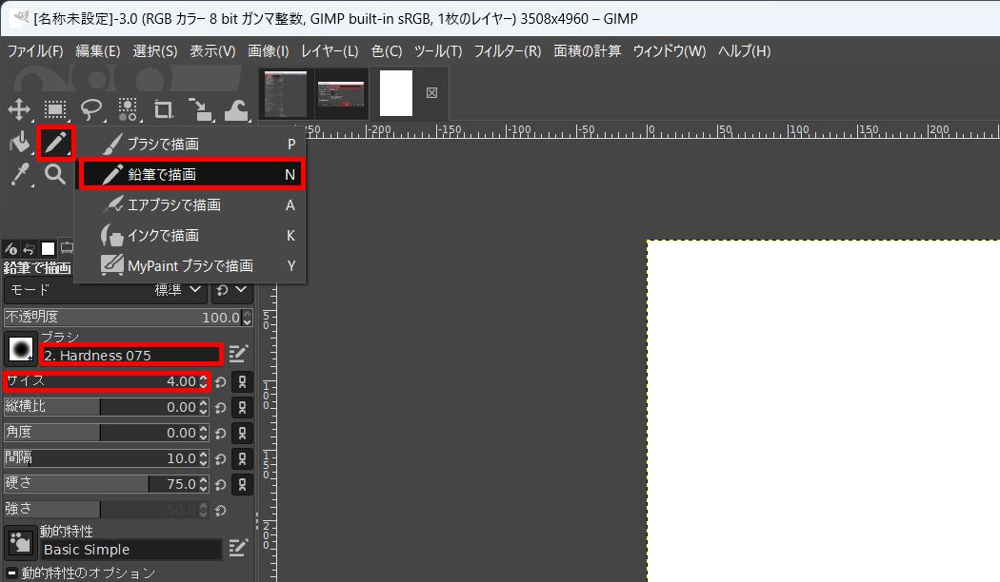

# レッスン01 オリエンテーション

## ミッション

**ロボ部で何を学ぶのかを知り、Arduinoとオープンソースについて自分の言葉で説明できるようになろう。**

## このレッスンで身につける力

- [ ] Arduinoについて説明できる
- [ ] オープンソースの利点と欠点を説明できる
- [ ] レッスンに必要なPC操作ができる
- [ ] タイピングの指の対応を覚える

## 今回使う技術

- パソコンの基本操作（アプリの起動・終了、ウィンドウの切り替え）
- タイピングのホームポジション
- オープンソースソフトウェア（GIMP）を使ってみる

---

## ミッションの準備

### 用意するもの

- [ ] パソコン
- [ ] ノート（考えたことを書く）

### 手順

このレッスンはロボットを組み立てません。まずはロボ部で何をやるのかを知るところから始めます。

---

## メインミッション

### ロボ部はこんな活動です！

こんにちは！アイアルクの**ロボ部**のレッスンへようこそ！
ロボ部ではいままでよりも本格的なロボットのレッスンが学べます。ロボ部で使うロボットはこれ！

カッコイイよね。このロボットを少しずつ作りながら、最後は**対戦ゲーム**を行う予定です。

これはLEGOなどで動いていたロボットとは違って、部品が丸出しになっています。だから、センサーやモーターの原理がより深く学べるんだ！

その代わり、囲われていない分こわれやすいとも言えます。このロボットはみんなひとりひとり自分のロボットをお家の人に買ってもらったものだから、**大切**に使ってくださいね。こわれたときは、そのパーツを別に買ってもらうことになります！

### ロボ部の4つの段階

ロボ部は次の4つの段階で進みます。何回受けたら次に進む、ではなく、**できるようになったら次に進みます。**

| 段階 | 何をするか |
|---|---|
| **入門** | ブレッドボードを使って、部品ひとつひとつの仕組みを知る（いまここ） |
| **実践** | ロボットカーを組み立てて、部品をのせて課題を解く。最後は対戦ゲーム |
| **応用** | 自分だけのロボットを設計して作る |
| **発展** | 作ったロボットを、新しい対戦に向けて改造する |

最後は**自分で考えて作ったロボット**で戦うのがゴールです。

### Arduino（アルディーノ）について

ロボ部のロボットの頭脳とも言えるコンピュータを**Arduino**といいます。これはイタリアのある王様の名前から取られたもの。2005年に、いままで高くて教育用には使えなかったマイコンを**安く多くの人に**使ってもらえるように、と開発されたものなんだ。

安くてシンプルで使いやすいと評判になって、世界中の電子工作や電気回路、プログラムを学ぼうとしている人たちに使われています。その中には子どもだけじゃなくて、大学や企業でしっかりと学ぼうとしている人たちも含まれているんだ。

出典: https://www.flickr.com/photos/dcuartielles/2363657276/

#### 考えてみよう

次の問いを考えて、ノートに答えを書いてみましょう。

1. Arduinoを使うメリットは何ですか？
2. Arduinoを作ろうとした理由は何でしょうか？

### オープンソースという自由

Arduinoは**オープンソース**という考え方で作られていて、非常に安価に使うことができます。

オープンソースとは **「誰でもソフトウェアを使える、作れる、改造できる」** という方針で作られたプログラムのことです。そのためにプログラムの設計図が公開されています。公開されているということは、誰でも真似をしたり改造したりできます。だから、プログラムを学ぶことにはとても都合がいいんですね。

実際たくさんのArduinoが公開されていて、それを使うことができます。

オープンソースには次のようなメリットがあります。

- 無料で使える
- 問題を修正したり、機能を追加したりできる
- 自由にビジネスで利用できる
- 作る人、使う人の集まりがあり、サポートがもらえる

その一方で**自己責任である**という特徴があります。使っていて何かしらのトラブルがあっても自分で解決してください、ということで少しハードルが高くなっています。

この反対に、ソースコードを公開しないソフトウェアもあります。例えばパソコンの基本ソフトである「**ウィンドウズ**」や、表計算ソフトの「**エクセル**」、絵を書いたり写真を修正したりできる「**フォトショップ**」など、有名なソフトウェアはほとんどがオープンソースではありません。ソフトウェアの開発にはたくさんのお金がかかりますから、無料で公開してしまっては、その開発費を賄うことができないので当然と言えば当然です。

オープンソースは多くのボランティアさんに支えられた活動です。**「ソフトウェアはみんなのもの」** という高い志によって多くのソフトウェアやサービスが開発されていて、コンピュータの世界を動かす原動力になっています。大きなオープンソース活動に関わることは、一流のソフトウェア開発者の証のようにもなっている大変名誉なことでもあります。

ウィンドウズの代わりにオープンソースの [**Linux(リナックス)**](https://jp.ubuntu.com/) を使ったり、エクセルの代わりに [**LibreOffice(リブレオフィス)**](https://ja.libreoffice.org/) を使ったり、フォトショップの代わりに [**GIMP(ギンプ)**](https://www.gimp.org/) を使ったりすることができます。

### GIMPを使ってみよう

では、試しにGIMPを使ってみましょう。楽しいお絵かきソフトですが、ものすごく高性能です。

デスクトップにある  のアイコンをクリックしてGIMPを立ち上げてみましょう。

では、GIMPを使ってお絵描きをしてみましょう。

「ファイル」＞「新しい画像」とクリックして白紙のページを作ってみよう。

テンプレートを選んで画像の大きさを決めたらOKを押そう。

白紙のキャンパスが出てきたら、鉛筆ツールで何か書いてみよう。

GIMPのより詳しい使い方については [ここ](https://gazocustomize.com/gimp/) や検索を使って調べてみよう。

---

## 確認

- [ ] GIMPを起動して、白紙の画像を作れた
- [ ] 鉛筆ツールで絵を描けた
- [ ] 描いた絵を**スクリーンショット**で撮れた（まとめページで使います）

> **スクリーンショットの撮り方**
> キーボードの `PrintScreen` キーを押すと画面全体が撮れます。今日から毎回使うので覚えておこう。

---

## やってみよう

描いた絵に**色を塗ってみよう。** 塗りつぶしツールを探して、好きな色で塗ってみること。

うまくいかなかったら、検索して調べてみよう。「GIMP 塗りつぶし」で調べると出てきます。
**自分で調べて解決する**のも、ロボ部で身につけたい力のひとつです。

---

## まとめ

### できるようになったことをチェックしよう

- [ ] Arduinoについて説明できる
- [ ] オープンソースの利点と欠点を説明できる
- [ ] レッスンに必要なPC操作ができる
- [ ] タイピングの指の対応を覚える

### 考えてみよう

次の問いを考えて、ノートに答えを書いてみましょう。

1. オープンソースを使うメリットは何ですか？
2. オープンソースを使うデメリットは何ですか？
3. あなたが使ってみたいオープンソースのソフトウェアは何ですか？

### まとめページに書こう

Googleサイトの自分の**まとめページ**に、次の4つを書こう。

1. **やったこと**
2. **わかったこと**
3. **感じたこと**
4. **つぎやること**

**スクリーンショットか画像を必ず1枚入れること。** 今日はGIMPで描いた絵を入れよう。

> まとめは1日に1回書く。
> 複数のレッスンを進めた日も、1つのレッスンが1回で終わらなかった日も、まとめは1回。
