# レッスン02 ハローワールド

## ミッション

**シリアルモニターに "Hello World!" と自分の名前を表示させよう。**

## このレッスンで身につける力

- [ ] **Arduino IDE**を起動できる
- [ ] 白紙の**スケッチ**を作れる
- [ ] スケッチを決まった名前で保存できる
- [ ] スケッチに**コメント**を入れることができる
- [ ] `Serial.begin()` と `Serial.println()` を使って "Hello World" を表示できる

## 今回使う技術

- Arduino IDE の起動とスケッチの保存
- コメント `//`
- `Serial.begin(9600)` — シリアルポートを使う準備
- `Serial.println()` — シリアルモニターに表示する
- `delay()` — 待つ
- 引用符 `" "`

---

## ミッションの準備

### 用意するもの

- [ ] Osoyoo UNO Board（Arduino UNO rev.3と完全互換） x 1
- [ ] USBケーブル x 1
- [ ] パソコン x 1

### 手順

#### 1. Arduino IDE とはなに？

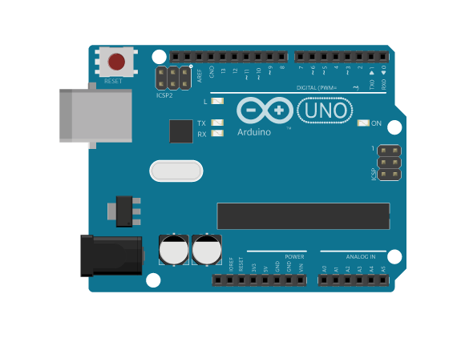

Arduino（あるでぃーの）は世界中で使われているコンピュータ。ロボットや電子工作に使われているよ。安い上に、使うためのいろいろな情報が豊富で、コンピュータやロボットの学習にピッタリ。

Arduino IDE（あるでぃーの あいでぃーいー）は、Arduinoのためのプログラムを書くためのツールです。

> **※教室でやるときはインストールは済んでいます。「2. スケッチを作成しよう」まで進んでください。**
>
> 自分のパソコンに入れたいときは https://www.arduino.cc/en/software からダウンロードできます。
>
> 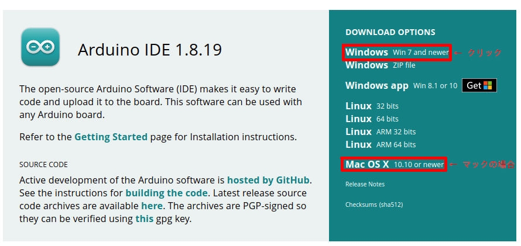
> 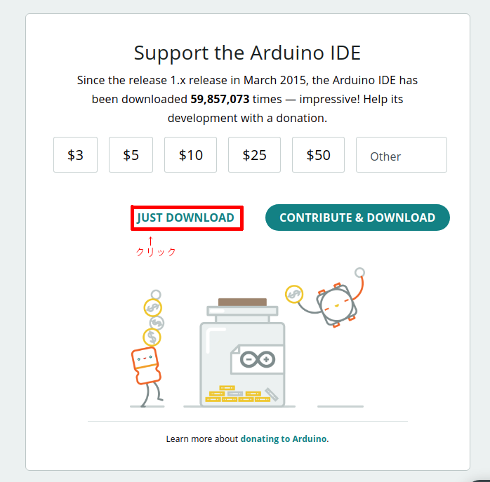
> 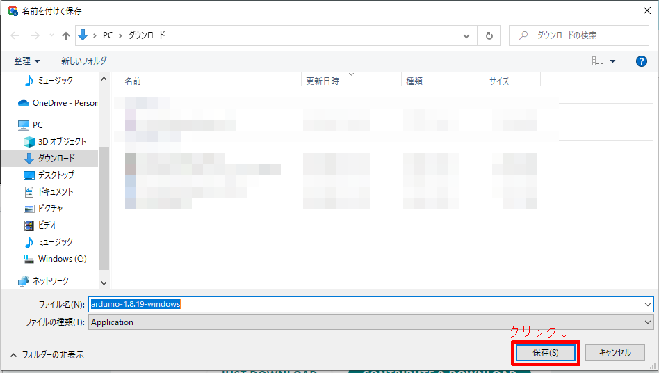
> 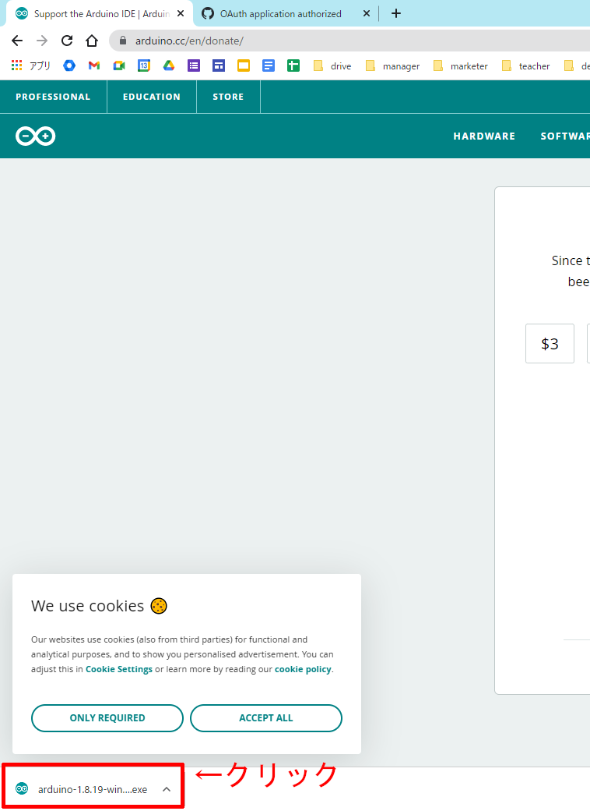

#### 2. スケッチを作成しよう

デスクトップにあるアイコン 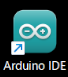 をクリックして起動してみましょう。

こんな画面が出てくるはずです。この画面のプログラムのことを**スケッチ**といいます。

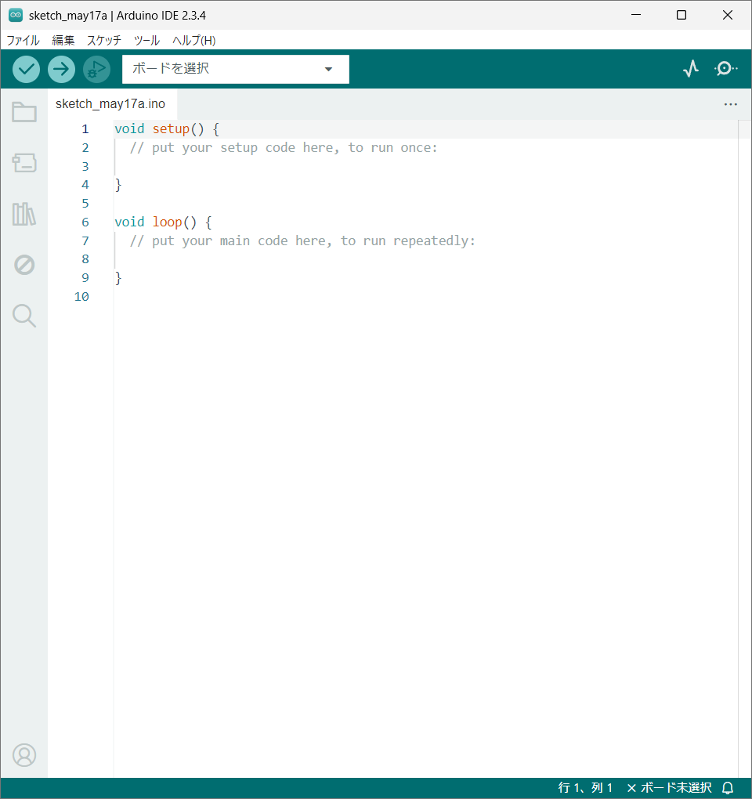

以前使った人がいたら、その人のスケッチが表示されているかもしれません。そのときは新しいスケッチを作成します。

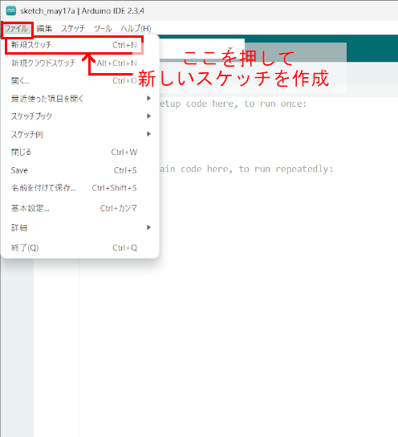

#### 3. スケッチを保存しよう

最初にスケッチを保存しておきましょう。ファイル名は分かりやすいのが一番ですが、ロボ部では次の書き方をおススメしています。

**（日付4桁の数字）（自分の名前ローマ字）（レッスン番号2桁の数字）**

例えば、4月10日に誠さんがレッスン02のファイルを保存するときには **`0410makoto02`** となります。

レッスンに複数のファイルがある場合は、末尾に **`_1` `_2` `_3`** と足していきます。
例：`0410makoto03_1` `0410makoto03_2`

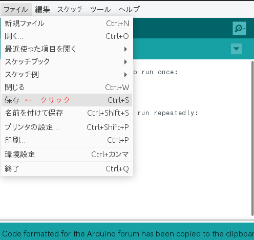

そうするとデスクトップに、先ほど付けた名前のフォルダーができていると思います。フォルダーの中には「（付けた名前）.ino」というファイルがあるはずです。

スケッチを移動したりするときには、**このフォルダーごと**行うようにしましょう。

> **この名前の付け方は、これから毎回使います。**
> 次のレッスンでは「前回保存したファイルを開いて続きをする」こともあるので、どこに保存したか覚えておこう。

#### 4. コメントについて知ろう

次に、できた画面を詳しく見てみましょう。アルファベットがたくさん並んでいますね。

プログラムは英語を元にして書くことが多いのですが、英語の単語は少しずつ覚えていけば大丈夫。安心してね。

```C++
void setup() {
  // put your setup code here, to run once:

}

void loop() {
  // put your main code here, to run repeatedly:

}
```

`//` で始まる行が2つあるのを見つけられるかな？
`//` で始まる行は**コメント**といって、プログラムの中で実行されない部分です。

プログラムなのに動かない行があるのは変だと思いますか？これがなかなか便利なんです。

**便利なコメントの使い方**

- プログラムの使い方や書き方などを説明する文を書く。日本語でも大丈夫。
- プログラムの動きを調べるために、コメントにして動かないようにする（**コメントアウト**）

---

## メインミッション

### サンプルコードを貼り付けよう

スケッチに、このコードをコピーして貼り付けていきましょう。

```C++
void setup() {
  // put your setup code here, to run once:
  // (日本語訳)最初に一度だけ動かすプログラムはここに書く
  Serial.begin(9600); // シリアルポートを使うための準備
}
void loop() {
  // put your main code here, to run repeatedly:
  // (日本語訳)繰り返して動かすプログラムはここに書く
  Serial.println("Hello World!");
  //シリアルは「Hello World！」という文字列を出力します
  delay(5000);
  // 5秒待機させます（この数値を変更して時間を設定することができます）
}
```

> **コピーアンドペースト（コピペ）のやり方**
>
> 1. コピーする範囲をマウスでドラッグして選択
> 2. `Ctrl` + `C` を押してコピー
> 3. Arduino IDEのウィンドウで貼り付けたいところに `Ctrl` + `V` すると貼り付けられる
>
> **便利な技**
>
> - `Ctrl` + `A` を押すとすべてを選択できる
> - 選択したところに貼り付けると、選択した範囲を消して貼り付けられる
> - `Ctrl` + `X` を押すと元の選択範囲を消してコピーできる（切り取り）

- [ ] **コピーアンドペースト**ができたらチェック！
- [ ] 一番はじめの行にコメントで自分の名前を入れてみよう。できたらチェック！

### スケッチをArduinoに書き込もう

次に、スケッチをArduinoに書き込んでいきます。

まずUSBケーブルをArduinoとつなぎます。
Arduinoはいろいろな種類があるので、それを選びます。
次に接続しているポートを選びます。デバイスの名前が付いているのが選ぶべきポートです。

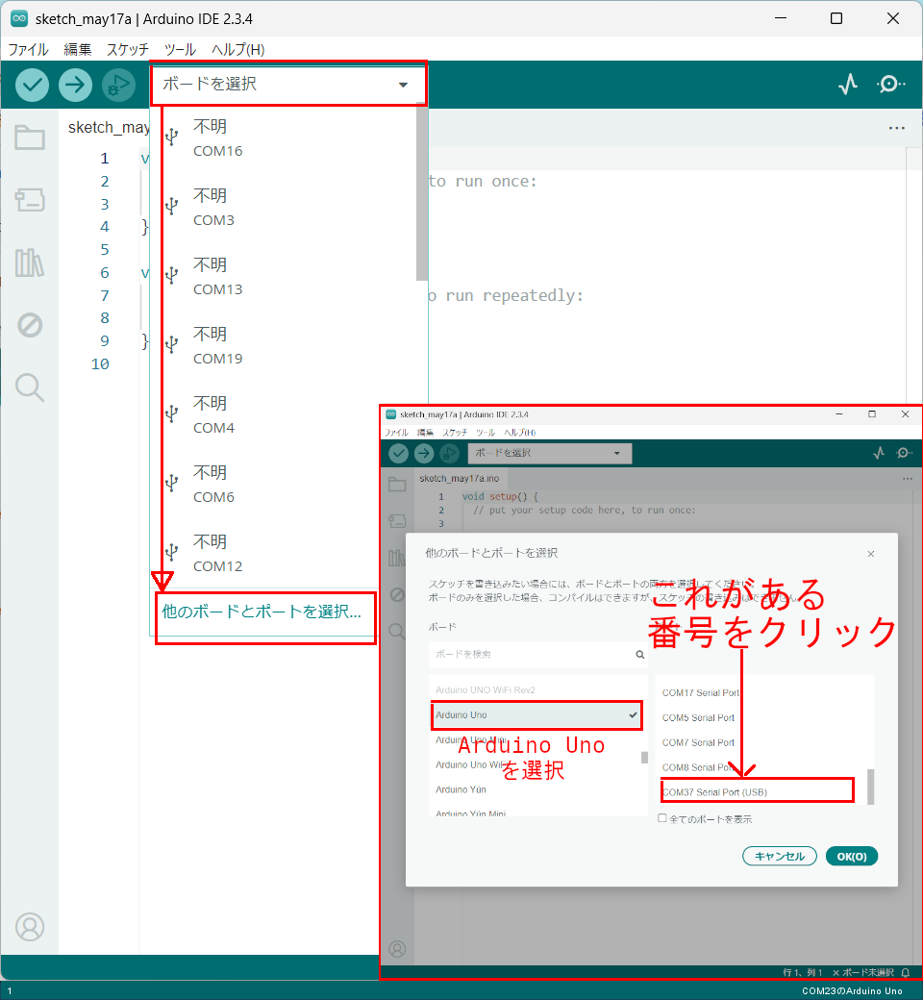

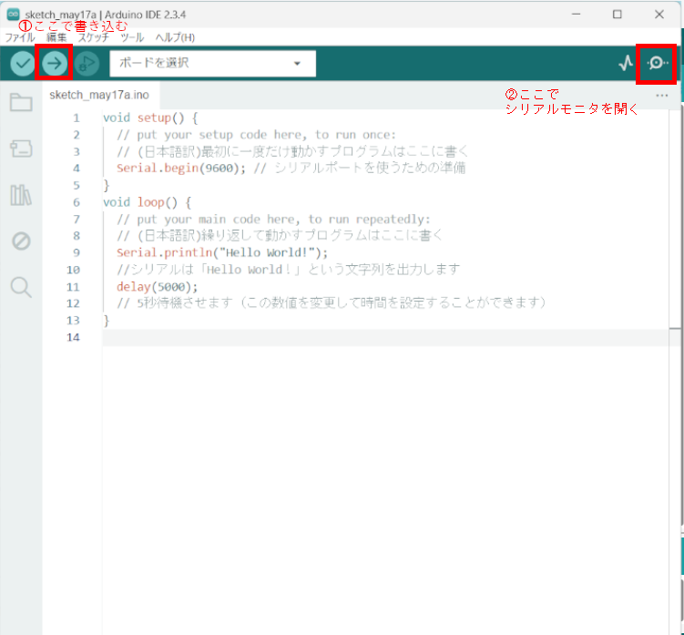

虫眼鏡のマークのアイコンをクリックするとシリアルモニターが開きます。

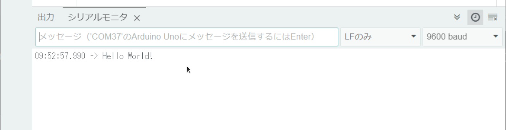

このプログラムは5秒ごとに "Hello World!" が表示されるスケッチですね。

---

## 確認

作ったものを動かして確かめよう。

- [ ] シリアルモニターに "Hello World!" が表示された
- [ ] 5秒ごとに1行ずつ増えていく

うまくいかないときは、ここを見てみよう。

| 症状 | 見るところ |
|---|---|
| 書き込みでエラーが出る | ボードとポートの設定が合っているか |
| 何も表示されない | シリアルモニターの通信速度が `9600` になっているか |
| 文字化けする | 同じく通信速度を確認 |

---

## やってみよう

### 1. 自分の名前を表示させてみよう

```C++
  Serial.println("ここに自分の名前");
```

`" "` は文字を表す記号 **「引用符」** です。この間に自分の名前などの表示させたい言葉を入力してみましょう。日本語でも大丈夫だよ。

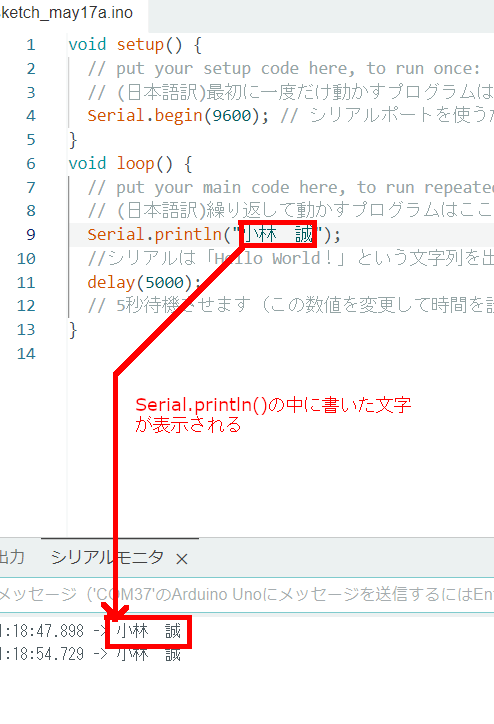

- [ ] 自分の名前をシリアルモニターに表示できたらチェック！

### 2. 表示される間かくを1秒に変えてみよう

`delay(5000);` の数字を変えると、表示される間かくが変わります。
**1秒ごとに表示されるように**変えてみよう。

- [ ] 1秒ごとに表示されるようになったらチェック！
- [ ] `delay()` の数字は何を表しているか、説明できたらチェック！

---

## まとめ


- **Arduino** : ロボットを動かすためのコンピュータ
- **Arduino IDE** : Arduinoのコードを書くためのツール
- **スケッチ** : Arduino IDEのプログラムのこと
- `//` : **コメント**。実行されない。説明を書いたり、動かないようにしたりする
- `Serial.begin(9600);` : シリアルポートを使うための準備。`setup()` に書く
- `Serial.println();` : シリアルモニターに表示する
- `delay(5000);` : 5000ミリ秒＝5秒待つ
- `" "` : 文字を表す記号「**引用符**」

### できるようになったことをチェックしよう

- [ ] **Arduino IDE**を起動できる
- [ ] 白紙の**スケッチ**を作れる
- [ ] スケッチを決まった名前で保存できる
- [ ] スケッチに**コメント**を入れることができる
- [ ] `Serial.begin()` と `Serial.println()` を使って "Hello World" を表示できる

### ファイルを保存してクラウドに上げよう

**レッスンが終わったら、かならずやること。**

今日つくったスケッチは**1つ**。名前がこうなっているか確かめよう。

`（日付4桁）（自分の名前ローマ字）02`

例：4月10日に誠さんなら `0410makoto02`

1. スケッチの名前が上の形になっているか確かめる
2. スケッチを**フォルダごと**、**「生徒共有」の中の自分のフォルダ**に入れる
3. 入れたあと、フォルダの中に `.ino` ファイルが入っているか確かめる

> **なぜフォルダごと運ぶの？**
> Arduinoのスケッチは、**フォルダと、その中の `.ino` ファイルがセット**になっています（レッスン02）。
> `.ino` だけを取り出して運ぶと、開けなくなってしまうんだ。

- [ ] ファイル名を決まった形にできた
- [ ] スケッチをフォルダごと「生徒共有」の自分のフォルダに上げられた

### まとめページに書こう

Googleサイトの自分の**まとめページ**に、次の4つを書こう。

1. **やったこと**
2. **わかったこと**
3. **感じたこと**
4. **つぎやること**

**スクリーンショットか画像を必ず1枚入れること。** 今日はシリアルモニターの画面を撮って入れよう。

> まとめは1日に1回書く。
> 複数のレッスンを進めた日も、1つのレッスンが1回で終わらなかった日も、まとめは1回。
