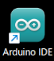
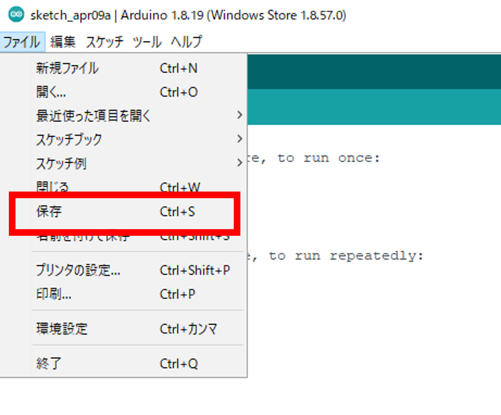
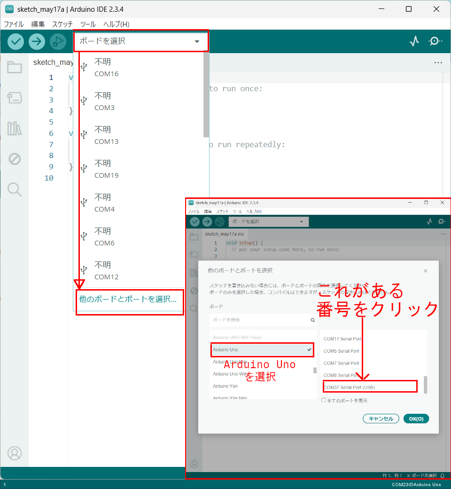
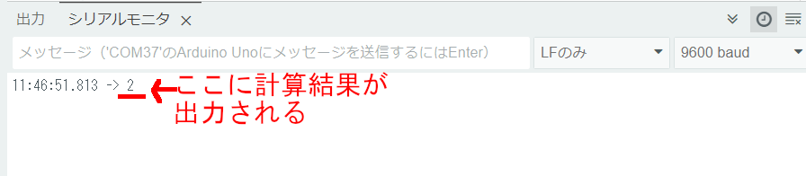

# レッスン03 Arduinoでタイマーをつくろう

## ミッション

**シリアルモニターの入力でスタート・ストップできるタイマーを作り、0.1秒まで測れるように改良しよう。**

## このレッスンで身につける力

- [ ] 足す、引く、掛ける、割るの計算ができる
- [ ] 計算の順序に合わせて `( )` を使える
- [ ] `delay()` と変数、整数型（`int`）を使ってタイマーを作れる
- [ ] 浮動小数点型（`float`）を使ってタイマーを改良できる

## 今回使う技術

- 四則演算 `+` `-` `*` `/` と `( )`
- 変数の宣言、データ型（`int` と `float`）
- `Serial.available()` と `Serial.read()` — シリアルモニターからの入力を受け取る
- `if` 文と `||`（または）
- `delay()` でループの速さを決める

---

## ミッションの準備

### 用意するもの

- [ ] Osoyoo UNO Board（Arduino UNO rev.3と完全互換） x 1
- [ ] USBケーブル x 1
- [ ] パソコン x 1

### 手順

#### 1. Arduino IDEを起動しよう（復習）

デスクトップにあるArduinoのアイコン  をダブルクリックしてArduino IDEを起動し、白紙のスケッチを作っておきましょう。


#### 2. スケッチを保存しよう（復習）

ファイル→保存をクリック（`Ctrl` + `S` でもOK）して、デスクトップに「(日付)(ローマ字の名前)03_1」という名前で保存しましょう。

（例）5月17日にまことさんが作ったファイルなら **`0517makoto03_1`**



#### 3. Arduinoとパソコンを接続しよう（復習）

Arduino UNOボードとパソコンをUSBケーブルでつなぎましょう。


> 【注意】USBを抜き差しするときは向きを確認して、ていねいにあつかうこと。

USBを差したら、Arduino IDEでポートを指定しましょう。
ツール→シリアルポートをクリックして、「COM〜（USB）」となっているものをクリックします。（COM〜の数字は毎回変わります。）



---

## メインミッション

### ステップ1 Arduinoを計算機として使ってみよう

以下をすべてコピー＆ペーストしましょう。

```C++
void setup() {
  // put your setup code here, to run once:
  // (日本語訳)最初に一度だけ動かすプログラムはここに書く
  Serial.begin(9600); // シリアルポートを使うための準備
}
void loop() {
  // put your main code here, to run repeatedly:
  // (日本語訳)繰り返して動かすプログラムはここに書く
  Serial.println(1 + 1);
  //()内の計算をしてシリアルモニタに表示
  delay(5000);
  // 5秒待機させます（この数値を変更して時間を設定することができます）
}
```

1. コピー＆ペーストができたら左上の矢印  を押して（または `Ctrl` + `U`）、プログラムを書き込みましょう。
2. 右上の  をクリックしましょう。
3. シリアルモニタが表示されたら、ボーレートが **9600** になっていることを確認しましょう。なっていなかったら変更します。




#### 計算式の書き方を覚えよう

足し算、引き算、掛け算、割り算のことを **「四則演算（しそくえんざん）」** と言います。
算数の時間だけでなく、プログラムを書くときもこの四則演算を使うことが多いです。

| 種類 | 算数 | プログラム |
| ---- | ---- | ---- |
| 足し算 | + | + |
| 引き算 | - | - |
| 掛け算 | × | * （アスタリスク） |
| 割り算 | ÷ | / （スラッシュ） |

四則演算が混ざった計算は、掛け算 `*` と割り算 `/` が先に計算されます。

- `2 + 3 * 2` → 先に `3 * 2` を計算する → `2 + 6` → **8**

足し算・引き算を先に計算させたいときは `( )` を使います。

- `(1 + 2) * 3` → **9**
- `((1 + 2) * 3) / 3` → **3**

上のプログラムの `Serial.println(1 + 1);` の行を改造して、いろいろな計算をしてみましょう。

```C++
  Serial.println(2 + 3 * 2);
```

```C++
  Serial.println(((1 + 2) * 3) / 3);
```

- [ ] 足す、引く、掛ける、割るの計算ができたらチェック
- [ ] 計算の順序に合わせて `( )` を使えたらチェック

---

### ステップ2 カウントアップするタイマーをつくろう

50m走をするときに使うストップウォッチなどは、1秒の100分の1（＝0.01秒）や1000分の1（＝0.001秒）の細かい時間まで測ることができます。
ここでは、カウントアップするタイマーを作りましょう。

ファイル→名前を付けて保存をクリックして、「(日付)(ローマ字の名前)03_2」という名前で保存しましょう。

以下をすべてコピー＆ペーストしましょう。

```C++
int count = 0;
//整数型の変数countを定義

void setup() {
  Serial.begin(9600);
  Serial.println("Yを押してタイマースタート");
}
void loop() {
  if (Serial.available()) {
  //シリアル信号を受信した場合
    char ch = Serial.read();
    //受信した値を変数に代入
    if (ch == 'y' ||  ch == 'Y') {
    //yまたはYだった場合
      Serial.println("タイマーON");
      Serial.println("タイマーを止めるにはNを押してください");
      count = 0;
      //countに0を代入
    }
    if (ch == 'n' ||  ch == 'N') {
    //nまたはNだった場合
      Serial.println("タイマーOFF");
      Serial.print(count);
      Serial.println(" 秒");
      Serial.println("Yを押してタイマースタート");
      count = 0;
      //countに0を代入
    }
  }
  delay(1000);
  //1秒待機
  count += 1;
  //countに1を足す

}
```

1. 書き込んで、シリアルモニタを開きましょう。
2. ボーレートを **9600** に、改行の設定を「**改行なし**」にしましょう。
3. シリアルモニタに「y」を入力してEnterを押すと、タイマーが起動します。
4. 数秒後、「n」を入力してEnterを押すと、タイマーが停止して経過した時間が表示されます。


#### 変数とデータ型について学ぼう

**変数**は、数字や文字を入れておく入れ物のことです。MindStormsではカバンになっていましたね。

Arduinoでは、変数を使う前に宣言する（用意する）必要があります。

```C++
int count = 0;
```

これは「整数が入る変数 `count` を用意して、その変数に0を入れた」ということになります。

`int` が「**整数型**」を表します。整数とは「1」「100」「-5」などの、小数や分数以外の数字です。
整数型には整数しか入りません。「3.14（小数）」「b（文字）」などは入りません。

小数を扱いたいときは **`float` 型**を使います。`float` 型は「浮動小数点型」とも言います。

---

## 確認

作ったものを動かして確かめよう。

- [ ] 「y」を押すとタイマーがスタートする
- [ ] 「n」を押すと止まって、かかった秒数が表示される
- [ ] 10秒数えてみて、表示された秒数とだいたい合っている

うまくいかないときは、ここを見てみよう。

| 症状 | 見るところ |
|---|---|
| 「y」を押しても反応しない | シリアルモニタの改行の設定が「改行なし」になっているか |
| 文字化けする | ボーレートが9600になっているか |
| 数字がずれる | `delay()` の数と `count += ` の数が合っているか |

---

## やってみよう

### 0.1秒ごとに測れるタイマーに改良しよう

ステップ2のタイマーは1秒ずつしか測れませんでした。50m走や水泳に使うなら、せめて0.1秒ごとに測りたいですよね。

プログラムの下のほうに `delay(1000);` という行があります。**`delay(1000)` は1秒待つ**という意味です。
1秒なら1000、2秒なら2000、0.5秒なら500です。

つまり、**このプログラムは1秒に1回ループする**ようになっています。ここを変えれば、0.1秒ごとに測れそうですね。

**1つめの変更** — ループを遅らせる時間を1000ms（1秒）から100ms（0.1秒）に変えます。

```C++
delay(100);
```

**2つめの変更** — `count += 1;` は `count` の値を1増やす、という意味です。0.1秒ごとなら増やす量も変えないといけませんね。

```C++
count += 0.1;
```

に変えて実行してみましょう。


**何秒経っても0秒のままです。** なぜでしょう？

> **ヒント**：`count` は何型で宣言したかな？ 整数型に0.1を足そうとするとどうなる？

**3つめの変更** — `count` を小数も入る `float` 型に変えます。

```C++
float count = 0;
```


**0.1秒単位で数字が表示できました！**

- [ ] `delay()` を使ってタイマーを改良できたらチェック
- [ ] `float` 型を使ってタイマーを改良できたらチェック

### さらにやってみよう

**0.01秒単位のタイマー**を作ってみよう。どこを、いくつに変えればいいかな？

---

## まとめ

- プログラムでの四則演算は `+` `-` `*` `/`。掛け算・割り算が先、`( )` で順序を変えられる
- シリアルモニタでデータの入力・表示ができる
- ループを遅らせるための命令は `delay();`
- **変数**は、数字や文字を入れておく箱
- `int` 型は「整数型」、`float` 型は「浮動小数点型」
- **型を間違えると、エラーにならずに変な結果になることがある**

### できるようになったことをチェックしよう

- [ ] 足す、引く、掛ける、割るの計算ができる
- [ ] 計算の順序に合わせて `( )` を使える
- [ ] `delay()` と変数、整数型（`int`）を使ってタイマーを作れる
- [ ] 浮動小数点型（`float`）を使ってタイマーを改良できる

### まとめページに書こう

Googleサイトの自分の**まとめページ**に、次の4つを書こう。

1. **やったこと**
2. **わかったこと**
3. **感じたこと**
4. **つぎやること**

**スクリーンショットか画像を必ず1枚入れること。** 今日はタイマーが動いているシリアルモニタを撮って入れよう。

> まとめは1日に1回書く。
> 複数のレッスンを進めた日も、1つのレッスンが1回で終わらなかった日も、まとめは1回。
