# レッスン04 LEDの点滅をコントロールしよう

## ミッション

**ブレッドボードに回路を作り、キーボードの入力で2つのLEDを光らせ分けよう。**

## このレッスンで身につける力

- [ ] **ブレッドボード**で回路を作れる
- [ ] `Serial.read()` を使って文字の入力を取れる
- [ ] `setup()` について説明できる
- [ ] `loop()` について説明できる
- [ ] `pinMode()` でピンの設定ができる
- [ ] **if構文**を使ってプログラムを改造できる
- [ ] **for文**を使って同じ処理を繰り返せる

## 今回使う技術

- ブレッドボードとジャンパー線を使った配線
- `pinMode()` — ピンを入力／出力に設定する
- `digitalWrite()` — ピンにHIGH／LOWを出す
- `if` 文と比較演算子
- `for` 文・`while` 文 — 繰り返し

---

## ミッションの準備

### 用意するもの

- [ ] Osoyoo UNO Board（Arduino UNO rev.3と完全互換） x 1
- [ ] USBケーブル x 1
- [ ] パソコン x 1
- [ ] ブレッドボード x 1 ※先生に言って借りてくる
- [ ] ジャンパー線（オス-オス）x 4 ※先生に言って借りてくる
- [ ] LED(赤) x 1 ／ LED(白) x 1 ※先生に言って借りてくる
- [ ] 抵抗（330Ω）× 2 ※先生に言って借りてくる

### 手順

#### 0. Arduino IDEを起動しよう

デスクトップにあるArduinoのアイコンをダブルクリックして起動しましょう。


#### 1. スケッチを保存しよう

ファイル→保存をクリック（`Ctrl` + `S` でもOK）して、デスクトップに「(日付)(ローマ字の名前)04_1」という名前で保存しましょう。


#### 2. Arduinoとパソコンを接続しよう

Arduino UNOボードとパソコンをUSBケーブルでつなぎましょう。


> 【注意】USBを抜き差しするときは向きを確認して、ていねいにあつかうこと。

USBを差したら、Arduino IDEでボードとシリアルポートを指定しましょう。
ツール→ボードをクリックして「Arduino/Genuino UNO」を選びます。
次にツール→シリアルポートをクリックして、「COM〜（Arduino UNO）」を選びます。

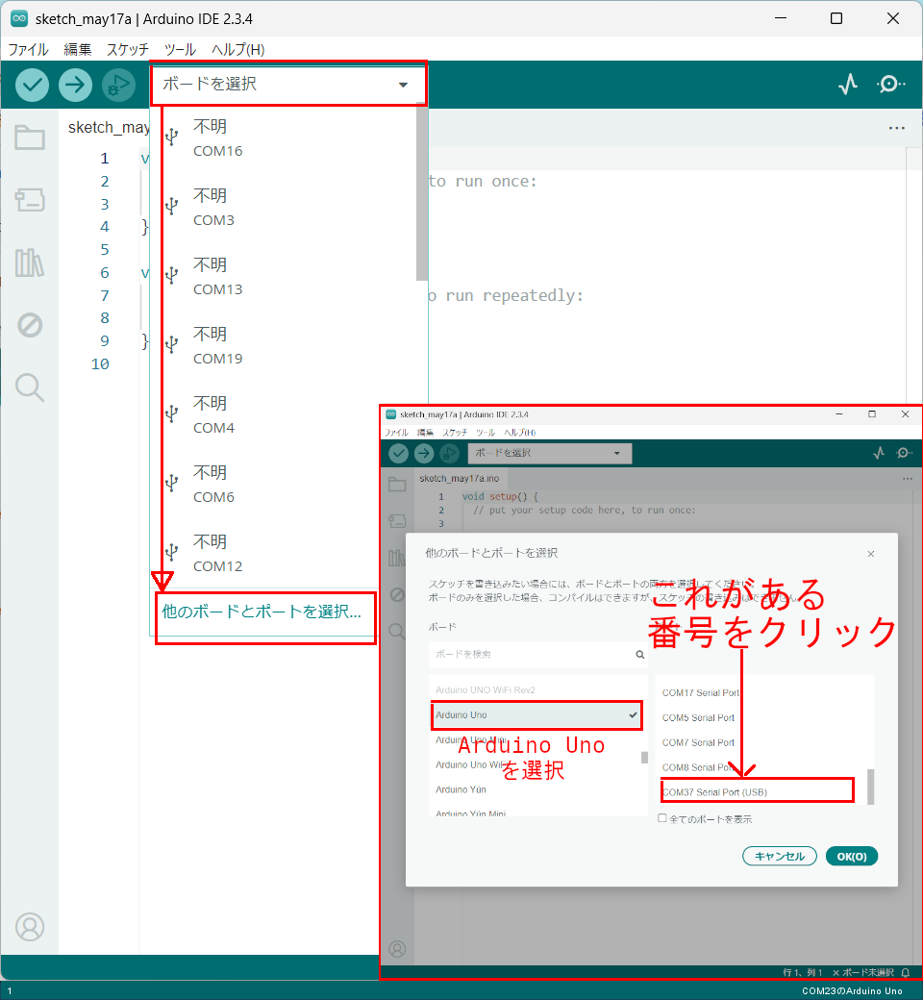

---

## メインミッション

### ステップ1 ブレッドボードで回路を作ってみよう

**ブレッドボード**と**ジャンパー線**を使って電子回路を組んでみよう。
ブレッドボードやジャンパー線を使うことで、ハンダ付けをしなくても簡単に電子回路を作ることができるんだ。

先生に声を掛けてブレッドボードとジャンパー線、LED(赤)を借りてこよう！

**＜ブレッドボード＞**

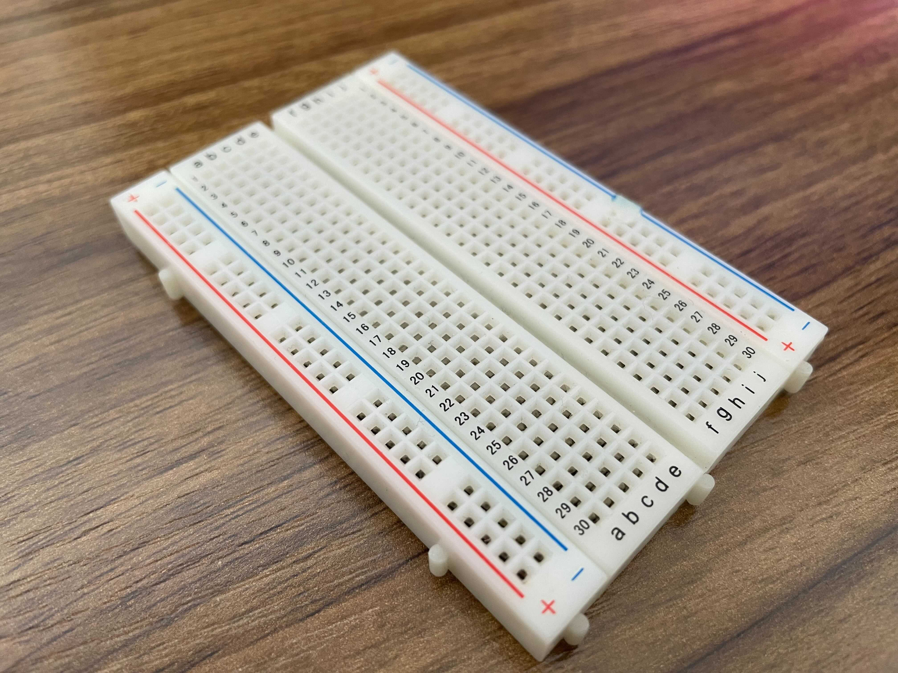

**＜ジャンパー線（オス-オス）＞**

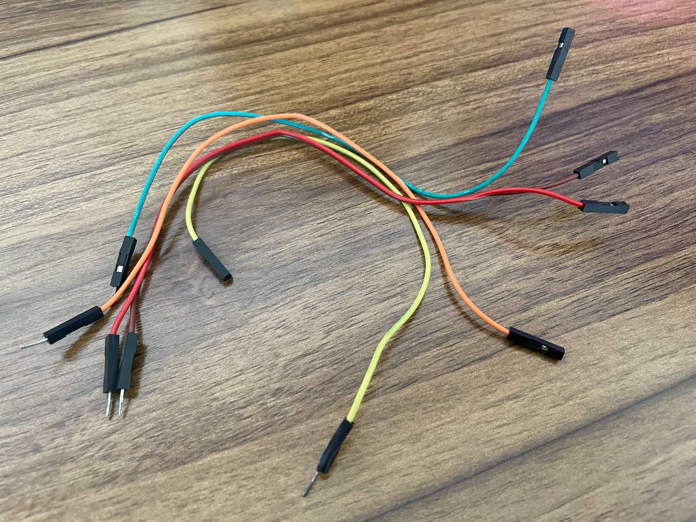

これらの器具とArduinoを使って、イラストと同じように配線をしてみよう！
**LEDにはプラスとマイナスの向きがある**ので注意しよう。

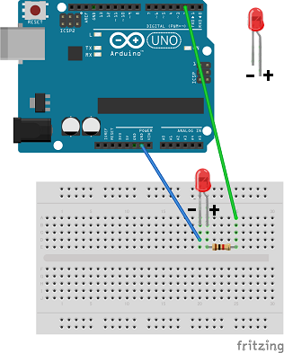

実際に配線するとこんな感じになるよ。

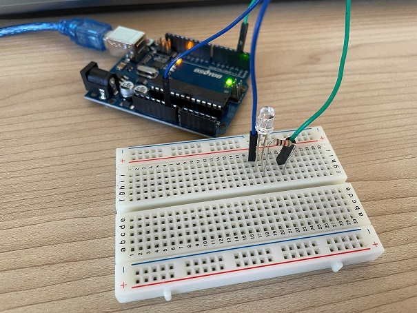

> **⚠ 電源を入れる前に、必ず「確認」の配線チェックをやること。**
> まちがった配線で電源を入れると、部品がこわれることがあります。

- [ ] ブレッドボードで回路を作れたらチェック！

### ステップ2 サンプルスケッチを実行させてみよう

スケッチに以下のコードをコピー＆ペーストして、実行してみよう。

```C++
void setup() {
  pinMode(2, OUTPUT);//LEDピンを出力へ
  Serial.begin(9600); //シリアルを9600バンドに設定する
  while (! Serial); // シリアルの初期化を許可する
  Serial.println("Yもしくはyを入力するとLEDが光るよ！");
}
void loop() {
  if (Serial.available()){
    char ch = Serial.read();
    if(ch=='y'||ch=='Y'){
      digitalWrite(2, HIGH);
      Serial.println("LEDが光りました!!");
      Serial.println("スイッチをオフにする場合はNまたはnを入力するとLEDが消えるよ!");
      }
    if(ch=='n'||ch=='N'){
      digitalWrite(2, LOW);
      Serial.println("LEDが消えました!!");
      Serial.println("スイッチをオンにする場合はYもしくはyを入力するとLEDが光るよ");
    }
  }
  delay(1000);
}
```

 を押してスケッチをArduinoに書き込もう！
書き込みが終わったら、シリアルモニター  をクリックしましょう。

シリアルモニターに文章が出てきたね！少し読んでみよう。

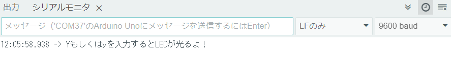

一番上の入力ボックスに大文字の `Y` を入力して、エンターを押してみよう。

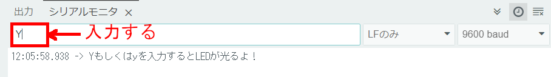

そうするとブレッドボード上のLEDが光るよ！

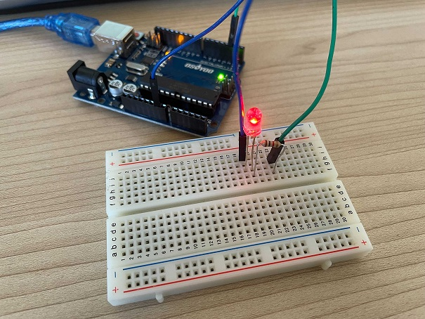
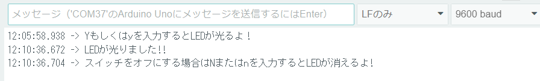

どうやら `n` か `N` を入力するとLEDが消えるらしいよ。同じように入力してみよう！

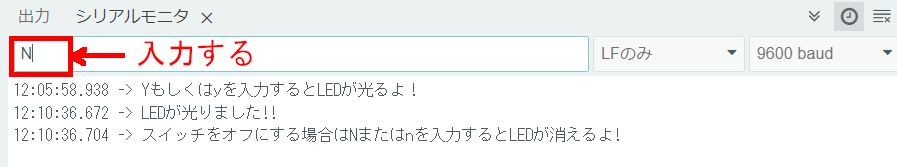

そうするとLEDが消えたね。

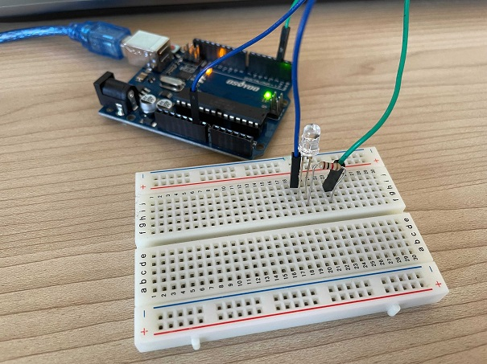

### ステップ3 プログラムの中身を知ろう

#### `Serial.read()` について

```C++
    char ch = Serial.read();
```

これはシリアルモニターの入力スペースに入れられた文字を、1文字ずつ `ch` という変数に代入しています。
`char` は文字を入れられるデータ型ですが、**英数字1文字しか入りません**。

```C++
  if (Serial.available()){
```

ここは、シリアルモニターに入力があったときだけ動くプログラムです。

#### `setup()` と `loop()` について

- **`setup()` 関数** — Arduinoに**電源が入ったとき一回だけ実行される**プログラム。ピンの設定やシリアル通信の開始をここに書く
- **`loop()` 関数** — **電源が切れるまでずっと繰り返される**プログラム。Arduinoのメインの処理

```C++
void setup() {
  pinMode(使いたいピンの番号, ピンの設定(入力or出力));

  最初に1回だけする処理をここに書く
}
void loop() {

  繰り返す処理をここに書く
}
```

#### `pinMode()` について

**`pinMode(ピン番号, モード)`** — Arduinoのピンを設定するためのものだよ。

- **INPUT（入力）** — Arduinoが**データを受け取る**ときに使う
- **OUTPUT（出力）** — Arduinoが**信号を出す**ときに使う

今回のプログラムでは、2番ピンを出力ピンに設定しているよ。

```C++
pinMode(2, OUTPUT);//LEDピンを出力へ
```

#### if文とは

キーボードを押すことでLEDが光ったり消えたりしたね。これは **if構文**という、条件分岐を行うための命令文を使っているからだよ。

```C++
if (条件式){
    (条件式が成立する場合の処理を記述)
}
```

**条件式**は、正しい（true）か正しくない（false）をプログラムに判断させるための式です。
if文は条件式がtrueのときだけ実行されます。

2つの値を比べる**比較演算子**もあります。

| 演算子 | 説明 |
| :----: | :--------------: |
| `x == y` | xとyが等しければtrue |
| `x != y` | xとyが等しくなければtrue |
| `x < y` | xがyより小さければtrue |
| `x > y` | xがyより大きければtrue |
| `x <= y` | xがy以下ならばtrue |
| `x >= y` | xがy以上ならばtrue |

また `||` は「**または**」という意味。`ch=='y'||ch=='Y'` は「小文字のyまたは大文字のY」ということだね。

### ステップ4 LEDを2つに増やして改造しよう

図のようにブレッドボードにLEDをもう一つ追加してみよう。

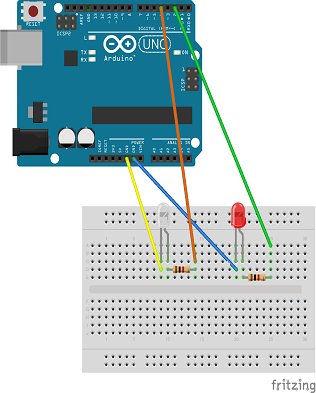

実際に配線するとこんな感じになるよ。

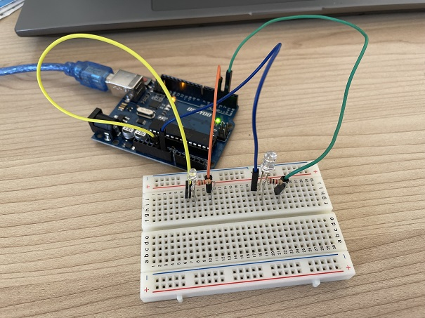

**追加したLEDをArduinoの4番ピンにつないで、キーボードの `m` もしくは `M` で光らせよう！**

下のプログラムに3つの `?` マークがあるよ。その `?` を変更してみよう！

```C++
void setup() {
  pinMode(2, OUTPUT);//LEDピンを出力へ
  pinMode(?, OUTPUT);//LEDピンを出力へ
  Serial.begin(9600); //シリアルを9600バンドに設定する
  while (! Serial); // シリアルの初期化を許可する
  Serial.println("Yもしくはyを入力するとLEDが光るよ！");
}
void loop() {
  if (Serial.available()){
    char ch = Serial.read();
    if(ch=='y'||ch=='Y'){
      digitalWrite(2, HIGH);
      Serial.println("LEDが光りました!!");
      Serial.println("スイッチをオフにする場合はNまたはnを入力するとLEDが消えるよ!");
      }
    if(ch=='n'||ch=='N'){
      digitalWrite(2, LOW);
      digitalWrite(4, LOW);
      Serial.println("LEDが消えました!!");
      Serial.println("スイッチをオンにする場合はYもしくはyを入力するとLEDが光るよ");
    }
    if (ch == '?' || ch == '?')  {  //キーボードのmもしくはMを押すとLEDが光る
      digitalWrite(4, HIGH);
      Serial.println("LEDが光りました!!");
      Serial.println("スイッチをオフにする場合はNまたはnを入力するとLEDが消えるよ!");
    }
  }
  delay(1000);
}
```

`m` もしくは `M` を押して、追加したLEDが光れば成功だ！

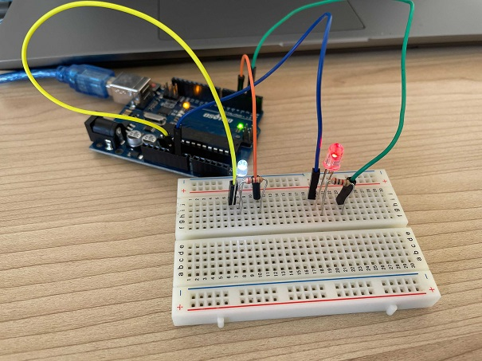

---

## 確認

### 電源を入れる前の配線チェック

**⚠ ここは必ずやること。** まちがった配線で電源を入れると部品がこわれます。

- [ ] LEDの**長い足がプラス側**、短い足がマイナス側になっているか
- [ ] LEDに**抵抗（330Ω）がつながっている**か（抵抗なしでつなぐとLEDがこわれます）
- [ ] ジャンパー線がブレッドボードの穴に**しっかり刺さっている**か
- [ ] GND（マイナス）がArduinoのGNDピンにつながっているか

ここまで確認できたら、USBをつないで電源を入れよう。

### 動かして確かめよう

- [ ] `Y` を入力すると2番ピンのLEDが光る
- [ ] `M` を入力すると4番ピンのLEDが光る
- [ ] `N` を入力すると両方消える

うまくいかないときは、ここを見てみよう。

| 症状 | 見るところ |
|---|---|
| LEDが光らない | LEDの向き（長い足がプラス）、抵抗がつながっているか |
| 片方だけ光らない | `pinMode()` のピン番号、配線したピン番号が合っているか |
| 入力しても反応しない | シリアルモニターの改行設定とボーレート |

---

## やってみよう

### 2つのLEDを交互に10回光らせよう

キーボードで `t` を押したら、**2つのLEDが交互に10回光る**ようにしてみよう。

同じことを10回書いてもできますが、それだと大変ですよね。こんなときに使うのが **`for` 文**です。

#### for文の書き方

```C++
for (int i = 0; i < 10; i++) {
  // ここに書いた処理が10回くりかえされる
}
```

- `int i = 0` — 数えるための変数 `i` を0から始める
- `i < 10` — `i` が10より小さいあいだ繰り返す
- `i++` — 1回まわるごとに `i` を1増やす

つまり `i` が 0, 1, 2, ... 9 と変わりながら、**10回**繰り返されます。

#### ヒント

`t` を押したときの処理を、if文の中にこう書いてみよう。

```C++
    if (ch == 't' || ch == 'T')  {
      for (int i = 0; i < 10; i++) {
        digitalWrite(2, HIGH);
        digitalWrite(4, LOW);
        delay(300);
        digitalWrite(2, LOW);
        digitalWrite(4, HIGH);
        delay(300);
      }
      digitalWrite(4, LOW);
    }
```

- [ ] 2つのLEDが交互に10回光ったらチェック！
- [ ] 回数を**20回**に変えられたらチェック！
- [ ] 光る速さを**2倍速く**できたらチェック！

#### もうひとつの繰り返し — while文

`for` 文のなかまに **`while` 文**があります。

```C++
while (条件式) {
  // 条件式がtrueのあいだ、ずっとくりかえす
}
```

`for` は「**回数が決まっている**繰り返し」、`while` は「**条件が変わるまで**繰り返し」に向いています。

実は、このレッスンのサンプルコードにも最初から `while` が使われています。探してみよう。

```C++
  while (! Serial); // シリアルの初期化を許可する
```

これは「シリアルの準備ができるまで待つ」という意味です。

---

## まとめ

- **ブレッドボード** : 電子回路の実験や試作をするための板
- `Serial.read()` : 受信データを読み取る
- `setup()` : 最初に一回だけ実行される処理
- `loop()` : ずっと実行される処理
- `pinMode()` : ピンを入力／出力に設定する
- `digitalWrite(ピン, HIGH/LOW)` : ピンに信号を出す
- **if構文** : 条件分岐。`||` は「または」
- **for文** : 回数が決まっている繰り返し
- **while文** : 条件が変わるまでの繰り返し
- **LEDには向きがあり、抵抗が必要**

### できるようになったことをチェックしよう

- [ ] **ブレッドボード**で回路を作れる
- [ ] `Serial.read()` を使って文字の入力を取れる
- [ ] `setup()` について説明できる
- [ ] `loop()` について説明できる
- [ ] `pinMode()` でピンの設定ができる
- [ ] **if構文**を使ってプログラムを改造できる
- [ ] **for文**を使って同じ処理を繰り返せる

### まとめページに書こう

Googleサイトの自分の**まとめページ**に、次の4つを書こう。

1. **やったこと**
2. **わかったこと**
3. **感じたこと**
4. **つぎやること**

**スクリーンショットか画像を必ず1枚入れること。** 今日は作った回路の写真を撮って入れよう。

> まとめは1日に1回書く。
> 複数のレッスンを進めた日も、1つのレッスンが1回で終わらなかった日も、まとめは1回。
