# レッスン05 赤外線リモコンのデータを受信しよう

## ミッション

**赤外線受信モジュールの回路を作り、リモコンのボタンごとのIRコードを調べて記録しよう。**

## このレッスンで身につける力

- [ ] 赤外線受信モジュールを説明できる
- [ ] ジャンパー線を使って赤外線受信モジュールの配線ができる
- [ ] IRremote**ライブラリ**を追加できる
- [ ] サンプルコードを実行できる
- [ ] 付属のリモコンからの信号を確認して**記録できる**
- [ ] 他の付属ではないリモコンの信号を確認できる
- [ ] （発展）赤外線受信の原理を説明できる

## 今回使う技術

- 赤外線受信モジュールの配線
- **ライブラリ**の追加（ZIP形式のインストール）
- `#include <IRremote.h>`
- `irrecv.decode()` — 受信したデータを読み取る
- 16進数（`0x` で始まる数）

> **このレッスンで記録したIRコードは、実践14（赤外線リモコンでロボットを動かそう）と実践20（ロボット対戦ゲーム1）で必ず使います。** 記録表を必ず埋めておこう。

---

## ミッションの準備

### 用意するもの

- [ ] Osoyoo UNO Board（Arduino UNO rev.3と完全互換） x 1
- [ ] USBケーブル x 1
- [ ] パソコン x 1
- [ ] オス-オス ジャンパー線 x 3（赤・黒・緑か青） ※先生に言って借りてくる
- [ ] ブレッドボード ※先生に言って借りてくる
- [ ] 赤外線受信機 x 1
- [ ] リモートコントローラ x 1

### 手順

- [ ] 新しい白紙のスケッチを作る
- [ ] 「（日付4桁）(自分の名前・ローマ字)05-01」という名前でスケッチを保存

---

## メインミッション

### ステップ1 赤外線受信機とは？

赤外線は**人間に見えない光**のことだよ。光は電磁波と呼ばれる波で、その波の長さによって見える光が決まってきます。人間が見ることができる光を可視光線と呼んで、可視光線の**赤の外側**にある光を**赤外線**と呼ぶよ。逆に紫の外側にある光を紫外線と呼びます。

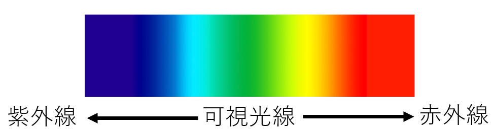

赤外線はみんなの暮らしに溶け込んでいるよ。例えばテレビやエアコンのリモコンは、遠くからでも電源をつけたり消したり、温度を変えたりできるよね？
これはリモコンが**赤外線を送信**して、テレビやエアコンが**赤外線を受信**して動作しているんだよ。


このレッスンでは、テレビやエアコンの中にある赤外線受信機と同じようなモジュールをArduinoと配線して、リモコンからどんな値が出ているか見てみるよ！

### ステップ2 赤外線受信モジュールを配線しよう

赤外線受信機とブレッドボード、Arduino、ジャンパー線を使って、写真と同じように配線してみよう。

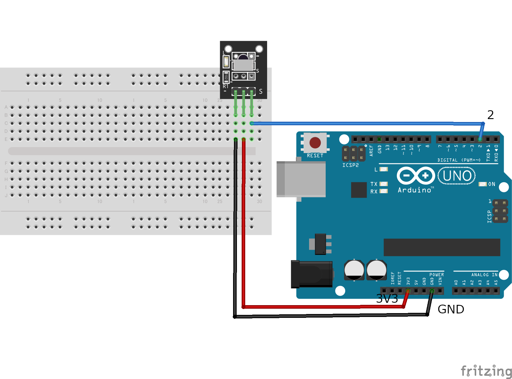

実際に回路を作るとこんな感じになるよ！

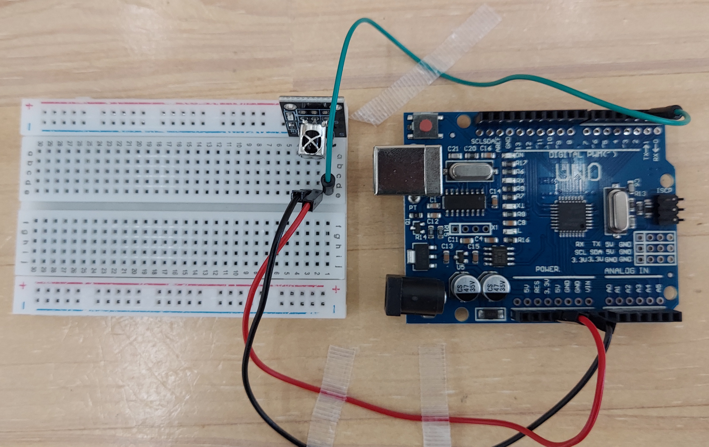

- [ ] ジャンパー線を使って赤外線受信モジュールの配線ができたらチェック

### ステップ3 IRremoteライブラリを追加しよう

#### Arduinoライブラリとは？

Arduinoライブラリとは、**世界中のプログラマが作ってくれた便利なプログラム**のこと。よく使われる機能を、いろんな人が使いやすいようにまとめたものだよ。
ライブラリを利用することで、難しいプログラムを自分で組まなくても簡単にプログラムが作れるんだ！

実際にプログラムをお仕事にしている人たちも、ライブラリを駆使してプログラムを作っているよ。

> レッスン01で学んだ**オープンソース**を覚えているかな？ライブラリの多くはオープンソースとして公開されていて、誰でも無料で使えます。

#### ライブラリをインストールしよう

今回はGitHubと呼ばれるサイトからzipファイルでインストールする方法をやってみよう！

[IRremote Arduino Library](https://osoyoo.com/wp-content/uploads/samplecode/IRremote.zip) ← クリックしよう

ダウンロードする場所を聞かれるので「デスクトップ」を選んでダウンロードしよう。

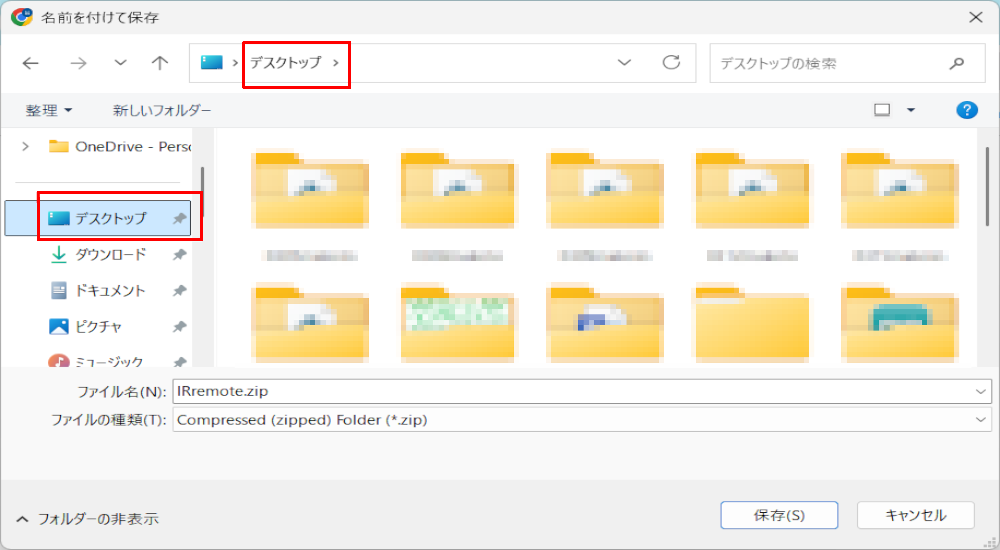

ダウンロードが終わったらArduino IDEに戻って、
スケッチ→ライブラリをインクルード→**ZIP形式のライブラリをインストール**を押そう！

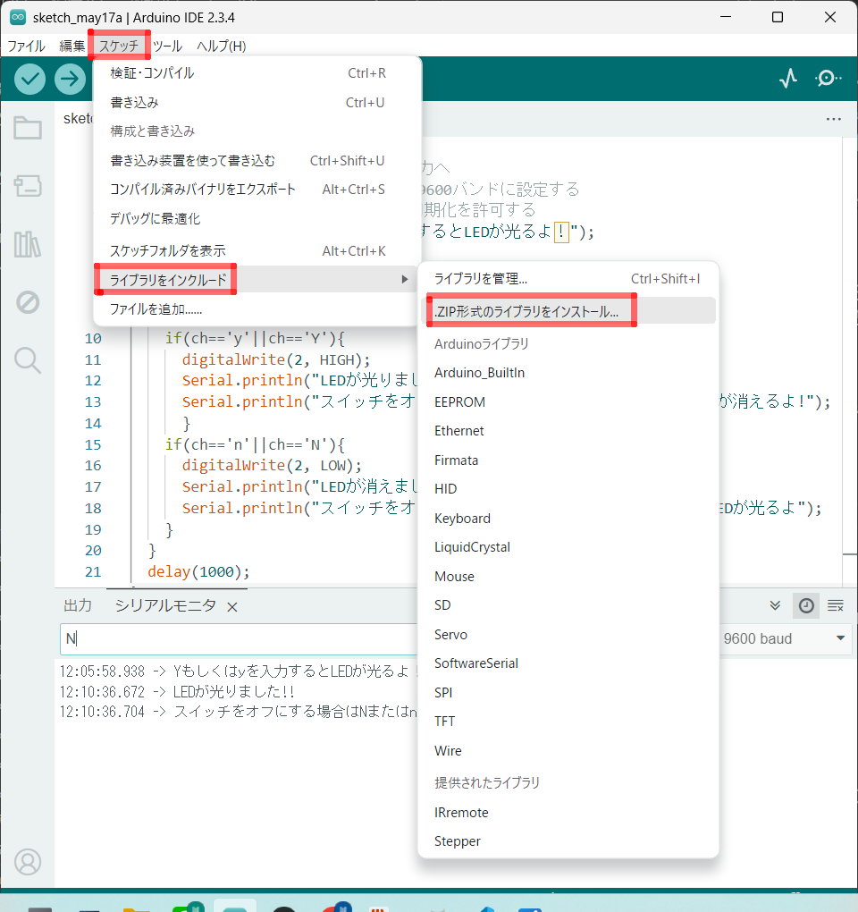

さっきダウンロードしたzipファイルを探して、開くボタンを押すとインクルードできるよ。

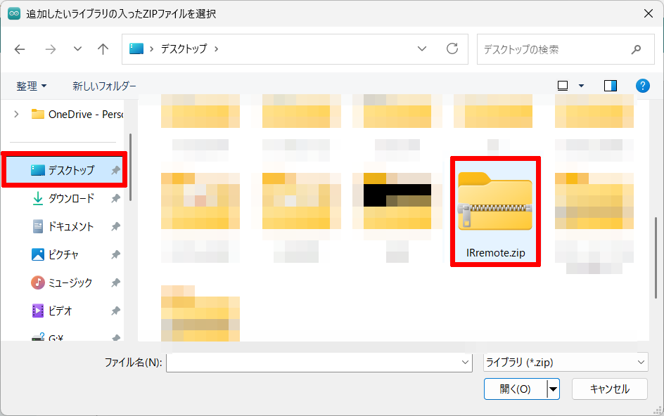

- [ ] IRremoteライブラリをダウンロードできたらチェック
- [ ] ダウンロードしたライブラリを追加（インクルード）できたらチェック

### ステップ4 サンプルスケッチを実行してみよう

スケッチに以下のコードをコピー＆ペーストして、実行してみよう。

```c++
#include <IRremote.h>  // IRRemote.hをインクルード ここでライブラリが使えるようになる
const int irReceiverPin = 2;  ///受信モジュールのSIGはpin2
IRrecv irrecv(irReceiverPin); //IRrecvタイプの変数を作成します
decode_results results;    // 結果

void setup(){
  Serial.begin(9600);    //シリアルを初期化し、ボーレートは9600に設定する
  irrecv.enableIRIn();   // 赤外線受信機モジュールを有効にする
  Serial.print("赤外線モジュールサンプルプログラムスタート\n");
}

void loop(){
  if (irrecv.decode(&results)){ //赤外線受信機モジュールの受信データ
    Serial.print("IRコード: ");
    Serial.print(results.value, HEX); //シリアルに値を出力する
    Serial.print(",　ビット: ");  //bitsを送信する
    Serial.println(results.bits); //bitsを結果に出力する
    irrecv.resume();// 次の値を受取る
  }
  delay(600); //600ミリ秒待機
}
```

今までのレッスンを参考にスケッチをArduinoに書き込もう！
書き込みが終わったら、ツール→シリアルモニタをクリックしてみよう。

「赤外線モジュールサンプルプログラムスタート」と表示されたら、プログラムがうまく動いているよ。

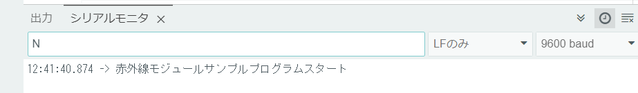

付属の赤外線コントローラを、黒色の赤外線受信モジュールに向かってボタンを押してみよう！

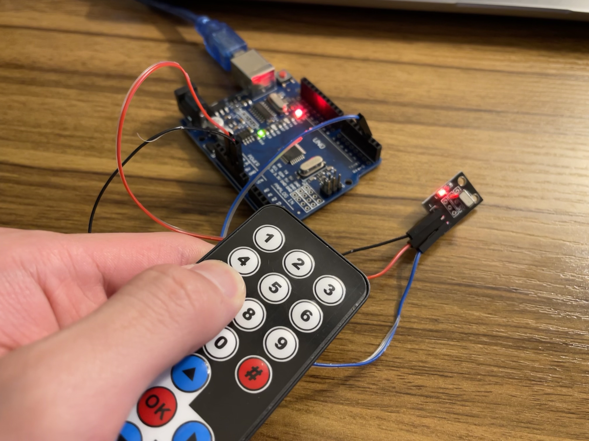

すると写真のような感じでIRコードとビットが表示されるよ。

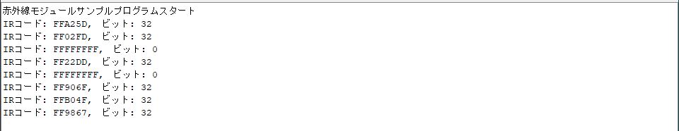

---

## 確認

作ったものを動かして確かめよう。

- [ ] 「赤外線モジュールサンプルプログラムスタート」が表示された
- [ ] リモコンのボタンを押すとIRコードが表示された
- [ ] **同じボタンを押すと、毎回同じIRコードが出る**ことを確かめた
- [ ] **違うボタンを押すと、違うIRコードが出る**ことを確かめた

うまくいかないときは、ここを見てみよう。

| 症状 | 見るところ |
|---|---|
| コンパイルでエラーが出る | ライブラリのインストールができているか |
| 何も表示されない | 受信モジュールの配線（3本とも正しい場所か） |
| ボタンを押しても反応しない | リモコンを受信モジュールに**まっすぐ向けている**か／リモコンの電池 |
| `FFFFFFFF` と出る | ボタンを押しっぱなしにしていないか（長押しのサイン） |

---

### 🔴 IRコード記録表 — 必ず埋めよう

**この表は、実践14と実践20で使います。** リモコンのボタンを1つずつ押して、出てきたIRコードを書き込もう。

| ボタン | IRコード（`0x` のあとに書く） |
|---|---|
| ▲（上） | `0x` |
| ▼（下） | `0x` |
| ◀（左） | `0x` |
| ▶（右） | `0x` |
| OK | `0x` |
| 1 | `0x` |
| 2 | `0x` |
| 3 | `0x` |
| ＊ | `0x` |
| ＃ | `0x` |

> 書いた表は**写真に撮ってまとめページに残しておこう。** 次に使うときに探さなくて済みます。

#### クイズ！

問題1：付属のリモコンの「OK」ボタンを押したときのIRコードは？

<details><summary>答えはここをクリック</summary><div>

IRコード: FF38C7,　ビット: 32

</div></details>

問題2：付属のリモコンの「#」ボタンを押したときのIRコードは？

<details><summary>答えはここをクリック</summary><div>

IRコード: FFB04F,　ビット: 32

</div></details>

2問とも正解できたかな？このクイズでわかる通り、**リモコンのボタンごとに「IRコード」が割り振られている**よ。

---

## やってみよう

### リモコンでLEDを光らせよう

記録したIRコードを使って、**「OK」ボタンでLEDが光り、「#」ボタンでLEDが消える**プログラムを作ってみよう！

#### 追加で用意するもの

- [ ] ジャンパーワイヤー × 2（黒・赤） ※先生に言って借りてくる
- [ ] LED × 1 ※先生に言って借りてくる
- [ ] 抵抗(330Ω) ※先生に言って借りてくる

#### 回路を作ろう

Arduinoの3番ピンを使ってLEDが光るように配線してみよう！

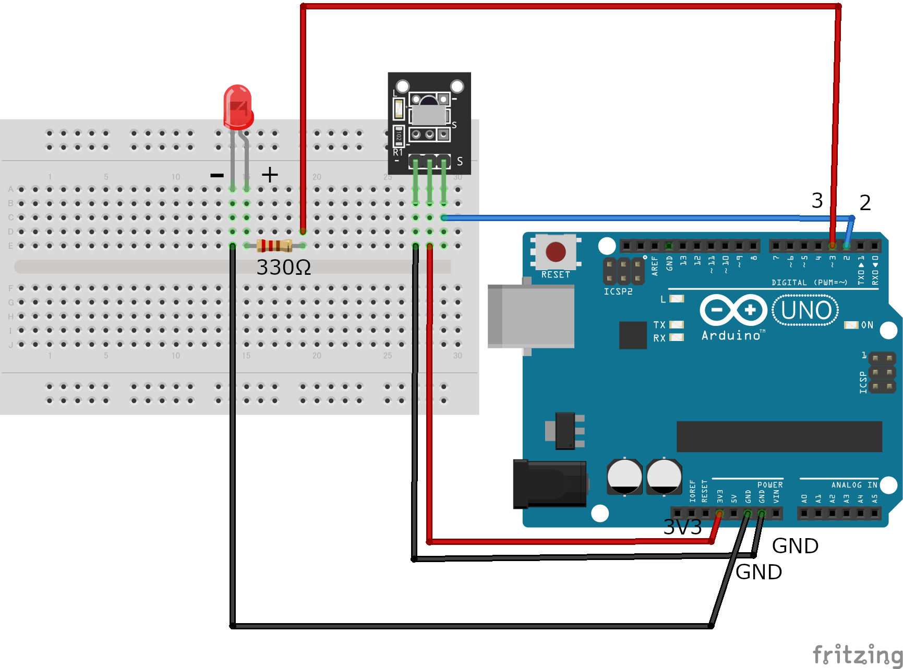

新しいスケッチを「（日付4桁）(自分の名前・ローマ字)05-02」という名前で保存しよう。

#### プログラムを書き換えよう

下のプログラムに `0x******` と書いてある部分が2つあるね。
ここに、記録表で調べた**OKボタン**と**#ボタン**のIRコードを書こう。

```C++
#include <IRremote.h>  // IRRemote.hをインクルード
const int irReceiverPin = 2;  ///受信モジュールを２番ピンに繋げる
IRrecv irrecv(irReceiverPin); //IRrecvタイプの変数を作成します
decode_results results;    // 結果

void setup(){
  Serial.begin(9600);    //シリアルを初期化し、ボーレートは9600に設定する
  pinMode(3,OUTPUT);     //LEDを３番ピンに繋げる
  irrecv.enableIRIn();   // 赤外線受信機モジュールを有効にする
  Serial.print("赤外線モジュールチャレンジプログラムスタート\n");
}

void loop(){
  if (irrecv.decode(&results)){ //赤外線受信機モジュールの受信データ
    Serial.print("IRコード: ");
    Serial.print(results.value,HEX); //シリアルに値を出力する
    Serial.print(",　ビット: ");  //bitsを送信する
    Serial.println(results.bits); //bitsを結果に出力する
    //「OK」ボタンが押されたら、LEDが光る
    if(results.value==0x******){  // ←【ここを書き換えよう】
      digitalWrite(3, HIGH);
      Serial.print("HIGH\n");
      }
    //「#」ボタンが押されたら、LEDが消える
    if(results.value==0x******){  // ←【ここを書き換えよう】
      digitalWrite(3, LOW);
      Serial.print("LOW\n");
    }
    irrecv.resume();// 次の値を受取る

  }
  delay(600); //600ミリ秒待機
}
```

成功するとこんな感じで動くよ！

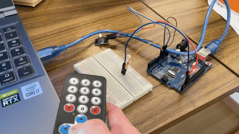

<details><summary>答えのプログラムはここをクリック</summary><div>

```C++
    //「OK」ボタンが押されたら、LEDが光る
    if(results.value==0xFF38C7){
      digitalWrite(3, HIGH);
      Serial.print("HIGH\n");
      }
    //「#」ボタンが押されたら、LEDが消える
    if(results.value==0xFFB04F){
      digitalWrite(3, LOW);
      Serial.print("LOW\n");
    }
```

</div></details>

- [ ] OKボタンでLEDが光ったらチェック
- [ ] #ボタンでLEDが消えたらチェック

### さらにやってみよう

**別のボタンでもLEDが光るように**、if文を1つ増やしてみよう。どのボタンにするかは自分で決めていいよ。

### 身の回りのリモコンを調べてみよう

赤外線リモコンは、世界で一番機械を操作するために使われているリモコンだよ。
びっくりなことに、今回使っている赤外線受信モジュールは**市販のエアコンのリモコンの信号も受け取ることができる**よ！

最初のサンプルプログラムに戻して、家や教室のリモコンを近づけてみて、どんな信号が出るか確認してみよう！

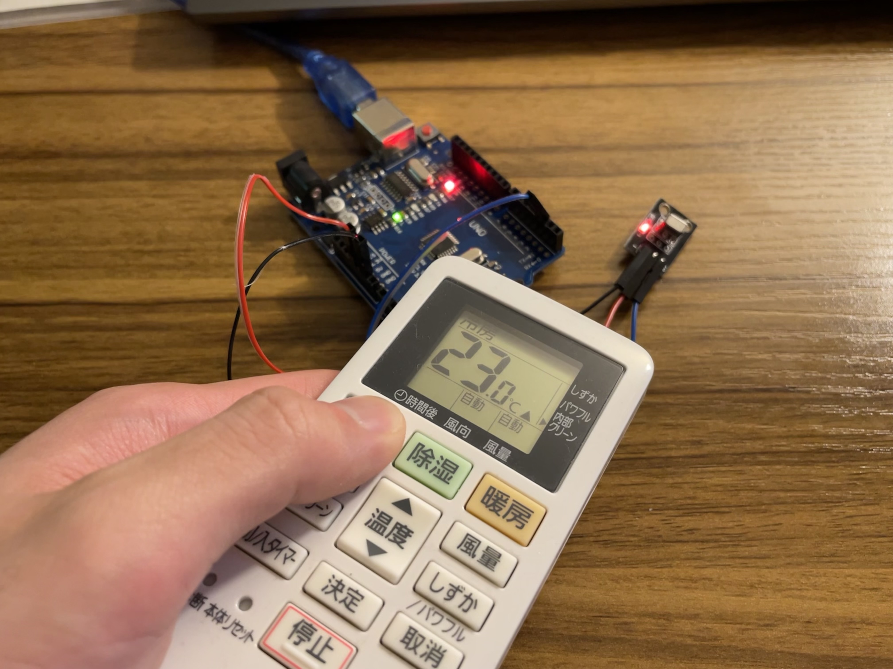

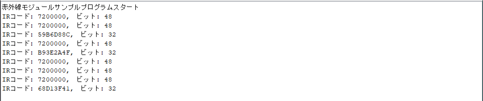

- [ ] 付属ではないリモコンの信号を確認できたらチェック

---

## まとめ

- **赤外線** : 光（電磁波）の一種。目に見えない。赤外線通信に使われる
- **赤外線受信モジュール** : リモコンなどから送られる赤外線を受信するモジュール
- **ライブラリ** : プログラムを効率的に開発できるように、あらかじめ作ってあるプログラム
- **IRコード** : リモコンのボタンごとに割り振られた番号。`0x` で始まる16進数で表す
- 同じボタンなら**毎回同じコード**が出る。だからプログラムで見分けられる

### できるようになったことをチェックしよう

- [ ] 赤外線受信モジュールを説明できる
- [ ] ジャンパー線を使って赤外線受信モジュールの配線ができる
- [ ] IRremote**ライブラリ**を追加できる
- [ ] サンプルコードを実行できる
- [ ] 付属のリモコンからの信号を確認して**記録できる**
- [ ] 他の付属ではないリモコンの信号を確認できる
- [ ] （発展）赤外線受信の原理を説明できる

### まとめページに書こう

Googleサイトの自分の**まとめページ**に、次の4つを書こう。

1. **やったこと**
2. **わかったこと**
3. **感じたこと**
4. **つぎやること**

**スクリーンショットか画像を必ず1枚入れること。**
今日は**IRコード記録表**を写真に撮って入れておこう。あとのレッスンで必ず使います。

> まとめは1日に1回書く。
> 複数のレッスンを進めた日も、1つのレッスンが1回で終わらなかった日も、まとめは1回。
