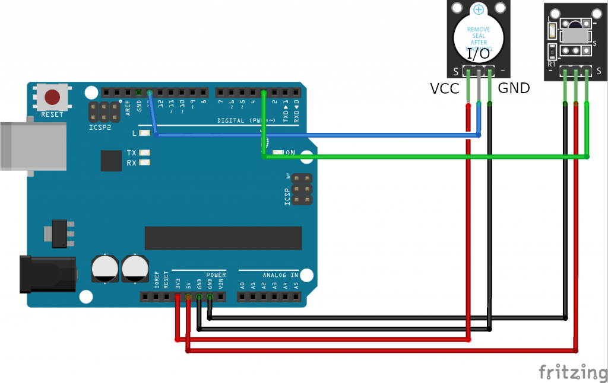

# レッスン06 赤外線を使ってブザーを鳴らそう

## ミッション

**リモコンのボタンごとに違う音が鳴るブザーを作ろう。**

## このレッスンで身につける力

- [ ] ブザーと赤外線受信モジュールの回路を作ることができる
- [ ] `digitalWrite()` と `delay()` を使って、いろいろなブザーの鳴らし方を作ることができる
- [ ] サンプルコードを実行できる
- [ ] サンプルコードを改造して、他のボタンに他の音を割り当てることができる

## 今回使う技術

- アクティブブザーモジュールの配線
- `digitalWrite()` と `delay()` の組み合わせで音のパターンを作る
- `if` 〜 `else` 文
- （復習）`IRremote.h` とIRコード

> **ブザーはこの先ずっと使います。** ロボットが「いま何をしているか」を音で知らせる、**デバッグの道具**になります。

---

## ミッションの準備

### 用意するもの

- [ ] Osoyoo UNO Board x 1
- [ ] 赤外線コントローラー（リモコン）
- [ ] 赤外線受信機
- [ ] アクティブブザーモジュール x 1
- [ ] オス-メス ジャンパー線
- [ ] ブレッドボード
- [ ] USBケーブル x 1
- [ ] パソコン x 1

### 手順

- [ ] 新しい白紙のスケッチを作る
- [ ] 「（日付4桁）(自分の名前・ローマ字)06-01」という名前でスケッチを保存
- [ ] レッスン05で作った**IRコード記録表**を出しておく

---

## メインミッション

### ステップ1 ブザーの回路を作ろう

画像のように、回路同士をF/Mジャンパーで接続しよう！



- [ ] 回路が作れたらチェック！

### ステップ2 ブザーを鳴らしてみよう

まずはブザーだけを鳴らしてみます。以下をコピーして実行してみよう。

```C++
const int buzzerPin = 13;//13ピンをブザーに割り当て

void setup() {
    pinMode(buzzerPin,OUTPUT);//ブザーのピン番号を出力に設定
}

void loop() {
    digitalWrite(buzzerPin,LOW);//ブザーのビープ音（低音）
    delay(1000);                 //1000ms待機
    digitalWrite(buzzerPin,HIGH);//ブザーを停止
    delay(1000);                 //1000ms待機
}
```

ブザーから音が鳴るよ。

**似たプログラムを見たことがないかな？**
実は**LEDを光らせるときと同じプログラム**で、ブザーの音を鳴らすことができるんだ。
`pinMode()` で出力に設定して、`digitalWrite()` で信号を出す。LEDとまったく同じだね。

> ⚠ ただし**LEDと逆**で、このブザーは `LOW` で鳴って `HIGH` で止まります。気をつけよう。

- [ ] ブザーを鳴らせたらチェック！

### ステップ3 リモコンでブザーを鳴らそう

新しいスケッチを「（日付4桁）(自分の名前・ローマ字)06-02」で保存して、以下をコピー＆ペーストしよう。

```C++
#include <IRremote.h>
const int irReceiverPin =3; //受信モジュールのSIGはpin3
const int buzzerPin = 13;//13ピンをブザーに接続します
IRrecv irrecv(irReceiverPin); //IRrecv タイプの変数を作成します
decode_results results;
void setup()
{
  pinMode(buzzerPin,OUTPUT);//ブザーピンを出力として設定します
  digitalWrite(buzzerPin,HIGH);
  Serial.begin(9600);//irrecvを初期化します。
  irrecv.enableIRIn(); // ir受信機モジュールを有効にする
}
void loop()
{
  if (irrecv.decode(&results)) //赤外線受信モジュールの受信データ
  {
    Serial.print("irCode: "); //"irCode: "を送信する出力
    Serial.print(results.value, HEX); //値を16進数で出力します
    Serial.print(", bits: "); //" , bits: " を送信する
    Serial.println(results.bits); //bitsを結果に出力する
    irrecv.resume(); // Receive the next value
  }

  if(results.value == 0xFF38C7)//「OK」ボタンを押すと、受信モジュールは0xFF38C7を受信します
  {
    digitalWrite(buzzerPin,LOW);//ブザーのビープ音（低音）
  }
  else
  {
    digitalWrite(buzzerPin,HIGH);//stop beep
  }
    delay(400); //delay 400ms
}
```

アップロードが完了して数秒待ってから**OKボタン**を押すとブザーが鳴り続けるよ。止めたかったら他のボタンを押してね。

> **`if` 〜 `else` とは？**
>
> ```C++
> if (条件式) {
>   条件が正しいときの処理
> } else {
>   条件が正しくないときの処理
> }
> ```
>
> 「OKボタンなら鳴らす、**そうでなければ**止める」という書き方です。

- [ ] サンプルプログラムが実行できたらチェック

---

## 確認

作ったものを動かして確かめよう。

- [ ] ステップ2でブザーが1秒ごとに鳴った
- [ ] OKボタンを押すとブザーが鳴り続ける
- [ ] 他のボタンを押すと止まる

うまくいかないときは、ここを見てみよう。

| 症状 | 見るところ |
|---|---|
| 音が鳴らない | ブザーの配線、`digitalWrite` が `LOW` になっているか |
| ずっと鳴りっぱなし | `setup()` の `digitalWrite(buzzerPin,HIGH);` があるか |
| リモコンが効かない | 受信モジュールが**3番ピン**につながっているか（レッスン05は2番ピンでした） |
| IRコードが違う | 自分のリモコンの記録表と見比べる |

---

## やってみよう

### 1. 鳴る時間を変えてみよう

ステップ2のプログラムで、ブザーが鳴る時間を **500ms** にしてみよう。

- [ ] 鳴る時間を変更できたらチェック！

### 2. 他のボタンに別の音を割り当てよう

OKボタンの他にも音を割り当てられるよ。**レッスン05のIRコード記録表**を見ながらやってみよう。

1.  を押して、シリアルモニターから各ボタンの信号を読み取る
2. サンプルコードのIRコードを、読み取った信号に書き換える

```C++
if(results.value == 0x【ここに読み取った信号を入力】)
  {
    digitalWrite(buzzerPin,LOW);//ブザーのビープ音（低音）
  }
  else
  {
    digitalWrite(buzzerPin,HIGH);//stop beep
  }
```

- [ ] 他のボタンにも音を割り当てられたらチェック

### 3. ボタンごとに違う鳴り方を作ろう

ここが今日の本番です。**3つのボタンに、それぞれ違う鳴り方**を作ってみよう。

例えばこんな鳴り方が作れます。

| 鳴り方 | 作り方のヒント |
|---|---|
| ピッ（短く1回） | `LOW` → `delay(100)` → `HIGH` |
| ピピッ（短く2回） | 上を2回くりかえす |
| ピーーー（長く1回） | `LOW` → `delay(1000)` → `HIGH` |
| ピピピピピ（速く5回） | **レッスン04で習った `for` 文**を使うと短く書けるよ |

`for` 文を使った例：

```C++
      for (int i = 0; i < 5; i++) {
        digitalWrite(buzzerPin, LOW);
        delay(100);
        digitalWrite(buzzerPin, HIGH);
        delay(100);
      }
```

- [ ] 3つのボタンに違う鳴り方を割り当てられたらチェック！
- [ ] 自分で考えたオリジナルの鳴り方を作れたらチェック！

> この「音で知らせる」技は、あとのレッスンでロボットが**いまどの処理をしているか**を確かめるのに使います。作った鳴り方はメモしておこう。

---

## まとめ

- **ブザー** : 音が出る素子。LEDと同じ `digitalWrite()` で鳴らせる
- `digitalWrite(buzzerPin, LOW);` : 音が出る（**LEDと逆なので注意**）
- `digitalWrite(buzzerPin, HIGH);` : 音が止まる
- `digitalWrite()` と `delay()` の組み合わせで、鳴り方のパターンを作れる
- `if` 〜 `else` : 「〜なら○○、そうでなければ△△」
- ブザーは**プログラムの動きを音で知る道具**にもなる

### できるようになったことをチェックしよう

- [ ] ブザーと赤外線受信モジュールの回路を作ることができる
- [ ] `digitalWrite()` と `delay()` を使って、いろいろなブザーの鳴らし方を作ることができる
- [ ] サンプルコードを実行できる
- [ ] サンプルコードを改造して、他のボタンに他の音を割り当てることができる

### まとめページに書こう

Googleサイトの自分の**まとめページ**に、次の4つを書こう。

1. **やったこと**
2. **わかったこと**
3. **感じたこと**
4. **つぎやること**

**スクリーンショットか画像を必ず1枚入れること。** 今日は作った回路の写真か、鳴り方を書いたプログラムの画面を入れよう。

> まとめは1日に1回書く。
> 複数のレッスンを進めた日も、1つのレッスンが1回で終わらなかった日も、まとめは1回。
