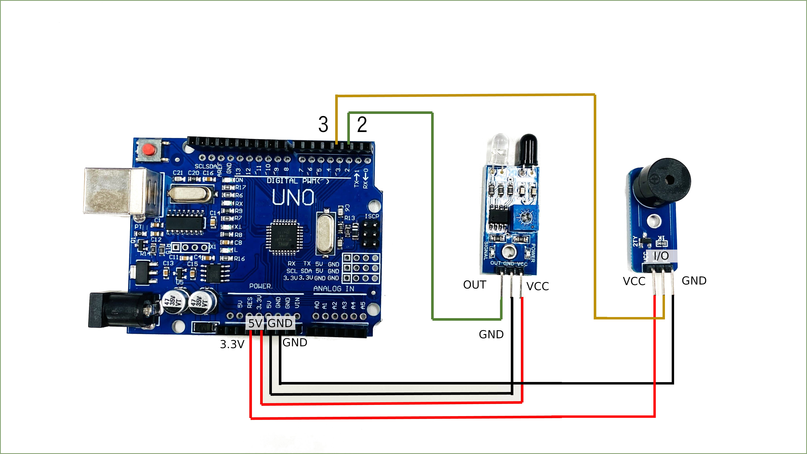
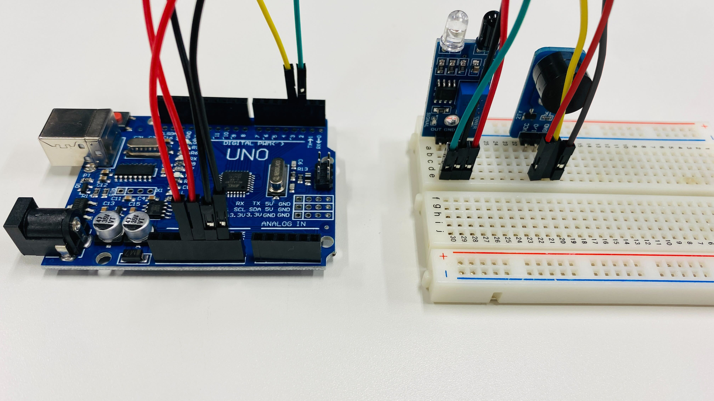

# レッスン07 障害物センサーを使ってブザーを鳴らそう

> ⭐ **このレッスンは入門の「到達課題」です。** ここができたら実践に進めます。

## ミッション

**ちょうど10cmに近づいたときだけブザーが鳴る「人感センサー」を作ろう。**

## このレッスンで身につける力

- [ ] ブレッドボードを使って障害物センサーとブザーの入った回路を作成できる
- [ ] 障害物センサーの感度を調整できる
- [ ] サンプルコードを実行できる
- [ ] 10cmでブザーが鳴る人感センサーを作ることができる

## 今回使う技術

- ブレッドボードの電源ライン（＋／−）を使った配線
- 赤外線障害物回避センサーの配線
- `digitalRead()` — センサーの値を読み取る
- `if` 〜 `else` による分岐
- ドライバーを使ったセンサーの**感度調整**（ハードウェアの調整）
- 定規を使った測定

---

## ミッションの準備

### 用意するもの

- [ ] Osoyoo UNO Board x1
- [ ] 赤外線障害物回避センサー x1
- [ ] アクティブブザーモジュール x1
- [ ] ブレッドボード x1
- [ ] ジャンパー線
- [ ] プラスドライバー x1
- [ ] 定規 x1
- [ ] USBケーブル x1
- [ ] パソコン x1

### 手順

- [ ] Arduino IDEを開き、「（日付4桁）(自分の名前・ローマ字)07_1」という名前で保存する

---

## メインミッション

### ステップ1 障害物センサーとブザーをArduinoにつなごう

**回路は、ブレッドボードの上に作ります。**（レッスン04・06と同じやり方だね）

今回つなぐのは**障害物センサー**と**ブザー**の2つ。どちらも電気（VCCとGND）が必要なので、
ブレッドボードの**電源ライン**（左右のはしにある赤い＋と青い−の列）から分けてあげよう。

1. Arduinoの **`5V`** を、ブレッドボードの **＋の列**につなぐ
2. Arduinoの **`GND`** を、ブレッドボードの **−の列**につなぐ
3. センサーとブザーのVCCを、それぞれ **＋の列**にさす
4. センサーとブザーのGNDを、それぞれ **−の列**にさす
5. 信号線だけを、Arduinoのピンに直接つなぐ（センサー→D2、ブザー→D3）

**配線図：**



**ブレッドボードを用いた接続例：**



> **配線図と、実物のブレッドボードを見くらべよう。**
> 配線図は「どことどこがつながっているか」だけを描いた図です。
> **実物では、ブレッドボードの中で横一列がつながっている**ことを思い出して組み立てよう。

> **※注意！ ブザーが鳴らないとき・・・**
> ブザーによっては書かれている「VCC」と「GND」が実際には反対の場合があります（生産工場のミス）。配線しなおしてみましょう。

- [ ] ブレッドボードの＋と−の列に、5VとGNDをつなげたらチェック！
- [ ] ブレッドボードの上に回路が作れたらチェック！
- [ ] **ブレッドボードのどのあなとどのあながつながっているか**、先生に説明できたらチェック！

### ステップ2 障害物を検知したらシリアルモニタとLEDで通知しよう

スケッチに以下のコードをコピー＆ペーストして、実行してみよう。

```C++
int LEDPin = 13;  //LEDピンを13番に設定　（Arduino本体のLED）
int isObstaclePin = 2;  // 2番ピンを赤外線センサーに接続
int isObstacle = HIGH;  // 障害物が無い場合

void setup() {
  pinMode(isObstaclePin, INPUT);
  pinMode(LEDPin, OUTPUT);
  Serial.begin(9600);
}

void loop() {
  isObstacle = digitalRead(isObstaclePin);
  if (isObstacle == LOW)  //障害物がある場合
  {
    Serial.println("物体を検知しました！！　LEDをオン");
    digitalWrite(LEDPin, HIGH); //LEDをON
  }
  else  //障害物がない場合
  {
    Serial.println("物体はありません　LEDオフ");
    digitalWrite(LEDPin, LOW); //LEDをOFF
  }
  delay(200);
}
```

シリアルモニタを開いて、センサに手をかざすと何が起こるかな？

#### `digitalRead()` について

いままでは `digitalWrite()` で**信号を出す**ことばかりやってきました。
今回の `digitalRead()` は反対に、**信号を読み取る**命令です。

```C++
  isObstacle = digitalRead(isObstaclePin);
```

だから `pinMode()` も `OUTPUT` ではなく **`INPUT`（入力）** にしていますね。

```C++
  pinMode(isObstaclePin, INPUT);
```

> **注意**：このセンサーは**物体があるとき `LOW`**、ないとき `HIGH` を返します。ふつうと逆なので気をつけよう。

- [ ] シリアルモニタに「物体を検知しました！！」「物体はありません」の表示が出たらチェック！
- [ ] LEDが光ったらチェック！

### ステップ3 障害物センサーの感度を調整しよう

ここが今回の大事なところです。**プログラムだけでは距離は決まりません。**

回路につないだまま、プラスドライバーで障害物センサーのネジをまわしてみよう！
ネジを回す方向によって、反応する距離がどのように変化するかな？


- [ ] ネジを回して反応距離が変化することが確認できたらチェック！

### ステップ4 ブザーをつけよう

「（日付4桁）(自分の名前・ローマ字)07_2」という名前で保存して、以下をコピー＆ペーストしよう。

```C++
int LEDPin = 13;  //LEDピンを13番に設定　（Arduino本体のLED）
int buzzerPin = 3;  //3番ピンをブザーに接続
int isObstaclePin = 2;  // 2番ピンを赤外線センサーに接続
int isObstacle = HIGH;  // 障害物が無い場合

void setup() {
  pinMode(buzzerPin, OUTPUT);
  pinMode(isObstaclePin, INPUT);
  pinMode(LEDPin, OUTPUT);
  Serial.begin(9600);
}

void loop() {
  isObstacle = digitalRead(isObstaclePin);
  if (isObstacle == LOW)  //障害物がある場合
  {
    Serial.println("物体を検知しました！！　LED・ブザーをオン");
    digitalWrite(LEDPin, HIGH); //LEDをON
    digitalWrite(buzzerPin, LOW); //ブザーをON
  }
  else  //障害物がない場合
  {
    Serial.println("物体はありません　LED・ブザーをオフ");
    digitalWrite(LEDPin, LOW); //LEDをOFF
    digitalWrite(buzzerPin, HIGH); //ブザーをOFF
  }
  delay(200);
}
```

---

## 確認

### ⭐ ちょうど10cmでブザーが鳴るようにしよう

**定規を使って、反応する距離が10cmになるようにネジで調整しよう！**

測り方はこうします。

1. 定規をセンサーの前に置く
2. 手（または白い紙）を10cmのところに置く → **鳴る**
3. 手を15cmのところに置く → **鳴らない**
4. この2つが両方できるまで、ネジを少しずつ回して調整する

- [ ] 10cmで鳴る
- [ ] 15cmでは鳴らない
- [ ] 3回試して、3回とも同じ結果になる

**3回とも同じ結果になったら、このレッスンはクリアです。**

うまくいかないときは、ここを見てみよう。

| 症状 | 見るところ |
|---|---|
| ずっと鳴りっぱなし | ネジを反対に回す／センサーの前に何か置いていないか |
| ぜんぜん鳴らない | ブザーのVCCとGNDが逆になっていないか（上の注意を見る） |
| 距離が安定しない | 当てるものを**白い紙**にしてみる（色や材質で反応がかわります） |
| LEDは光るがブザーが鳴らない | ブザーは `LOW` で鳴る。`HIGH` になっていないか |

> **考えてみよう**：黒い服と白い紙では、反応する距離がちがうかな？試してみよう。

---

## やってみよう

### 1. 距離を変えてみよう

**5cmで鳴るように**調整しなおしてみよう。そのあと**20cmで鳴るように**もやってみよう。

- [ ] 5cmに調整できたらチェック
- [ ] 20cmに調整できたらチェック
- [ ] どこまで遠くできるか、限界を調べられたらチェック

### 2. 近づくほど速く鳴るようにしよう（むずかしい）

いまは「鳴る」か「鳴らない」の2つだけです。
**レッスン06で作った鳴り方**を使って、検知したときの音を工夫してみよう。

例：検知したら「ピピピ」と3回鳴らして止まる（`for` 文を使う）

```C++
    for (int i = 0; i < 3; i++) {
      digitalWrite(buzzerPin, LOW);
      delay(100);
      digitalWrite(buzzerPin, HIGH);
      delay(100);
    }
```

- [ ] 検知したときの鳴り方を自分で変えられたらチェック

---

## まとめ

- **内蔵LED**は13番（`LEDPin = 13` で指定できる）
- **障害物センサー**は `digitalRead(isObstaclePin);` で読み取る
- `pinMode()` の **`INPUT`** は読み取る、**`OUTPUT`** は信号を出す
- このセンサーは**物体があると `LOW`** を返す（逆なので注意）
- 障害物センサーはネジを回して**感度の調整**をすることで、反応する距離を変えられる
- **プログラムだけでは決まらないことがある。** ハードの調整も大事な仕事

### できるようになったことをチェックしよう

- [ ] ブレッドボードを使って障害物センサーとブザーの入った回路を作成できる
- [ ] 障害物センサーの感度を調整できる
- [ ] サンプルコードを実行できる
- [ ] 10cmでブザーが鳴る人感センサーを作ることができる

### ファイルを保存してクラウドに上げよう

**レッスンが終わったら、かならずやること。**

今日つくったスケッチは**2つ**。名前がこうなっているか確かめよう。

`（日付4桁）（自分の名前ローマ字）07_1`・`（日付4桁）（自分の名前ローマ字）07_2`

例：4月10日に誠さんなら `0410makoto07_1`

1. スケッチの名前が上の形になっているか確かめる
2. スケッチを**フォルダごと**、**「生徒共有」の中の自分のフォルダ**に入れる
3. 入れたあと、フォルダの中に `.ino` ファイルが入っているか確かめる

> **なぜフォルダごと運ぶの？**
> Arduinoのスケッチは、**フォルダと、その中の `.ino` ファイルがセット**になっています（レッスン02）。
> `.ino` だけを取り出して運ぶと、開けなくなってしまうんだ。

- [ ] ファイル名を決まった形にできた
- [ ] スケッチをフォルダごと「生徒共有」の自分のフォルダに上げられた

### まとめページに書こう

Googleサイトの自分の**まとめページ**に、次の4つを書こう。

1. **やったこと**
2. **わかったこと**
3. **感じたこと**
4. **つぎやること**

**スクリーンショットか画像を必ず1枚入れること。** 今日は定規を当てて10cmを測っているところの写真を入れよう。

> まとめは1日に1回書く。
> 複数のレッスンを進めた日も、1つのレッスンが1回で終わらなかった日も、まとめは1回。

---

<details><summary>📋 指導員向け：入門の進級判定ポイント</summary><div>

このレッスンは**入門の到達課題**です。次の観点で観察してください。

| 観点 | 見るところ |
|---|---|
| 指示を理解して始められる | 用意するものを自分で集めたか |
| 部品・道具を確認できる | センサー・ブザー・定規をそろえられたか |
| 組み立て・プログラムを進められる | 配線図を見ながら自分で配線できたか |
| 動作テストができる | 言われる前に手をかざして試したか |
| 問題の原因を探せる | 鳴らないとき、配線とプログラムのどちらを先に疑ったか |
| 修正・改良を行える | ネジを少しずつ回して追い込めたか（一気に回していないか） |
| 説明できる | 「なぜ10cmで鳴るようになったか」を自分の言葉で言えるか |

**合格の目安**：10cmで鳴り15cmで鳴らない状態を、**3回連続で再現できる**こと。
まぐれで1回できただけでは、調整できたとは言えません。

**つまずきやすい点**
- ブザーのVCC/GND逆転（個体差）。鳴らない原因の大半はこれ
- 対象物の色で反応距離が変わることに気づかず混乱する
- ネジを回しすぎて、どこが元だったか分からなくなる → 最初に元の位置を印でつけさせるとよい

</div></details>
