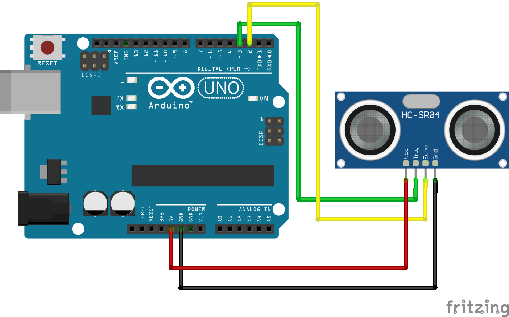
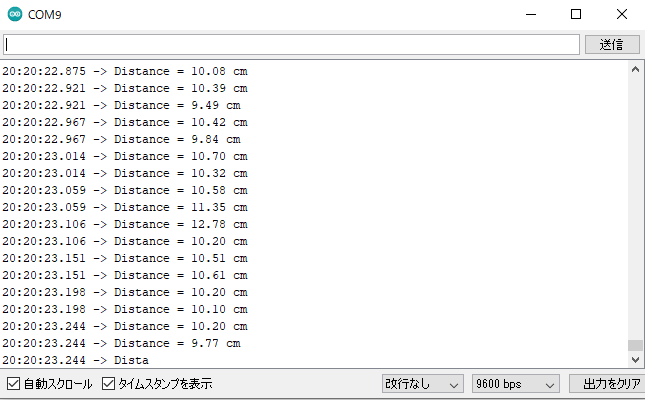
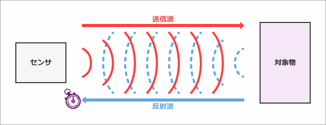
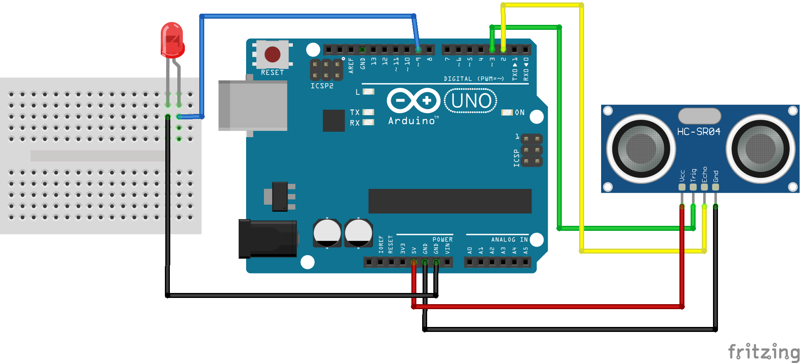
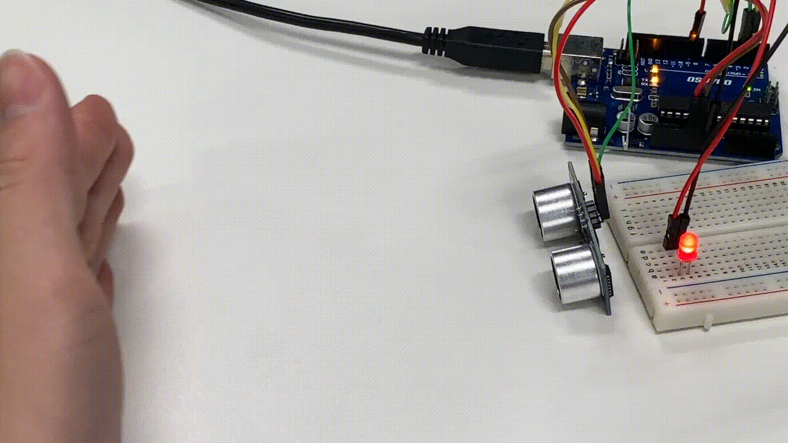

# レッスン08 超音波センサーを使ってみよう

## ミッション

**超音波センサーで距離を測り、近づくほどLEDが明るくなるようにしよう。**

## このレッスンで身につける力

- [ ] ブレッドボードに超音波センサーを使った回路を作ることができる
- [ ] 超音波センサの仕組みを大まかに理解する
- [ ] サンプルコードを実行できる
- [ ] サンプルコードを改造して人感センサを作ることができる
- [ ] `map()` を使って値の範囲を変換できる

## 今回使う技術

- ブレッドボードの電源ライン（＋／−）を使った配線
- 超音波センサー HC-SR04 の配線（たんしの名前を読んで合わせる）
- `pulseIn()` — 信号が返ってくるまでの時間を測る
- `delayMicroseconds()` — マイクロ秒単位で待つ
- 距離の計算式と `float` 型
- `map()` — 値の範囲を変換する
- `analogWrite()` — 明るさや強さを段階で出す

> **レッスン07の障害物センサーとのちがい**
> 障害物センサーは「ある／ない」しか分かりませんでした。
> 超音波センサーは**何cmか**という数字が分かります。だから、もっと細かい制御ができます。

---

## ミッションの準備

### 用意するもの

- [ ] Osoyoo UNO Board x1
- [ ] 超音波センサーHC-SR04 x1
- [ ] LED x1、抵抗(330Ω) x1
- [ ] ブレッドボード x1
- [ ] ジャンパー線
- [ ] 定規 x1
- [ ] USBケーブル x1
- [ ] パソコン x1

### 手順

- [ ] Arduino IDEを開き、「（日付4桁）(自分の名前・ローマ字)08_1」という名前で保存する

---

## メインミッション

### ステップ1 超音波センサをArduinoにつなごう

**回路は、ブレッドボードの上に作ります。**（レッスン04・06・07と同じやり方だね）

超音波センサーには **VCC・Trig・Echo・GND** の4本の足があります。
電気（VCCとGND）はブレッドボードの**電源ライン**（左右のはしにある赤い＋と青い−の列）から分けよう。

1. Arduinoの **`5V`** を、ブレッドボードの **＋の列**につなぐ
2. Arduinoの **`GND`** を、ブレッドボードの **−の列**につなぐ
3. センサーを**ブレッドボードにさす**（4本の足が、それぞれ別の列に入るように）
4. センサーの **VCC** を ＋の列へ、**GND** を −の列へつなぐ
5. **Trig** を D3、**Echo** を D2 につなぐ

**配線図：**



> ### ⚠ 超音波センサーの向きに注意！
>
> **配線図のセンサーは、丸い「目」がこちらを向いた〈正面〉から描かれています。**
> でも**足（たんし）はうら側に出ています。**
> そのため、図を見たまま左から順にさすと、**足の順番が左右逆になってしまいます。**
>
> **数えて合わせるのではなく、センサーに書いてある文字を1本ずつ読んで合わせよう。**
>
> | たんしの名前 | つなぐ先 |
> |---|---|
> | VCC | ブレッドボードの ＋の列（5V） |
> | Trig | D3 |
> | Echo | D2 |
> | GND | ブレッドボードの −の列（GND） |
>
> **VCC と GND を逆にさすと、センサーがこわれます。** さす前にもう一度見よう。

- [ ] ブレッドボードの＋と−の列に、5VとGNDをつなげたらチェック！
- [ ] **センサーの4本の足の名前を1本ずつ読んで**、つなぐ先を確かめたらチェック！
- [ ] ブレッドボードの上に回路が作れたらチェック！
- [ ] **ブレッドボードのどのあなとどのあながつながっているか**、先生に説明できたらチェック！

### ステップ2 測った距離をシリアルモニタに表示しよう

スケッチに以下のコードをコピー＆ペーストして、実行してみよう。

```C++
#define echoPin 2
#define trigPin 3

void setup() {
  Serial.begin (9600);
  pinMode(trigPin, OUTPUT);
  pinMode(echoPin, INPUT);
}

void loop() {
  float duration, distance;
  digitalWrite(trigPin, LOW);
  delayMicroseconds(2);

  digitalWrite(trigPin, HIGH);
  delayMicroseconds(10);
  digitalWrite(trigPin, LOW);

  duration = pulseIn(echoPin, HIGH);
  distance = (duration / 2) * 0.0344;

  if (distance >= 400 || distance <= 2) {
    Serial.print("Distance = ");
    Serial.println("Out of range");
  }
  else {
    Serial.print("Distance = ");
    Serial.print(distance);
    Serial.println(" cm");
  }
  delay(10);
}
```

シリアルモニタを開こう！



- [ ] シリアルモニタに上の画像のような表示が出たらチェック！

### ステップ3 超音波センサとは？

ここで、超音波センサの仕組みについて簡単に説明するよ。

「**超音波**」とは、人間には聞こえない高さの音のことで、音は空気中を波として伝わっていきます。

超音波を対象物に向かって出すと、対象物に当たってセンサーに返ってきます。超音波を出してから返ってくるまでには、少しだけ時間がかかります。

例えば、音は**1秒で340m**くらい進むから、340m先に対象物があったら、返ってくるまでに往復で2秒かかります。

**返ってくるまでにかかった時間から、対象物がどのくらい遠くにあるかを計算できる。これが超音波センサの仕組みです。**



今回のプログラムだと、

- 変数 `duration` … センサが測った、超音波が返ってくるまでの**時間**
- 変数 `distance` … `duration` の値を**距離(cm)** に直したもの

```C++
  duration = pulseIn(echoPin, HIGH);
  distance = (duration / 2) * 0.0344;
```

> **なぜ `/ 2` するの？**
> 超音波は**行って帰ってくる**ので、測った時間は往復ぶん。片道にするために2で割っています。
>
> **`0.0344` って何？**
> 音が1マイクロ秒に進む距離（cm）です。時間×速さ＝距離、ですね。レッスン03でやった掛け算がここで使われています。

### ステップ4 人感センサを作ろう

先ほどの回路を改造して、**10cm以内に障害物があることを検知したらLEDが点灯する**人感センサを作ろう！

**配線図：**



「（日付4桁）(自分の名前・ローマ字)08_2」という名前で保存して、以下をコピー＆ペーストしよう。

```C++
#define echoPin 2
#define trigPin 3
#define LEDPin 9

void setup() {
  Serial.begin (9600);
  pinMode(trigPin, OUTPUT);
  pinMode(echoPin, INPUT);
  pinMode(LEDPin, OUTPUT);

}

void loop() {
  float duration, distance;
  digitalWrite(trigPin, LOW);
  delayMicroseconds(2);

  digitalWrite(trigPin, HIGH);
  delayMicroseconds(10);
  digitalWrite(trigPin, LOW);

  duration = pulseIn(echoPin, HIGH);
  distance = (duration / 2) * 0.0344;

  Serial.print("Distance = ");
  Serial.print(distance);
  Serial.println(" cm");

  if (distance < 10) {
    digitalWrite(LEDPin, HIGH);
  }
  else {
    digitalWrite(LEDPin, LOW);
  }
  delay(10);
}
```

- [ ] 超音波センサで測定した距離に応じてLEDが光ったらチェック！

> **レッスン07とくらべてみよう**
> レッスン07ではドライバーでネジを回して距離を調整しました。
> 今回は **`if (distance < 10)` の数字を変えるだけ**で距離が変わります。プログラムで決められるんですね。

---

## 確認

作ったものを動かして確かめよう。

- [ ] 定規で測って、表示される距離とだいたい合っている（10cmのところに手を置いたら 10 前後と出る）
- [ ] 手を近づけると数字が小さくなり、遠ざけると大きくなる
- [ ] 10cm以内でLEDが光る
- [ ] 何もないところに向けると `Out of range` が出る

うまくいかないときは、ここを見てみよう。

| 症状 | 見るところ |
|---|---|
| ずっと `Out of range` | trigPin と echoPin の配線が逆になっていないか（**図は正面向きなので、足の順番をまちがえやすい**） |
| 数字がめちゃくちゃ | センサーを対象物に**まっすぐ**向けているか（ななめだと超音波が返ってこない） |
| 0 ばかり出る | センサーのVCCとGNDの配線 |
| LEDが光らない | LEDの向きと抵抗（レッスン04の確認を見よう） |

> **考えてみよう**：やわらかい布とかたい板では、測りやすさがちがうかな？試してみよう。

---

## やってみよう

### 1. 距離に応じてLEDの明るさを変えよう

「（日付4桁）(自分の名前・ローマ字)08_3」という名前で保存して、以下をコピー＆ペーストしよう。

```C++
#define echoPin 2
#define trigPin 3
#define LEDPin 9

void setup() {
  Serial.begin (9600);
  pinMode(trigPin, OUTPUT);
  pinMode(echoPin, INPUT);
  pinMode(LEDPin, OUTPUT);

}

void loop() {
  float duration, distance;
  digitalWrite(trigPin, LOW);
  delayMicroseconds(2);

  digitalWrite(trigPin, HIGH);
  delayMicroseconds(10);
  digitalWrite(trigPin, LOW);

  duration = pulseIn(echoPin, HIGH);
  distance = (duration / 2) * 0.0344;

  Serial.print("Distance = ");
  Serial.print(distance);
  Serial.println(" cm");

  float duty=map(distance,0,180,0,255);

  analogWrite(LEDPin, duty);
  delay(10);
}
```

このようにLEDの明るさが変化したらチェック！



#### map関数とは？

**`map()` は、数値のある範囲を別の範囲に対応させて変換する命令**だよ。

例えば「0〜10」の範囲で取られた **5** という値を、「0〜100」の範囲に変換すると **50** になります。

```C++
  float duty=map(distance,0,180,0,255);
```

これは「0〜180の範囲の `distance` を、0〜255の範囲に変換する」という意味。
`map()` を使うことで、**距離とLEDの明るさを対応させる**ことができました。

> **`digitalWrite()` と `analogWrite()` のちがい**
> - `digitalWrite()` … ONかOFFの2つだけ
> - `analogWrite()` … 0〜255の**段階**で出せる（明るさ、速さなど）
>
> この `analogWrite()` は、実践でロボットの**スピードを変える**のに使います。

- [ ] LEDの明るさが距離で変わったらチェック！

### 2. 近いほど明るくしよう

いまのプログラムは「遠いほど明るい」になっています。
**近いほど明るくなる**ように変えてみよう。

> ヒント：`map()` の後ろの2つの数字を入れかえるとどうなるかな？

- [ ] 近いほど明るくなったらチェック！

### 3. ブザーもつけてみよう（発展）

レッスン06のブザーをつけて、**近づくほど速く「ピピピ」と鳴る**ようにしてみよう。
車のバックセンサーと同じ仕組みです。

> ヒント：`delay()` の中に `distance` を使った計算を入れると、距離で速さが変わります。

---

## まとめ

- **超音波**は人間に聞こえない高さの音。対象物に当たって返ってくる
- 超音波センサは、**返ってくるまでにかかった時間**から距離を計算できる
- `pulseIn()` で時間を測り、計算して cm に直す
- **`map()`** : 数値の範囲を別の範囲に変換する
- **`analogWrite()`** : 0〜255の段階で出力する（`digitalWrite()` はONかOFFだけ）
- 障害物センサーは「ある／ない」、超音波センサーは「**何cmか**」が分かる

### できるようになったことをチェックしよう

- [ ] ブレッドボードに超音波センサーを使った回路を作ることができる
- [ ] 超音波センサの仕組みを大まかに理解する
- [ ] サンプルコードを実行できる
- [ ] サンプルコードを改造して人感センサを作ることができる
- [ ] `map()` を使って値の範囲を変換できる

### ファイルを保存してクラウドに上げよう

**レッスンが終わったら、かならずやること。**

今日つくったスケッチは**3つ**。名前がこうなっているか確かめよう。

`（日付4桁）（自分の名前ローマ字）08_1`・`（日付4桁）（自分の名前ローマ字）08_2`・`（日付4桁）（自分の名前ローマ字）08_3`

例：4月10日に誠さんなら `0410makoto08_1`

1. スケッチの名前が上の形になっているか確かめる
2. スケッチを**フォルダごと**、**「生徒共有」の中の自分のフォルダ**に入れる
3. 入れたあと、フォルダの中に `.ino` ファイルが入っているか確かめる

> **なぜフォルダごと運ぶの？**
> Arduinoのスケッチは、**フォルダと、その中の `.ino` ファイルがセット**になっています（レッスン02）。
> `.ino` だけを取り出して運ぶと、開けなくなってしまうんだ。

- [ ] ファイル名を決まった形にできた
- [ ] スケッチをフォルダごと「生徒共有」の自分のフォルダに上げられた

### まとめページに書こう

Googleサイトの自分の**まとめページ**に、次の4つを書こう。

1. **やったこと**
2. **わかったこと**
3. **感じたこと**
4. **つぎやること**

**スクリーンショットか画像を必ず1枚入れること。** 今日は距離が表示されているシリアルモニタを撮って入れよう。

> まとめは1日に1回書く。
> 複数のレッスンを進めた日も、1つのレッスンが1回で終わらなかった日も、まとめは1回。
