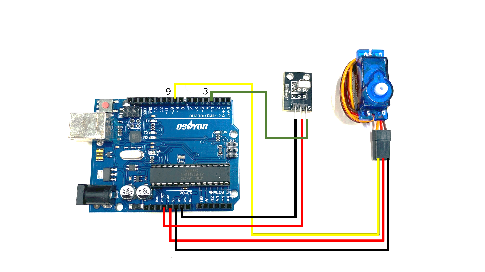
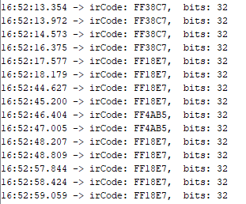

# レッスン09 リモコンでサーボモーターを動かそう

> 🎓 **入門の最後のレッスンです。** ここまでできたら、いよいよ実践でロボットを組み立てます。

## ミッション

**リモコンの数字ボタンを押すと、サーボモーターが決まった角度に動くようにしよう。**

## このレッスンで身につける力

- [ ] ブレッドボードにサーボモーターと赤外線受信モジュールを使った回路を作ることができる
- [ ] サンプルコードを実行できる
- [ ] **`switch` 文**でたくさんの分岐を整理して書ける
- [ ] サンプルコードを改造して、他のリモコンでもモーターを動かすことができる

## 今回使う技術

- サーボモーターの配線
- `#include <Servo.h>` — サーボを使うライブラリ
- `servo.attach()` / `servo.write()` — サーボの角度を指定する
- **`switch` / `case`** — たくさんの分岐を整理して書く
- （復習）`IRremote.hpp` とIRコード

---

## ミッションの準備

### 用意するもの

- [ ] Osoyoo UNO Board x1
- [ ] 赤外線受信機 x1
- [ ] リモートコントローラー x1
- [ ] SG90サーボモーター x1
- [ ] ブレッドボード x1
- [ ] ジャンパー線
- [ ] USBケーブル x1
- [ ] パソコン x1

### 手順

- [ ] 新しいスケッチを「（日付4桁）(自分の名前・ローマ字)09_1」で保存する
- [ ] レッスン05で作った**IRコード記録表**を出しておく

---

## メインミッション

### ステップ1 赤外線受信機とサーボモーターをArduinoにつなごう

**配線図：**



- [ ] 回路が作れたらチェック！

### ステップ2 リモコンからの信号を確かめよう（復習）

まずは受信できているか確かめます。以下をコピー＆ペーストして実行しよう。

```C++
#include <IRremote.hpp>  // IRremoteライブラリの関数を使用する

const int irReceiverPin = 3;  //受信モジュールのSIGはpin3

void setup()
{
  Serial.begin(9600);    //シリアルを初期化し、ボーレートは9600に設定する
  IrReceiver.begin(irReceiverPin, ENABLE_LED_FEEDBACK); // 赤外線受信機モジュールを有効にする
}

void loop()
{
  if (IrReceiver.decode()) //赤外線を受け取ったら
  {
    Serial.print("IRコード: 0x");
    Serial.println(IrReceiver.decodedIRData.command, HEX); //ボタンの番号を出力する
    IrReceiver.resume();    // 次の値を受取る
  }
  delay(600); //600ミリ秒待機
}
```



- [ ] シリアルモニタに上の画像のような表示が出たらチェック！

> **記録表と見くらべよう。** レッスン05で記録したコードと同じ値が出ているかな？

### ステップ3 サーボモーターとは？

ロボットのタイヤを動かしているモーターは何回転でもできるかわりに、**決まった角度に止める**ことはできません。

今回動かす「**サーボモーター**」は、0度から180度までしか動かないかわりに、**決まった角度に動かすことができる**んだ！

| | ふつうのモーター | サーボモーター |
|---|---|---|
| 回転 | 何回転でもできる | 0〜180度まで |
| 角度の指定 | できない | **できる** |
| 使いみち | タイヤを回す | 首をふる、うでを動かす |

実践のレッスン17では、このサーボでセンサーを首ふりさせて、ロボットが周りを見わたせるようにします。

### ステップ4 リモコンでサーボモーターを動かそう

「（日付4桁）(自分の名前・ローマ字)09_2」で保存して、以下をコピー＆ペーストしよう。

```C++
#include <IRremote.hpp>
#include <Servo.h>

#define plus   0x18   //時計回りのボタン（▲）
#define minus  0x4A   //反時計回りのボタン（▼）

int RECV_PIN = 3;       //赤外線受信機のピン
Servo servo;
int val;                //回転角度
bool cwRotation, ccwRotation;  //回転の状態

void setup()
{
  Serial.begin(9600);
  IrReceiver.begin(RECV_PIN, ENABLE_LED_FEEDBACK); // 受信機を起動する
  servo.attach(9);     //サーボピン
}

void loop()
{
  if (IrReceiver.decode()) {
    Serial.println(IrReceiver.decodedIRData.command, HEX);

    if (IrReceiver.decodedIRData.command == plus)
    {
      cwRotation = !cwRotation;      //回転角度の値を切り替えます
      ccwRotation = false;         //これ以上回転しません
    }

    if (IrReceiver.decodedIRData.command == minus)
    {
      ccwRotation = !ccwRotation;
      cwRotation = false;            //回転角度の値を切り替えます
    }
    IrReceiver.resume(); // Receive the next value
  }
  if (cwRotation && (val != 175))  {
    val++;                         //連動ボタン用
  }
  if (ccwRotation && (val != 0))  {
    val--;                         //カウンター連動ボタン用
  }
  servo.write(val);
  delay(20);          //回転速度
}
```

リモコンの▲/▼ボタンを押してみよう！ 同じボタンを2回押すと回転が止まります。

> **`servo.attach(9)`** … サーボを9番ピンにつなぐ、という宣言
> **`servo.write(val)`** … サーボを `val` 度の位置に動かす（0〜180）
> **`val++`** … `val` を1増やす。`val--` は1減らす

- [ ] モーターが動くことが確認できたらチェック！

### ステップ5 switch文を覚えよう

ここからが今日の山場です。

**数字ボタン0〜9で、それぞれちがう角度に動かしたい**とします。
いままでのやり方だと `if` 文を10個ならべることになりますね。

```C++
if (IrReceiver.decodedIRData.command == BUTTON_0) { pos = 0; }
if (IrReceiver.decodedIRData.command == BUTTON_1) { pos = 20; }
if (IrReceiver.decodedIRData.command == BUTTON_2) { pos = 40; }
   ... （あと7個）
```

読みにくいし、書くのも大変です。こんなときに使うのが **`switch` 文**です。

#### switch文の書き方

```C++
switch (変数) {
  case 値1:  その時の動き; break;
  case 値2:  その時の動き; break;
  case 値3:  その時の動き; break;
  default:   どの値でもない時の動き; break;
}
```

- `switch (変数)` … この変数の中身を見る
- `case 値:` … 「もしその値だったら」
- `break;` … **ここで終わり**という合図。**書き忘れると次のcaseも実行されてしまう**ので注意！
- `default:` … どれにも当てはまらなかったとき（なくてもよい）

**1つの変数をいくつもの値と比べるとき**は、`if` をならべるより `switch` のほうがずっと読みやすくなります。

### ステップ6 数字ボタンで決まった角度に動かそう

「（日付4桁）(自分の名前・ローマ字)09_3」で保存して、以下をコピー＆ペーストしよう。

```C++
#include <IRremote.hpp>
#include <Servo.h>

#define RIGHT_ARROW   0x5A //時計回りに回転する（▶）
#define LEFT_ARROW    0x10 //反時計回りに回転する（◀）
#define SELECT_BUTTON 0x38 //サーボの回転位置が中心（OK）
#define BUTTON_0 0x98  //ボタン0〜9を押すと、決まった位置に移動します
#define BUTTON_1 0xA2  // 20度ずつ回転
#define BUTTON_2 0x62
#define BUTTON_3 0xE2
#define BUTTON_4 0x22
#define BUTTON_5 0x02
#define BUTTON_6 0xC2
#define BUTTON_7 0xE0
#define BUTTON_8 0xA8
#define BUTTON_9 0x90

int RECV_PIN = 3;       //赤外線受信機のピン
int16_t pos;         // サーボ位置を保存する変数を設定する
Servo servo;

void setup()
{
  Serial.begin(9600);
  IrReceiver.begin(RECV_PIN, ENABLE_LED_FEEDBACK); // 受信機を起動する
  servo.attach(9);     //サーボピン
  pos = 90;               // 中間点90度から開始
  servo.write(pos);     // 初期位置を設定
}

void loop()
{
  if (IrReceiver.decode()) {
    switch (IrReceiver.decodedIRData.command) {  //ボタンに応じてサーボを動かす
      case LEFT_ARROW:    pos = min(180, pos + 5); break;
      case RIGHT_ARROW:   pos = max(0, pos - 5); break;
      case SELECT_BUTTON: pos = 90; break;
      case BUTTON_0:      pos = 0 * 20; break;
      case BUTTON_1:      pos = 1 * 20; break;
      case BUTTON_2:      pos = 2 * 20; break;
      case BUTTON_3:      pos = 3 * 20; break;
      case BUTTON_4:      pos = 4 * 20; break;
      case BUTTON_5:      pos = 5 * 20; break;
      case BUTTON_6:      pos = 6 * 20; break;
      case BUTTON_7:      pos = 7 * 20; break;
      case BUTTON_8:      pos = 8 * 20; break;
      case BUTTON_9:      pos = 9 * 20; break;
    }
    servo.write(pos);
    IrReceiver.resume();
  }
}
```

> **`#define` って何？**
> `#define BUTTON_1 0xA2` は「`BUTTON_1` という名前で `0xA2` を表す」という意味。
> `0xA2` のままだと何のことか分かりませんが、`BUTTON_1` なら一目で分かりますね。
> **数字に名前をつけて読みやすくする**技です。

- [ ] 数字ボタンでサーボモーターが動いたらチェック！
- [ ] 左右の矢印でサーボモーターの位置を細かく変更できたらチェック！

---

## 確認

作ったものを動かして確かめよう。

- [ ] `0` を押すと0度（はしっこ）に動く
- [ ] `5` を押すと100度（まんなかあたり）に動く
- [ ] `9` を押すと180度（反対のはしっこ）に動く
- [ ] OKボタンを押すと90度（まんなか）にもどる
- [ ] 分度器か紙に角度を書いて当ててみて、だいたい合っている

うまくいかないときは、ここを見てみよう。

| 症状 | 見るところ |
|---|---|
| サーボが動かない | `servo.attach(9)` のピン番号と配線が合っているか |
| ガタガタ震える | USBだけでは電力不足のことがある。先生に相談しよう |
| 一部のボタンだけ効かない | `#define` のIRコードが自分のリモコンと合っているか（記録表を見る） |
| 全部のボタンで同じ動き | `break;` を書き忘れていないか |

> **`break;` を1つ消してみよう。** どうなるか試すと、`break` の意味がよく分かります。

---

## やってみよう

### 1. 自分のリモコンのコードに書き換えよう

上のプログラムのIRコードは、教室のリモコンのものです。
**レッスン05の記録表**を見て、自分のリモコンのコードに書き換えてみよう。

- [ ] 自分の記録表のコードで動いたらチェック

### 2. 角度の割り当てを変えよう

いまは「ボタンの数字 × 20度」になっています。
**`1` を押したら90度、`2` を押したら45度**のように、自分で決めた角度にしてみよう。

```C++
      case BUTTON_1:      pos = 90; break;
      case BUTTON_2:      pos = 45; break;
```

- [ ] 自分で決めた角度に動いたらチェック

### 3. 首ふりを作ろう（発展）

`3` を押したら、**サーボが左右に3回首をふる**ようにしてみよう。

> ヒント：**レッスン04で習った `for` 文**と `servo.write()` を組み合わせます。

```C++
      case BUTTON_3:
        for (int i = 0; i < 3; i++) {
          servo.write(0);
          delay(500);
          servo.write(180);
          delay(500);
        }
        pos = 90;
        break;
```

- [ ] 首ふりができたらチェック！

この首ふりは、**実践17（迷路チャレンジ2）でロボットが周りを見わたす**ときに使う動きそのものです。

### 4. 他のリモコンでも試そう

プロジェクターやテレビなど、**他のリモコン**でも動かせるようにしてみよう。
レッスン05でやったように、まずコードを調べてから書き換えます。

- [ ] 他のリモコンで動かせたらチェック

---

## まとめ

- **サーボモーター** : 0〜180度の**決まった角度**に動かせるモーター
- 赤外線受信モジュールを使うためのライブラリは `IRremote.h`
- サーボモーターを使うためのライブラリは **`Servo.h`**
- `servo.attach(ピン番号)` : サーボをつなぐ宣言
- `servo.write(角度)` : 決まった角度に動かす
- **`switch` / `case`** : 1つの変数をいくつもの値と比べるときに使う。`if` をならべるより読みやすい
- **`break;` を忘れると次のcaseも動いてしまう**
- `#define` : 数字に名前をつけて読みやすくする

### できるようになったことをチェックしよう

- [ ] ブレッドボードにサーボモーターと赤外線受信モジュールを使った回路を作ることができる
- [ ] サンプルコードを実行できる
- [ ] **`switch` 文**でたくさんの分岐を整理して書ける
- [ ] サンプルコードを改造して、他のリモコンでもモーターを動かすことができる

### ファイルを保存してクラウドに上げよう

**レッスンが終わったら、かならずやること。**

今日つくったスケッチは**3つ**。名前がこうなっているか確かめよう。

`（日付4桁）（自分の名前ローマ字）09_1`・`（日付4桁）（自分の名前ローマ字）09_2`・`（日付4桁）（自分の名前ローマ字）09_3`

例：4月10日に誠さんなら `0410makoto09_1`

1. スケッチの名前が上の形になっているか確かめる
2. スケッチを**フォルダごと**、**「生徒共有」の中の自分のフォルダ**に入れる
3. 入れたあと、フォルダの中に `.ino` ファイルが入っているか確かめる

> **なぜフォルダごと運ぶの？**
> Arduinoのスケッチは、**フォルダと、その中の `.ino` ファイルがセット**になっています（レッスン02）。
> `.ino` だけを取り出して運ぶと、開けなくなってしまうんだ。

- [ ] ファイル名を決まった形にできた
- [ ] スケッチをフォルダごと「生徒共有」の自分のフォルダに上げられた

### まとめページに書こう

Googleサイトの自分の**まとめページ**に、次の4つを書こう。

1. **やったこと**
2. **わかったこと**
3. **感じたこと**
4. **つぎやること**

**スクリーンショットか画像を必ず1枚入れること。** 今日はサーボが動いているところの写真か動画を入れよう。

> まとめは1日に1回書く。
> 複数のレッスンを進めた日も、1つのレッスンが1回で終わらなかった日も、まとめは1回。
