# レッスン10 ロボットカーを組み立てよう1

> 🚗 **ここから実践です。** いよいよ自分のロボットカーを組み立てます。
> このレッスンは**機構の組み立て**、次のレッスン11で**配線とプログラム**をやります。

## ミッション

**部品をチェックして、シャーシにモーター・モータードライバ・電圧計・Arduino・バッテリーボックスを取り付けよう。**

## このレッスンで身につける力

- [ ] 部品があるかチェックができる
- [ ] モーターを取り付けられる
- [ ] モータードライバーと電圧計を取り付けられる
- [ ] Arduinoボードと電池ボックス、WiFiシールドを取り付けられる

## 今回使う技術

- 六角ドライバー・プラスドライバーの使い方
- ネジ・スペーサー・ナットの組み合わせ
- 部品リストを見ながらの確認作業
- 取り付ける**向き**を図から読み取る

> **⚠ このロボットは自分のものです。** こわれたときは、そのパーツを別に買ってもらうことになります。ていねいにあつかおう。

---

## ミッションの準備

### 用意するもの

- [ ] Osoyoo ROBOT CAR KIT x1
- [ ] 六角ドライバー（教室のもの） x1
- [ ] ラジオペンチ（教室のもの） x1
- [ ] プラスドライバー（キットに入っています）

### 手順

机の上を片づけて、小さいネジをなくさないように**ふたのある入れ物**を用意しよう。

---

## メインミッション

### ステップ1 部品があるかチェックしよう

**まず全部そろっているか確認します。** 途中で足りないと気づくと、やり直しになります。

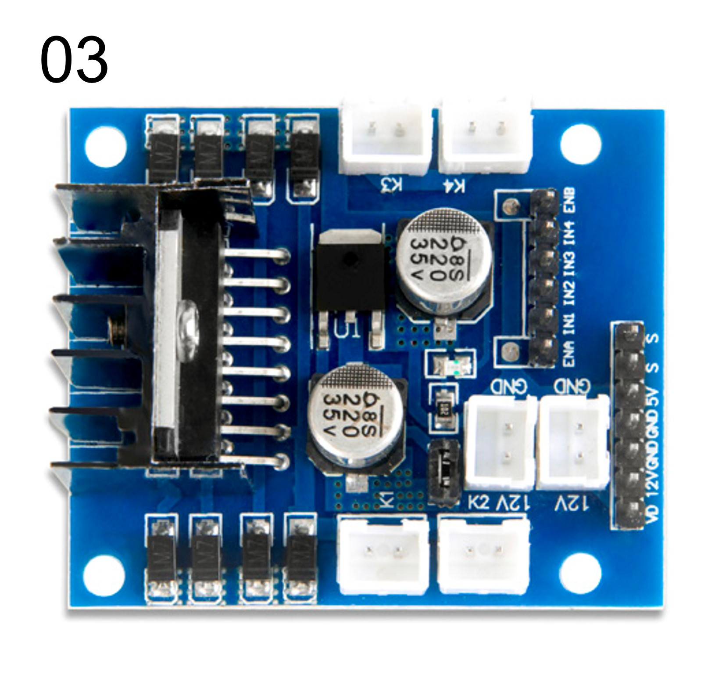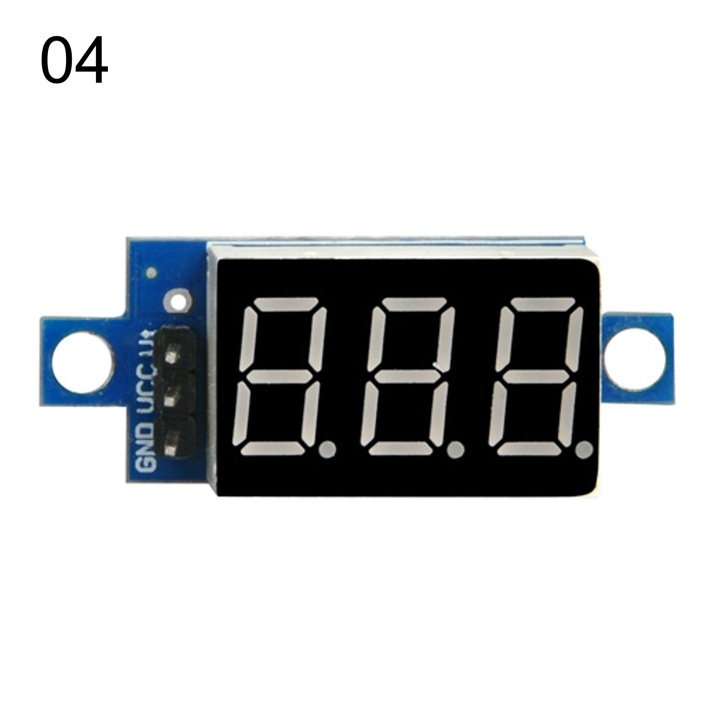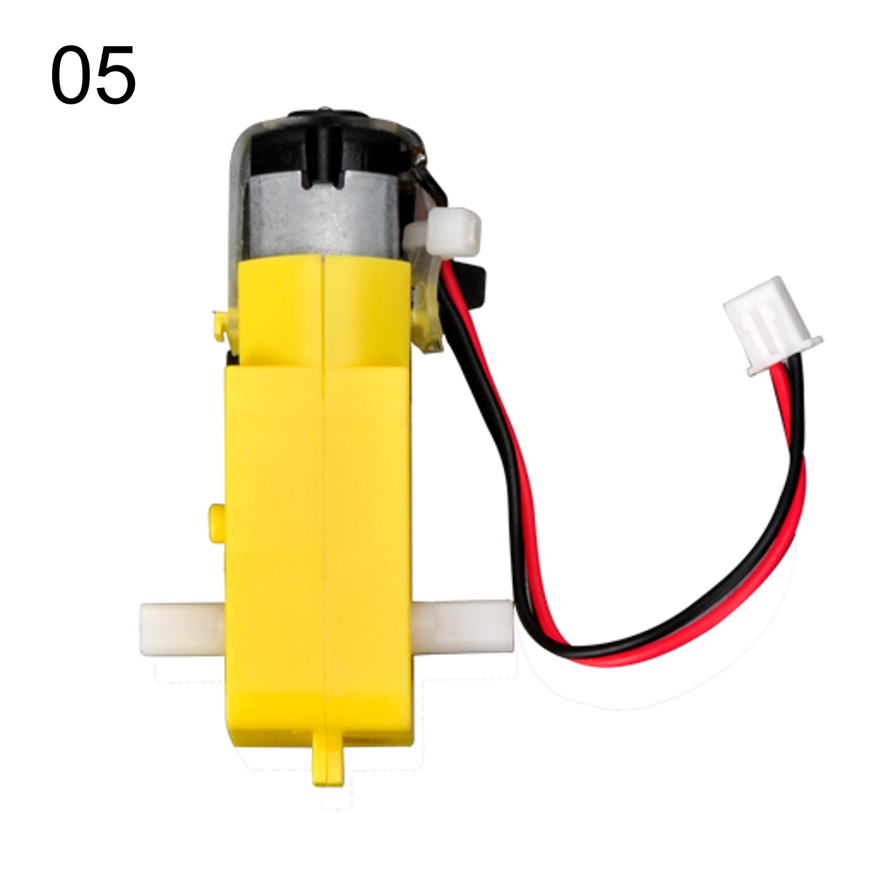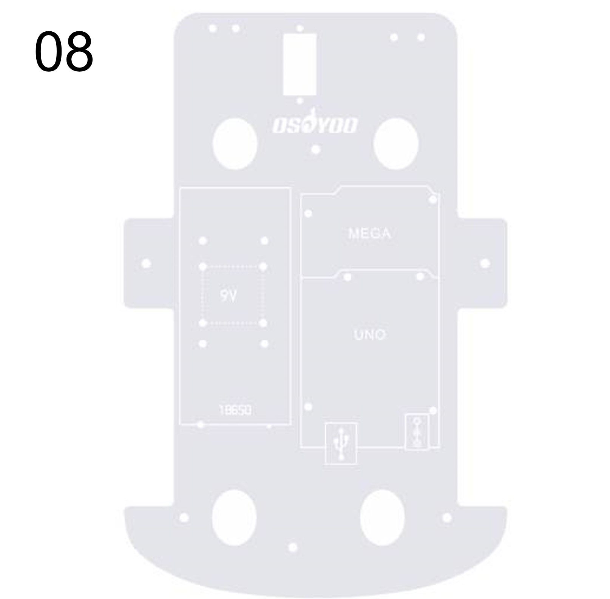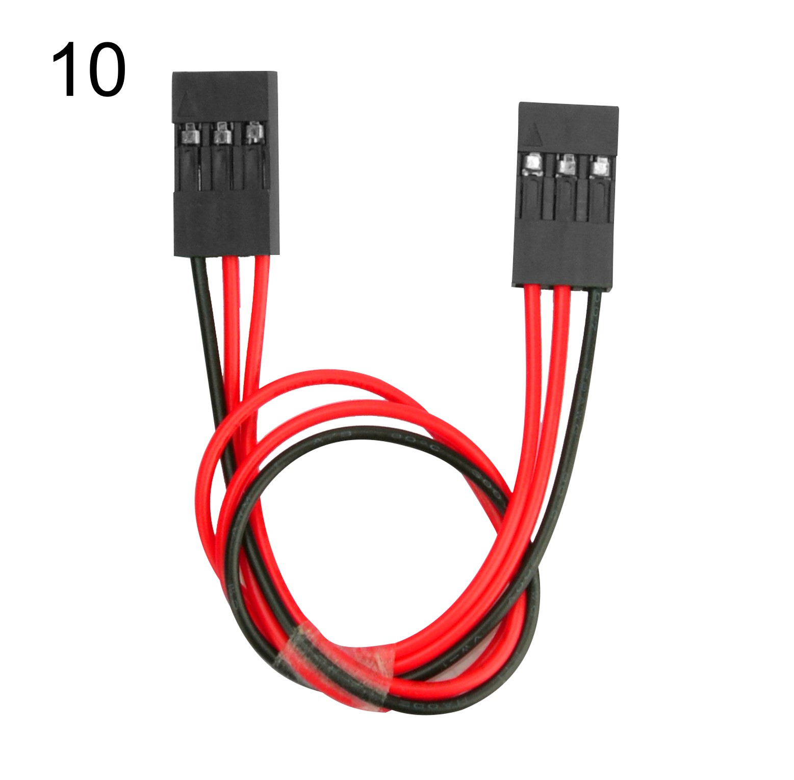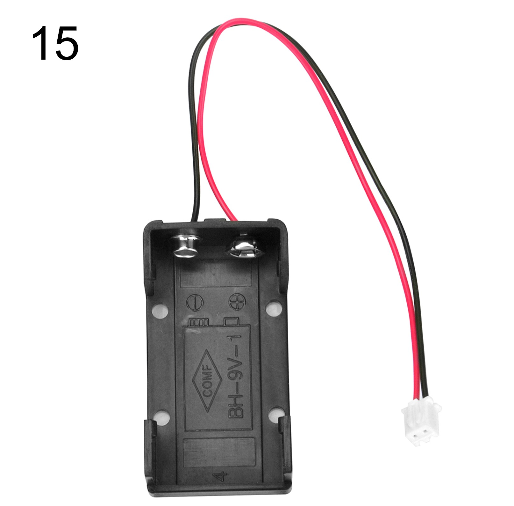

| 番号 | 名前 | 個数 | | 番号 | 名前 | 個数 |
| ----- |----|-----------|-| ------- |----------------------|-----------|
| 01 | Arduino UNO                       | 1    |  | 13 | プラスドライバー                  | 1    |
| 02 | WiFiシールド                 | 1    | | 14 | 六角ドライバー                    | 1    |
| 03 | モータードライバー                | 1    | | 15 | バッテリーボックス（９V電池用）   | 1    |
| 04 | 電圧計                            | 1    | | 16 | M3x10 六角ネジ	                 | 10   |
| 05 | ギアモーター                      | 4    | | 17 | M3x10 プラスネジ	               | 4    |
| 06 | モーター用ホルダー（ネジ付き）    | 4    | | 18 | M3ナット                         | 4    |
| 07 | ホイール                          | 4    |  | 19 | 黄銅スペーサー                | 5    |
| 08 | シャーシ（上部）                  | 1    || 20 | ホイール用ネジ                    | 4    |
| 09 | シャーシ（下部）                  | 1    |  | 21 | M3プラスチックネジ               | 9    |
| 10 | 3ピン メスーメス ジャンパーワイヤ | 1   | | 22 | M3プラスチックスペーサー         | 10   |
| 11 | 6ピン オスーメス ジャンパーワイヤ | 1    | | 23 | M3プラスチックナット             | 10   |
| 12 | 2ピン PnP ケーブル                | 1    |

- [ ] 部品があるか確認できたらチェック！

> 足りないものがあったら、**組み立てる前に**先生に伝えよう。

### ステップ2 シャーシの保護フィルムをはがそう

必要なもの：シャーシ（上部）、シャーシ（下部）

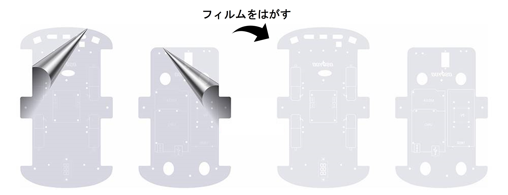

### ステップ3 ギアモーターにモーター用ホルダーを付けよう

必要なもの：ギアモーター x4、モーター用ホルダー（ネジ付き） x4

**※取り付け向きに注意！**

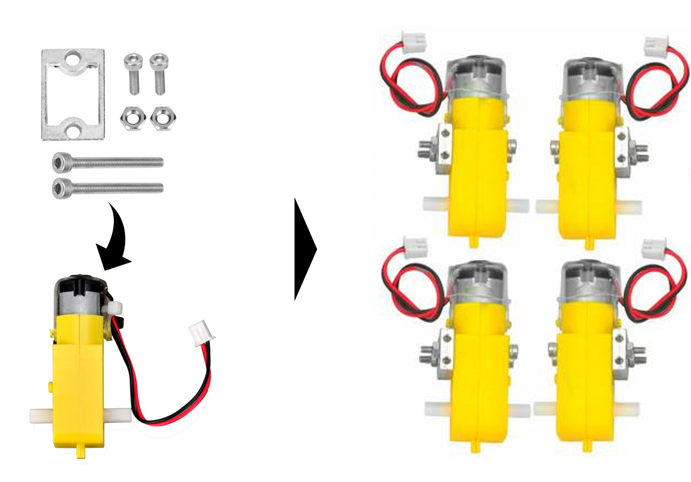

### ステップ4 モーターをシャーシ（下部）に取り付けよう

必要なもの：シャーシ（下部）、ステップ3で組み立てたモーター

※ネジはモーター用ホルダーに同封されています。新しく出す必要はありません。

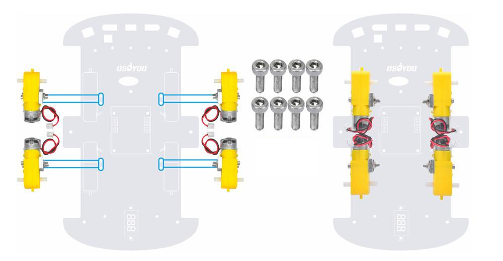

- [ ] モーターを取り付けられたらチェック！

### ステップ5 モータードライバを取り付けよう

必要なもの：モータードライバ、M3プラスチックネジ x4、M3プラスチックスペーサー x4、M3プラスチックナット x4

**※モータードライバの取り付け向きに注意！**

### ステップ6 電圧計を取り付けよう

必要なもの：電圧計、M3プラスチックネジ x2、M3プラスチックスペーサー x2、M3プラスチックナット x2

- [ ] モータードライバーと電圧計を取り付けられたらチェック！

### ステップ7 Arduino UNOを取り付けよう

必要なもの：Arduino UNO、シャーシ（上部）、M3プラスチックネジ x4、M3プラスチックスペーサー x4、M3プラスチックナット x4

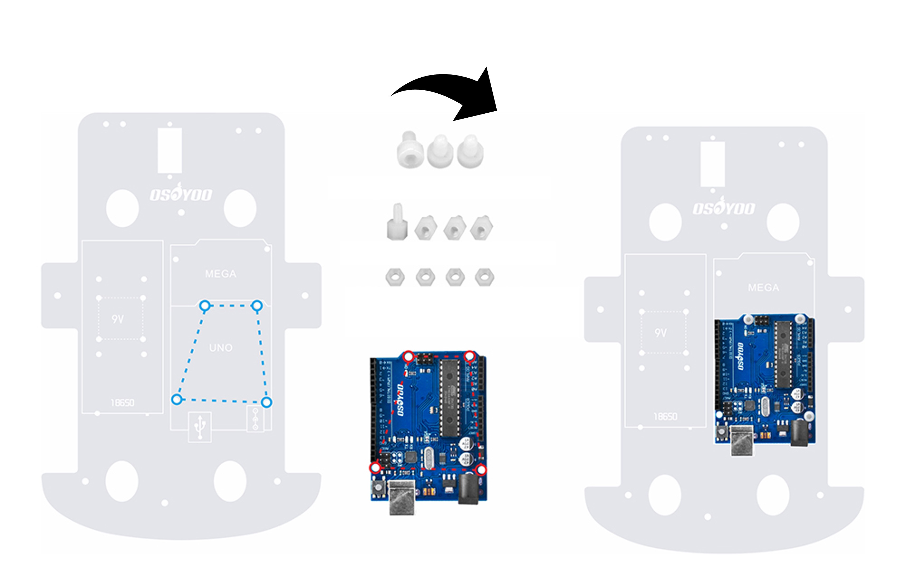

### ステップ8 バッテリーボックスを取り付けよう

必要なもの：バッテリーボックス（9V電池用）、M3x10 プラスネジ x4、M3ナット x4

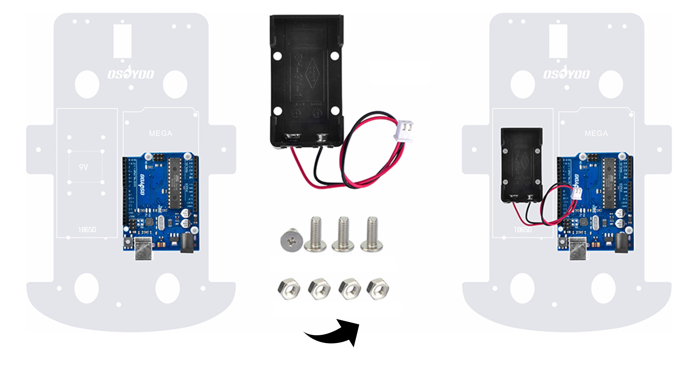

### ステップ9 WiFiシールドを取り付けよう

必要なもの：WiFiシールド

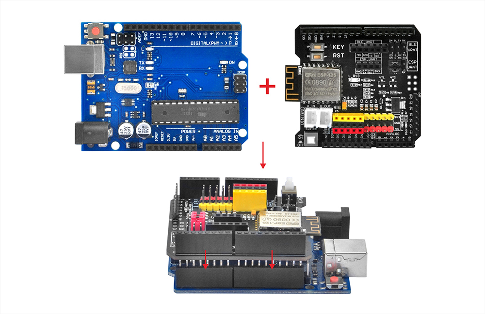

- [ ] Arduinoボードと電池ボックス、WiFiシールドを取り付けられたらチェック！

---

## 確認

**まだ電源は入れません。** ここでは、手で触って確かめます。

### 取り付けの確認

- [ ] モーター4個すべてが**しっかり固定**されていて、手で押してもぐらつかない
- [ ] タイヤの軸を手で回すと、**4つとも軽く回る**（かたい場合はネジのしめすぎ）
- [ ] モータードライバの向きが図と同じ
- [ ] 電圧計の向きが図と同じ
- [ ] Arduinoの上にWiFiシールドが**まっすぐ**刺さっている（ピンが曲がっていないか）
- [ ] 余ったネジ・ナットが、部品表の残りと合っている

### 数えてみよう

使い終わったあとに残っているはずの部品です。合っているかな？

| 部品 | 残っているはず |
|---|---|
| M3x10 六角ネジ | 10本（次のレッスンで使う） |
| 黄銅スペーサー | 5個（次のレッスンで使う） |
| ホイール | 4個（次のレッスンで使う） |
| ホイール用ネジ | 4本（次のレッスンで使う） |

うまくいかないときは、ここを見てみよう。

| 症状 | 見るところ |
|---|---|
| タイヤの軸が回らない | モーターホルダーのネジをしめすぎていないか |
| ネジが余った／足りない | 図をもう一度見て、使う本数を数えなおす |
| WiFiシールドが刺さらない | ピンが曲がっていないか。無理に押し込まず先生に相談 |
| ぐらぐらする | スペーサーを入れ忘れていないか |

---

## やってみよう

### 1. ネジのしめ具合を調整しよう

タイヤの軸を指で回してみて、**4つとも同じくらいの軽さ**になるように調整しよう。

1つだけかたいと、まっすぐ走らない原因になります。**次のレッスンでまっすぐ走らせる**ので、ここで直しておくとあとが楽です。

- [ ] 4つとも同じくらいの軽さになったらチェック

### 2. 完成予想図を描こう

次のレッスンで配線をします。**どの線がどこにつながるか**、いまの状態を写真に撮っておこう。
組み立てたあとだと見えなくなる部分があります。

- [ ] 上から・横から・下からの写真を撮ったらチェック

---

## まとめ

- 組み立ての前に、**まず部品がそろっているか確認する**
- 部品には**取り付ける向き**がある。図をよく見る
- ネジは**しめすぎない**。タイヤが回らなくなる
- スペーサーは、板と部品のあいだにすき間を作るためのもの
- 余った部品の数を数えると、つけ忘れに気づける

### できるようになったことをチェックしよう

- [ ] 部品があるかチェックができる
- [ ] モーターを取り付けられる
- [ ] モータードライバーと電圧計を取り付けられる
- [ ] Arduinoボードと電池ボックス、WiFiシールドを取り付けられる

### まとめページに書こう

Googleサイトの自分の**まとめページ**に、次の4つを書こう。

1. **やったこと**
2. **わかったこと**
3. **感じたこと**
4. **つぎやること**

**スクリーンショットか画像を必ず1枚入れること。** 今日は組み立てたシャーシの写真を入れよう。

> まとめは1日に1回書く。
> 複数のレッスンを進めた日も、1つのレッスンが1回で終わらなかった日も、まとめは1回。
