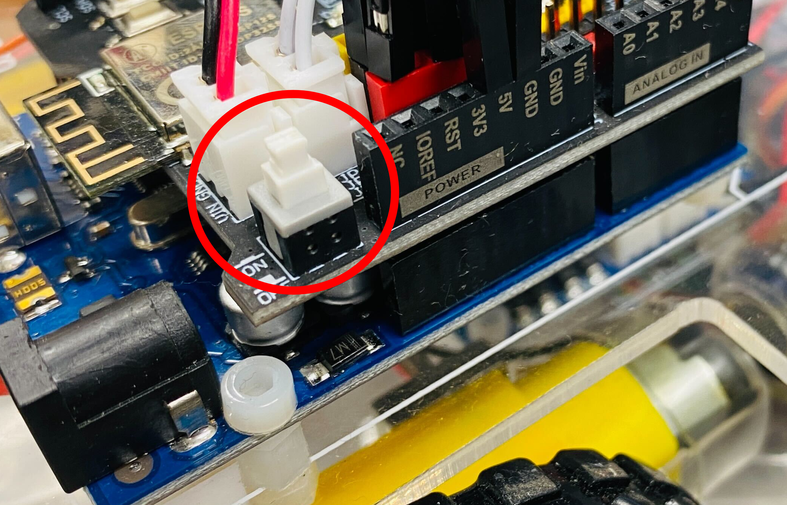

# レッスン11 ロボットカーを組み立てよう2

> 前回は機構を組み立てました。今回は**配線をしてロボットを完成させ、はじめて動かします。**

## ミッション

**配線を完成させてロボットを組み上げ、前後左右に動かそう。**

## このレッスンで身につける力

- [ ] ジャンパーワイヤーを正しく取り付けられる
- [ ] シャーシ・タイヤを取り付けられる
- [ ] `motor_driver.h` を使ってロボットを動かせる
- [ ] **関数**とは何か説明できる
- [ ] **引数**を変えて動きを変えられる

## 今回使う技術

- ジャンパーワイヤーの接続
- `#include "motor_driver.h"` — 共通ライブラリの読み込み
- `init_GPIO()` — ピンの初期化
- `go_Advance()` `go_Back()` `go_Left()` `go_Right()` `stop_Stop()` — 走行の関数
- **関数**と**引数**

---

## ミッションの準備

### 用意するもの

- [ ] レッスン10で組み立てたロボット
- [ ] 六角ドライバー、ラジオペンチ
- [ ] 3ピン メス-メス ジャンパーワイヤ、6ピン オス-メス ジャンパーワイヤ、2ピン PnPケーブル
- [ ] M3x10 六角ネジ x10、黄銅スペーサー x5
- [ ] ホイール x4、ホイール用ネジ x4
- [ ] 9V電池
- [ ] USBケーブル、パソコン

### 手順

- [ ] レッスン10で撮った**組み立て途中の写真**を出しておく

---

## メインミッション

### ステップ1 モータードライバとモーターを接続しよう


必要なもの：3ピン メス-メス ジャンパーワイヤ

### ステップ2 モータードライバとWiFiシールドを接続しよう

必要なもの：6ピン オス-メス ジャンパーワイヤ、2ピン PnP ケーブル

**※上部シャーシの穴を通して配線しよう！** 先に閉じてしまうと通せなくなります。


> ### ⚠ 右モーターのPWM（ENA）は **D3** につなぐこと
>
> 古い説明書では D9 につなぐようになっていますが、ロボ部では **D3** を使います。
> **D9 はサーボモーター用に空けておく**ためです（実践17の迷路チャレンジ2で使います）。
>
> あとから変えると「前に動いたプログラムが動かない」ことになるので、**最初からD3**にしておこう。

### ステップ3 バッテリーボックスとWiFiシールドを接続しよう


- [ ] ジャンパーワイヤーを正しく取り付けられたらチェック！

### ステップ4 上下のシャーシを固定しよう

必要なもの：M3x10 六角ネジ x10、黄銅スペーサー x5

※最後までネジが入らない場合があります。


### ステップ5 ホイールを取り付けよう

必要なもの：ホイール x4、ホイール用ネジ x4

**※きつく締め付けすぎるとタイヤが回らなくなります。**


- [ ] シャーシ・タイヤを取り付けられたらチェック！

**これでロボットの完成です！**

### ステップ6 motor_driver.h を用意しよう

ロボ部では、モーターを動かすプログラムを **`motor_driver.h`** という1つのファイルにまとめてあります。
**これから先のロボットのレッスンでは、ずっとこれを使います。**

1. `common/motor_driver.h` をコピーする
2. 新しいスケッチを「（日付4桁）(自分の名前・ローマ字)11」で保存する
3. スケッチを保存したフォルダの中に、`motor_driver.h` を**貼り付ける**

> スケッチのフォルダがどこにあるか分からなくなったら、Arduino IDEの
> スケッチ→スケッチのフォルダを表示 で開けます。

### ステップ7 ロボットを動かすプログラムを書こう

```C++
#include "motor_driver.h"   // 共通のモーター制御を読みこむ

void setup()
{
  init_GPIO();       // ピンの準備。必ず最初に呼ぶ

  beep(1, 200);      // 「ピッ」と鳴ってスタートの合図

  go_Advance(200, 2000);   // 前に進む（速さ200で2秒）
  stop_Stop(500);          // 止まる（0.5秒）

  go_Back(200, 2000);      // 後ろに下がる
  stop_Stop(500);

  go_Left(200, 1000);      // 左に旋回する
  stop_Stop(500);

  go_Right(200, 1000);     // 右に旋回する
  stop_Stop();

  beep(2, 200);      // 「ピピッ」と鳴って終わりの合図
}

void loop() {
}
```

### ステップ8 書き込んで動かそう

1. Arduino UNOボードとパソコンをUSBケーブルでつなぐ

   

   【注意】USBを抜き差しするときは向きを確認して、ていねいにあつかうこと。

2. ツール→シリアルポートで「COM〜（Arduino UNO）」を選ぶ

   

3. 左上の矢印を押して（または `Ctrl` + `U`）書き込む

4. プラス・マイナスに気をつけて9V電池をバッテリーボックスに差し込む

5. **※ロボットを広い場所に移動しよう**

6. スイッチを押し込んで電源を入れる

   

**ロボットが前後移動・左右旋回したら成功！**

### ステップ9 関数について学ぼう

`go_Advance()` のような、**まとまった仕事に名前をつけたもの**を**関数**といいます。

`motor_driver.h` の中では、前に進む処理はこう書かれています。

```C++
void go_Advance(int speed = 200, int time = 0)
{
  digitalWrite(RightMotorDirPin1, HIGH);
  digitalWrite(RightMotorDirPin2, LOW);
  digitalWrite(LeftMotorDirPin1, HIGH);
  digitalWrite(LeftMotorDirPin2, LOW);
  analogWrite(speedPinL, speed);
  analogWrite(speedPinR, speed);
  ...
}
```

6行もありますね。でも、**関数にしておけば `go_Advance();` の1行で呼び出せます。**

#### 関数の書き方

```C++
void 関数の名前(引数)
{
  やりたい処理
}
```

- **`void`** … 「返す答えがない」という意味
- **引数（ひきすう）** … 関数に渡す値。`go_Advance(200, 2000)` なら `200` と `2000`

#### 引数を変えると動きが変わる

```C++
go_Advance(200, 2000);   // 速さ200 で 2秒間
go_Advance(100, 1000);   // 速さ100 で 1秒間（おそくて短い）
go_Advance(255, 3000);   // 速さ255 で 3秒間（最速で長い）
```

| 引数 | 意味 | 範囲 |
|---|---|---|
| 1つめ `speed` | 速さ | 0〜255（`analogWrite` と同じ！） |
| 2つめ `time` | 動く時間 | ミリ秒。0にするとずっと動き続ける |

> **レッスン08の `analogWrite()`** を覚えているかな？
> LEDの明るさを0〜255で変えました。モーターの速さもまったく同じ仕組みです。

#### 使える関数の一覧

| 関数 | 動き |
|---|---|
| `go_Advance(速さ, 時間)` | 前に進む |
| `go_Back(速さ, 時間)` | 後ろに下がる |
| `go_Left(速さ, 時間)` | 左に旋回する |
| `go_Right(速さ, 時間)` | 右に旋回する |
| `stop_Stop(時間)` | 止まる |
| `back_Left(速さ, 時間)` | 下がりながら左へ（実践19・20で使う） |
| `back_Right(速さ, 時間)` | 下がりながら右へ（実践19・20で使う） |
| `set_Motorspeed(左, 右)` | 左右の速さを別々に決める |
| `beep(回数, 長さ)` | ブザーを鳴らす |
| `init_GPIO()` | ピンの準備（`setup()` で必ず1回） |

---

## 確認

### 電源を入れる前の配線チェック

**⚠ 必ずやること。** まちがった配線で電源を入れると、部品がこわれます。

- [ ] 右モーターのPWM（ENA）が **D3** につながっている
- [ ] 6ピンのジャンパーワイヤが**上部シャーシの穴を通って**いる
- [ ] バッテリーの線のプラス・マイナスが合っている
- [ ] 線がタイヤに**巻きこまれない**ように整理されている
- [ ] ネジがゆるんでいない

### 動かして確かめよう

**ロボットを広い場所に置いてから**電源を入れよう。

- [ ] スタートのとき「ピッ」と鳴る
- [ ] 前に進む
- [ ] 後ろに下がる
- [ ] 左に回る
- [ ] 右に回る
- [ ] 終わりに「ピピッ」と鳴る

うまくいかないときは、ここを見てみよう。

| 症状 | 見るところ |
|---|---|
| まったく動かない | 電池が入っているか／スイッチが入っているか／電圧計の表示 |
| 音は鳴るが動かない | モータードライバの配線、バッテリーの接続 |
| 前に進まず、その場で回る | 左右どちらかのモーターの線が逆。IN1とIN2を入れかえてみる |
| まっすぐ進まない | タイヤのネジのしめ具合（レッスン10の「やってみよう」） |
| 逆向きに進む | モーターの線が左右とも逆になっている |
| コンパイルでエラー | `motor_driver.h` がスケッチのフォルダに入っているか |

> **ブザーが役に立つ場面です。** 「ピッ」が鳴れば、プログラムは動いています。
> 鳴るのに走らないなら、原因は**プログラムではなく配線や電池**だと分かりますね。

---

## やってみよう

### 1. 四角を描いて走らせよう

**前進→右に90度→前進→右に90度…** をくりかえして、**四角い道を1周**してもとの場所にもどってこよう。

右に90度回るには、`go_Right()` の**時間**をどれくらいにすればいいかな？
何度か試して、ちょうど90度になる時間をさがそう。

> ヒント：**レッスン04で習った `for` 文**を使うと、4回のくりかえしが短く書けます。

```C++
  for (int i = 0; i < 4; i++) {
    go_Advance(150, 1000);
    stop_Stop(300);
    go_Right(150, ???);   // ←ここの時間をさがそう
    stop_Stop(300);
  }
```

- [ ] 90度になる時間を見つけられたらチェック
- [ ] 四角を1周してもとの場所に近いところにもどれたらチェック

### 2. 速さを変えてみよう

同じ時間でも、速さを変えると進む距離が変わります。

| 速さ | 1秒で進んだ距離 |
|---|---|
| 100 | cm |
| 150 | cm |
| 200 | cm |
| 255 | cm |

定規かメジャーで測って、表をうめてみよう。**この表は次のレッスン12（チキンラン）で使います。**

- [ ] 表をうめられたらチェック

### 3. カーブを走らせよう（発展）

`set_Motorspeed(左, 右)` を使うと、左右のタイヤの速さを別々にできます。
**大きくカーブしながら進む**ようにしてみよう。

> ヒント：外側のタイヤを速く、内側をおそくします。

---

## まとめ

- ロボットの配線は、**シャーシを閉じる前に**通す
- 右モーターのPWM（ENA）は **D3**。D9はサーボ用に空けておく
- **`motor_driver.h`** をスケッチのフォルダに入れて `#include "motor_driver.h"` で読みこむ
- `init_GPIO()` を `setup()` の最初に必ず呼ぶ
- **関数**＝まとまった仕事に名前をつけたもの。1行で呼び出せる
- **引数**＝関数に渡す値。`go_Advance(速さ, 時間)`
- 速さは **0〜255**（`analogWrite` と同じ）
- **ブザーは原因さがしの道具になる**。鳴るのに走らないなら、原因はプログラムの外

### できるようになったことをチェックしよう

- [ ] ジャンパーワイヤーを正しく取り付けられる
- [ ] シャーシ・タイヤを取り付けられる
- [ ] `motor_driver.h` を使ってロボットを動かせる
- [ ] **関数**とは何か説明できる
- [ ] **引数**を変えて動きを変えられる

### まとめページに書こう

Googleサイトの自分の**まとめページ**に、次の4つを書こう。

1. **やったこと**
2. **わかったこと**
3. **感じたこと**
4. **つぎやること**

**スクリーンショットか画像を必ず1枚入れること。** 今日は完成したロボットの写真か、動いている動画を入れよう。

> まとめは1日に1回書く。
> 複数のレッスンを進めた日も、1つのレッスンが1回で終わらなかった日も、まとめは1回。
