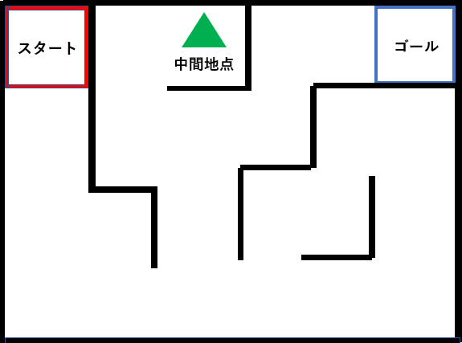
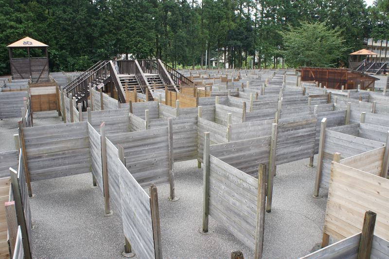
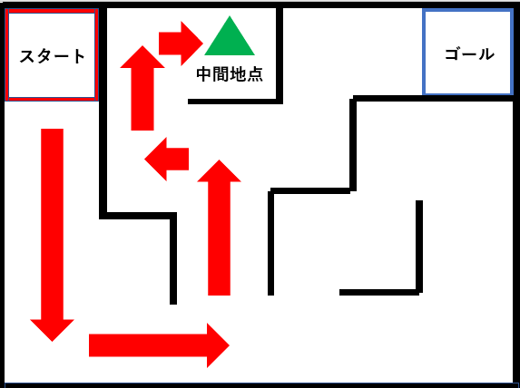
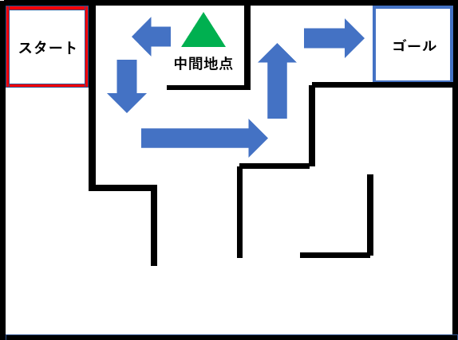
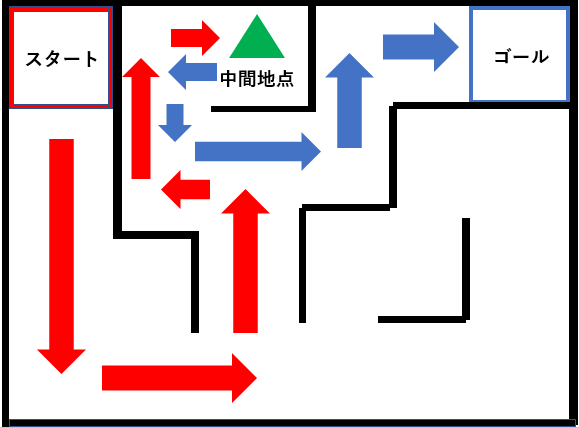

# レッスン13 迷路チャレンジ1

## ミッション

**前進・後進・左右の旋回を組み合わせて、スタートから中間地点を通ってゴールまで迷路を抜けよう。**

## このレッスンで身につける力

- [ ] `motor_driver.h` を使ってロボットの向きを左右に変えることができる
- [ ] 時間を調整して、ちょうどいい方向にロボットを向けることができる
- [ ] 前進と方向転換を使って迷路を抜けることができる
- [ ] 一度に全部やろうとせず、**区間ごとに試して直す**ことができる

## 今回使う技術

- `go_Left(速さ, 時間)` / `go_Right(速さ, 時間)`
- 動きの組み合わせで経路を作る
- 区間ごとに切って試す進め方

---

## ミッションの準備

### 用意するもの

- [ ] レッスン11で完成させたロボット
- [ ] USBケーブル x1
- [ ] パソコン x1
- [ ] 迷路コース
- [ ] ノート



### 手順

1. 「（日付4桁）(自分の名前・ローマ字)13」で保存する
2. スケッチのフォルダに **`motor_driver.h` をコピー**する
3. 下の土台コードをコピー＆ペーストする

```C++
#include "motor_driver.h"

void setup()
{
  init_GPIO();
  beep(1, 200);      // スタートの合図

  //ここから下にプログラムを書く


}

void loop() {
}
```

---

## メインミッション

### 迷路とは？

入り込むと迷って出られなくなるような道のことだよ！
ここで少し変わった迷路を紹介しよう。栃木県の日光市というところには、写真のような人が通れる巨大な迷路もあるよ。



ネットで「巨大な迷路」と検索するともっと出てくるよ。検索してみてね。

今回は下図のような迷路を、スタートから中間地点を通ってゴールしてもらいます。


### ステップ1 ロボットを動かそう（復習）

ここで前後左右の動きができるか確認するよ！

| やりたいこと | 関数 |
|---|---|
| まっすぐ進む | `go_Advance(速さ, 動く時間);` |
| 後ろに下がる | `go_Back(速さ, 動く時間);` |
| 左に曲がる | `go_Left(速さ, 動く時間);` |
| 右に曲がる | `go_Right(速さ, 動く時間);` |

> **注意**：左右の動きは**関数そのものが変わります。** マイナス「-」を使うのではありません。

### ステップ2 曲がる時間を調べよう

迷路を抜けるには、**きっちり90度曲がる**ことが大事です。まずここを調べておこう。

広い場所でロボットを動かして、**90度曲がるのに何ミリ秒かかるか**をさがそう。

| 回 | 速さ | 時間 | 結果 |
|---|---|---|---|
| 1回目 | 150 | 500ミリ秒 | 足りない / ちょうど / 回りすぎ |
| 2回目 | 150 | ミリ秒 | |
| 3回目 | 150 | ミリ秒 | |

**分かったこと**

- 右に90度 ＝ 速さ150 で ______ ミリ秒
- 左に90度 ＝ 速さ150 で ______ ミリ秒
- 右に180度 ＝ 速さ150 で ______ ミリ秒

> 左と右で時間がちがうこともあります。モーターのクセです。両方とも調べておこう。

- [ ] 90度曲がる時間を見つけられたらチェック

### ステップ3 スタートから中間地点まで動かそう

ステップ1・2を使って、スタートから中間地点を目指そう！



**いきなり全部書かないこと。** 1つの動きを書いて → 試して → 直す、をくりかえします。

```C++
  go_Advance(150, 1000);   // まず1つめだけ書いて試す
  stop_Stop(300);
```

うまくいったら、次の動きを書き足します。

> **`stop_Stop(300)` を間に入れよう。**
> 動きの間で一度止まると、勢いで曲がりすぎるのを防げて、どこがずれたか分かりやすくなります。

中間地点まで移動できたら次に進もう。

- [ ] 中間地点までたどり着けたらチェック

### ステップ4 中間地点からゴールまで動かそう

中間地点からゴールを目指そう！

中間地点から抜け出すときは、**後ろに下がりながら**移動すると楽だよ！
だけど、ほかの抜け出し方をしてもいいよ。



- [ ] 中間地点からゴールにたどり着けたらチェック

### ステップ5 スタートからゴールまで通しでやろう

最後のステップだよ！ ステップ3とステップ4を組み合わせて、スタートからゴールまで一気に走らせよう。



**ゴールにたどり着けたらミッションクリアです！**

---

## 確認

### 区間ごとに確かめよう

**一発で通そうとしないこと。** 区間ごとに切って確かめると、どこが悪いかすぐ分かります。

- [ ] 区間1（スタート → 最初の曲がり角）だけで試した
- [ ] 区間2（曲がり角 → 中間地点）だけで試した
- [ ] 区間3（中間地点 → ゴール）だけで試した
- [ ] 全部つないで通した
- [ ] **3回やって3回ともゴールできた**

### 区間ごとにブザーを鳴らそう

いま**どの区間を走っているか**を音で知らせると、失敗した場所がすぐ分かります。

```C++
  beep(1, 100);            // 区間1 開始
  go_Advance(150, 1000);
  stop_Stop(300);

  beep(2, 100);            // 区間2 開始
  go_Right(150, 600);
  stop_Stop(300);

  beep(3, 100);            // 区間3 開始
  go_Advance(150, 1500);
  stop_Stop();
```

「ピピッ」の途中で壁にぶつかったなら、直すのは区間2だと分かりますね。

- [ ] 区間ごとにブザーを鳴らせたらチェック

うまくいかないときは、ここを見てみよう。

| 症状 | 見るところ |
|---|---|
| 曲がりすぎる／足りない | 曲がる時間を少しずつ変える（50ミリ秒ずつ） |
| だんだんずれていく | 前の区間の小さなずれが積み重なっている。前の区間から直す |
| 毎回ちがう場所で止まる | 電池が減っていないか。スタート位置は毎回同じか |
| まっすぐ進まない | タイヤのネジのしめ具合／`set_Motorspeed()` で左右の速さを微調整 |

> **スタート位置を毎回そろえよう。** 床にテープで印をつけておくと安定します。

---

## やってみよう

### 1. スピードを上げてタイムを縮めよう

ゴールできるようになったら、**速さを上げて**どこまでタイムを縮められるか挑戦しよう。

| 回 | 速さ | タイム | 結果 |
|---|---|---|---|
| 1回目 | 150 | 秒 | ゴール / 失敗 |
| 2回目 | 200 | 秒 | |
| 3回目 | 255 | 秒 | |

速さを上げると、曲がる時間も変えないといけないはずです。どう変わったかな？

- [ ] 速さを上げてもゴールできたらチェック
- [ ] 自己ベストのタイムを記録できたらチェック

### 2. 逆走してみよう

ゴールからスタートまで、**逆向きに**走らせてみよう。

### 3. for文でくりかえしをまとめよう（発展）

同じ動きが何回も出てくるところはないかな？
**レッスン04で習った `for` 文**を使うと短く書けます。

```C++
  // 「前進して右折」を3回くりかえす
  for (int i = 0; i < 3; i++) {
    go_Advance(150, 1000);
    stop_Stop(200);
    go_Right(150, 600);
    stop_Stop(200);
  }
```

- [ ] `for` 文でプログラムを短くできたらチェック

---

## まとめ

- ロボットを動かす4つの関数

  | やりたいこと | 関数 |
  |---|---|
  | まっすぐ進む | `go_Advance(速さ, 時間);` |
  | 後ろに下がる | `go_Back(速さ, 時間);` |
  | 左に曲がる | `go_Left(速さ, 時間);` |
  | 右に曲がる | `go_Right(速さ, 時間);` |

- これらの組み合わせを変えることで、前後左右の移動ができる
- **90度曲がる時間**は、速さによって変わる。調べておくと使い回せる
- 動きの間に `stop_Stop()` を入れると安定する
- **一発で通そうとせず、区間ごとに試して直す**
- ブザーで区間を知らせると、失敗した場所が分かる

### できるようになったことをチェックしよう

- [ ] `motor_driver.h` を使ってロボットの向きを左右に変えることができる
- [ ] 時間を調整して、ちょうどいい方向にロボットを向けることができる
- [ ] 前進と方向転換を使って迷路を抜けることができる
- [ ] 一度に全部やろうとせず、**区間ごとに試して直す**ことができる

### まとめページに書こう

Googleサイトの自分の**まとめページ**に、次の4つを書こう。

1. **やったこと**
2. **わかったこと**
3. **感じたこと**
4. **つぎやること**

**スクリーンショットか画像を必ず1枚入れること。** 今日は迷路を走っている動画か、ゴールした写真を入れよう。

> まとめは1日に1回書く。
> 複数のレッスンを進めた日も、1つのレッスンが1回で終わらなかった日も、まとめは1回。
