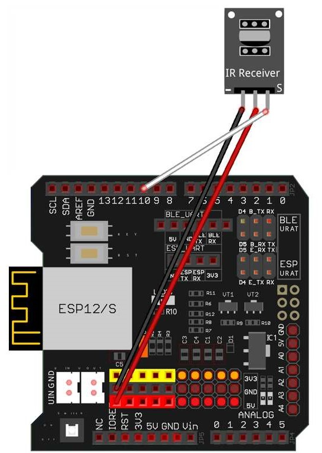

# レッスン14 赤外線リモコンでロボットを動かそう

## ミッション

**赤外線リモコンでロボットを操縦して、コースを走破しよう。**

## このレッスンで身につける力

- [ ] 赤外線受信モジュールを正しく取り付けることができる
- [ ] ジャンパーワイヤーを正しく接続できる
- [ ] （復習）IRremoteライブラリを追加できる
- [ ] `switch` 文でボタンと動きを結びつけられる
- [ ] コースを走破するためにサンプルコードを修正できる
- [ ] （発展）テレビなどのリモコンを使ってロボットを動かすことができる

## 今回使う技術

- 赤外線受信モジュールのロボットへの取り付け
- （復習）`IRremote.h` とIRコード — **入門05**
- （復習）`switch` / `case` — **入門09**
- `motor_driver.h` の走行関数

> **入門で別々にやったことが、ここでつながります。**
> 入門05でIRコードを調べ、入門09で `switch` を覚えました。今回はその2つでロボットを動かします。

---

## ミッションの準備

### 用意するもの

- [ ] レッスン11で完成させたロボット
- [ ] 赤外線受信モジュール x1
- [ ] リモートコントローラー x1
- [ ] オス-メス ジャンパーワイヤ（赤・黒・白） x3
- [ ] M2.5プラスチックネジ・ピラー・ナット（取り付け用）
- [ ] USBケーブル x1
- [ ] パソコン x1
- [ ] コース


### 手順

- [ ] **入門05で作ったIRコード記録表**を出しておく（今日使います）
- [ ] 「（日付4桁）(自分の名前・ローマ字)14」で保存する
- [ ] スケッチのフォルダに **`motor_driver.h` をコピー**する

---

## メインミッション

### ステップ1 赤外線受信モジュールをロボットに取り付けよう

上部シャーシの前側に赤外線受信モジュールを追加します。
取り付けにはプラスチックのM2.5ネジ長10、ピラーとナットを使おう！


- [ ] 赤外線受信モジュールを正しく取り付けられたらチェック

### ステップ2 ジャンパーワイヤーを接続しよう

写真のように赤と黒と白のワイヤーを接続します。
**この時、今までのレッスンでつないできたワイヤーは外さないでね！**



信号線は **D10** につなぎます。

- [ ] ジャンパーワイヤーを正しく接続できたらチェック

### ステップ3 （復習）IRremoteライブラリを追加しよう

ライブラリが入っていなかったときは、**入門05**のテキストを見て追加しよう。

- [ ] IRremoteライブラリが入っていることを確認できたらチェック

### ステップ4 サンプルスケッチを実行してみよう

以下のコードをコピー＆ペーストしよう。

```C++
#include <IRremote.h>
#include "motor_driver.h"

#define IR_PIN 10          // 赤外線レシーバの信号ピンは D10
IRrecv IR(IR_PIN);
decode_results IRresults;

// リモコンのボタンとIRコードの対応（自分の記録表の値に書きかえよう）
#define IR_ADVANCE  0x00FF18E7   // 「▲」前進
#define IR_BACK     0x00FF4AB5   // 「▼」後進
#define IR_RIGHT    0x00FF5AA5   // 「▶」右折
#define IR_LEFT     0x00FF10EF   // 「◀」左折
#define IR_STOP     0x00FF38C7   // 「OK」ストップ

void setup()
{
  init_GPIO();                 // モーターとブザーの準備

  pinMode(IR_PIN, INPUT);
  IR.enableIRIn();             // 赤外線受信機モジュールを有効にする

  Serial.begin(9600);
  Serial.println("--プログラムスタート！--");
  beep(1, 200);                // 準備できたよの合図
}

void loop()
{
  if (IR.decode(&IRresults)) {
    Serial.println(IRresults.value, HEX);   // 受け取ったコードを表示

    switch (IRresults.value) {
      case IR_ADVANCE:  go_Advance(200, 300);  break;   // 少し前進
      case IR_BACK:     go_Back(200, 300);     break;   // 少し後進
      case IR_LEFT:     go_Left(200, 200);     break;   // 少し左折
      case IR_RIGHT:    go_Right(200, 200);    break;   // 少し右折
      case IR_STOP:     stop_Stop();           break;   // 止まる
      default:                                 break;
    }
    stop_Stop();          // 一回動いたら止まる
    IR.resume();          // 次の信号を受け取る
  }
}
```

書き込みが終わったら、ロボットを起動してリモコンで操縦してみよう！

**操縦の仕方**

| ボタン | 動き |
|---|---|
| ▲ | 前進 |
| ▼ | 後進 |
| ▶ | 右折 |
| ◀ | 左折 |
| OK | ストップ |


- [ ] サンプルコードを実行できたらチェック

> **このプログラムは「押すたびに少しだけ動く」タイプです。**
> ボタンを押すと0.3秒だけ動いて止まります。細かく動かせるので、コースの通りやすさで調整できます。

### ステップ5 自分のリモコンのコードに書きかえよう

サンプルのIRコードは教室のリモコンのものです。
**入門05で作った記録表**を見て、自分のリモコンのコードに書きかえよう。

```C++
#define IR_ADVANCE  0x00FF18E7   // ←ここを自分の記録表の値に
```

> **`0x00FF18E7` と `0xFF18E7` のちがい**
> シリアルモニターには `FF18E7` と出ます。コードでは前に `0x00` をつけて `0x00FF18E7` と書きます。
> 記録表の値の前に `0x00` をつければOKです。

- [ ] 自分のリモコンで動かせたらチェック

---

## 確認

作ったものを動かして確かめよう。

- [ ] 起動したとき「ピッ」と鳴る
- [ ] ▲で前に進む
- [ ] ▼で後ろに下がる
- [ ] ◀で左を向く
- [ ] ▶で右を向く
- [ ] OKで止まる
- [ ] シリアルモニターに押したボタンのコードが出る

うまくいかないときは、ここを見てみよう。

| 症状 | 見るところ |
|---|---|
| 「ピッ」が鳴らない | 書き込みができているか。`motor_driver.h` がフォルダにあるか |
| 音は鳴るがリモコンが効かない | 受信モジュールの配線（D10）、リモコンの電池 |
| シリアルにコードは出るが動かない | `#define` のコードと、表示されるコードが合っているか |
| 一部のボタンだけ効かない | そのボタンの `#define` の値を記録表と見くらべる |
| 全部のボタンで同じ動き | **`break;` を書き忘れていないか**（入門09を思い出そう） |
| 動くが向きが逆 | `case` の中の関数が入れちがっていないか |

> **シリアルモニターを開いたまま操縦しよう。**
> ボタンを押したときコードが出れば「受信はできている」。出ないなら原因は受信側です。
> **どこまでできているかを切り分ける**のが、原因さがしのコツです。

---

### コースを走破しよう！

リモコンでうまく操作して、スタートから中間地点を通ってゴールできるかな。


- [ ] コースを走破できたらチェック
- [ ] 走破にかかった時間を記録できたらチェック（ ___ 秒）

---

## やってみよう

### 1. 動く量を調整してコースを走りやすくしよう

1回に動く量が大きすぎると行きすぎ、小さすぎると何回も押すことになります。
**コースに合った量**に調整しよう。

```C++
      case IR_ADVANCE:  go_Advance(200, 300);  break;
                                    ↑    ↑
                                   速さ  時間
```

| 調整 | 結果 |
|---|---|
| `go_Advance(200, 300)` | |
| `go_Advance(150, 500)` | |
| `go_Advance(255, 200)` | |

- [ ] 自分が操縦しやすい設定を見つけられたらチェック

### 2. ボタンを増やそう

まだ使っていないボタンに、**新しい動き**を割り当ててみよう。

例：

| ボタン | 動き | 書き方のヒント |
|---|---|---|
| 「#」 | 小さい左折 | `go_Left(150, 100);` |
| 「1」 | その場で1回転 | `go_Right(200, ???);`（レッスン13で調べた90度の時間×4） |
| 「2」 | ブザーを鳴らす | `beep(3, 100);` |

- [ ] ボタンを1つ増やせたらチェック
- [ ] 自分で考えた動きを割り当てられたらチェック

### 3. ずっと動き続けるタイプにしよう（発展）

いまは「押すたびに少し動く」タイプです。
**ボタンを押したら、次のボタンを押すまで動き続ける**ようにしてみよう。

> ヒント：`go_Advance(200, 300)` の**時間を0にする**と、止めるまで動き続けます。
> そのあとの `stop_Stop();` を消す必要がありますね。

```C++
      case IR_ADVANCE:  go_Advance(200, 0);  break;   // 止めるまで進み続ける
```

⚠ 止まらなくなるので、**広い場所で**、OKボタンをすぐ押せるようにして試そう。

- [ ] 動き続けるタイプにできたらチェック
- [ ] どちらが操縦しやすいか、くらべられたらチェック

### 4. テレビなどのリモコンで動かそう（発展）

身の回りにあるテレビやエアコンのリモコンも、今回のリモコンと同じように信号を発信しています。


1. **入門05**のサンプルコードで、そのリモコンのボタンのコードを調べる
2. `#define` の値を書きかえる
3. 動いたら成功！

- [ ] テレビなどのリモコンでロボットを動かせたらチェック

---

## まとめ

- リモコンのボタンを押すと、ボタンごとの**赤外線の信号（IRコード）**が出る
- 出力された信号に、ロボットの**動きを割り当てる**
- **`switch` 文**を使うと、ボタンと動きの対応が見やすく書ける
- `#define` で「コードに名前をつける」と読みやすくなる
- シリアルモニターを見れば、**受信までできているか**が分かる。原因の切り分けに使える
- `go_Advance(速さ, 0)` にすると止めるまで動き続ける

### できるようになったことをチェックしよう

- [ ] 赤外線受信モジュールを正しく取り付けることができる
- [ ] ジャンパーワイヤーを正しく接続できる
- [ ] （復習）IRremoteライブラリを追加できる
- [ ] `switch` 文でボタンと動きを結びつけられる
- [ ] コースを走破するためにサンプルコードを修正できる
- [ ] （発展）テレビなどのリモコンを使ってロボットを動かすことができる

### まとめページに書こう

Googleサイトの自分の**まとめページ**に、次の4つを書こう。

1. **やったこと**
2. **わかったこと**
3. **感じたこと**
4. **つぎやること**

**スクリーンショットか画像を必ず1枚入れること。** 今日はリモコンで操縦しているところの動画を入れよう。

> まとめは1日に1回書く。
> 複数のレッスンを進めた日も、1つのレッスンが1回で終わらなかった日も、まとめは1回。
