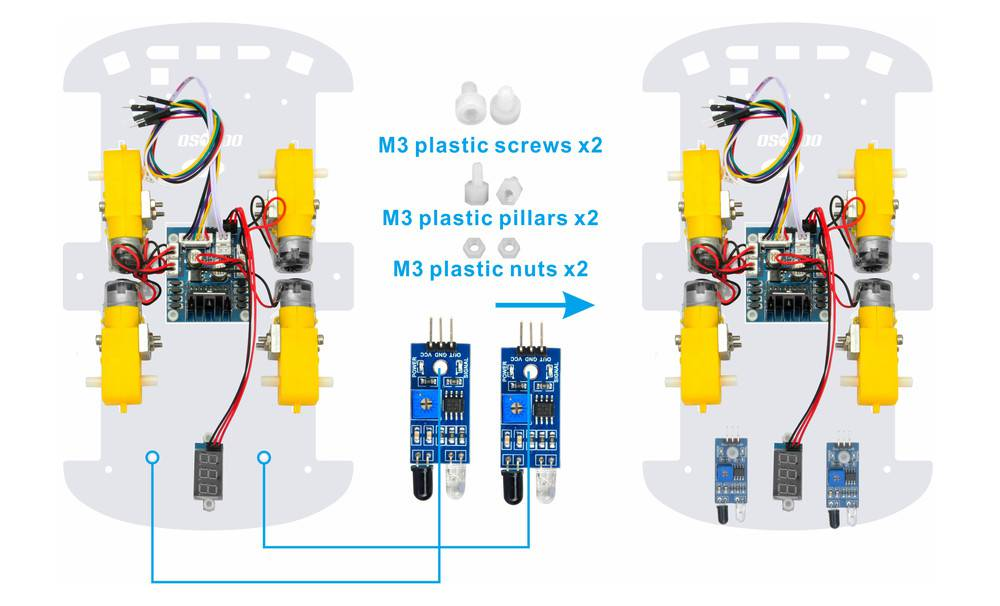
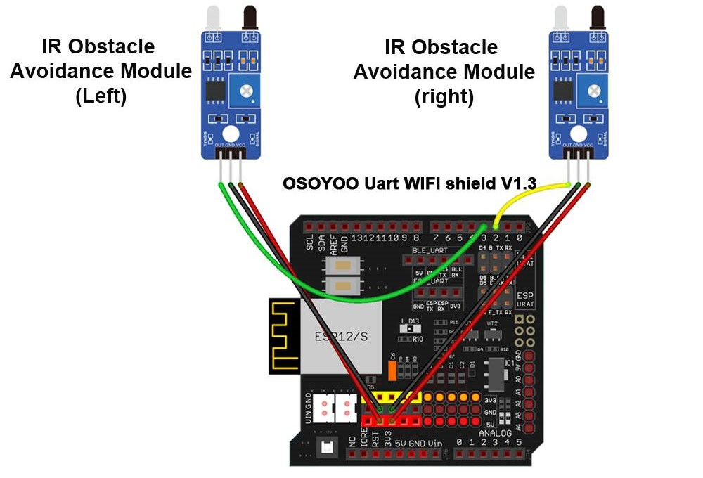
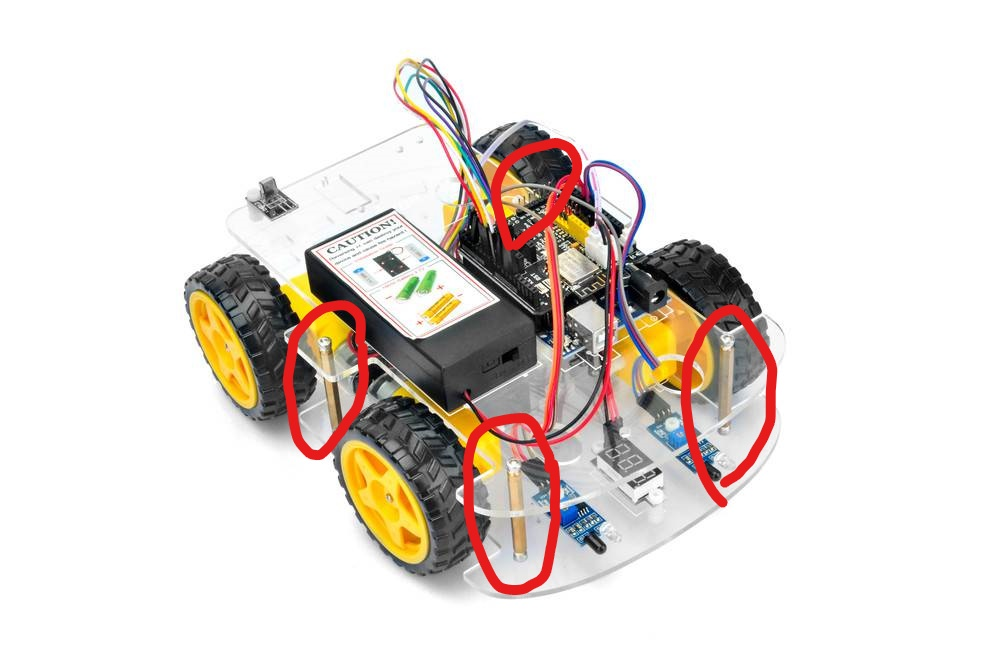

# レッスン15 追いかけロボットを作ろう

## ミッション

**障害物センサー2個で物体を見つけて、追いかけるロボットを作ろう。**

## このレッスンで身につける力

- [ ] 障害物センサーを正しく取り付けられる
- [ ] ジャンパーワイヤーを正しく接続できる
- [ ] サンプルコードを実行できる
- [ ] 障害物センサーの感度を調整できる
- [ ] 追従しやすくするためにサンプルコードを修正できる

## 今回使う技術

- 障害物回避センサー2個の取り付けと配線
- （復習）`digitalRead()` とセンサーの感度調整 — **入門07**
- **左右2つのセンサーの組み合わせ**による判断
- `if` 〜 `else if` のつなげ方
- `&&`（かつ）

> **入門07では**センサー1個で「ある／ない」を見ました。
> 今回は**2個使います。** 左右どちらにあるかが分かると、ロボットは「向き」を判断できます。

---

## ミッションの準備

### 用意するもの

- [ ] レッスン11で完成させたロボット
- [ ] 赤外線障害物回避センサー x2
- [ ] M3プラスチックネジ・ピラー・ナット（取り付け用）
- [ ] オス-メス ジャンパー線
- [ ] プラスドライバー（感度調整用）
- [ ] USBケーブル x1
- [ ] パソコン x1
- [ ] 追いかける物（箱など）
- [ ] コース

### 手順

- [ ] 「（日付4桁）(自分の名前・ローマ字)15」で保存する
- [ ] スケッチのフォルダに **`motor_driver.h` をコピー**する

---

## メインミッション

### ステップ1 障害物センサーを取り付けよう

銅ピラーのネジを外し、2個の赤外線回避モジュールを車に追加します。

下部カーシャーシの**背面**に、2個のM3プラスチックネジ、M3プラスチックピラー、およびM3プラスチックナットを使用して当該センサーを取り付けます。



> **なぜ背面（うしろ）につけるの？**
> このロボットは**後ろ向きに近づいて**いきます。うしろにセンサーをつけて、うしろにある物に向かって下がっていく仕組みです。

- [ ] 障害物センサーを正しく取り付けられたらチェック

### ステップ2 ジャンパー線を接続しよう

次の接続図のように2個の障害回避モジュールを接続します。



銅ピラーにネジを固定して、上部シャーシと下部シャーシを接続します。



| センサー | つなぐピン |
|---|---|
| 右の障害物センサー | D2 |
| 左の障害物センサー | D4 |

- [ ] ジャンパーワイヤーを正しく接続できたらチェック

### ステップ3 2つのセンサーで何が分かるか考えよう

センサーが2つあると、組み合わせで**4通り**の状態が分かります。

| 左センサー | 右センサー | どういう状態？ | ロボットはどうする？ |
|:---:|:---:|---|---|
| 見つけた | 見つけた | まうしろにある | まっすぐ下がって近づく |
| 見つけた | 見つけない | 左うしろにある | 左に向きを変える |
| 見つけない | 見つけた | 右うしろにある | 右に向きを変える |
| 見つけない | 見つけない | どこにもない | 止まる |

**この表がそのままプログラムになります。**

> センサーは、物があるとき `LOW`、ないとき `HIGH` を返します（入門07の復習）。

### ステップ4 サンプルコードを実行しよう

以下のコードをコピー＆ペーストして、実行してみよう。

```C++
#include "motor_driver.h"

#define RightObstacleSensor 2   // 右の障害物センサーは D2
#define LeftObstacleSensor  4   // 左の障害物センサーは D4

#define SPEED 180               // モーターの速さ

void auto_following()
{
  int IRvalueLeft  = digitalRead(LeftObstacleSensor);
  int IRvalueRight = digitalRead(RightObstacleSensor);

  if (IRvalueLeft == LOW && IRvalueRight == LOW) {
    // 両方のセンサーが見つけた → まうしろにある。下がって近づく
    go_Back(SPEED, 0);
  }
  else if (IRvalueLeft == LOW && IRvalueRight == HIGH) {
    // 左だけが見つけた → 左に向きを変える
    go_Left(SPEED, 0);
  }
  else if (IRvalueLeft == HIGH && IRvalueRight == LOW) {
    // 右だけが見つけた → 右に向きを変える
    go_Right(SPEED, 0);
  }
  else {
    // どちらも見つけていない → 止まる
    stop_Stop();
  }
}

void setup()
{
  init_GPIO();
  pinMode(RightObstacleSensor, INPUT);
  pinMode(LeftObstacleSensor, INPUT);
  Serial.begin(9600);
  beep(1, 200);          // 準備できたよの合図
}

void loop()
{
  auto_following();
}
```

#### `else if` について

```C++
if (条件1) {
  条件1のときの処理
}
else if (条件2) {
  条件1ではなく、条件2のときの処理
}
else {
  どれでもないときの処理
}
```

`else if` をつなげると、**上から順に**調べて、当てはまったところだけが実行されます。
`&&` は「**かつ**」。`IRvalueLeft == LOW && IRvalueRight == LOW` は「左も右も見つけた」という意味です。

- [ ] サンプルコードを実行できたらチェック

---

## 確認

### センサーが効いているか確かめよう

**走らせる前に、センサーの値を見て確かめます。**

`loop()` を一時的にこう書きかえて、シリアルモニターを開こう。

```C++
void loop()
{
  Serial.print("左: ");
  Serial.print(digitalRead(LeftObstacleSensor));
  Serial.print("   右: ");
  Serial.println(digitalRead(RightObstacleSensor));
  delay(300);
}
```

- [ ] 何もないとき、左右とも `1`（HIGH）になる
- [ ] 左センサーの前に手を出すと、左だけ `0`（LOW）になる
- [ ] 右センサーの前に手を出すと、右だけ `0`（LOW）になる
- [ ] 両方に手を出すと、両方 `0` になる

**ここが合っていないと、絶対にうまく動きません。**
左右が逆になっていたら、配線かプログラムのピン番号を直そう。

### 感度を調整しよう

入門07と同じように、ドライバーでネジを回して感度を調整します。

- [ ] 左右のセンサーが**同じくらいの距離**で反応するようにした
- [ ] 反応する距離を測った（左： cm ／ 右： cm）

> 左右で反応距離がちがうと、まっすぐ追いかけられません。**そろえるのが大事です。**

### 動かして確かめよう

- [ ] 箱をうしろに置くと、下がって近づいてくる
- [ ] 箱を左にずらすと、左を向く
- [ ] 箱を右にずらすと、右を向く
- [ ] 箱をどけると止まる

うまくいかないときは、ここを見てみよう。

| 症状 | 見るところ |
|---|---|
| ずっと動きっぱなし | センサーが何かを見つづけている。周りに物がないか |
| まったく動かない | センサーの値を確認（上の方法で）。感度が近すぎないか |
| 左右が逆に動く | センサーのピン番号（D2とD4）が入れかわっていないか |
| 近づきすぎてぶつかる | 感度を下げて、遠くで止まるようにする |
| ガタガタゆれる | `SPEED` を下げてみる |

---

## やってみよう

### 1. 速さを調整して追従しやすくしよう

プログラムの上のほうにある速さの設定を変えてみよう。

```C++
#define SPEED 180               // モーターの速さ
```

| 速さ | 結果 |
|---|---|
| 120 | |
| 180 | |
| 255 | |

速すぎると行きすぎ、おそすぎると追いつけません。**ちょうどいい速さ**をさがそう。

- [ ] 追従しやすい速さを見つけられたらチェック

### 2. 近づきすぎないようにしよう

いまは、ぶつかるまで近づいてしまいます。
**一定の距離まで近づいたら止まる**ようにしてみよう。

> ヒント：感度を調整して、遠めで反応するようにします。プログラムだけでは解決しません。

- [ ] ぶつからずに止まれるようになったらチェック

### 3. 見つけたら音で知らせよう

いまどの状態なのかを、**音で分かる**ようにしてみよう。

```C++
  if (IRvalueLeft == LOW && IRvalueRight == LOW) {
    beep(1, 50);           // まうしろ → ピッ
    go_Back(SPEED, 0);
  }
  else if (IRvalueLeft == LOW && IRvalueRight == HIGH) {
    beep(2, 50);           // 左 → ピピッ
    go_Left(SPEED, 0);
  }
```

音を聞けば、ロボットが**いまどう判断しているか**が分かります。
思ったのと違う音が鳴ったら、そこが直すところです。

- [ ] 状態ごとに違う音を鳴らせたらチェック

### 4. コースを走破しよう

箱を持って歩いて、ロボットを誘導しながらゴールを目指そう！


- [ ] コースを走破できたらチェック

### 5. 逃げるロボットにしよう（発展）

追いかけるのと反対に、**近づくと逃げる**ロボットにしてみよう。

> ヒント：`go_Back()` を `go_Advance()` に変えるとどうなるかな？

---

## まとめ

- センサーが**2つ**あると、左右どちらに物があるかが分かる
- 2つのセンサーの組み合わせは**4通り**。その表がそのままプログラムになる
- `&&` は「**かつ**」。両方の条件が正しいときだけtrue
- `else if` をつなげると、上から順に調べて当てはまったところだけ実行される
- **左右の感度をそろえる**ことが大事。片方だけ遠いとまっすぐ追えない
- 走らせる前に**センサーの値を確かめる**。ここが合っていないと絶対に動かない
- 音で状態を知らせると、ロボットの判断が見える

### できるようになったことをチェックしよう

- [ ] 障害物センサーを正しく取り付けられる
- [ ] ジャンパーワイヤーを正しく接続できる
- [ ] サンプルコードを実行できる
- [ ] 障害物センサーの感度を調整できる
- [ ] 追従しやすくするためにサンプルコードを修正できる

### まとめページに書こう

Googleサイトの自分の**まとめページ**に、次の4つを書こう。

1. **やったこと**
2. **わかったこと**
3. **感じたこと**
4. **つぎやること**

**スクリーンショットか画像を必ず1枚入れること。** 今日は追いかけているところの動画を入れよう。

> まとめは1日に1回書く。
> 複数のレッスンを進めた日も、1つのレッスンが1回で終わらなかった日も、まとめは1回。
